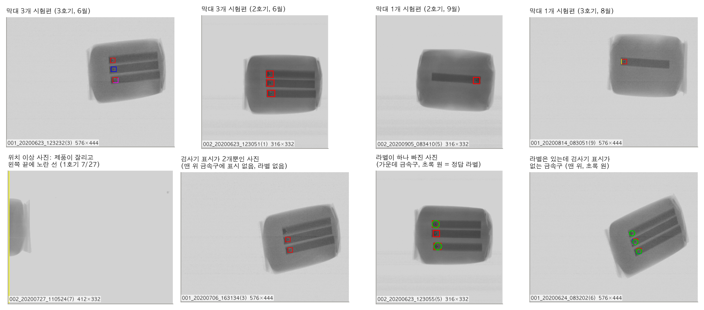
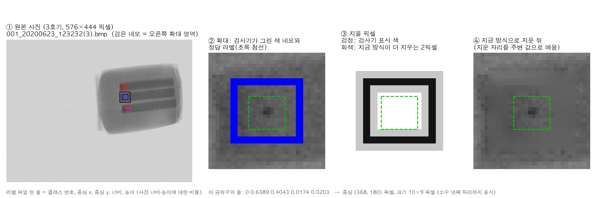
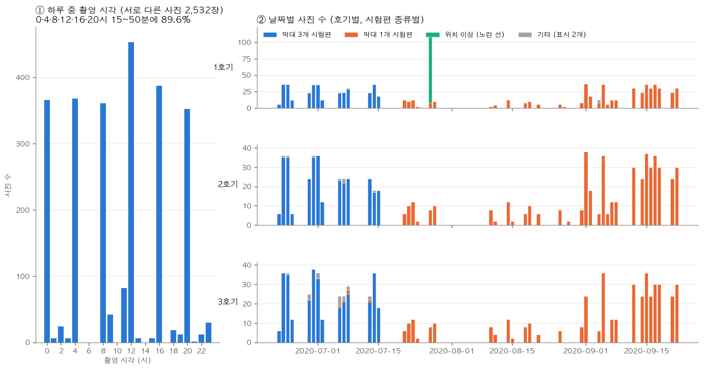
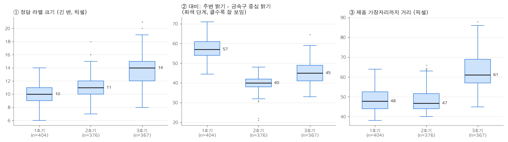

# 원본 데이터는 어떻게 생겼고, 어떻게 다듬을 것인가

2026-09-28 Claude Code 작성. 대회가 준 X-ray 데이터 폴더를 처음부터 다시 열어 보고, 무엇이 원본이고 무엇을 우리가 만들었는지, 폴더마다 무엇을 위한 것인지 정리했습니다. 끝에 전처리 계획을 붙였습니다.

이 문서의 숫자는 모두 스크립트가 센 값입니다. 원본 점검은 `scripts/xray_data_audit.py`(결과 `reports/data_audit/summary.json`), 가이드북 점검은 `scripts/xray_guidebook_audit.py`(결과 `reports/guidebook_audit/`), 그림은 `scripts/xray_data_figures.py`가 만들었습니다. 사진 몇 장을 눈으로 확인한 내용은 그렇다고 따로 적었습니다.

## 먼저 결론

대회가 준 X-ray 폴더에는 데이터와 실습 교재가 섞여 있습니다. 실제로 쓰는 데이터는 두 곳뿐입니다. 검사기가 저장한 원본 사진 폴더(`X선이물검출기(06.23_09.22)`)와 공식 정답 라벨 폴더(`라벨링 6종 세트/labels`)입니다. 나머지는 대회 측이 2020년에 만든 YOLOv3 실습 자료입니다. 연습용 사진 사본, 예제 코드, 연습 결과 가중치, 라벨링 도구가 여기에 해당합니다.

사진은 모두 검사기가 "이물 있음"으로 판정해 저장한 사진입니다. 그리고 거의 전부가 4시간마다 하는 감도 점검 때 찍혔습니다. 작업자가 금속구가 박힌 시험용 막대(시험편)를 제품 위에 올려 여러 번 통과시키면, 검사기가 금속구를 이물로 잡아 사진을 남깁니다. 정답 라벨 1,147개는 모두 이 금속구이고, 생산 중에 실제로 섞여 들어온 이물 사진은 찾지 못했습니다. 지난 기록에서는 박스가 1개인 사진을 "시편이 아닌 사진"으로 분류했지만, 확인해 보니 이것도 막대가 1개인 시험편이었습니다.

이 사실이 데이터의 한계를 정합니다. 정답 이물은 한 종류의 금속구이고, 크기와 대비가 비슷하며, 모두 제품 안쪽 막대 끝에 있습니다. 출제문이 걱정하는 작은 이물, 가장자리 이물, 모양이나 밀도가 다른 이물은 실제 데이터에 없습니다. 이런 조건에서의 성능은 가짜 이물을 심는 실험으로 재야 합니다.

원본 BMP는 256색 팔레트 이미지입니다. 0~243번 색은 X-ray 회색이고, 244~255번은 검사기 표시에만 쓰입니다. 그래서 색 네모를 추측 없이 픽셀 단위로 정확히 지울 수 있습니다. 지금 전처리는 표시 둘레를 2픽셀씩 더 지우는데, 이 때문에 정답 박스 가장자리를 건드리는 경우가 절반쯤 됩니다. 팔레트 번호로 지우는 방식으로 바꾸는 것을 제안합니다.

## 용어

- 호기: 공장에서 같은 종류 기계에 붙이는 번호입니다. 1호기는 1번 검사기입니다. 이 데이터는 X-ray 검사기 세 대에서 나왔습니다.
- NG 사진: 검사기가 불량(No Good)으로 판정해 저장한 사진입니다. 폴더 이름의 NgImage가 이것입니다.
- 시험편(테스트피스): 검사기 감도를 확인하려고 일부러 통과시키는 막대입니다. 끝에 작은 금속구가 박혀 있습니다. 이 데이터에는 막대 3개가 붙은 것과 1개인 것 두 종류가 보입니다.
- 정답 라벨: 사람이 이물 위치를 표시한 파일입니다. 사진마다 TXT 파일이 하나이고, 한 줄이 박스 하나입니다.
- 바운딩 박스와 YOLO 형식: 바운딩 박스는 물체를 둘러싼 네모입니다. 라벨 한 줄은 "클래스 번호, 중심 x, 중심 y, 너비, 높이"이고, 값은 사진 너비·높이에 대한 비율(0~1)입니다. 이 형식을 YOLO 형식이라고 부릅니다.
- 장비 표시: 검사기가 이물을 찾은 자리에 사진 위에 직접 그린 색 네모입니다. 픽셀에 박혀 있어서, 지우지 않으면 모델이 금속구 대신 이 네모를 보고 답을 맞힙니다.
- 팔레트 이미지: 픽셀마다 색 번호(0~255)를 저장하고, 번호별 실제 색은 따로 둔 표(팔레트)에서 찾는 이미지 형식입니다.
- 마스킹과 인페인팅: 지울 픽셀을 고르는 것이 마스킹이고, 그 자리를 주변 값으로 자연스럽게 메우는 것이 인페인팅입니다.
- 점검 묶음(촬영 묶음): 같은 검사기에서 60초 안에 이어 찍힌 사진들입니다. 한 번의 점검에서 나온 거의 같은 사진들입니다.

## 1. 무엇이 원본이고 무엇을 우리가 만들었나

```
프로젝트 폴더/
├─ 제조AI데이터셋/4. X-ray 검사장비 AI 데이터셋/dataset/   대회가 준 원본 (읽기만 한다)
│   ├─ test1/yolov3/X선이물검출기(06.23_09.22)/   원본 사진 BMP          ← 데이터
│   ├─ 라벨링 6종 세트/labels/                     공식 정답 라벨 TXT      ← 데이터
│   ├─ 라벨링 6종 세트/images 15 ~ images 400/     실습용 사진 사본
│   ├─ test1/yolov3/ (위 사진 폴더를 뺀 나머지)    가이드북 YOLOv3 예제 코드와 결과
│   ├─ 실습별 가중치파일/                          실습 묶음별 YOLOv3 학습 결과
│   ├─ OpenLabeling-master/                        라벨링 도구
│   └─ yolov3_20201200.ipynb                       가이드북 실습 노트북
├─ data/xray_v1/     우리가 만든 학습용 데이터
├─ runs/             우리가 학습한 모델
├─ reports/          우리 예측·채점·점검 결과
├─ weights/          YOLO 출발점 가중치 (인터넷에서 자동으로 내려받음)
├─ scripts/  docs/  outputs/  archive/
```

`제조AI데이터셋/` 폴더에는 원래 데이터셋 다섯 개가 있었고, 9월 28일 기준으로 X-ray만 남아 있습니다. 나머지 넷은 휴지통에 있습니다. X-ray 폴더는 그대로입니다.

우리가 만든 것은 모두 스크립트가 만듭니다. 지우고 다시 돌려도 같은 결과가 나옵니다.

- `data/xray_v1/images/{train,val,test}`, `labels/`, `manifest.csv`, `data.yaml`: `xray_prepare.py`가 공식 라벨 500장의 색 표시를 지우고 학습·검증·평가로 나눈 것입니다.
- `data/xray_v1/images/val_fakemask`, `fake_positions.csv`: `xray_fake_mask.py`가 만든 "마스킹 흔적을 배웠는가" 검사용 사진입니다.
- `data/xray_v1/images/val_objremoved`: `xray_object_removed.py`가 금속구를 지운 사진입니다. 모델이 금속구를 보고 판단하는지 검사할 때 씁니다.
- `runs/v1_*`: `xray_train_yolo.py`가 학습한 YOLOv8 모델입니다.
- `reports/preds_*.csv`, `*_eval.json`, `model_comparison.md`: 예측 결과와 `xray_eval.py` 채점 결과, `xray_condition_plot.py`가 만든 비교표입니다.
- `reports/data_audit/`, `reports/guidebook_audit/`: 이번에 만든 원본 점검 결과입니다.
- `reports/machine_missed_objects.csv`: 9월 22일 일회성 계산의 결과이고, 만든 스크립트는 남아 있지 않습니다. 이번 원본 점검이 같은 내용을 다시 셉니다.
- `weights/yolov8n.pt`, `yolov8s.pt`: Ultralytics가 일상 사진으로 미리 학습해 둔 공개 가중치입니다. 우리 학습의 출발점입니다.

## 2. 원본 폴더 하나하나

그림을 보면서 읽으면 이해가 쉽습니다. 먼저 사진 종류를 봅니다.



### 2-1. 원본 사진: `test1/yolov3/X선이물검출기(06.23_09.22)/`

진짜 데이터입니다. 호기별 폴더 세 개가 있고, 그 안에 `SN77128_20200826_NgImage`처럼 날짜별 폴더가 있습니다. 앞의 SN 번호는 검사기 시리얼 번호입니다(1호기 SN77128, 2호기 SN77127, 3호기 SN12053).

파일 이름은 `002_20200826_083051(9).bmp`처럼 생겼습니다. 앞 번호, 촬영 날짜, 촬영 시각, 괄호 속 숫자 순서입니다. 앞 번호는 1·2호기가 002, 3호기가 001이라 호기 번호는 아닙니다. 제품(품목) 번호로 추정하지만 확인할 방법은 없습니다. 괄호 속 숫자는 0~9가 고르게 나오고 뜻은 알 수 없습니다.

파일은 2,809개지만 서로 다른 사진은 2,532장입니다. 277개는 같은 검사기의 이웃한 날짜 폴더에 한 번 더 들어간 완전히 같은 파일입니다. 날짜 폴더가 하루 단위로 딱 끊기지 않아서, 전날 사진(대부분 20시대)이 다음 날 폴더에 들어가거나 두 폴더에 모두 들어간 경우가 있습니다. 그래서 날짜 폴더와 파일 이름의 날짜가 다른 파일이 287개 있고, 촬영 시각은 파일 이름을 기준으로 삼아야 합니다. 이름이 같은데 내용이 다른 사진도 3쌍 있습니다. 1호기와 2호기에서 같은 초에 찍혀 이름이 겹친 것이고, 셋 다 라벨이 없습니다.

사진 크기는 호기와 시기에 따라 다릅니다. 2호기는 316×332, 3호기는 576×444로 일정합니다. 1호기는 6~7월에 352×332, 8~9월에 316×332이고, 412×332 사진도 120장 있습니다. 이 가운데 104장이 위치 이상 사진(4장에서 설명)입니다.

모든 파일이 256색 팔레트 BMP이고, 팔레트 구성 방식도 모두 같습니다. 0~243번은 같은 번호의 회색(0=검정, 243=가장 밝은 회색)이고, 244~255번 12개는 초록·분홍·자홍·노랑·빨강·하늘·파랑 같은 표시용 색입니다.

### 2-2. 공식 정답 라벨: `라벨링 6종 세트/labels/`

TXT 500개에 박스 1,147개가 있습니다. 클래스 번호는 전부 0(이물)이고, 값이 0~1 범위를 벗어난 줄은 없습니다. 대회 안내문에 따르면 이 TXT가 유일한 공식 정답이고, 장비 표시와 다르면 TXT를 따릅니다.

라벨이 붙은 사진은 원본 2,532장 가운데 500장(약 20%)입니다. 호기별로 1호기 156장, 2호기 177장, 3호기 167장입니다. 박스 수로 보면 1개짜리 176장, 2개짜리 1장, 3개짜리 323장입니다.

### 2-3. 실습용 사진 사본: `라벨링 6종 세트/images 15 ~ images 400/`

폴더 여섯 개에 파일이 1,065개 있지만 서로 다른 사진은 400장입니다. 15장 폴더는 50장 폴더에, 50장 폴더는 100장 폴더에 들어 있는 식으로 겹쳐 있어서, 가장 큰 400장 폴더가 전부를 담고 있습니다. 라벨이 많아지면 성능이 어떻게 달라지는지 보여 주는 가이드북 실습용 묶음입니다.

확장자는 .jpg이지만 내용은 원본과 픽셀까지 똑같은 BMP입니다. 가이드북 노트북에 폴더 안 파일 확장자를 한꺼번에 .jpg로 바꾸는 명령(`ren *.* *.jpg*`)이 있는데, 그 결과로 보입니다.

공식 라벨 500개 중 100개는 이 사진 폴더들에 없습니다. 이 "라벨만 있는 100장"은 모두 9월 사진이고(1호기 32장, 2호기 68장), 모두 금속구 1개짜리입니다. 실습 가중치가 한 번도 보지 못한 사진이라서, 가이드북 모델을 공정하게 시험해 볼 수 있는 사진이기도 합니다.

### 2-4. 가이드북 YOLOv3 실습 자료: `test1/yolov3/`, `실습별 가중치파일/`, `yolov3_20201200.ipynb`

대회 측이 만든 실습 교재입니다. 노트북은 여덟 단계로 되어 있습니다. 라이브러리 설치, 사진 확인, 호기별 사진 정리, OpenLabeling으로 라벨 달기, 무작위 8:2 분할(`splitdata.py`), YOLOv3-SPP 학습, 탐지·평가 순서입니다. 코드는 2020년 무렵의 Ultralytics YOLOv3 저장소 버전입니다.

`실습별 가중치파일/`의 `last15.pt`~`last400.pt`는 실습 묶음 15~400장으로 각각 학습한 YOLOv3-SPP 가중치입니다. 파일 하나가 약 250MB이고 파라미터는 6,263만 개입니다. 파일 안에 학습 기록이 들어 있습니다. 적은 사진일수록 오래 학습했고(15장은 1,000회, 400장은 100회), 입력 크기를 320~640 사이에서 바꿔 가며 학습했습니다. 기록 마지막 줄의 검증 F1은 0.906~0.975입니다. 이 값은 색 표시가 남은 사진을 무작위로 나눠 잰 것이라, 같은 점검 묶음의 거의 같은 사진이 학습과 검증에 함께 들어갔을 가능성이 큽니다. 우리 숫자와 나란히 비교하면 안 됩니다.

`test1/yolov3/`에는 예제용 사진 15장과 라벨 15개, 학습·평가 목록(12장/3장), 탐지 결과 그림, 학습 기록(`results.txt`, `results.png`), 가중치 `weights/last.pt`가 있습니다. 예제 15장 가운데 3장은 공식 라벨에도 있는데, 세 장 모두 좌표가 다릅니다. 예제 라벨의 박스가 더 작게 그려져 있습니다. 공식 라벨을 따르면 됩니다.

이 폴더에는 이름이 이상한 파일이 20개 있습니다. `detect.jpg`, `README.jpg`, `custom.jpga`, `.jpgignore` 같은 것들입니다. 사진이 아니고 코드·설정 파일의 확장자가 바뀐 사본입니다. 9개는 원래 파일과 똑같고, 4개는 원래 파일과 내용이 조금 다르며, 7개는 원래 파일이 폴더에 없습니다. 모두 무시해도 됩니다.

### 2-5. 라벨링 도구: `OpenLabeling-master/`

공개 라벨링 프로그램입니다. 입력 폴더의 BMP 15장은 가이드북 예제 사진과 같고, 출력 폴더의 YOLO 라벨 15개도 예제 라벨과 같습니다. VOC 형식 XML 833개 가운데 810개는 비어 있고, 798개는 `people_walking_mp4_*`처럼 이 도구에 원래 들어 있던 예제 영상 프레임용입니다. 데이터로 쓸 것은 없습니다.

## 3. 사진 한 장 읽기



①은 3호기 원본 사진입니다. 제품(둥근 네모꼴 포장) 위에 어두운 막대 세 개가 있고, 막대 왼쪽 끝마다 작은 점이 있습니다. 이 점이 금속구이고, 검사기가 그 둘레에 색 네모를 그렸습니다.

②는 가운데 금속구를 확대한 것입니다. 파란 테두리가 검사기 표시이고, 초록 점선이 사람이 단 정답 라벨입니다. 라벨 박스는 금속구에 거의 딱 맞고, 검사기 네모는 그보다 한 겹 바깥에 있습니다. 라벨 중심과 금속구 중심의 차이는 보통 1픽셀 안팎입니다.

③은 지워야 할 픽셀입니다. 검정은 팔레트 244~255번 색, 즉 검사기 표시 자체입니다. 회색은 지금 전처리(`xray_prepare.mask_image`)가 안전하게 하려고 2픽셀씩 더 지우는 부분입니다. 이 사진에서는 회색이 라벨 박스에 닿지 않았지만, 전체로 보면 절반 넘는 라벨 박스가 조금씩 잘립니다(6장).

④는 지금 방식으로 지우고 메운 결과입니다. 금속구는 그대로 남고 네모 자국은 거의 보이지 않습니다.

## 4. 이 사진들은 언제, 왜 찍혔나



①을 보면 사진이 0·4·8·12·16·20시에 몰려 있습니다. 서로 다른 사진의 89.6%가 이 여섯 시각의 15~50분 사이에 찍혔고, 분은 30분 무렵이 가장 많습니다. 4시간마다 하는 감도 점검입니다.

점검 한 번은 이렇게 진행됩니다. 작업자가 시험편을 올린 제품을 20초 안팎 동안 6번(일부 기간은 2번) 연달아 통과시킵니다. 사진의 99.5%가 60초 안에 이어 찍힌 묶음에 속하고, 묶음은 모두 547개입니다. 세 호기는 같은 시각에 몇 분 간격을 두고 차례로 점검했습니다. 정기 점검 162번 가운데 89번은 1호기, 2호기, 3호기 순서였습니다. 예를 들어 9월 5일 0시에는 1호기 00:31, 2호기 00:33, 3호기 00:39에 점검했습니다.

②를 보면 시험편이 중간에 바뀝니다. 6월부터 7월 중순까지는 막대 3개짜리를 썼고, 7월 하순부터는 막대 1개짜리를 썼습니다. 8월에는 점검 한 번에 2번, 9월에는 6번 통과시켰습니다. 사진이 있는 날은 석 달 중 46일이고, 호기별로는 42~45일입니다. 데이터를 준 쪽이 날짜를 골라 뽑은 것으로 보입니다.

1호기의 7월 27일 사진 104장과 7월 13일 사진 1장은 다릅니다. 제품이 화면 왼쪽 밖으로 잘려 있고, 검사기가 네모 대신 왼쪽 끝에 노란 세로선을 그었습니다. 이물 판정이 아니라 제품 위치나 길이 이상으로 저장된 사진으로 보이고, 라벨은 하나도 없습니다.

생산 중 실제 이물이 찍힌 사진이 있는지도 눈으로 확인했습니다. 라벨이 붙은 사진 가운데 박스가 1~2개인 177장을 모두 잘라 보았고, 라벨 없는 사진은 무작위로 168장을 보았습니다. 위치 이상 사진을 빼면 모두 막대 끝의 금속구였습니다. 표본 검사라 "실제 이물 사진은 전혀 없다"고 단정할 수는 없지만, 있더라도 극히 드뭅니다.

라벨 사진의 시기도 치우쳐 있습니다. 막대 3개짜리 라벨 사진은 6~7월(1호기 124장, 2호기 100장, 3호기 100장), 막대 1개짜리는 7월 하순~9월(1호기 32장, 2호기 77장, 3호기 67장)에 몰려 있습니다.

## 5. 정답 라벨과 검사기 표시는 얼마나 맞나

정답 박스 1,147개 가운데 1,145개가 검사기 네모 안에 있습니다. 나머지 2개는 3호기의 막대 3개짜리 사진에서 맨 위와 맨 아래 금속구입니다. 사람은 라벨을 달았지만 검사기는 표시하지 않았으니, 라벨 사진 안에서 검사기가 놓친 사례입니다(그림 "사진 종류"의 마지막 칸). 두 장은 지금 분할에서 각각 학습 세트와 검증 세트에 있습니다.

반대로 라벨이 빠진 사진도 1장 있습니다. 2호기 `002_20200623_123055(5)`는 검사기가 금속구 3개에 모두 네모를 그렸는데 라벨은 2개뿐입니다. 가운데 금속구의 라벨이 빠졌고, 이 사진은 지금 학습 세트에 있습니다.

검사기 네모가 2개인 사진은 34장입니다. 30장은 막대 3개짜리를 쓰던 6~7월에 나왔고, 라벨이 붙은 것은 4장뿐입니다. 몇 장을 눈으로 보니, 금속구 하나에 표시가 없는 사진(검사기가 놓친 사례)과 가까운 네모 두 개가 붙어 하나로 세어진 사진이 섞여 있었습니다. 검사기가 놓친 금속구를 모델이 찾는지 보는 현장 사례로 쓸 수 있습니다.

검사기 네모의 색은 빨강이 가장 많고 파랑, 자홍, 초록, 노랑 순입니다. 같은 막대도 통과할 때마다 색이 바뀌어서 금속구 재질을 뜻하지는 않습니다. 무엇을 뜻하는지는 알 수 없고, 어차피 모델 입력에서는 지웁니다.

## 6. 금속구(정답 이물)의 특징



라벨 박스의 긴 변은 보통 11픽셀입니다. 3호기에서는 조금 크게(14픽셀) 찍히는데, 3호기 사진이 더 크고 세밀한 것과 관련 있어 보입니다. 확대해서 눈으로 보면 금속구의 진한 부분은 그보다 작아서 지름 3~5픽셀쯤입니다.

대비는 금속구 주변의 밝기에서 금속구 중심의 밝기를 뺀 값입니다(회색 단계 0~243 기준). 보통 46이고, 1호기가 57로 가장 선명하고 2호기가 40으로 가장 흐립니다. 막대 3개짜리 시험편에서 위·가운데·아래 금속구의 대비는 거의 같아서, 세 금속구는 같은 종류로 보입니다.

모든 금속구가 제품 가장자리에서 한참 안쪽에 있습니다. 가장자리까지 거리는 보통 51픽셀이고, 가장 가까운 것도 38픽셀 떨어져 있습니다. 금속구 박스 넓이를 모두 더해도 사진 넓이의 0.17%입니다.

정리하면, 실제 정답 이물은 한 종류의 금속구가 비슷한 크기와 대비로 제품 안쪽 막대 끝에만 있습니다. 모델이 이 금속구를 잘 찾는 것은 이미 확인했지만(지난 실험의 재현율 거의 1.0), 이 데이터만으로는 작은 이물, 흐린 이물, 가장자리 이물, 막대가 없는 자리의 이물을 찾는지 알 수 없습니다.

## 7. 데이터 진단 요약 (보고서 1장 "데이터 이해 및 진단"에 쓸 내용)

생산 단위와 변수. 사진 한 장은 검사기가 이물로 판정한 한 번의 통과입니다. 파일 이름에 촬영 시각이 있고, 폴더에 호기가 있으며, 사진 크기로 제품 규격을 짐작할 수 있습니다. 표 형태의 공정 변수는 없습니다.

시간·설비·제품의 관계. 4시간마다 세 호기를 차례로 점검했고, 7월 하순에 시험편이 3개짜리에서 1개짜리로 바뀌었습니다. 1호기는 8월에 사진 폭이 352에서 316으로 바뀌었습니다. 3호기는 다른 제품(576×444)을 검사합니다.

결측. 라벨은 서로 다른 사진의 약 20%에만 있습니다. 라벨 하나가 빠진 사진이 1장 있습니다.

중복. 완전히 같은 파일 277개, 이름만 겹치는 서로 다른 사진 3쌍이 있습니다. 실습용 사본 1,065개는 400장의 복사본입니다. 한 번의 점검에서 거의 같은 사진이 6장씩 나오므로, 사진을 무작위로 나누면 같은 장면이 학습과 평가에 함께 들어갑니다.

이상치. 위치 이상 사진 105장이 있습니다. 날짜 폴더와 촬영 날짜가 다른 파일은 287개입니다. 라벨과 검사기 표시가 어긋난 사례로는 검사기가 놓친 금속구 2개와 라벨 누락 1건이 있습니다.

불균형. 모든 사진에 금속구가 있어서 이물 없는 정상 사진이 없습니다. 금속구는 사진 넓이의 0.17%입니다. 라벨 사진은 6~7월(막대 3개)과 8~9월(막대 1개)로 나뉘어 있습니다. 이물 종류가 사실상 하나라는 것이 가장 큰 불균형입니다.

## 8. 전처리 계획

지금 전처리(`scripts/xray_prepare.py`, 결과 `data/xray_v1`)는 큰 틀에서 맞습니다. 다만 이번 점검에서 고칠 점이 몇 가지 나왔습니다. 분할 방식이나 마스킹이 바뀌므로, 규칙대로 새 폴더(`data/xray_v2`)를 만들어 v1과 나란히 두는 것을 제안합니다. 코드는 팀이 이 계획에 동의한 뒤에 고치겠습니다.

### 8-1. 어떤 사진을 쓸 것인가

학습과 평가는 공식 라벨이 있는 500장으로만 합니다. 대회 규칙이고, v1과 같습니다.

라벨 없는 사진(2,032장)은 학습에 쓰지 않습니다. 검사기 네모 위치를 가짜 정답으로 쓰는 방법도 있지만, 대회가 색 표시를 특징으로 쓰지 말라고 했고, 라벨 500장만으로도 이미 성능이 충분해서 얻을 것이 적습니다. 대신 두 가지에 쓸 수 있습니다. 첫째, 네모가 2개뿐인 막대 3개짜리 사진은 "검사기가 놓친 금속구를 모델이 찾는가"를 보여 주는 사례가 됩니다. 둘째, 4시간 점검 사진 전체의 금속구 대비를 날짜순으로 그리면 검사기 감도 추세를 볼 수 있습니다.

위치 이상 사진 105장은 학습에서 뺍니다. 노란 선을 지우면 검사기가 이물 판정을 하지 않은 진짜 사진이 되므로, 오경보(없는 이물을 있다고 하는 것)를 재는 음성 사진으로 쓸 수 있습니다. 다만 제품이 잘린 특이한 사진이라는 점을 함께 적어야 합니다.

### 8-2. 중복과 라벨 문제

사진 목록은 이름이 아니라 (이름, 내용) 쌍으로 만듭니다. 같은 파일 277개는 하나만 쓰고, 이름이 겹치는 3쌍은 호기 폴더로 구분합니다. 셋 다 라벨이 없어서 v1 학습에는 영향이 없었습니다.

라벨은 공식 TXT만 씁니다. 가이드북 예제 라벨 15개는 쓰지 않습니다.

라벨 누락 1장은 공식 라벨을 고치지 않고 그대로 둡니다. 대신 이 사진은 평가 세트에 넣지 않고 학습에만 쓰며, 보고서에 적습니다. 평가 세트에 들어가면, 모델이 빠진 금속구를 제대로 찾아도 오경보로 채점되기 때문입니다. 검사기가 놓친 금속구 2개는 정상적인 정답으로 쓰고, "검사기는 놓쳤지만 모델은 찾았는가"를 따로 확인합니다.

### 8-3. 색 표시 지우기

v1은 RGB 채널 차이가 40보다 큰 픽셀을 표시로 보고, 5×5로 넓혀(둘레 2픽셀 추가) 지운 뒤 주변 값으로 메웁니다(OpenCV의 텔레아 인페인팅). 결과는 거의 맞지만 두 가지가 아쉽습니다. 문턱값 40은 근거가 약하고, 넓히는 과정에서 정답 박스를 건드립니다. 정답 박스 1,147개 중 584개가 넓이의 10% 넘게 지워졌고, 금속구 중심부(반경 3픽셀)까지 닿은 경우도 1개 있습니다.

제안은 팔레트 번호 244~255번 픽셀만 정확히 고르고, 넓히지 않고, 같은 방식으로 메우는 것입니다. 팔레트 표시는 주변과 섞이지 않아서 넓힐 이유가 없습니다. 바꾼 뒤에는 v1에서 한 두 가지 검사를 다시 돌립니다. 가짜 네모를 그렸다 지운 자리를 모델이 이물로 잡는지, 금속구만 지운 자리를 여전히 이물로 잡는지입니다.

마스킹을 아예 하지 않는 것은 선택지가 아닙니다. 네모를 보고 맞히는 모델이 되기 때문입니다. 표시 부분을 단색으로 칠하는 방법도 인공적인 무늬를 남겨서 권하지 않습니다.

### 8-4. 입력 형식

회색 한 채널(0~243)을 그대로 PNG로 저장합니다. YOLO는 같은 값을 세 채널에 복사해 넣습니다. 대비를 늘리는 보정(히스토그램 평활화 등)은 하지 않습니다. 금속구의 원래 대비가 곧 분석 대상이라, 보정하면 조건별 분석이 흐려집니다.

사진 크기는 원본 그대로 두고, 학습할 때 YOLO가 640에 맞춰 늘립니다. 1·2호기 사진은 약 2배로 커지고 3호기는 약 1.1배로 커집니다.

### 8-5. 학습·검증·평가 나누기

기본 분할은 v1처럼 점검 묶음 단위로 나눕니다. 같은 점검의 거의 같은 사진이 학습과 평가에 갈라 들어가지 않게 하기 위해서입니다. v1은 호기별로 묶음을 섞어 60:20:20으로 나눴는데(학습 293장, 검증 96장, 평가 111장, 묶음 114개), v2에서는 시험편 종류(막대 3개/1개)도 고르게 들어가도록 나누는 것을 제안합니다. 라벨 사진이 속한 점검 묶음은 114개뿐이라, 실제로 독립적인 표본 수는 사진 수보다 훨씬 적다는 점도 기억해야 합니다.

추가 평가 조건 세 가지를 따로 둡니다.
- 시기 나누기: 6~7월(막대 3개)로 학습하고 8~9월(막대 1개)로 평가합니다. 시험편이 바뀌어도 되는지 봅니다.
- 호기 하나 빼기: 두 호기로 학습하고 나머지 한 호기로 평가합니다. 새 검사기에 그대로 쓸 수 있는지 봅니다.
- 라벨만 있는 100장: 가이드북 실습 가중치가 보지 못한 사진입니다. 가이드북 모델과 비교할 때 씁니다.

v1의 `is_testpiece` 열은 박스 수와 촬영 시각으로 시편을 판별했는데, 라벨 사진이 모두 시험편이라 의미가 없습니다. 이 열은 "시험편 종류"(박스 2~3개면 막대 3개, 1개면 막대 1개)로 바꾸고, AGENTS.md의 "시편과 그 외 사진을 따로 보고한다"는 규칙도 "시험편 종류와 호기별로 따로 보고한다"로 바꾸는 것을 제안합니다.

### 8-6. 이물 없는 사진 만들기

오경보를 재려면 이물 없는 사진이 필요합니다. v1은 검증 세트에서만 금속구를 지운 사진을 만들었습니다. v2에서는 평가 세트에도 만들고, 위치 이상 105장(노란 선을 지운 것)을 더합니다. 결과표에는 사진당 오경보 수를 같이 적습니다.

### 8-7. v2 데이터 목록에 추가할 정보

`manifest.csv`에 다음 열을 더합니다. 원본 파일 경로(중복 정리 후), 파일 해시, 시험편 종류, 점검 묶음 번호, 정기 점검 시각 여부, 실습 묶음 소속(images 15~400 또는 라벨만), 라벨 문제 표시(누락, 검사기 미표시)입니다. 두 도구가 같은 분할을 쓰도록 분할 목록은 파일로 저장합니다.

## 9. 팀이 정할 것

1. 보고 기준을 "시편 / 비시편"에서 "시험편 종류 × 호기"로 바꿀지 (AGENTS.md 규칙 수정)
2. 마스킹을 팔레트 번호 방식으로 바꾸고 `data/xray_v2`를 만들지
3. 라벨 누락 1장을 평가에서 빼는 처리에 동의하는지
4. 위치 이상 105장을 오경보 평가용 음성 사진으로 쓸지
5. 라벨 없는 사진 중 네모가 2개뿐인 사진을 검사기 미검 사례 분석에 쓸지

## 숫자로 보기

원본 폴더
- X-ray 데이터 폴더의 파일 5,353개 (macOS 캐시 파일 제외). 이 가운데 확장자와 실제 형식이 다른 파일 1,092개 (실습용 사진 사본 1,065개, 가이드북 예제 사진 15개, 가이드북 코드·설정 12개)
- 원본 사진 파일 2,809개, 436.2MB. 서로 다른 사진 2,532장, 같은 파일 사본 277개(모두 같은 호기 안), 이름만 겹치는 서로 다른 사진 3쌍(라벨 없음)
- 호기별 서로 다른 사진: 1호기 943장, 2호기 805장, 3호기 784장
- 사진 크기: 1호기 352×332 392장, 316×332 431장, 412×332 120장(위치 이상 104장, 네모 표시 16장) / 2호기 316×332 805장 / 3호기 576×444 784장
- 촬영 기간 2020-06-22 20:30 ~ 2020-09-22 16:33, 사진이 있는 날 46일 (호기별 44 / 45 / 42일)
- 팔레트 BMP 2,809개 모두 같은 팔레트 (0~243 회색, 244~255 표시 색)
- 날짜 폴더와 파일 이름 날짜가 다른 파일 287개
- 실습용 사진 사본 1,065개 = 서로 다른 400장 (15 ⊂ 50 ⊂ 100 ⊂ 200 ⊂ 300 ⊂ 400)
- 가이드북 실습 가중치 6개: 각 250.7~250.8MB, 파라미터 6,263만 개, 학습 기록 1,000 / 350 / 149 / 90 / 89 / 100회(15 / 50 / 100 / 200 / 300 / 400장), 기록 마지막 검증 F1 0.906 / 0.907 / 0.909 / 0.949 / 0.952 / 0.975 (가이드북의 무작위 분할, 색 표시 있는 사진)
- 가이드북 폴더의 확장자 바뀐 사본 20개: 원래 파일과 동일 9개, 옛 버전 4개, 원래 파일 없음 7개
- 라벨링 도구 VOC XML 833개 중 빈 파일 810개, 도구 예제용 798개

정답 라벨
- 라벨 500장, 박스 1,147개, 클래스 0 하나
- 호기별 라벨 사진: 156 / 177 / 167장. 서로 다른 사진 대비 16.5% / 22.0% / 21.3%
- 사진당 박스 수: 1개 176장, 2개 1장, 3개 323장
- 실습 묶음 소속: images 15에 15장, 50에 새로 35장, 100에 50장, 200에 100장, 300에 100장, 400에 100장, 라벨만 있는 사진 100장(9월, 1호기 32장, 2호기 68장, 모두 박스 1개)
- 가이드북 예제 라벨 15개 중 공식 라벨과 겹치는 3장, 3장 모두 좌표 다름

장비 표시와 라벨
- 네모 표시 사진 2,427장, 노란 선 표시 사진 105장(1호기, 7/13 1장, 7/27 104장, 라벨 없음)
- 사진당 네모 수: 0개 105장, 1개 1,395장, 2개 34장(라벨 사진 4장 포함), 3개 998장
- 검사기 네모 안에 있는 라벨 박스 1,145 / 1,147개. 네모 밖 2개(3호기 막대 3개짜리의 맨 위·맨 아래)
- 라벨 사진 안의 라벨 없는 네모 1개(라벨 누락, `002_20200623_123055(5)`)
- 라벨 박스를 둘러싼 네모 색: 빨강 933, 파랑 114, 자홍 75, 초록 12, 노랑 11

금속구
- 라벨 박스 긴 변: 보통 11픽셀(10% 지점 9, 90% 지점 15). 호기별 10 / 11 / 14픽셀
- 라벨 중심과 금속구 중심의 거리: 보통 1.0픽셀(90% 지점 2.0)
- 대비: 보통 46(10% 지점 38, 90% 지점 60). 호기별 57 / 40 / 45. 막대 3개짜리 위·가운데·아래 47.5 / 45 / 46
- 제품 가장자리까지 거리: 보통 50.6픽셀(10% 지점 42.9, 90% 지점 66.8), 가장 가까운 것 38.1픽셀
- 금속구 박스 넓이 합 = 라벨 사진 넓이의 0.17%

마스킹 영향 (v1 방식)
- 검사기 네모 테두리와 라벨 중심의 거리: 보통 6.7픽셀(10% 지점 5.7)
- 원래 표시 픽셀이 라벨 박스 안에 들어온 경우 139개
- 넓힌 마스크가 덮은 라벨 박스 넓이: 보통 11%(90% 지점 37%), 10% 넘게 덮인 박스 584개
- 금속구 중심 반경 3픽셀까지 닿은 경우 1개

촬영 시각
- 0·4·8·12·16·20시 15~50분에 찍힌 사진 89.6% (라벨 사진은 94.4%). 분은 보통 31분(10% 지점 25분, 90% 지점 38분)
- 60초 묶음 547개, 묶음 크기는 보통 6장(10% 지점 2장), 묶음 길이는 보통 20초(10% 지점 4초, 90% 지점 34초). 여러 장 묶음에 속한 사진 99.5%
- 월별 주된 묶음 크기: 6월 6장 70묶음, 7월 6장 92묶음·2장 71묶음, 8월 2장 92묶음, 9월 6장 174묶음
- 정기 점검 162번 중 1호기, 2호기, 3호기 순서 89번
- 라벨 사진이 속한 묶음 114개
- 묶음 안 네모 수 패턴: 1개짜리 6장 175묶음, 1개짜리 2장 157묶음, 3개짜리 6장 139묶음
- 시험편 종류(호기·월별 사진 수): 막대 3개는 6~7월에만(1호기 348장, 2호기 317장, 3호기 333장), 막대 1개는 7월 하순~9월(1호기 481장, 2호기 481장, 3호기 433장)

현재 분할 (v1)
- 학습 293장, 검증 96장, 평가 111장, 점검 묶음 114개
- 박스 1개 / 3개 사진 수: 학습 95 / 197(박스 2개 1장 별도), 검증 25 / 71, 평가 56 / 55
