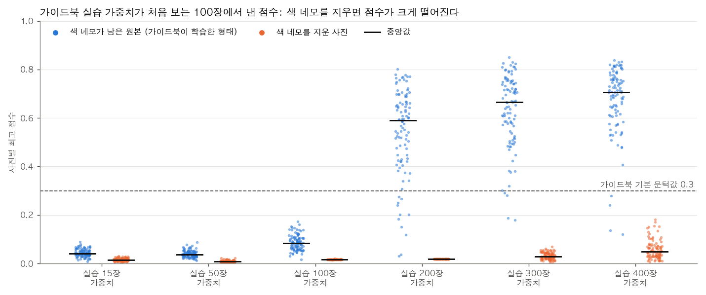

# 베이스라인은 무엇으로 하고, 어떤 모델을 비교할 것인가

2026-09-28 Claude Code 작성. 원본 데이터 점검 결과(`docs/06_원본데이터_구성과_전처리계획.md`)를 바탕으로, 보고서 2장(AI 예측모델 개발 및 성능평가, 40점)에서 비교할 모델을 고릅니다. 이 문서의 숫자는 스크립트 출력입니다. 출처는 각 절 끝과 "숫자로 보기"에 적었습니다.

## 먼저 결론

대회는 베이스라인이 무엇인지 정하지 않았습니다. 가이드북 YOLO를 베이스라인으로 쓰는 것은 좋은 선택입니다. 다만 받은 가중치를 그대로 쓰면 같은 평가 조건이 되지 않습니다. 실제로 받은 가중치를 돌려 보았습니다. 색 네모가 남은 원본 사진에서는 한 번도 본 적 없는 100장을 모두 찾았습니다. 네모를 지우니 사진별 최고 점수가 15분의 1 수준으로 떨어졌고, 가이드북 기본 문턱값으로는 하나도 찾지 못했습니다. 가이드북 모델은 확신의 대부분을 색 네모에서 얻고 있었습니다.

그래서 베이스라인을 두 개 둡니다. 하나는 딥러닝 없는 점 검출(DoG)이고, 다른 하나는 가이드북과 같은 계열의 YOLOv3-SPP를 우리 조건으로 다시 학습한 모델입니다. 받은 가중치를 그대로 돌린 결과는 "왜 색 표시를 지워야 하는가"를 보여 주는 증거로 씁니다.

비교할 모델로는 YOLOv8n(주 모델)과 YOLOv8n-P2(작은 물체용 탐지층을 더한 판)를 추천합니다. 여유가 있으면 RT-DETR-L(트랜스포머)을 더합니다. 이 조합은 데이터의 성질에 하나씩 대응합니다. 금속구가 아주 작고, 독립 표본이 적고, 검사기 옆에서 실시간으로 판정해야 한다는 점입니다.

실제 평가 세트에서는 딥러닝 모델이 모두 만점에 가까워 차이가 잘 드러나지 않습니다. 그래서 같은 평가 조건 안에 스트레스 시험을 함께 넣어야 모델 비교가 의미를 가집니다. 가짜 이물의 크기·대비·위치를 바꾼 검출 한계, 시기 나누기, 호기 하나 빼기, 오경보 측정이 여기에 해당합니다.

## 1. 대회가 요구하는 것

보고서 양식 2장의 작성 요령은, 계획서에 따라 베이스라인을 포함한 2개 이상의 모델을 같은 평가 조건에서 비교하고, 어떤 차이가 났는지와 최종 모델을 고른 이유를 쓰라는 내용입니다. 서면평가 지표도 같은 내용을 요구합니다. 제조 이상 확률을 예측하는 모델을 만들고, 베이스라인을 포함한 2개 이상의 모델을 F1 점수 등으로 비교하고, 최종 모델의 선정 근거를 설명하라는 것입니다.

여기서 세 가지를 읽어 낼 수 있습니다. 첫째, 베이스라인이 무엇인지는 정해 주지 않았습니다. 둘째, "같은 평가 조건"이 핵심입니다. 같은 사진으로 평가하고 같은 기준으로 채점해야 비교가 성립합니다. 셋째, "계획서에 따라"라는 말이 있습니다. 참가 신청 때 낸 계획서에 베이스라인이나 모델을 적었다면 그것과 맞춰야 합니다. 이 부분은 팀이 확인해야 합니다.

## 2. 베이스라인이란, 그리고 가이드북 YOLO는 베이스라인인가

베이스라인은 "비교의 출발점"이 되는 모델입니다. 보통 가장 단순한 방법이나 이미 널리 쓰이는 방법을 둡니다. 새 모델이 베이스라인보다 얼마나 나은지 보여야 그 모델을 쓸 이유가 생깁니다. 대회 안내문과 보고서 양식은 이 단어를 평가 항목과 작성 요령에서만 쓰고, 무엇을 베이스라인으로 삼으라고 정하지 않습니다. 가이드북 노트북과 코드에는 "베이스라인"이라는 말이 아예 없습니다.

그러니 가이드북 YOLO를 반드시 베이스라인으로 써야 하는 것은 아닙니다. 다만 대회가 함께 준 방법이라서 베이스라인으로 삼으면 설득력이 큽니다. "대회가 보여 준 방법보다 이만큼 나아졌다"는 이야기가 되기 때문입니다.

문제는 받은 가중치를 그대로 쓰면 같은 평가 조건이 되지 않는다는 점입니다. 이유는 세 가지입니다.

첫째, 가이드북 가중치는 검사기 색 네모가 남아 있는 사진으로 학습했습니다. 실습용 사진 사본은 원본과 픽셀까지 같은 BMP이고, 색 표시가 그대로 있습니다. 대회 안내문은 이 표시를 특징으로 쓰지 말라고 했습니다.

둘째, 가이드북은 사진을 무작위로 8:2로 나눠 학습하고 검증했습니다. 한 번의 점검에서 거의 같은 사진이 6장씩 나오는 데이터라서, 가이드북 기록에 남은 F1 0.906~0.975는 부풀려졌을 가능성이 큽니다.

셋째, 실습 묶음 400장이 우리 평가 세트 사진 대부분을 이미 학습했습니다. 평가 세트 111장 가운데 82장이 실습 묶음에 들어 있고, 실습 가중치가 보지 못한 것은 라벨만 있는 29장뿐입니다.

### 받은 가중치를 직접 돌려 본 결과

받은 가중치가 실제로 색 네모에 기대는지 확인했습니다(`scripts/xray_guidebook_probe.py`). 실습 가중치 여섯 개를 "라벨만 있는 100장"에 돌렸습니다. 어느 실습 묶음에도 없어서 가중치들이 한 번도 보지 못한 사진입니다. 같은 사진을 두 가지로 넣었습니다. 하나는 색 네모가 남은 원본이고, 다른 하나는 우리 방식으로 네모를 지운 사진입니다. 전처리와 입력 크기(512)는 가이드북 `detect.py`와 똑같이 맞췄고, 채점은 `xray_eval.py`로 했습니다.

원본을 넣으면 실습 300장·400장 가중치가 100장을 모두 찾았습니다(F1 1.0). 가이드북 기본 문턱값 0.3에서도 재현율이 0.96입니다.

네모를 지우면 사정이 달라집니다. 400장 가중치의 사진별 최고 점수가 보통 0.707에서 0.048로 떨어졌고, 여섯 가중치 모두 문턱값 0.3에서 하나도 찾지 못했습니다. 문턱값을 0.01 근처까지 낮추면 300장·400장 가중치는 여전히 금속구를 골라냅니다(F1 0.965, 0.990). 금속구를 아예 못 보는 것은 아니지만, 점수의 대부분이 색 네모에서 나온다는 뜻입니다. 더 적은 사진으로 학습한 가중치는 무너졌습니다. 200장 가중치는 F1이 0.990에서 0.003으로 떨어졌고, 사진 한 장에 오경보가 132개씩 나왔습니다.

우리 평가 세트 가운데 실습 가중치가 보지 못한 29장으로 여러 모델을 나란히 채점해 보기도 했습니다. 가이드북 400장 가중치(원본·지운 사진 모두), YOLOv8n, YOLOv8s가 모두 F1 1.0이었고, DoG만 0.405였습니다. 이 29장은 너무 쉬워서 딥러닝 모델끼리의 차이를 가를 수 없습니다.

그래서 베이스라인을 두 개 두는 것을 제안합니다.

- 베이스라인 A, 딥러닝 없는 점 검출(DoG): "가장 단순한 방법"입니다. 이미 만들어 두었습니다(`scripts/xray_baseline_classical.py`). 학습이 필요 없고, 작은 어두운 점을 찾는 규칙 기반 방법입니다.
- 베이스라인 B, 가이드북과 같은 계열의 YOLOv3-SPP를 우리 조건으로 다시 학습한 것: "대회가 준 방법"입니다. 색 표시를 지운 사진과 점검 묶음 분할을 똑같이 적용합니다. 설치된 Ultralytics에 YOLOv3-SPP 설계와 일반 사진으로 미리 학습한 가중치가 있어서 우리 학습 스크립트로 학습할 수 있습니다. 탐지 결과를 내는 마지막 부분(머리)이 최신식이라 가이드북 버전과 다르고 파라미터도 더 많다는 점은 보고서에 적습니다.

받은 가중치를 그대로 돌린 결과는 진단 실험으로 씁니다. "색 표시에 기대어 학습하면 표시를 지웠을 때 어떻게 되는가"를 보여 주는 근거로, 보고서 1장(데이터 이해)과 5장(창의성)에 넣을 수 있습니다.

## 3. 데이터가 모델에 요구하는 것

모델 후보는 원본 데이터의 성질에서 출발해 골랐습니다. docs/06에서 확인한 사실과, 거기서 나오는 요구를 짝지으면 이렇습니다.

1. 금속구가 아주 작습니다. 라벨 박스는 보통 11픽셀이고 진한 부분은 3~5픽셀쯤이며, 사진 넓이의 0.17%입니다. 그래서 작은 물체를 놓치지 않는 구조가 필요합니다. 입력 해상도를 줄이지 않고, 작은 물체용 탐지층을 갖춘 모델이 유리합니다.
2. 라벨 사진은 500장이지만, 점검 한 번에 거의 같은 사진이 여러 장 나와서 독립 표본은 점검 묶음 114개입니다. 이물 종류도 사실상 금속구 하나입니다. 큰 모델은 외우기 쉽고, 일반 사진으로 미리 학습한 가벼운 모델이 유리합니다. 데이터가 많이 필요한 트랜스포머 계열이 이 규모에서 얼마나 되는지는 확인해 볼 만합니다.
3. 검사기 옆에서 실시간으로 판정해야 합니다. 한 장에 수~수십 밀리초 안에 끝나야 하므로 크기와 속도를 함께 비교합니다.
4. 위치를 표시해야 합니다. 출제문이 "이물을 탐지하고 위치를 표시하는 모델"을 요구하므로, 사진 전체에 "있다/없다"만 답하는 분류 모델은 주 모델이 될 수 없습니다.
5. 이물 없는 정상 사진이 없습니다. 정상 사진만으로 학습하는 이상탐지 방식은 쓰기 어렵습니다. 오경보는 금속구를 지운 사진과 위치 이상 사진으로 잽니다.
6. 금속구가 늘 막대 끝에 있습니다. 모델이 금속구 대신 "막대 끝"을 단서로 배울 위험이 있습니다. 어떤 모델을 고르든, 막대가 없는 자리에 가짜 금속구를 심어 확인해야 합니다.
7. 사진 크기가 호기마다 다르고(316~576픽셀 폭) 흑백입니다. 모든 후보에 같은 전처리(표시 지우기, 흑백 세 채널 복사, 640 맞춤)를 적용합니다.

## 4. 후보 검토

각 후보를 쉬운 설명, 이 데이터에 맞는 점, 약점, 비용 순서로 적었습니다. 크기와 속도는 `scripts/xray_model_info.py`로 잰 값입니다(클래스 1개 기준, 640×640 한 장, 전처리와 겹친 박스 정리 제외).

| 모델 | 파라미터 | CPU 한 장 | Apple GPU(MPS) 한 장 |
|---|---|---|---|
| YOLOv3-SPP (Ultralytics판) | 1억 474만 | 470 ms | 38 ms |
| YOLOv3-tiny | 1,213만 | 50 ms | 4.1 ms |
| YOLOv8n | 301만 | 36 ms | 5.7 ms |
| YOLOv8s | 1,114만 | 76 ms | 7.2 ms |
| YOLOv8n-P2 | 293만 | 56 ms | 7.5 ms |
| YOLO11n | 259만 | 38 ms | 7.8 ms |
| YOLO26n | 250만 | 43 ms | 10.3 ms |
| RT-DETR-L | 3,281만 | 243 ms | 28.8 ms |

가이드북이 쓴 원래 YOLOv3-SPP 구현은 파라미터가 6,263만 개입니다(`scripts/xray_guidebook_audit.py`, 가중치 파일 기준). Ultralytics판은 탐지 결과를 내는 마지막 부분(머리)이 최신식이라 더 큽니다.

### 고른 후보

딥러닝 없는 점 검출(DoG, 베이스라인 A). 사진을 두 번 다른 정도로 흐리게 한 뒤 빼서, 주변보다 어두운 작은 점을 찾습니다. 금속구가 작고 둥근 어두운 점이라 원리가 잘 맞고, 학습이 필요 없으며 설명하기 쉽습니다. 약점은 제품의 다른 어두운 무늬도 잡는다는 것과, 흐린 금속구를 놓친다는 것입니다. 지난 실험에서 검증 세트 F1이 0.51이었고, 가장 흐린 2호기에서 재현율이 크게 떨어졌습니다(평가 세트 0.025).

YOLOv3-SPP(베이스라인 B). 가이드북과 같은 계열입니다. 사진을 격자로 나눠 칸마다 물체의 위치와 확률을 한 번에 내는 "1단계 탐지 모델"의 초기 대표 구조이고, SPP는 여러 크기의 주변 정보를 모으는 부품입니다. 대회가 제시한 방법이라는 점이 장점입니다. 약점은 크고 무겁다는 것입니다. 이 데이터 규모에 비해 파라미터가 많아 외우기 쉽고, 실시간 판정에도 부담이 됩니다.

YOLOv8n(주 모델 후보). YOLOv3보다 여러 세대 뒤의 1단계 탐지 모델 가운데 가장 작은 판입니다. 일반 사진으로 미리 학습한 가중치에서 출발하므로 적은 라벨로도 잘 배웁니다. 지난 실험에서 검증·평가 세트의 금속구를 사실상 모두 찾았고, 한 장 처리가 빠릅니다. 약점은 가장 작은 물체를 보는 탐지층이 8배 축소 단계라서, 금속구가 지금보다 훨씬 작아지면 놓칠 수 있다는 점입니다.

YOLOv8n-P2(작은 물체용 변형). YOLOv8n에 4배 축소 단계의 탐지층을 하나 더 붙인 구조입니다. 이 데이터의 가장 큰 특징인 "아주 작은 금속구"에 직접 대응하는 후보입니다. 출제문의 "작은 이물은 놓칠 수 있다"를 검출 한계 실험에서 YOLOv8n과 비교하면, 구조 차이가 성능 차이로 이어지는지 보여 줄 수 있습니다. 약점은 계산량이 늘어 조금 느려진다는 것입니다.

### 여유가 있으면 더할 후보

RT-DETR-L(트랜스포머 탐지 모델). 사진 전체의 관계를 한꺼번에 보는 트랜스포머 구조로 물체 위치를 바로 예측합니다. 격자 방식 CNN과 원리가 달라서 좋은 대조군이 됩니다. 다만 크고 느리며, 일반적으로 데이터가 적거나 물체가 작을 때 불리하다고 알려져 있습니다. 이 데이터에서도 그런지 확인하는 의미가 있습니다. 학습 스크립트에 모델 종류 선택을 조금 추가해야 합니다.

히트맵 점 검출. 박스 대신 "사진의 각 픽셀이 금속구 중심일 확률" 지도를 내는 작은 신경망입니다(U-Net 같은 구조). 금속구가 작고 둥글어서 박스보다 점으로 다루는 편이 자연스럽고, 확률 지도는 불확실성 설명에도 좋습니다. 대신 학습·예측 코드를 직접 짜야 해서 하루쯤 듭니다.

### 고르지 않은 후보

YOLOv8s와 입력 1024. 지난 실험에서 YOLOv8n 640과 성능이 같았고 더 느립니다. 크기 비교용으로 표에만 남기고 주 비교에서는 뺍니다.

YOLO11n, YOLO26n. YOLOv8n의 후속 경량 모델입니다. 성능은 비슷하거나 조금 낫겠지만, YOLOv8n 대신 쓸 뚜렷한 이유가 데이터에서 나오지 않습니다. 이미 결과가 있는 YOLOv8n을 주 모델로 두는 편이 일정상 안전합니다.

2단계 탐지 모델(Faster R-CNN 등). 후보 영역을 먼저 고르고 다시 분류하는 방식이라 정확한 편이지만 느리고, Ultralytics 밖의 별도 학습 코드를 짜야 해서 같은 조건을 맞추는 부담이 큽니다. 실시간 요구와도 잘 맞지 않습니다.

이상탐지(PatchCore 등). 정상 사진만 배워서 "평소와 다른 곳"을 찾는 방식이라, 처음 보는 이물에도 반응할 수 있다는 장점이 있습니다. 하지만 이 데이터에는 정상 사진이 없고, 모든 사진에 시험용 막대가 있어서 막대 자체를 이상으로 잡을 위험이 큽니다.

사진 분류 모델. 위치를 내지 않아서 출제 요구를 채우지 못합니다.

## 5. 추천 조합

| 역할 | 모델 | 이 비교가 답하는 질문 |
|---|---|---|
| 베이스라인 A | DoG 점 검출 | 딥러닝이 꼭 필요한가 |
| 베이스라인 B | YOLOv3-SPP (Ultralytics판, `yolov3-sppu.pt`에서 출발해 우리 조건으로 학습) | 대회가 보여 준 방법보다 나아졌는가 |
| 주 모델 | YOLOv8n | 가볍고 빠른 모델로 충분한가 |
| 비교 모델 | YOLOv8n-P2 | 작은 물체용 구조가 작은 이물 검출에 도움이 되는가 |
| 여유 시 | RT-DETR-L, 히트맵 점 검출 | 원리가 다른 모델이 이 데이터에서 더 나은가 |
| 진단 | 가이드북 받은 가중치 (원본 대 지운 사진) | 색 표시에 기대면 어떻게 되는가 |

YOLOv8n과 YOLOv3-SPP는 크기가 약 35배 차이 납니다. 실제 평가 세트에서 성능이 비슷하게 나온다면, 가벼운 쪽이 현장에 맞는다는 근거가 됩니다. YOLOv8n과 YOLOv8n-P2는 크기가 거의 같고 작은 물체용 탐지층만 다릅니다. 그래서 검출 한계 실험에서 작은 가짜 이물을 누가 더 잘 찾는지 보면, 구조의 차이가 성능 차이로 이어지는지 깔끔하게 보여 줄 수 있습니다.

필요한 코드 변경은 작습니다. 학습 스크립트에 두 가지를 더하면 됩니다. 설계 파일로 만든 모델(YOLOv8n-P2)에 YOLOv8n 가중치를 옮겨 싣는 옵션과, RT-DETR을 불러오는 옵션입니다. 베이스라인 B는 지금 스크립트에 `--model weights/yolov3-sppu.pt`를 주면 학습할 수 있을 것으로 봅니다. 아직 돌려 보지는 않았고, 가중치는 처음 실행할 때 자동으로 내려받습니다.

## 6. 공통 평가 조건

비교가 의미 있으려면 모든 모델을 같은 조건에서 평가해야 합니다. 제안하는 조건은 이렇습니다.

- 데이터: 같은 전처리와 같은 분할(`data/xray_v2`, docs/06 8장)을 씁니다. 학습·검증·평가는 점검 묶음 단위로 나눕니다.
- 학습: 같은 입력 크기(640), 같은 시드(0), 각 모델의 기본 학습 설정을 씁니다. 학습 시간과 사용 장치를 함께 적습니다.
- 문턱값: 검증 세트에서 정하고 평가 세트에는 그대로 적용합니다. 지난 채점은 평가 세트 안에서 문턱값을 골라 조금 낙관적이었습니다.
- 채점: `scripts/xray_eval.py` 하나로 합니다. 예측 박스 중심이 정답에서 8픽셀 안이거나 IoU(두 박스가 겹친 비율)가 0.3 이상이면 맞힌 것으로 봅니다.
- 지표: 박스 단위 정밀도·재현율·F1·AP, 사진 단위 F1(이물 없는 사진 포함), 사진당 오경보 수, 한 장 처리 시간, 모델 크기를 봅니다.
- 나눠 보기: 호기별, 시험편 종류별(막대 3개/1개)로 나눠 봅니다.

실제 평가 세트에서는 딥러닝 모델들이 모두 만점에 가까워서 차이가 잘 드러나지 않을 것입니다. 차이는 다음 스트레스 시험에서 드러납니다.

- 검출 한계 지도: 가짜 금속구를 크기, 대비, 위치(가장자리, 막대 없는 자리)를 바꿔 심고 탐지율을 잽니다.
- 시기 나누기: 6~7월(막대 3개)로 학습하고 8~9월(막대 1개)로 평가합니다.
- 호기 하나 빼기: 두 호기로 학습하고 나머지 한 호기로 평가합니다.
- 오경보: 금속구를 지운 사진과 위치 이상 사진에서 몇 번 잘못 울리는지 셉니다.

최종 모델은 실제 평가 세트 성능이 비슷하다면, 스트레스 시험에서 덜 무너지고 오경보가 적으며 빠른 모델로 고릅니다.

## 7. 팀이 정할 것

1. 참가 신청 때 낸 계획서가 있는지, 거기에 베이스라인이나 모델을 적었는지 확인. 적었다면 그 내용과 맞춥니다.
2. 베이스라인을 두 개(DoG, YOLOv3-SPP 재학습)로 둘지
3. 비교 모델을 YOLOv8n과 YOLOv8n-P2로 할지, RT-DETR-L까지 더할지
4. 가이드북 받은 가중치 실험을 보고서에 "색 표시에 기대면 생기는 일"의 근거로 넣을지
5. 최종 모델을 고르는 기준에 동의하는지. 실제 평가 세트 성능이 비슷하면 스트레스 시험, 오경보, 속도 순서로 봅니다.

## 숫자로 보기

가이드북 받은 가중치 (라벨만 있는 100장, 박스 100개, `reports/guidebook_probe/summary.md`)
- 색 네모가 남은 원본, 최고 F1 기준: 15장 0.813 / 50장 0.812 / 100장 0.734 / 200장 0.990 / 300장 1.000 / 400장 1.000
- 네모를 지운 사진, 최고 F1 기준: 15장 0.783 / 50장 0.400 / 100장 0.268 / 200장 0.003 / 300장 0.965 / 400장 0.990
- 최고 F1을 낸 문턱값(400장): 원본 0.120, 지운 사진 0.0094
- 가이드북 기본 문턱값 0.3에서의 재현율: 원본 200장 0.89, 300장 0.96, 400장 0.96, 나머지 0 / 지운 사진은 여섯 가중치 모두 0
- 사진별 최고 점수의 중앙값(400장): 원본 0.707, 지운 사진 0.048
- 지운 사진에서 사진당 오경보(최고 F1 기준): 200장 132.47개, 100장 2.17개, 400장 0.01개
- 처리 장치 CPU, 입력 512, 사진 한 장 약 0.11초

우리 평가 세트와 실습 묶음의 관계 (`reports/data_audit/summary.json`)
- 평가 세트 111장 중 실습 묶음에 들어 있는 사진 82장, 라벨만 있는 사진 29장
- 공통 29장(박스 29개)의 F1: 가이드북 400장 원본 1.000, 지운 사진 1.000, YOLOv8n 640 1.000, YOLOv8s 1024 1.000, DoG 0.405

모델 크기와 속도 (`reports/model_info.csv`, 640×640 한 장, 전처리·박스 정리 제외, 30회 중앙값)
- 위 표와 같습니다. YOLOv3-SPP(Ultralytics판)는 YOLOv8n보다 파라미터가 약 35배, 가이드북 구현(6,263만)은 약 21배입니다.

지난 실험 (v1 분할, 각 세트 안에서 최고 F1 문턱값을 고른 값이라 조금 낙관적)
- DoG: 검증 F1 0.510 / 평가 F1 0.439. 호기별 재현율(평가): 1호기 0.43, 2호기 0.025, 3호기 0.911
- YOLOv8n 640: 검증·평가 F1 1.000, 사진당 오경보 0
- YOLOv8n 1024: 검증 F1 0.998(238개 중 1개 놓침), 평가 F1 1.000
- YOLOv8s 1024: 검증·평가 F1 1.000, 학습 1,239초
- 참고: `xray_eval.py`의 AP는 정답이 N개일 때 최대 1 − 1/N으로 계산됩니다(검증 238개면 0.996, 평가 221개면 0.995). 그래서 지난 결과의 AP 0.995~0.996은 사실상 만점입니다. 이 계산 방식은 다음 작업에서 바로잡겠습니다.
