# 사진으로 이해하는 데이터 전처리

2026-10-05 보완 · [문서 처음으로](README.md) · [모델 설명](20_모델선정과_평가_정리본.md) · [계획과 이력](21_진행계획과_작업이력.md)

우리가 하려는 일은 **X-ray 사진에서 작은 이물이 어디 있는지 AI가 찾게 하는 것**이다. 이를 위해 먼저 사진에 덧그려진 검사기 표시를 지우고, 이물 위치를 알려 주는 정답 파일과 사진을 짝지어 학습한다. 그다음 사진 일부를 잘라 확대하거나 사진 전체를 조금 돌려, 위치와 방향이 달라진 학습 자료를 만들었다.

이 문서는 실제 사진으로 처리 과정을 설명한다. 색 네모 제거를 추가 원본까지 확대했고, 학습용 사진을 자르거나 돌린 자료와 이물을 지운 자료도 생성했다. 기본 학습 데이터셋으로 세 모델의 학습·검증·테스트, 라벨링 후보 데이터셋 1,900장 검사와 8가지 학습 데이터 조건 비교를 완료했다. 자르기·회전 자료는 기존 8조건 중 잠정 선택이며, 2026-10-03 연구에서는 모든 처리를 합친 자료도 세 모델에서 비교하도록 제안했다. 이후 전체 혼합 2,453장으로 세 모델의 20epoch 학습·검증·테스트 평가까지 완료했다(6절과 모델 정리본 13절). 2026-10-04에는 D-FINE-S를 포함한 네 모델의 공통 20epoch 비교도 완료했다(모델 정리본 18절). 자료를 생성했다는 사실과 성능 개선이 확인됐다는 사실은 구분한다.

## 0. 팀에서 통일해서 사용할 이름

앞으로 현재 설명·회의·제출 자료는 아래 이름을 사용한다. **사진의 출처, 정답 유무, 사용하는 목적을 구분해 이름을 붙인다.** 과거 작업 기록·원문·파일 경로는 추적을 위해 그대로 보존한다. 아래 장수는 현재 자료 구성에 대한 값이며, 이름 자체에 장수를 포함하지 않는다.

### 0.1. 사진 속 대상과 라벨

| 통일한 이름 | 무엇을 뜻하는가 |
|---|---|
| **이물** | 우리가 탐지할 대상. 현재 라벨 제공 데이터셋에서는 시험용 금속구가 작은 검은 점으로 보인다. 사진의 모든 어두운 점을 이물이라고 확정하는 것은 아니다. |
| **시험편 막대** | 검사 감도 확인에 사용하는 길쭉한 회색 막대. 이물 자체와 구분한다. |
| **색 네모** | 검사기가 원본 사진에 그려 놓은 사각형 테두리. 공식 정답 라벨이 아니다. 노란 위치 안내선은 별도로 설명한다. |
| **공식 정답 라벨** | 데이터 제공자가 TXT에 기록한 이물 종류·위치·크기. 현재 학습·채점의 기준이다. |
| **정답 박스** | 공식 정답 라벨의 위치·크기를 사각형으로 나타낸 것. 그림의 파란 선은 설명용이다. |
| **예측 박스 / 이물 신뢰도 점수** | AI가 제시한 사각형 / 해당 후보를 이물로 판단하는 강도를 나타내는 점수. |
| **의사 라벨** | AI가 만들고 자동 검사 기준을 통과해 학습용으로 채택한 라벨. 공식 정답 라벨과 구분한다. 검사 전에는 ‘라벨 초안’이라고 부른다. |
| **탐지 임계값** | 이물 신뢰도 점수가 이 값 이상인 예측 박스를 채택하는 기준. 실제 공장의 출하 허용 기준은 별도로 검증해야 한다. |

### 0.2. 데이터셋 이름과 포함 관계

| 통일한 이름 | 현재 장수 | 뜻과 사용하는 목적 |
|---|---:|---|
| **원본 데이터셋** | 2,532 | 중복 파일을 제외한 고유 원본 사진 전체. 원본 파일은 읽기만 한다. |
| **라벨 제공 데이터셋** | 500 | 공식 정답 라벨이 있는 사진 전체. 아래 세 데이터셋으로 나눈다. |
| **기본 학습 데이터셋** | 296 | 라벨 제공 데이터셋 중 모델 학습에 사용하는 사진. 색 네모를 제거한 사진과 공식 정답 라벨을 짝지어 사용한다. |
| **검증 데이터셋** | 107 | 학습에 넣지 않고 증강·모델·탐지 임계값을 고르는 사진. 색 네모 제거 후 사용한다. |
| **테스트 데이터셋** | 97 | 선택한 설정과 탐지 임계값을 고정해 결과를 확인하는 사진. 색 네모 제거 후 사용한다. |
| **미라벨 데이터셋** | 2,032 | 공식 정답 라벨이 없는 사진. 정상이라는 뜻이 아니다. |
| **라벨링 후보 데이터셋** | 1,900 | 미라벨 데이터셋에서 학습 편입 제외 사진을 뺀, AI 라벨링 대상. 자동 채택 802장·의심 698장·보류 400장으로 처리했다. |
| **의사 라벨 데이터셋** | 802 | 라벨링 후보 데이터셋 중 자동 검사를 통과한 사진과 의사 라벨. 학습에만 추가한다. |
| **증강 데이터셋** | 종류별로 집계 | 기본 학습 데이터셋의 사진을 자르기·회전·이물 제거·이물 추가로 바꾼 사진과 변환한 라벨. 1,355장을 생성해 전체 혼합 비교에 사용했다. 개별 처리의 기여와 전체 혼합 성능은 구분한다. |

‘기본 학습 데이터셋의 사진’이라고 불렀던 것은 앞으로 **기본 학습 데이터셋**으로 부른다. 제공자가 정한 학습 분할이라는 뜻이 아니라, 팀이 촬영 묶음에 따라 학습용으로 나눈 자료라는 뜻이다. ‘처리 사진’은 색 네모 제거 상태를 설명하는 말이며 새로운 데이터셋 이름으로 사용하지 않는다. 현재 전체 혼합 학습 자료는 기본 296장·증강 1,355장·의사 라벨 802장을 합친 2,453장이다. 검증·테스트에는 증강과 의사 라벨을 추가하지 않았다.

포함 관계를 글로 보면 다음과 같다.

```text
원본 데이터셋 2,532장
├─ 라벨 제공 데이터셋 500장
│  ├─ 기본 학습 데이터셋 296장 → 증강 데이터셋의 출처
│  ├─ 검증 데이터셋 107장
│  └─ 테스트 데이터셋 97장
└─ 미라벨 데이터셋 2,032장
   ├─ 라벨링 후보 데이터셋 1,900장 → 검사 통과분만 의사 라벨 데이터셋
   ├─ 검증·테스트 촬영 묶음에 속한 27장 → 학습 편입 제외
   └─ 위치 이상 사진 105장 → 학습 편입 제외
```

‘촬영 묶음’은 데이터셋 이름이 아니라 서로 비슷한 연속 사진을 함께 관리하는 단위다. 8절에서 설명한다.

## 1. 먼저 사진과 정답 파일을 구분하기

사진에서 길쭉한 회색 막대는 검사 감도를 확인하는 시험편이고, 막대 끝의 작은 검은 점이 우리가 찾을 금속구다. 라벨 제공 데이터셋은 시험편 막대가 있는 사진으로 파악돼 있다. 실제 생산 중 혼입된 이물은 항상 이런 막대와 함께 나타나는 것은 아니다.

다음 그림은 **같은 사진의 같은 이물 하나를 확대**한 것이다.

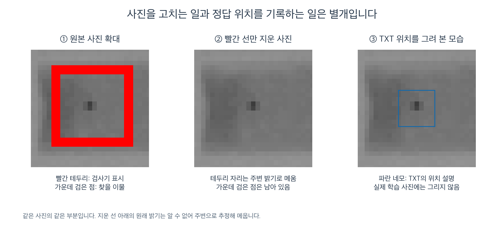

왼쪽을 보면 가운데 작은 검은 점과 그 주위의 큰 빨간 테두리가 있다. **검은 점은 이물의 X-ray 모습이고, 빨간 테두리는 검사기가 나중에 사진 위에 그려 넣은 표시**다. AI가 빨간 테두리만 보고 이물이 있다고 판단하면, 테두리가 없는 실제 입력에서는 제대로 찾지 못할 수 있다.

가운데는 빨간 테두리 자리만 골라 주변의 회색 밝기로 메운 결과다. 가운데의 검은 점과 막대는 남아 있다. 네모 안쪽 전체를 지우는 것이 아니다. 다만 빨간 선이 덮은 자리의 원래 밝기는 알 수 없으므로, 그 부분은 주변 정보를 이용해 추정한다. 원래 사진을 완벽하게 복원했다고 설명하지 않는다.

오른쪽의 파란 네모는 별도 TXT 파일에 적힌 위치를 이해하기 쉽게 그려 본 것이다. **파란 네모는 학습 사진에 넣는 선이 아니다.** 실제 학습에는 가운데 사진과 별도 TXT 파일을 함께 전달한다. 원본 BMP와 공식 TXT는 그대로 두고, 처리한 사진을 별도 폴더에 저장한다.

| 무엇인가 | 어디에 있는가 | AI 학습에서 하는 역할 |
|---|---|---|
| 이물 | X-ray 사진에서 작은 검은 점으로 보이는 대상 | AI가 찾아야 하는 영상 속 대상 |
| 색 네모 | 원본 사진 위에 이미 그려진 픽셀 | 학습 단서가 되지 않도록 제거할 표시 |
| 공식 정답 라벨 | 사진과 이름이 같은 별도 텍스트 파일 | 찾을 이물의 위치와 크기를 알려 주는 정답 |
| 정답 박스 | 이 문서의 그림에만 추가한 선 | 사람이 TXT의 뜻을 눈으로 확인하도록 도움 |

**라벨 하나는 사진 한 장이 아니라 이물 하나의 위치 기록이다.** 사진에 이물이 세 개면, TXT에는 이물 위치가 세 줄 들어갈 수 있다. 각 줄에는 이물 종류 번호, 중심의 가로·세로 위치, 박스의 가로·세로 크기가 들어 있다. 학습 프로그램은 사진에서 예측한 위치와 이 정답 위치를 비교하며 배운다.

### 1.1. 실제 사진 한 장과 TXT 파일을 같이 읽어 보기

아래는 `002_20200622_203053(2)`라는 **실제 사진과 그 사진의 공식 정답 라벨 TXT**다. 이 사진에는 작은 검은 점이 세 개 있고, TXT에는 각 점을 둘러싼 사각형의 위치가 한 줄씩, 총 세 줄로 적혀 있다. 이처럼 물체를 둘러싼 사각형을 ‘바운딩 박스’라고 한다.

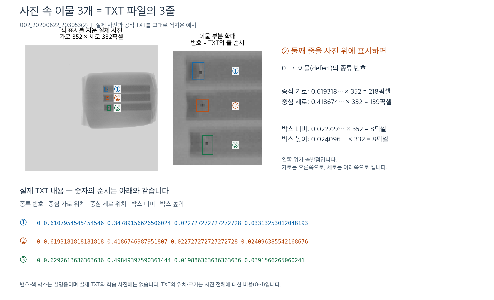

그림의 ①은 TXT 첫째 줄, ②는 둘째 줄, ③은 셋째 줄에 대응한다. 이 예시에서는 위쪽 점부터 순서대로 기록돼 있다. **번호와 색 박스는 설명을 위해 공식 TXT 좌표를 그린 것이며, AI가 예측한 결과가 아니다.** 사진 자체를 학습할 때는 이 설명선을 넣지 않는다.

직접 열어 볼 파일:

- [실제 TXT 파일 열기](<examples/002_20200622_203053(2).txt>): 공식 원본과 바이트 단위로 동일한 사본이다.
- [대응 사진 열기](<examples/002_20200622_203053(2).png>): 색 네모를 제거한 학습 사진의 동일한 사본이다. 설명용 박스·번호가 없다.

두 파일은 확장자 앞의 이름이 같아 서로 짝을 이룬다. 원본 사진은 BMP이며 색 네모를 제거한 학습 사진은 PNG로 저장했다. 실제 TXT의 전체 내용은 다음과 같다. **파일에는 제목 줄이나 ①②③ 번호 없이 아래 숫자 세 줄만 들어 있다.**

```text
0 0.6107954545454546 0.34789156626506024 0.022727272727272728 0.03313253012048193
0 0.6193181818181818 0.4186746987951807 0.022727272727272728 0.024096385542168676
0 0.6292613636363636 0.49849397590361444 0.019886363636363636 0.0391566265060241
```

### 1.2. 한 줄의 숫자 다섯 개는 무엇을 뜻하나

이 TXT는 YOLO 형식으로, 숫자가 **`종류 번호 → 박스 중심의 가로 위치 → 박스 중심의 세로 위치 → 박스 너비 → 박스 높이`** 순서로 적혀 있다. 좌표는 사진의 왼쪽 위를 기준으로 가로는 오른쪽, 세로는 아래쪽으로 잰다. 가로·세로 위치는 박스의 모서리가 아니라 **중심**이다.

종류 번호를 제외한 네 값은 픽셀 수를 그대로 적은 것이 아니라 **사진 전체의 가로·세로에 대한 비율**이다. 예를 들어 가로 위치가 0.5이면 사진 너비의 절반 지점이다. 이를 ‘정규화 좌표’라고 부른다. 사진 크기가 달라도 같은 방식으로 위치를 표현할 수 있다.

숫자로 보기 — 그림의 **② 둘째 줄**을 풀어 읽기:

| 순서 | 실제 값의 앞부분 | 뜻 | 이 사진에서의 해석 |
|---|---|---|---|
| 1 | `0` | 물체 종류 번호 | `defect`, 즉 탐지할 이물. **정상이나 이물 0개라는 뜻이 아니다.** |
| 2 | `0.619318…` | 박스 중심의 가로 위치 ÷ 사진 너비 | 왼쪽에서 사진 너비의 약 61.9% 지점 |
| 3 | `0.418674…` | 박스 중심의 세로 위치 ÷ 사진 높이 | 위쪽에서 사진 높이의 약 41.9% 지점 |
| 4 | `0.022727…` | 박스 너비 ÷ 사진 너비 | 사진 너비의 약 2.27%인 작은 사각형 |
| 5 | `0.024096…` | 박스 높이 ÷ 사진 높이 | 사진 높이의 약 2.41%인 작은 사각형 |

이 사진은 **가로 352픽셀, 세로 332픽셀**이다. 둘째 줄의 가로 관련 값에는 352를, 세로 관련 값에는 332를 곱하면 된다. 실제 전체 소수값으로 계산하면 박스 중심은 **(218, 139)픽셀**, 너비와 높이는 각각 **8픽셀**이다. 따라서 왼쪽 위 **(214, 135)**부터 오른쪽 아래 **(222, 143)**까지의 사각형이 그림의 ②에 해당한다. 위 표와 그림에서는 긴 소수를 줄여 표기했고, 실제 TXT의 값은 바꾸지 않았다.

공식 자료의 `classes.names`에는 `defect` 한 종류가 정의돼 있어 이 예시의 세 줄 모두 종류 번호가 0이다. 이 형식의 정답 TXT에는 AI의 확신 점수나 색 네모의 색이 들어 있지 않다. TXT가 없는 다른 사진도 그 사실만으로 이물이 없는 정상 사진이라고 판단할 수 없다.

색 네모 제거는 사진 크기와 이물의 위치를 이동시키지 않으므로 **같은 TXT를 짝지어 사용한다.** 반면 사진을 자르거나 돌려 이물 위치가 달라지면, 뒤에서 설명하는 것처럼 박스 좌표도 함께 계산해 바꿔야 한다. 여기서 ‘라벨 보존’은 공식 TXT의 기록을 유지한다는 뜻이며, 모든 영상 픽셀이 그대로라는 뜻은 아니다.

## 2. 가지고 있는 사진은 어떤 구성인가

원본 폴더에는 같은 사진이 여러 곳에 복사돼 있다. 파일 개수와 서로 다른 사진 수를 구분한다. 모든 사진에 TXT가 있는 것은 아니다.

숫자로 보기:

- 원본 BMP 파일 2,809개. 동일 이름·파일 내용의 중복을 정리하면 고유 사진 2,532장.
- 라벨 제공 데이터셋 500장, 그 안의 정답 이물 박스 1,147개.
- 미라벨 데이터셋 2,032장. 장비에 색 네모가 있다고 공식 정답이 있는 것은 아니다.
- 고유 사진 중 색 네모가 있는 사진 2,427장, 색 네모 없이 노란 선만 있는 사진 105장.
- 노란 선만 있는 사진은 제품 위치 이상 사진으로 별도 취급하고, 정상 제품의 학습 예시로 쓰지 않는다.

원본과 공식 TXT는 `제조AI데이터셋/4. X-ray 검사장비 AI 데이터셋/dataset/` 아래에 있다. 사진은 `test1/yolov3/X선이물검출기(06.23_09.22)/`, 정답은 `라벨링 6종 세트/labels/`를 사용한다. 실습 폴더의 사본이나 장비 색 네모를 공식 정답 대신 사용하지 않는다.

### 2.1. EDA는 언제, 무엇을 확인했나

**EDA(탐색적 데이터 분석)는 모델을 만들기 전에 데이터의 구성·분포·이상 항목을 살펴보는 작업이다. 이 프로젝트에서도 EDA를 진행했고, 그 결과로 현재 전처리와 분할 방법을 정했다.** 다만 모든 분석을 최초 전처리 이전에 끝낸 것은 아니다. 초기 점검 → 전처리 시제품 → 상세 EDA → 전처리 개선 → 학습 후 오류 분석 순서로 보완했다.

| 시점 | 실제 수행한 분석 | 기록의 의미 |
|---|---|---|
| 2026-09-22 | 데이터셋 선정, 라벨 수·출처 확인, 초기 마스킹·연습 학습 | 초기 데이터 점검과 전처리 시제품이 함께 진행됨 |
| 2026-09-28 | 원본 중복·촬영 시각·검사기·라벨·박스 크기·대비·시험편 구성 분석 | 현재 전처리를 정하기 전의 상세 EDA |
| 2026-09-29 | 팔레트 분석, 색 네모 없는 동일 사본 검색, 표시 제거 방법 비교 | 지울 픽셀의 범위와 메우는 방법의 선택 근거 |
| 2026-09-30 | 색 테두리 픽셀만 제거하고 주변 영상으로 메우는 방법 적용, 촬영 묶음 분할 보완 | EDA 결과를 전처리에 반영 |
| 2026-10-03~04 | 작은 이물·저대비 등 조건별 모델 오류 분석 | 학습 후의 후속 분석. 최초 EDA로 소급해 쓰지 않음 |
| 2026-10-04 | 기존 원본 점검 스크립트를 별도 폴더에 다시 실행 | 원본·색 네모·라벨·박스·시간·추가 점검의 6개 결과 묶음이 기존 JSON과 같음을 확인 |

### 2.2. 무엇을 발견했고, 전처리에 어떻게 반영했나

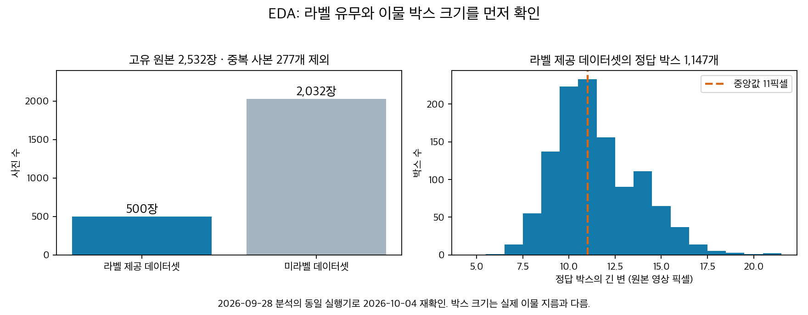

왼쪽은 서로 다른 원본 사진 중 공식 TXT가 있는 사진과 없는 사진의 수다. **미라벨 사진을 정상으로 간주할 수 없다는 점**이 중요하다. 오른쪽은 공식 TXT 박스의 긴 변 분포다. 작은 박스가 많으므로 색 네모 주변까지 넓게 지우면 필요한 영상 정보도 바뀔 수 있다. 박스의 긴 변은 실제 금속구 지름이나 밀리미터 단위 크기가 아니다.

| EDA 항목 | 확인한 결과 | 전처리·평가에 반영한 결정 |
|---|---|---|
| 파일 중복과 이름 충돌 | 같은 내용의 사본이 있고, 이름만 같은 서로 다른 사진도 있음 | 파일 이름만으로 중복 제거하지 않고 파일 내용 해시도 확인 |
| 공식 라벨 출처와 누락 | 미라벨 사진이 많고 실습용 라벨과 공식 TXT가 다른 사례가 있음 | `라벨링 6종 세트/labels`를 기준으로 고정. 추가 AI 라벨은 학습용 의사 라벨로 분리 |
| 사진 속 색 네모 | BMP 팔레트에서 회색 영상과 표시 색 번호가 구분됨 | 표시 색 픽셀만 선택해 제거. 네모 안쪽 전체는 지우지 않음 |
| 색 네모 없는 동일 사본 | 라벨 제공 데이터셋의 같은 사진에서 표시 없는 원본 사본을 찾지 못함 | 주변 영상으로 메우되, 가려진 원래 픽셀을 완벽히 복원했다고 주장하지 않음 |
| 이물 크기와 대비 | TXT 박스가 작고, 검사기마다 크기·대비 분포가 다름 | 이물 주변 픽셀 보존. 모든 모델을 호기별·크기별·대비별로 추가 평가 |
| 촬영 시각과 연속 사진 | 짧은 시간 안에 찍힌 비슷한 사진이 반복됨 | 같은 호기에서 60초 이내로 이어진 촬영 묶음을 학습·검증·테스트에 나누어 넣지 않음 |
| 검사기와 시험편 막대 구성 | 검사기별 해상도가 다르고 막대 하나·세 개인 사진이 함께 있음 | 촬영 묶음을 유지하면서 호기와 막대 구성의 비율도 고려해 분할 |
| 데이터의 대표성 | 라벨 제공 데이터셋은 시험편 사진이며 실제 정상 제품 평가 표본이 없음 | 시험편 탐지 성능과 실제 공장 성능을 구분. 정상 오경보율·안전한 PASS는 미검증으로 기록 |

숫자로 보기 — 2026-10-04 같은 실행기로 재확인:

- 원본 BMP 2,809개 = 고유 사진 2,532장 + 같은 내용의 사본 277개. 이름만 겹치는 서로 다른 사진은 3쌍이며 모두 미라벨 사진이다.
- 고유 원본의 검사기별 사진 수: 1호기 943장 / 2호기 805장 / 3호기 784장.
- 원본 사진 크기: 316×332, 352×332, 412×332, 576×444픽셀. 서로 다른 크기를 그대로 같은 픽셀 의미로 해석하지 않는다.
- 라벨 제공 데이터셋 500장·정답 박스 1,147개. 정답 박스가 없는 사진은 0장이다. 사진별 박스 수는 1개 176장 / 2개 1장 / 3개 323장이다.
- 정답 박스 긴 변의 10·50·90백분위수는 각각 9·11·15픽셀이다. 검사기별 중앙값은 10·11·14픽셀이다. 이는 전체 라벨의 데이터 이해용 통계이며 모델 선택 점수가 아니다.
- 원본에서 계산한 국소 대비 지표 중앙값은 46이다. 이 값은 주변 밝기와 이물 중심 밝기의 차이를 나타내는 영상 지표이며 실제 금속의 물리적 성질을 측정한 값이 아니다.
- 색 네모 사진 2,427장, 노란 선만 있는 위치 이상 사진 105장. 위치 이상 사진은 정상 학습 자료로 쓰지 않는다.
- 고유 원본의 촬영 묶음 547개, 라벨 제공 데이터셋이 포함된 촬영 묶음 114개. 현재 분할은 학습 67 / 검증 24 / 테스트 23개 묶음이다.
- 알려진 라벨 누락 의심 사진 `002_20200623_123055(5)`는 해당 촬영 묶음을 학습에 고정했다. 이 사진에서 이물 제거 증강을 만들지 않았다. 공식 TXT 자체는 수정하지 않았다.

**메우는 방법도 비교했다.** 원래 회색값을 아는 주변 위치에 색 네모 모양의 마스크를 옮겨 놓고, 가린 뒤 다시 메운 값의 오차를 비교했다. 저장된 9월 29~30일 시험에서 나비에-스토크스 방식의 오차 중앙값은 2.45, 텔레아 방식은 3.16이었다. 이 근거와 회색 영상 보존을 고려해 나비에-스토크스 방식을 선택했다. 실제 색 네모 아래의 원본을 아는 시험은 아니므로 완전 복원을 입증하지는 않는다. 이 메우기 비교는 이번에 다시 실행하지 않고 저장 결과를 확인했다.

### 2.3. EDA로 말할 수 있는 것과 없는 것

EDA는 **중복 제거·라벨 출처 고정·색 네모 제거·촬영 묶음 분할·조건별 평가가 왜 필요한지** 설명한다. EDA만으로 어느 모델이 가장 좋거나 모든 증강이 성능을 높인다고 입증할 수는 없다. 그 판단에는 고정된 비교 실험이 필요하다.

시험편 이물은 작고 비교적 반복적인 모습이다. 다양한 재질·불규칙한 형상·실제 정상 제품을 충분히 대표한다고 볼 수 없다. 증강 사진과 의사 라벨을 늘려도 새로운 공장의 독립적인 평가 자료가 생기는 것은 아니다. 후속 오류 조건의 경계값은 기본 학습 데이터셋에서 계산했으며, 테스트 점수에 맞춰 전처리·분할을 다시 고르지 않았다.

근거: [과거 작업 기록](../archive/문서정리_20261002/이전문서모음.md)의 2026-09-22·28·29·30 항목, [원본 EDA 재확인 결과](../reports/eda_review_20261004/summary.json), [이전 결과와의 대조](../reports/eda_review_20261004/historical_comparison.json), [메우기 방법 비교](../reports/mask_compare/summary.json), [현재 분할 확인](../reports/roadmap_20261002/split_rationale_audit.json). 기존 실행기 `scripts/xray_data_audit.py`를 사용했고, 출력 폴더만 분리해 과거 결과를 보존했다.

## 3. 색 네모만 골라 지우고 주변 영상으로 메우는 전처리

우리는 **장비가 그린 색 테두리의 픽셀만 선택해 제거하고, 그 자리를 주변 영상의 밝기와 경계가 이어지도록 메우는 방법**으로 전처리했다. 기술적으로는 ‘팔레트 기반 마스킹과 나비에-스토크스 인페인팅’을 함께 사용한 것이다. 아래 그림에서 왼쪽 사진을 가운데 사진으로 바꾸는 과정이다.


**먼저, 색 테두리의 위치만 정확히 고른다.** 원본 BMP는 픽셀의 색을 색상표인 ‘팔레트’의 번호로 기록한다. 이 데이터에서는 회색 X-ray 영상과 색 네모에 사용하는 번호가 구분된다. 따라서 색 네모에 쓰인 번호의 픽셀만 찾아 ‘이 자리만 바꾼다’는 지도를 만든다. 이 지도가 마스크이며, 이물 주변의 네모 안쪽 전체를 선택하는 것은 아니다.

**그다음, 선택한 자리를 주변 영상으로 메운다.** 지운 자리를 검정이나 흰색으로 칠하면 새로운 선이 남을 수 있으므로, 주변의 밝기 변화와 경계 방향을 참고해 이어지는 모양으로 채운다. 여기에 쓰는 방법이 ‘나비에-스토크스 인페인팅’이다. 쉽게 말해, 선 때문에 끊긴 회색 무늬를 주변에서 이어 와 빈 부분을 메우는 처리다.

**왜 이 방법을 선택했는가?** 색 네모를 지울 때 그 주변까지 삭제 범위를 넓혀 함께 메우는 방법도 있다. 하지만 우리가 찾는 이물은 아주 작은 검은 점이므로, 범위를 넓히면 색 선 옆의 이물·막대·배경 픽셀까지 불필요하게 바뀔 수 있다. 그래서 주변까지 지우는 대신 **실제 색 선이 있는 자리만 바꾸어, 학습에 필요한 회색 영상 정보를 최대한 남기는 방법**을 선택했다. AI가 장비의 테두리에 기대지 않고 실제 이물의 모습을 배우도록 하려는 목적이다.

단, 색 선 아래에 원래 어떤 밝기가 있었는지는 알 수 없다. 메운 부분은 주변 정보로 추정한 결과이며, 이물이 색 선에 가려져 있던 부분까지 정확히 되살린다고 보장하지 않는다. 위 예시에서는 선 안쪽의 검은 점이 남아 있는 모습을 확인할 수 있다.

구현에서는 팔레트 번호 244~255를 선택하고, 선택 범위를 주변으로 확장하지 않은 채 나비에-스토크스 방식으로 메운다. 처리 결과는 기존 저장 경로인 `data/xray_v2/`에 있다. 사진·라벨·분할 목록은 이미 생성돼 있으며, 이 설명 수정으로 처리 방법이나 데이터 파일을 바꾸지는 않았다.

### 3.1. 실제 생성한 자료와 검사 결과

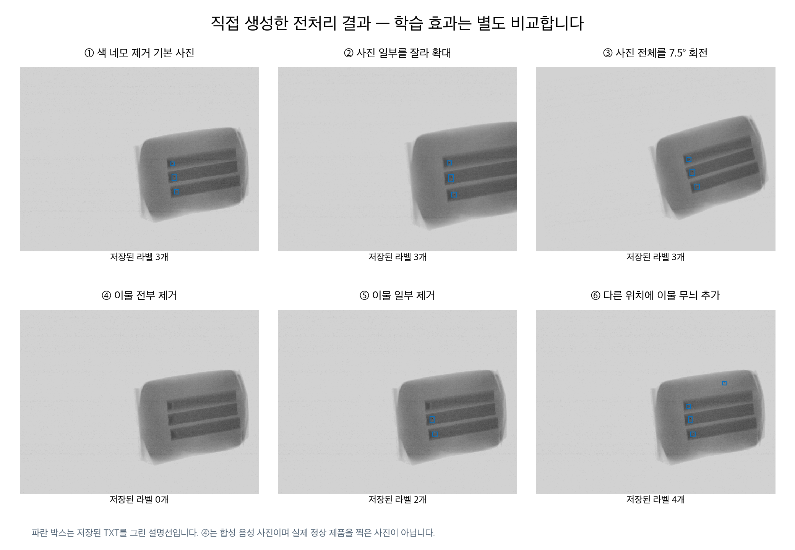

증강 데이터셋은 **기본 학습 데이터셋에서만** 만들었다. 같은 촬영 묶음이 검증·테스트 데이터셋에 섞이지 않도록 유지했고, 검증·테스트 데이터셋의 사진과 공식 정답 라벨은 그대로 두었다. 기본 학습 데이터셋 중 이미 라벨 누락이 의심되는 한 장은 증강에서 제외했다. 누락된 이물을 남겨 두고 ‘이물을 전부 지웠다’고 기록하는 일을 피하기 위해서다.

숫자로 보기 — 2026-10-02 생성·검사 기준:

| 처리 | 생성한 사진 수 | 적용 방법과 상태 |
|---|---:|---|
| 색 네모 제거 | 2,427 | 라벨 제공 데이터셋 500장 + 라벨링 후보 데이터셋 1,900장 + 검증·테스트 촬영 묶음에 속한 미라벨 사진 27장. 마지막 27장은 학습 제외 |
| 사진 일부 자르기·확대 | 295 | 이물 박스가 모두 남는 범위에서 가로·세로 약 80~95%를 남기고 확대 |
| 사진 전체 회전 | 590 | 사진마다 −7.5도·+7.5도 한 장씩 생성, 박스도 새 위치로 계산 |
| 이물 전부 제거 | 82 | 국소적인 어두운 성분을 지운 후 강화한 잔류 검사 통과. TXT는 빈 파일 |
| 이물 일부 제거 | 93 | 세 점 중 한 점을 지우고 남은 두 점의 TXT만 유지. 강화 검사 통과 |
| 막대 밖 이물 추가 | 295 | 기본 학습 데이터셋의 이물에서 어두운 성분을 골라 시험편 막대 밖 후보 위치에 옮긴 증강 후보 |

**막대 밖 이물 추가만 실험용이라는 뜻은 아니다.** 사진 일부 자르기·확대, 사진 전체 회전, 이물 전부 제거, 이물 일부 제거, 막대 밖 이물 추가는 모두 증강 데이터셋의 후보로 생성했고, 이후 8조건 비교와 전체 혼합 학습에 사용했다. 각 처리의 현장 효과까지 입증한 것은 아니다. 차이는 사진을 바꾸는 방식이다. 자르기·회전은 제품과 이물의 관계를 함께 유지한다. 이물 제거는 원래 있던 이물을 없애고, 막대 밖 이물 추가는 원래 없던 위치에 이물 무늬를 만든다. 뒤의 두 종류는 실제 촬영처럼 자연스러운지 더 주의해서 검사한다. 실제 정상 제품 사진과 막대 밖 실제 이물 사진이 충분하지 않으므로, 현재 검증 데이터셋에서 동점이라는 결과만으로 현장 효과가 없거나 있다고 결론내리지 않는다.

노란 선만 있는 위치 이상 사진 105장은 위 색 네모 제거 학습 후보에 넣지 않았다. 원본 이름이 같지만 파일 내용이 다른 세 쌍도 발견해, 처리 파일 이름에 내용 확인값을 붙여 서로 덮어쓰지 않도록 했다.

**이물 제거는 박스 전체를 통째로 지우는 방식에서 보완했다.** 처음 만든 결과에서는 막대 끝 모양까지 바뀌는 사진이 보여, 박스 중심 주변의 작은 어두운 성분을 골라 그 부분만 메웠다. 메운 뒤에도 어두운 성분이 일정 수준 이상 남으면 제외했다. 강화한 검사에서 제외된 제거 후보는 311장이다. 자동 검사 통과가 원래 정상 제품과 같다는 보장은 아니므로, 이 사진들은 ‘합성 음성 자료’ 또는 ‘이물 일부 제거 자료’로 구분한다. 초기 시제품은 기록으로 보존하고 최종 비교 후보에는 개선한 방식의 결과를 사용한다.

자르기·회전 좌표를 원래 좌표와 대조했고, 이물을 지운 경우에는 해당 줄만 TXT에서 빠졌는지 확인했다. 검증·테스트 사진과 TXT가 원래 파일과 바이트 단위로 같은 것도 확인했다. 저장 위치는 `data/xray_roadmap_20261002/`다. 모든 증강을 한꺼번에 최종 학습에 넣는 것이 아니라, 종류별로 분리해 효과를 비교한다.

## 4. 사진을 자른다는 것은 정확히 무엇인가

여기서 Crop은 **사진 속 이물이 모두 남는 범위를 고른 뒤, 범위 바깥의 여백이나 제품 일부를 잘라내고 남은 사진을 입력 크기에 맞게 확대하는 것**이다. 작은 이물 조각만 오려 다른 사진에 붙이는 작업과 다르다.

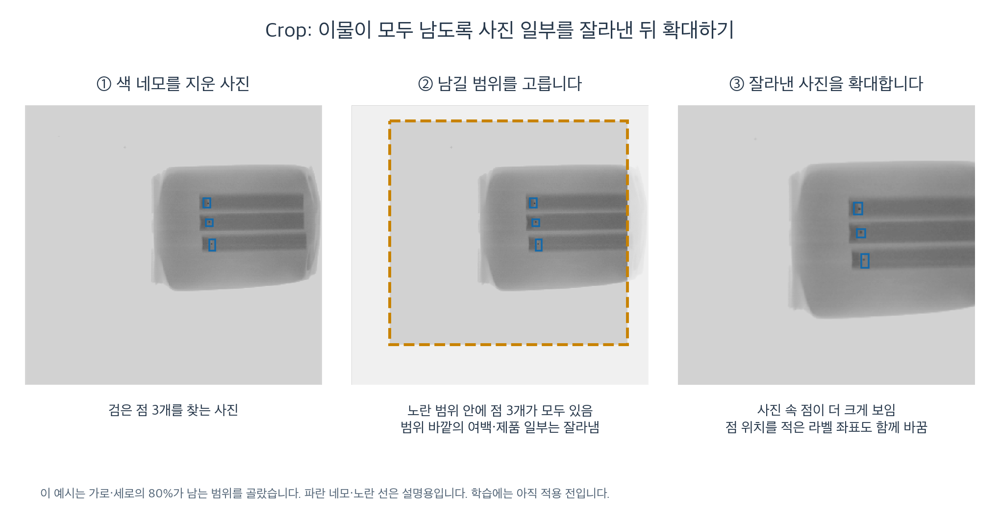

왼쪽 사진에는 검은 점 세 개가 있다. 가운데에서는 세 점이 모두 들어오는 노란 점선 범위를 고른다. 점선 바깥은 잘라내고, 점선 안쪽을 확대하면 오른쪽 사진이 된다. 같은 점들이 더 크게 보이고 사진 안에서의 위치도 달라진다. AI는 이 과정을 통해 원래 크기·위치에서만 점을 찾는 습관을 줄일 수 있다. 실제 성능 개선 여부는 학습 비교로 확인해야 한다.

사진을 자르면 좌표의 기준이 바뀐다. 따라서 **사진만 자르고 TXT를 그대로 쓰면 안 된다.** 예를 들어 원래 사진의 왼쪽 부분을 잘라냈다면 점의 새 가로 위치도 그만큼 달라진다. 프로그램이 이물 위치·크기를 같이 계산해 새 라벨을 만든다. 기존 공식 TXT를 덮어쓰지는 않는다.

처음에는 가로·세로 각각 80~100%를 남기는 범위를 검토했고, 현재 생성 자료에는 약 80~95% 범위를 사용했다. 제품 전체가 반드시 남는 조건은 아니며, 학습할 이물이 모두 남는 조건이다. 위 설명 사진은 각각 80%가 남는 예시다. 가로·세로 각각 80%이면 남는 면적은 전체의 64%다.

확인한 숫자:

- 기존 학습 사진 296장에서, 사진마다 무작위 자르기 위치를 비율별 100번 뽑았다.
- 가로·세로 각각 70%를 남기면 정답 일부가 잘리거나 빠지는 시행이 약 7.82%, 각각 80%를 남기면 약 1.07%였다.
- 이것은 좌표 분석이다. AI 학습 오류율이나 성능 감소율을 측정한 값은 아니다.

이 분석 때문에 처음에는 이물이 모두 들어오는 범위를 선택하기로 했다. 이미 이물 일부가 잘린 사진을 쓰려면 남은 부분에 맞게 라벨을 바꾸거나 제외하는 별도 규칙이 필요하다.

## 5. 사진을 돌린다는 것은 무엇인가

회전은 사진 전체를 조금 기울이는 것이다. 제품·막대·검은 점이 함께 돌아가며, 이물 조각만 따로 돌리거나 모양을 바꾸지 않는다.

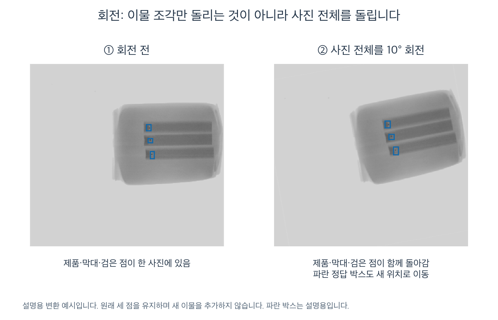

오른쪽은 왼쪽 사진 전체를 10도 돌린 예시다. 같은 세 점이 남아 있지만 방향과 위치가 달라진다. 정답 박스도 새 위치를 감싸도록 계산한다. 파란 선은 이 계산을 보여 주는 설명선이다.

첫 비교에서는 실제 촬영에서 가능한 작은 기울기를 가정해 ±5~10도 범위를 검토했고, 현재 생성 자료는 −7.5도·+7.5도를 사용했다. 작은 점은 회전 과정에서 흐려질 수 있으므로 성능 비교와 함께 확인한다. 90도·180도 회전을 무조건 추가하지 않는다.

자르기와 회전은 원래 사진을 변형해 학습 예시를 늘리는 **데이터 증강**이다. 검증·테스트 사진을 임의로 늘리는 데 쓰지 않고, 학습 사진에 적용한다.

## 6. 전달된 전처리와 현재 전처리는 무엇이 같고 다른가

이 절은 팀 내부에서 방법을 비교하기 위한 설명이다. 최종 제출 문서에서는 수행자를 구분하지 않고 실제 적용한 방법·근거·결과를 설명한다.

**전달 자료가 전반적으로 잘못되어서 새로 만든 것은 아니다.** 전달 자료는 이물이 특정 막대 끝에만 있는 상황을 보완하려고 이물의 위치·모양·개수를 바꾸었다. 현재 방법은 그 아이디어를 참고하면서 사진 전체 자르기·회전, 별도 AI 의사 라벨 검사, 고정 평가 분할을 추가·유지했다. 이물 합성과 이물 제거는 현재 전체 혼합 학습에도 포함됐다.

### 6.1. 전달된 전처리 방법을 순서대로 보기

설명서와 README에 적힌 처리 순서다. PNG·TXT 검사로 확인한 결과와 생성 코드·실행 로그가 없어 독립 재현하지 못한 방법 설명을 구분한다.

1. **중복을 제거한다.** 원본 파일 2,809개에서 같은 내용의 277개를 제외해 고유 원본 2,532장을 구분한다. 전달된 최종 PNG의 부모 사진은 라벨 제공 데이터셋 500장이다.
2. **촬영 묶음으로 나눈다.** 같은 검사기에서 60초 이내로 이어지는 사진들을 함께 배정한다. 설명서상 검증·테스트 목표는 호기별 각각 15%다. 실제 라벨 제공 데이터셋은 학습 340장·검증 80장·테스트 80장이다. 설명서는 분할을 먼저 하고, 여러 사진을 보고 정하는 처리값은 학습 사진으로만 정했다고 명시한다.
3. **색 네모를 찾아 주변 한 픽셀까지 지운다.** 선명한 색을 RGB 차이로 찾고, 선과 주변 한 픽셀을 Telea 인페인팅으로 메운다. 인페인팅은 주변 밝기를 참고해 빈 부분을 채우는 처리다.
4. **지운 자리의 흔적을 줄인다.** 이물 없는 곳에도 같은 네모를 그렸다가 지운다. 이를 미끼 박스라고 부른다. 지운 곳의 질감이 너무 매끈하지 않도록 잡음도 보충한다. 색 네모의 복원 흔적이 이물 위치를 알려 주는 단서가 되는 것을 줄이려는 목적이다. 설명서의 미끼 오탐률 주장은 이번에 예측 파일로 재검증한 성능 수치가 아니다.
5. **C: 이물 조각을 다른 위치에 합성한다.** 이물에서 주변보다 어두운 성분을 추출해, 같은 호기의 제품 안 다른 위치에 추가한다. 크기·진하기도 바꾼다. 학습 부모 사진 한 장마다 두 장씩, 총 680장이다.
6. **D: 이물 조각을 변형한 뒤 합성한다.** 조각을 0·90·180·270도로 돌리거나 좌우·상하로 뒤집고 가로세로 비율을 바꾼다. 제품 경계 안쪽도 합성 위치로 사용한다. 총 680장이다.
7. **E: 라벨된 이물을 모두 지운다.** 작은 어두운 부분을 주변 밝기로 채우는 모폴로지 닫힘 연산과 잡음 보충을 사용한다고 설명한다. 총 340장이며 TXT는 빈 파일이다. 실제 정상 생산품을 촬영한 사진과는 구분한다.
8. **F: 라벨된 이물 중 일부만 지운다.** 세 이물이 있는 부모 사진 226장에서 두 가지 제거 조합씩 만든다. 총 452장이며 남긴 이물만 TXT에 기록한다.
9. **학습 중 사진 전체 회전도 안내한다.** 설명서 9·12쪽과 README에는 `degrees=10`, 즉 사진 전체를 약 ±10도 범위로 무작위 회전하는 학습 설정이 있다. 이는 2,492장의 저장 PNG와 별도로 학습 중 만들어지는 변형이다. 그 설정으로 실제 학습했는지는 해당 실행 로그를 확인해야 한다.

숫자로 보기: 학습 기본 340 + C 680 + D 680 + E 340 + F 452 = **2,492장**이다. 학습 TXT의 이물 박스 합계는 **7,362개**다. 검증·테스트를 합친 전달 PNG는 **2,652장**이다. 전달된 PNG에는 사진 전체 일부를 잘라 확대하는 별도 종류가 없다. 이물 조각 추출도 자르기의 한 형태지만, 사진 전체 일부를 자르는 증강과 목적이 다르다.

### 6.2. 현재 실제 사용한 전처리를 순서대로 보기

1. **원본 중복과 라벨을 확인하고 촬영 묶음 분할을 고정한다.** 같은 500장을 학습 296장·검증 107장·테스트 97장으로 나눈 기존 목록을 유지했다. 목표 60·20·20%에서 촬영 묶음 전체를 배정한 결과다. 어느 비율이 최적이라고 입증한 것은 아니다.
2. **색 네모에 해당하는 픽셀만 지우고 메운다.** BMP 팔레트의 표시용 번호 244~255를 선택하고, 주변으로 삭제 범위를 넓히지 않은 채 나비에-스토크스 인페인팅으로 채운다. 현재 기본 처리에는 미끼 박스나 별도의 잡음 보충을 넣지 않았다. 회색 영상의 변경 범위를 줄이려는 선택이며, Telea보다 탐지 성능이 높다는 비교 결과는 아니다.
3. **이물들을 모두 남긴 채 사진 일부를 자르고 확대한다.** 가로·세로의 약 80~95%가 남는 창을 고르고 원래 사진 크기로 확대한다. 제품과 이물의 상대적인 배치는 유지하며 TXT 좌표도 바꾼다. 295장을 만들었다.
4. **사진 전체를 조금 돌린다.** 제품·막대·이물을 함께 −7.5도와 +7.5도로 돌리고, 변환한 이물을 감싸는 박스로 TXT 좌표를 다시 계산한다. 590장을 만들었다. 세 모델이 같은 변형 사진을 받도록 파일로 저장했다.
5. **이물 전부·일부 제거본을 만든 뒤 검사한다.** 공식 TXT 근처의 작은 어두운 성분을 분리해 메운다. 남겨야 할 이물의 박스와 지울 영역이 겹치지 않는지, 지운 자리에 어두운 반응이 남는지 자동 검사한다. 강화 검사 통과본은 전부 제거 82장·일부 제거 93장이다. 적은 수가 곧 더 좋은 성능의 증거는 아니며, 자동 검사가 실제 정상 제품임을 보장하지도 않는다.
6. **막대 밖 다른 제품 위치에도 이물 무늬를 추가한다.** 학습 사진의 이물에서 어두운 성분을 추출해, 같은 사진의 다른 제품 위치 후보에 옮긴 295장을 만들었다. C·D와 목적이 유사하다. 현재 구현은 조각의 90도 회전·종횡비 변형이나 제품 경계 집중 배치를 별도로 적용하지 않았다. 실제 X-ray 투과를 완벽히 재현한 자료는 아니다.
7. **라벨링 후보 데이터셋을 AI로 검사한다.** 1,900장에 대해 두 모델과 좌우 반전 예측의 위치 일치 등을 확인했다. 자동 채택 802장만 학습용 의사 라벨로 추가했고, 의심 698장·보류 400장은 제외했다. 무검출 사진을 자동으로 정상이라고 확정하지 않았다.
8. **중복 없는 전체 혼합 자료로 세 모델을 학습했다.** 기본 296 + 자르기 295 + 회전 590 + 전부 제거 82 + 일부 제거 93 + 이물 추가 295 + 의사 라벨 802 = **2,453장**이다. YOLOv8n·Faster R-CNN·RF-DETR-S의 20epoch 학습과 검증·테스트 평가를 완료했다. 전체 혼합이 각각의 전처리보다 더 좋다는 의미는 아니다.

라벨 누락이 의심되는 학습 사진 한 장은 변형·제거·합성의 부모에서 제외했다. 공식 TXT는 임의로 고치지 않았다. 검증·테스트에는 증강과 의사 라벨을 넣지 않았다.

### 6.3. 같은 원본의 실제 사진으로 비교하기

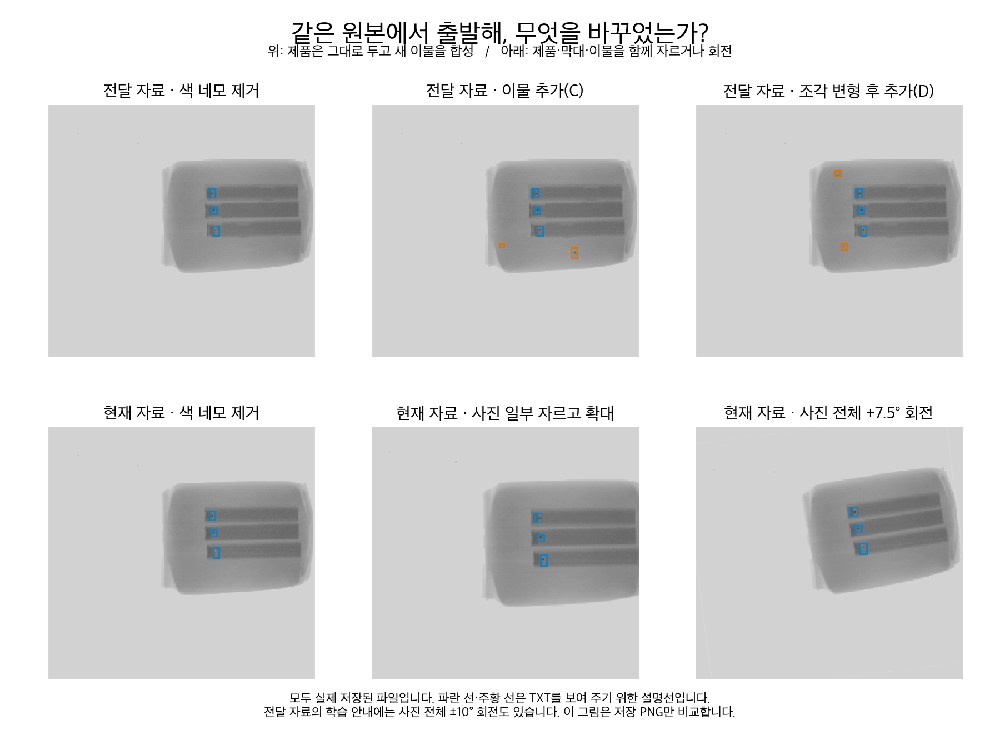

위쪽 가운데·오른쪽은 원래 제품 배치를 유지하면서 새 점을 추가했다. 아래쪽 가운데는 사진의 일부를 잘라 확대했고, 오른쪽은 제품 전체를 돌렸다. 파란 선과 주황 선은 실제 TXT를 보여 주는 설명선이며 저장된 학습 PNG에는 없다. 이 비교 그림은 같은 원본에서 실제 생성된 파일을 사용했다.

**‘회전이나 cutting을 잘못했다’고 설명하면 정확하지 않다.** C·D는 이물 조각을 잘라 붙이는 Copy-Paste 증강이다. 사용자가 원한 사진 전체 자르기·회전은 다른 변형이다. 게다가 전달 설명서에는 학습 중 사진 전체 회전도 이미 고려되어 있었다. 앞서 ‘이물 조각만 돌린다’고 설명한 것은 저장 PNG의 D 유형에 한정해야 한다.

| 비교 항목 | 전달 자료 | 현재 자료 | 판단 |
|---|---|---|---|
| 색 네모 제거 목적 | 이물 대신 표시를 배우는 문제 방지 | 같음 | 목적은 같고 픽셀 선택·메우기 방식이 다름 |
| 색 네모 제거 후 흔적 | 미끼 박스·잡음 보충 포함 | 변경 범위를 줄이고 별도 검사 | 어느 방법이 더 우수한지는 동일 조건 실험 필요 |
| 사진 전체 자르기·확대 | 전달 PNG 종류에는 없음 | 295장 저장 | 새로 추가한 변형 |
| 사진 전체 회전 | 학습 설정으로 ±10도 안내 | ±7.5도 사진 590장 저장 | 온라인 처리와 사전 생성의 차이도 있음 |
| 이물 조각 변형·합성 | C·D 1,360장, 조각 변형·경계 강화 | 295장, 다른 제품 위치 후보에 합성 | 목적 일부 공통, 강도·배치·개수 다름 |
| 이물 전부·일부 제거 | 340·452장 | 자동 검사 통과 82·93장 | 목적 공통, 지우는 방법·선별 기준 다름 |
| 분할 원칙 | 촬영 묶음 전체를 배정 | 같음 | 결과 목록과 비율은 다름 |
| 추가 의사 라벨 | 전달된 2,492장에는 없음 | 자동 채택 802장 포함 | 메타데이터의 미전달 항목과 실제 PNG를 구분 |

### 6.4. 방향을 달리한 이유와 유지한 아이디어

**첫째, 서로 다른 촬영 변화와 이물 위치 변화를 따로 확인하려 했다.** 사진 전체 회전은 제품이 기울어져 들어오는 상황을, 사진 일부 자르기·확대는 화면 내 위치와 크기 변화를 흉내 낸다. 이물 합성은 막대 끝 이외의 위치에도 이물이 있는 상황을 만든다. 회전만으로 막대 끝에 있는 점이 막대 밖으로 이동하지는 않으므로 합성을 대체할 수 없다. 두 방법은 보완 관계다.

**둘째, 기존 평가 분할을 유지하려고 새로 만들었다.** 전달 자료 자체의 촬영 묶음 누수는 이번 재검사에서 발견되지 않았다. 다만 전달 자료의 학습 부모 122장은 현재 프로젝트에서는 검증·테스트 사진이다. 그 부모에서 만든 증강본 762장을 현재 학습에 그대로 합치면 평가 사진의 변형을 미리 배우게 된다. 이는 어느 한쪽 분할이 틀렸다는 뜻이 아니라, 서로 다른 분할을 섞으면 문제가 생긴다는 뜻이다.

**셋째, 작은 이물 주변의 변경을 줄이고 처리 이력을 직접 남기려 했다.** 팔레트 기반 제거는 선택한 표시 픽셀 바깥을 그대로 보존한다. 그러나 전달 자료도 검사한 이물 중심 주변 회색 픽셀을 보존했다. 따라서 전달 자료가 이물을 훼손했다고 일반화하지 않는다. 미끼 박스·잡음 보충은 복원 흔적 의존을 줄이려는 합리적인 접근이며, 우리 방식이 그 효과까지 대체했다고 입증하지 못했다.

**넷째, 이물 제거와 추가 라벨에 자동 선별을 적용했다.** 사람이 모든 사진을 검수하는 부담을 줄이려는 사용자 요구를 반영했다. 이물 제거 사진이 실제 정상 사진을 대신한다거나 자동 채택 의사 라벨에 오류가 전혀 없다고 보장하지 않는다.

**다섯째, 세 모델이 같은 학습 자료를 사용하도록 했다.** 미리 생성한 사진과 변환 라벨의 목록·출처를 고정했다. 전달 자료의 이물 합성·제거 아이디어는 유지하고, 사진 전체 자르기·회전과 AI 의사 라벨을 더했다. 전처리 전체의 우열을 입증한 직접 비교 실험은 아직 없다.

### 6.5. 이번에 직접 확인한 것과 확인하지 못한 것

2026-10-03 기존 감사 스크립트를 별도 폴더로 다시 실행했다. 전달된 PNG 2,652장과 대응 TXT를 검사했고, 이전 주요 검사 결과와 일치했다. 색 픽셀 잔류·사진/TXT 짝 또는 형식 오류·전달 자료 자체의 촬영 묶음 교차는 발견되지 않았다. 기본 500장의 TXT는 공식 라벨과 허용 소수점 오차 내에서 같았다. 이물 중심과 중심 반경 3픽셀 내 원래 회색 픽셀의 변경도 발견되지 않았다. 이는 전체 정답 박스의 모든 픽셀이 같다는 뜻은 아니다.

전달 자료의 지운 이물 1,468개 중 어두운 반응이 비교적 큰 위치는 두 개였다. 이 반응은 잔류 의심을 찾는 영상처리 검사이며 실제 이물이 남았음을 확정하는 판정이 아니다. 전달 자료 전체가 잘못 지워졌다는 근거로 사용할 수 없다.

현재 전체 혼합 학습·검증·테스트의 사진 2,657장과 TXT 2,657개는 출처 파일과 SHA-256이 일치했다. 전달 자료의 완성 PNG를 현재 입력에 직접 사용하지 않았다. 이 확인은 출처·복사 무결성 검사이며 학습 성능 비교가 아니다.

전달 폴더에는 설명서에 나오는 생성 스크립트와 실행 로그가 없어, 조각의 실제 제공 사진과 무작위 각도 등의 모든 생성 과정을 재현하지는 못했다. `split_report.csv`에 미라벨 항목 2,016개가 있어도 그 사진이 현재 전달된 2,492장에 포함된 것은 아니다. 별도 보고서에서 사용한 의사 라벨 실험과 이번 전달 PNG 구성을 혼동하지 않는다.

근거: `preprocessed_data/데이터전처리설명서.pdf` 3·5·7~12쪽, 전달 폴더의 `README.txt`·`build_info.json`·`split_report.csv`, `scripts/xray_audit_shared_dataset.py`, `scripts/xray_prepare_v2.py`, `scripts/xray_prepare_roadmap.py`, `scripts/xray_refine_removal.py`, `scripts/xray_prepare_combined.py`. 재검사: `reports/preprocessing_comparison_20261003/`. 새 비교 그림의 출처·해시: 같은 폴더의 `figure_sources.json`.

## 7. 라벨링 후보 데이터셋에서 의사 라벨을 만드는 과정

TXT가 없는 사진은 AI에게 ‘어디를 찾아야 하는지’를 알려 줄 파일이 없는 상태다. 자동 라벨링은 AI가 사진을 보고 이물 위치를 찾아, 새 TXT 초안을 만드는 일이다. 이 라벨 초안 중 자동 검사 기준을 통과해 채택한 것을 **의사 라벨**이라고 하며 공식 정답 라벨과 구분한다.

구현한 절차는 색 네모 위치, YOLO와 RF-DETR의 예측, 사진 전체를 좌우로 뒤집은 후 되돌린 좌표, 설명되지 않은 어두운 점을 함께 확인한다. 기준을 정할 때는 기본 학습 데이터셋 안에서 촬영 묶음을 나누어 234장을 모델 학습에, 다른 61장을 자동 채택 기준 검사에 사용한다. 이 단계용 모델 학습과 후보 1,900장 검사를 완료했다. 자동 검사 통과 자료는 별도 의사 라벨로 저장하고, 최종 학습 채택 여부는 증강 효과 비교로 판단한다. 원본의 네모만 일정 비율로 줄여 정답이라고 확정하지 않는다. 색 네모를 지운 사진 전체도 확인해 네모 밖의 후보를 찾는다.

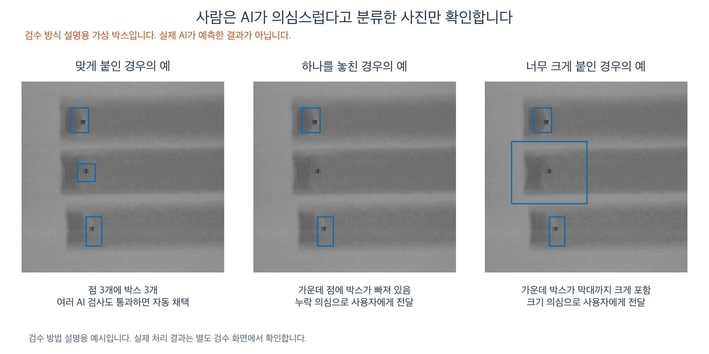

위 그림은 **검수 방식을 설명하기 위해 박스를 그린 가상 예시**다. 아직 AI가 추가 사진에 라벨을 붙인 결과는 아니다. 왼쪽처럼 여러 검사에서 통과하면 자동 채택하고, 가운데처럼 점 하나를 놓치거나 오른쪽처럼 박스가 너무 크면 의심 목록에 보낸다. 사용자는 그 목록만 확인한다. 미확인 의심 사진은 보류할 수 있다.

자동 채택 기준은 먼저 정답이 있는 학습 사진 일부를 따로 떼어, 해당 사진을 배우지 않은 모델이 얼마나 정확히 라벨을 붙이는지 시험해 정한다. 자동 판단에도 오류는 남을 수 있으므로 공식 정답으로 바꾸어 기록하지 않는다. 아무 점도 예측하지 않았다고 정상 사진으로 자동 확정하지도 않는다.

숫자로 보기:

- 미라벨 데이터셋 2,032장 중 라벨링 후보 데이터셋은 1,900장이다.
- 노란 선만 있는 위치 이상 사진 105장, 현재 검증·테스트와 같은 촬영 묶음 사진 27장은 학습 추가 대상에서 제외한다.
- 1,900장 전체를 처리했다. 자동 채택 802장(이물 박스 1,082개), 의심 698장, 보류 400장이다. 보류는 **YOLO가 원래 방향 사진에서 탐지 임계값 0.6 이상인 박스를 내지 않아** 자동 합의 검사를 진행하지 못한 경우다. 모든 모델의 예측이 없었다는 뜻이 아니며 자동 정상으로 확정하지 않았다.
- 자동 채택은 1호기 479장, 2호기 323장, 3호기 0장이다. 검사 기준을 고르는 61장 중 기준을 통과한 25장은 7개 촬영 묶음에 속했고 관찰 오류는 0이었지만, 이는 기준 조정 자료의 결과이며 독립적인 정확도 보장이 아니다. 3호기는 그 기준을 통과한 검사 사례도 없어 적용 근거가 제한된다.
- [의심 사진 확인 화면](../reports/roadmap_20261002/pseudo/review/AI라벨_검수.html)에서 실제 원본과 처리 사진, AI 제안 박스, 보류 이유를 볼 수 있다. 사용자가 검수하지 않은 의심·보류 사진은 학습에 넣지 않는다.
- 라벨 제공 데이터셋에서 색 네모 내부 영역과 정답 박스를 비교했을 때, 장비 영역의 면적은 중앙값 약 2.59배이고 겹침 정도(IoU)는 중앙값 약 0.39였다. 색 네모를 정답 크기로 그대로 쓰기 어려운 이유다.

새 라벨도 현재와 비슷한 시험편 사진에서 만들어질 수 있다. 실제 사진 수를 늘리는 것은 의미가 있지만, 그것만으로 실제 정상 제품·다양한 혼입 이물이 충분해지는 것은 아니다.

### 7.1. 자동 채택·의심·보류를 나눈 실제 이유

YOLOv8n과 RF-DETR-S가 각각 원래 방향 사진과 사진 전체를 좌우로 뒤집은 사진을 예측한다. 뒤집은 사진의 좌표를 원래 방향으로 되돌려 **네 번의 결과를 같은 위치에서 비교**한다. 원본에 있던 색 네모는 모델 입력에서 지웠으며, 그 위치는 별도의 누락 후보 검사에만 참고한다.

자동 채택은 다음 검사를 모두 통과했다는 뜻이다. 각 예측에서 탐지 점수 0.6 이상인 박스를 남기고, 네 결과의 박스 개수가 같아야 한다. 같은 이물로 연결할 박스들은 기준 YOLO 예측과 중심 거리가 4픽셀 이내이고 IoU가 0.4 이상이어야 한다. 일치한 좌표의 중앙값으로 의사 라벨을 만들고, 중복 박스·너무 큰/작은 박스·사진 밖 좌표도 검사한다. 이 0.6은 자동 라벨 생성용 탐지 임계값이며 ‘정확도 60%’나 최종 탐지 모델의 평가 임계값을 의미하지 않는다.

이후 색 네모 내부에 AI 예측 중심이 없는 위치가 남았는지 확인한다. 제품으로 추정한 영역에서는 주변보다 작은 어두운 점을 찾고, 그 점이 어느 예측 중심에서도 8픽셀 넘게 떨어져 있으면 누락 후보로 표시한다. **이 검사는 추가 의심점을 찾는 보조 검사이지, 모든 예측 박스 안의 점이 실제 이물임을 증명하는 검사는 아니다.** 여기의 4픽셀·IoU 0.4·8픽셀은 의사 라벨 검사 규칙이며 최종 평가의 IoU 0.5 규칙과 구분한다.

| 분류 | 사진 수 | 실제 판정 이유 | 현재 사용 |
|---|---:|---|---|
| 자동 채택 | 802 | 네 결과의 개수·위치 일치와 추가 검사를 모두 통과 | 의사 라벨 1,082개를 저장해 학습 효과 실험에 사용 |
| 의심: 개수 불일치 | 682 | 예를 들어 YOLO는 3개, RF-DETR이나 반전 사진에서는 2개처럼 결과가 다름. 예시는 설명용 | 학습 제외 |
| 의심: 남은 어두운 점 | 10 | AI 예측 위치에서 떨어진 어두운 점 후보가 남음 | 학습 제외 |
| 의심: 색 네모 위치 미해결 | 5 | 색 네모 내부에 AI 예측 중심이 없는 영역이 남음 | 학습 제외 |
| 의심: 위치 불일치 | 1 | 개수는 같지만 중심 거리 또는 IoU 검사에서 일치하지 않음 | 학습 제외 |
| 보류 | 400 | 기준인 YOLO 원래 방향 예측에서 0.6 이상 박스가 없음 | 정상 라벨을 만들지 않고 학습 제외 |

의심은 682+10+5+1=698장이다. 판정 이유는 **검사 도중 처음 걸린 조건 하나**이므로 다른 문제까지 전부 세었다는 뜻은 아니다. 보류 400장의 저장 예측을 다시 세니 399장은 다른 모델 또는 좌우 반전 결과 중 적어도 하나에 0.6 이상 예측이 있었다. 네 결과 모두 0.6 이상 박스가 없는 사진은 1장이다. 따라서 이 400장은 ‘정상 제품’도 ‘네 번 모두 무검출’도 아니다. 기준 예측에 의존하는 현재 자동 검사 방식의 한계로 기록한다.

3호기는 코드에서 강제로 제외하지 않았다. 후보 608장 중 324장은 위 보류 조건, 284장은 개수 불일치에 걸려 자동 채택이 0장이었다. 기준을 정한 학습 내부 61장 중 통과 25장·관찰 오류 0이라는 결과도 3호기까지 신뢰성이 입증됐다는 뜻은 아니다.

자동 채택은 ‘학습 효과를 시험할 수 있는 의사 라벨’이라는 뜻이다. 공식 정답이나 최종 학습 자료로 확정된 것이 아니다. 초기 8조건 비교에서는 자르기·회전만 한 조건이 더 좋아 당시 잠정 후보에서 802장을 제외했다. 이후 사용자가 선택한 전체 혼합 2,453장에는 802장을 포함해 세 모델을 학습했다. 이는 의사 라벨 효과가 입증돼서 채택했다는 뜻은 아니다. 의심·보류 자료의 추가 개선은 선택적 후속 작업이며, 이 사진들을 모두 사람이 검수해야 최종 모델 비교를 진행할 수 있는 것은 아니다.

근거: `scripts/xray_pseudo_label.py`, `reports/roadmap_20261002/pseudo/decisions.csv`, `prediction_cache/`, `decision_explanation_audit.json`.

## 8. 촬영 묶음과 검증·테스트 촬영 묶음은 무엇인가

같은 검사에서 몇 초 간격으로 찍힌 사진은 거의 같은 장면일 수 있다. 그중 한 장을 AI가 배우고 옆 장을 시험에 쓰면, 처음 보는 장면을 잘 찾았는지 평가하기 어렵다. 그래서 **같은 검사기에서 인접 사진의 촬영 간격이 60초 이내로 이어지면 하나의 ‘촬영 묶음’**으로 다룬다. ‘호기’는 검사기 번호다. 묶음 전체의 길이가 반드시 60초 이내인 것은 아니다. 이는 파일에 기록된 촬영 시각과 검사기로 만든 그룹이며, 동일한 실제 제품인지 확인한 결과는 아니다.

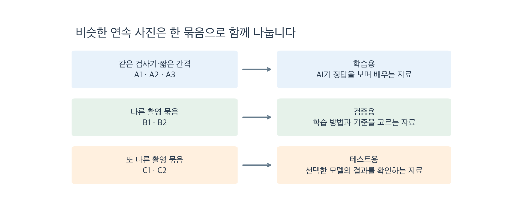

기본 학습 데이터셋은 AI가 공식 정답 라벨을 보며 배우는 데 쓴다. 검증 데이터셋은 학습 방법·탐지 임계값을 고르는 데 쓴다. 테스트 데이터셋은 선택한 설정의 결과를 확인하는 데 쓴다. 위 A·B·C는 이해를 위한 묶음 이름이다. 실제 분할은 파일로 고정돼 있다.

**검증·테스트 촬영 묶음**은 검증 데이터셋 또는 테스트 데이터셋에 배정한 촬영 묶음이다. 예를 들어 같은 검사기에서 10:00:00, 10:00:05, 10:00:10에 찍힌 사진은 같은 묶음이다. 첫 사진을 검증에 사용하면서 옆 사진을 AI 라벨링 후 학습에 넣으면 비슷한 장면이 양쪽에 들어간다. 따라서 이 묶음의 미라벨 사진도 학습에 추가하지 않는다. 이 시간 예시는 설명용이며 실제 파일 이름이 아니다.

현재 기본 학습 데이터셋은 296장, 검증 데이터셋은 107장, 테스트 데이터셋은 97장이다. 검증·테스트 촬영 묶음에 속한 미라벨 사진 27장은 정답이 없어 현재 F1 채점에도 쓰지 않으며, 학습 편입에서도 제외한다. 의사 라벨 데이터셋과 증강 데이터셋도 원래 사진의 촬영 묶음을 따라간다. 교차 검증은 여러 묶음을 번갈아 확인하는 평가 방법이며 사진을 늘리는 증강이 아니다.

### 8.1. 왜 296장·107장·97장으로 나누었나

**목표는 학습 60%·검증 20%·테스트 20%였으며, 촬영 묶음을 쪼개지 않고 배정한 결과가 현재 장수다.** 500장 중 약 300장으로 모델을 학습하고, 약 100장씩은 학습 방법·탐지 임계값 선택과 독립적인 결과 확인에 확보하려는 실무적인 선택이다. 60:20:20이 이 데이터에서 최적이라는 실험 증거는 없다.

검사기별로 원본 전체의 촬영 시간을 정렬하고 인접 사진 간격이 60초 이내로 이어지는 사진을 같은 묶음으로 만든다. 라벨이 없는 옆 사진도 이 묶음을 정할 때 포함한다. 다음으로 검사기와 묶음의 대표 시험편 구성별로 묶음 순서를 난수 시드 0으로 섞고, 목표 장수가 가장 부족한 세트에 묶음 전체를 배정한다. 시험편 구성은 저장된 라벨 수에 따른 구분(막대1·막대3)이며, 서로 다른 구성이 섞인 묶음은 가장 많은 구성을 대표값으로 사용한다.

| 구분 | 목표 장수 | 실제 장수 | 실제 비율 | 촬영 묶음 수 |
|---|---:|---:|---:|---:|
| 기본 학습 데이터셋 | 300 | 296 | 59.2% | 67 |
| 검증 데이터셋 | 100 | 107 | 21.4% | 24 |
| 테스트 데이터셋 | 100 | 97 | 19.4% | 23 |

예를 들어 7장짜리 촬영 묶음을 장수를 맞추려고 3장·4장으로 나누지 않는다. 비슷한 연속 사진을 학습과 평가에 동시에 넣는 것을 피하기 때문이다. 여기서 7장·3장·4장은 설명용 숫자다. 실제 배정 결과는 아래와 같다.

| 검사기 | 기본 학습 데이터셋 | 검증 데이터셋 | 테스트 데이터셋 |
|---|---:|---:|---:|
| 1호기 | 90 | 36 | 30 |
| 2호기 | 105 | 35 | 37 |
| 3호기 | 101 | 36 | 30 |

**예외:** 라벨 누락이 의심되는 사진이 포함된 2호기의 촬영 묶음 하나(6장)는 학습으로 고정했다. 불완전한 정답 때문에 제대로 찾은 예측이 오탐으로 채점될 수 있어 평가 자료에서 배제한 것이다. 해당 사진의 공식 TXT를 임의로 고치지 않았으며, 현재 기본 모델 학습에는 남아 있다는 한계도 공개한다. 해당 의심 사진 자체는 증강과 의사 라벨 생성 모델의 학습에서 제외했다.

2026-10-02에는 기존 생성 코드를 재실행해 사진을 덮어쓰는 대신, 분할 배정 부분만 다시 계산했다. 저장된 500장의 배정과 정확히 같았으며 세트 간 촬영 묶음 중복과 원본 내용 해시 중복은 모두 0이었다. 확인 파일은 `reports/roadmap_20261002/split_rationale_audit.json`이다.

**현재 분할은 유지한다.** 정확히 300·100·100장을 맞추는 것보다 촬영 묶음을 지키는 것이 중요하며, 이미 사용한 검증·테스트 결과를 보고 분할을 다시 고르면 평가에 유리한 구성을 고르는 위험이 있다. 이 분할은 날짜 전체를 분리한 시험이나 실제 정상 생산품 시험을 대신하지 않는다. 더 강한 근거가 필요하면 현재 결과를 보존한 채 학습 내부의 촬영 묶음 교차 검증이나 새로운 날짜·제품의 외부 평가를 추가한다.

## 9. AI 판정과 F1 채점을 사진부터 이해하기

이 절은 **전처리가 끝난 사진으로 AI가 예측하고 결과를 평가하는 과정**이다. 탐지 임계값·채점은 사진을 바꾸는 전처리 자체는 아니지만, 데이터 준비부터 평가까지 한 문서에서 이해하도록 함께 기록한다. 제출 자료에도 용어·판정 과정·채점 기준·한계를 포함한다.

### 9.1. 색 네모·정답 박스·예측 박스와 이물 신뢰도 점수

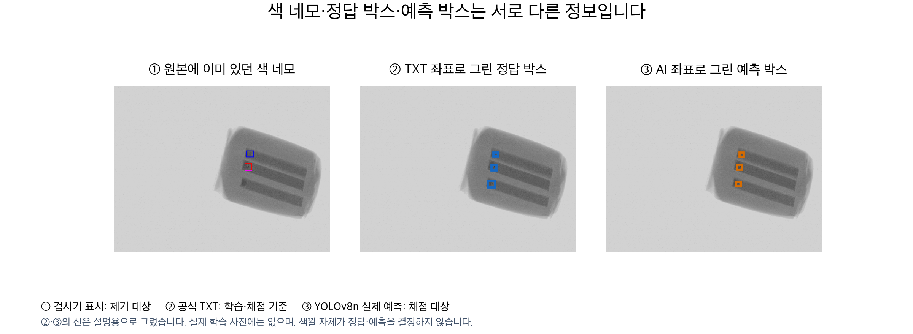

왼쪽 **색 네모**는 원본 사진의 픽셀에 이미 들어 있는 검사기 표시다. 가운데 **정답 박스**는 공식 TXT의 좌표를 읽어 그린 설명선이다. 오른쪽 **예측 박스**는 AI가 사진을 보고 출력한 좌표를 그린 설명선이다. 이 예시는 YOLOv8n의 실제 검증 예측이다. 색 네모가 두 개 보이는 원본에서도 공식 TXT는 세 이물을 기록하므로, 색 네모와 정답 박스가 같은 정보가 아님을 확인할 수 있다.

정답 박스와 예측 박스는 본래 ‘색칠된 네모 그림’이 아니라 **중심 위치·너비·높이라는 숫자 정보**다. 사람이 보기 쉽게 파랑·주황 선으로 그렸을 뿐이다. 선 색을 바꿔도 정답과 예측의 역할은 바뀌지 않는다. 실제 학습 입력에는 두 설명선을 넣지 않는다. 예측은 학습·검증·테스트·공장 입력 어느 사진에서도 만들 수 있으므로, ‘테스트 사진에서만 만든 박스’라는 뜻도 아니다.

**이물 신뢰도 점수(confidence score)**는 ‘이 예측 박스의 대상이 이물일 것이라고 모델이 얼마나 강하게 판단하는가’를 나타내는 모델 출력이다. 정답을 대조해서 측정한 정확도가 아니다. 모델은 학습 중 이물과 배경의 특징을 배우고, 새 사진의 특징으로 점수를 계산한다. 학습 손실에는 종류 판단과 위치 오차가 반영되지만, 추론 점수 그 자체가 측정된 IoU나 정확도는 아니다.

| 모델 | 현재 설치 코드에서 확인한 점수 계산 | 해석 |
|---|---|---|
| YOLOv8n | 이물 클래스의 내부 출력에 sigmoid를 적용 | 각 후보 위치가 이물 클래스로 얼마나 강하게 분류되는지 |
| Faster R-CNN | 후보 구역의 배경/이물 분류 출력에 softmax를 적용하고 이물 값을 선택 | 해당 구역을 배경보다 이물로 판단하는 정도 |
| RF-DETR-S | 탐지 후보(query)의 이물 분류 출력에 sigmoid를 적용 | 해당 탐지 후보를 이물로 판단하는 정도 |

sigmoid·softmax는 내부 숫자를 0~1 범위로 바꾸는 함수다. **0.9가 ‘이 예측은 정답과 90% 일치한다’거나 ‘실제 불량 확률이 검증된 90%다’라는 뜻은 아니다.** 정답과 비교한 정밀도·재현율은 추론 뒤 별도 채점으로 측정한다. 실제 확률로 해석하려면 대표 정상·이상 자료에서 확률 보정과 검증이 필요하다. 예측 박스의 위치·크기 정확도는 IoU 등으로 별도 확인한다.

흐름은 다음과 같다.

```text
색 네모를 제거한 사진 → AI의 예측 박스 + 이물 신뢰도 점수
→ 점수 ≥ 탐지 임계값인 예측 채택
→ 공식 TXT의 정답 박스와 한 개씩 비교
→ TP(맞은 탐지)·FP(오탐)·FN(미탐) → 정밀도·재현율·F1
```

### 9.1.1. 왜 앞선 설명에서는 이물이 243개였나

‘243개’는 검증 데이터셋 한 개에 들어 있는 이물 라벨 수다. 243장이나 전체 데이터의 이물 수라는 뜻이 아니다. 사진 한 장에 여러 이물이 들어 있을 수 있다.

| 데이터셋 | 사진 수 | 이물 라벨 수 | 이물 라벨이 0개인 사진 |
|---|---:|---:|---:|
| 기본 학습 데이터셋 | 296 | 679 | 0 |
| 검증 데이터셋 | 107 | 243 | 0 |
| 테스트 데이터셋 | 97 | 225 | 0 |
| 라벨 제공 데이터셋 합계 | 500 | 1,147 | 0 |

공식 TXT를 다시 세면 이물 1개 사진 176장, 2개 사진 1장, 3개 사진 323장이다. 따라서 검증을 만들 때 정상 사진을 일부러 뺀 것이 아니다. **라벨 제공 데이터셋 자체에 이물 0개로 표시된 사진이 없다.** 이물이 있는 사진에도 정상 배경 부분은 있지만, 이는 정상 제품 사진을 별도로 평가한 것과 다르다. 미라벨 데이터셋도 TXT가 없다는 이유만으로 정상이라고 정하지 않는다. 이물 전부 제거 사진은 합성 자료라 실제 정상 제품을 대신하지 못한다.

### 9.2. 정밀도·재현율·조화평균은 무엇인가

| 이름 | 세는 방법 | 쉽게 말하면 |
|---|---|---|
| 맞은 탐지(TP) | 채택한 예측 박스가 정답 박스 하나와 대응됨 | 이물을 제대로 찾음 |
| 오탐(FP) | 채택한 예측 박스에 대응할 정답 박스가 없음 | 틀린 경보. 같은 이물을 중복으로 찾은 추가 박스도 포함 |
| 미탐(FN) | 어떤 채택 예측 박스와도 대응하지 않은 정답 박스 | 이물을 놓침 |
| 정밀도(P) | `TP / (TP + FP)` | AI가 찾았다고 한 것 중 맞은 비율 |
| 재현율(R) | `TP / (TP + FN)` | 정답 이물 중 AI가 찾은 비율 |
| F1 | `2 × P × R / (P + R) = 2TP / (2TP + FP + FN)` | 정밀도와 재현율을 함께 고려한 점수 |

F1은 정밀도와 재현율의 **조화평균**이다. 둘의 역수를 평균 낸 뒤 다시 역수를 취한 값으로, 둘 중 낮은 값의 영향을 크게 받는다. 예를 들어 정밀도 100%, 재현율 50%라면 단순 평균은 75%지만 F1은 약 66.7%다. 틀린 경보가 없더라도 이물 절반을 놓쳤으므로 높은 점수를 주기 어렵다는 뜻이다. 반대로 정밀도 50%, 재현율 100%여도 F1은 약 66.7%다. 이 수치는 이해를 위한 가상 예시다. [F1 정의: scikit-learn 공식 문서](https://scikit-learn.org/stable/modules/generated/sklearn.metrics.f1_score.html)

현재 F1은 사진마다 계산한 F1의 평균이 아니라, **검증 데이터셋 전체에서 이물 단위 TP·FP·FN을 합산해 계산한 값**이다. 제품이 정상인지 이상인지 분류한 제품 단위 F1과 구분한다.

숫자로 보기 — 기존 완화 기준으로 저장된 실제 초기 검증 결과:

- 검증 데이터셋 107장, 공식 정답 라벨 243개.
- 세 모델 각각 TP 243개 / FP 0개 / FN 0개.
- 정밀도 `243 / (243 + 0) = 1`, 재현율 `243 / (243 + 0) = 1`.
- F1 `2 × 243 / (2 × 243 + 0 + 0) = 1.0`.

따라서 이 초기 결과는 **‘검증 데이터셋에서, 당시 고른 탐지 임계값과 기존 완화 채점 규칙을 적용했을 때 모든 정답 이물을 찾았고 추가 오탐은 없었다’**라고 해석한다. 공장에서 항상 완벽하게 작동한다는 뜻은 아니다. 공식 정답 라벨의 누락 가능성과 채점 허용 오차도 함께 고려한다.

### 9.3. 탐지 임계값 선택은 성능을 과장하는가

이 문서에서는 threshold를 **탐지 임계값**으로 부른다. 이물 신뢰도 점수가 이 값 이상이면 예측 박스를 채택한다. 예를 들어 점수 0.90·0.60·0.20에 임계값 0.50을 적용하면 앞의 두 박스만 채택한다. 이는 설명용 숫자다.

**우려는 부분적으로 타당하다.** 학습과 별도로 둔 검증 데이터셋에서 F1을 높이는 임계값을 찾는 것은 일반적인 방법이다. 하지만 그 검증 최고 F1은 임계값을 고르는 데 사용한 자료의 점수이므로, 새로운 자료에 대한 최종 성능으로 보고하면 낙관적일 수 있다. 반대로 모든 모델에 무조건 0.5를 적용하는 것도 모델마다 다른 점수 분포와 미탐·오탐 비용을 무시하므로 자동으로 공정해지지는 않는다.

현재 절차는 다음과 같이 고정한다.

1. 기본 학습 데이터셋에서 모델을 학습한다.
2. 검증 데이터셋에서 모델·증강과 모델별 탐지 임계값을 고른다. 임계값 후보는 서로 다른 예측 점수이며, F1이 같으면 가장 높은 임계값을 고른다.
3. 이 설정을 저장하고 테스트 데이터셋에서 그대로 평가한다. **테스트 최고 F1을 찾기 위해 임계값을 다시 고르지 않는다.**
4. 테스트를 본 뒤 설정을 고치면 그 결과는 개발 평가가 된다. 새로운 외부 평가 없이 독립 최종 검증이라고 부르지 않는다. 현재 테스트에도 과거 확인 이력이 있다는 한계를 기록한다.

임계값 선택과 일반화 성능 추정의 분리는 [scikit-learn 임계값 조정 설명](https://scikit-learn.org/stable/modules/classification_threshold.html)과 [학습·검증·테스트 구분](https://scikit-learn.org/stable/modules/cross_validation.html)을 참고했다. 표본이 적을 때 촬영 묶음 교차 검증을 추가하면 분할 민감도를 확인할 수 있지만, 현재 단일 분할 점수가 그런 검사를 대신하지 않는다.

초기 세 모델의 검증 임계값은 YOLOv8n 0.39883268, Faster R-CNN 0.9990447, RF-DETR-S 0.53260154였다. 각 값은 원래 JSON의 정밀도를 유지한다. 모델마다 값이 다른 것은 점수 분포가 다르기 때문이며 성능 순위를 뜻하지 않는다. 이후 다른 모델·학습 조건에서는 그 조건의 검증 결과로 임계값을 다시 정하고 테스트에 고정한다.

### 9.4. IoU·중심 거리·일대일 채점은 무엇인가

**IoU(Intersection over Union)**는 정답 박스와 예측 박스의 `겹친 넓이 ÷ 합친 전체 넓이`다. 합친 넓이는 겹친 부분을 두 번 세지 않는다. 둘이 완전히 같으면 1, 겹치지 않으면 0이다. 중심 거리는 두 박스의 가운데 점이 얼마나 떨어져 있는지를 사진의 픽셀 단위로 잰 값이다.

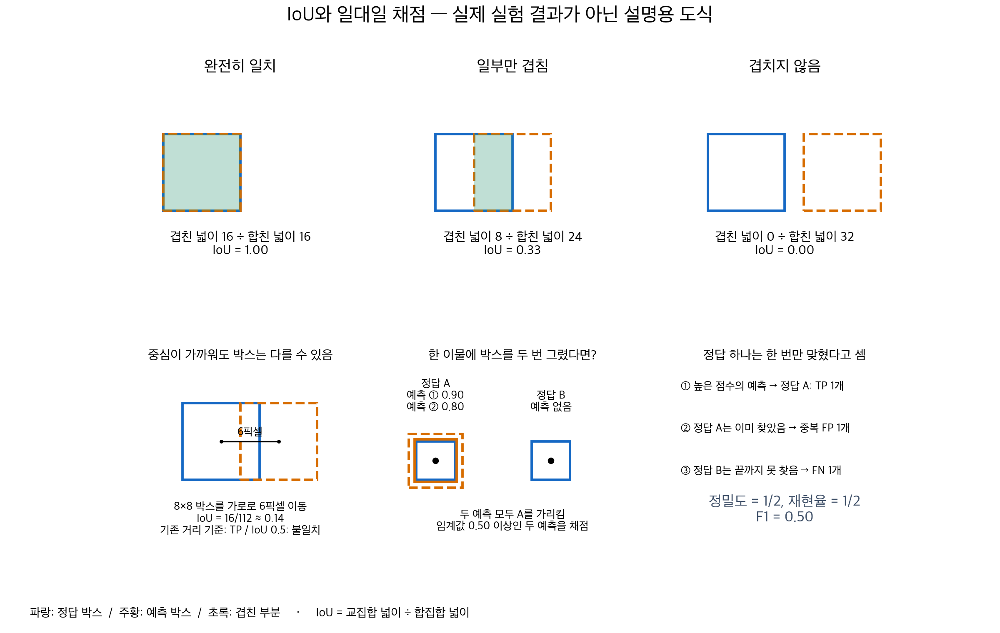

위 그림은 실제 AI 결과가 아닌 설명용 도식이다. 첫 줄 가운데는 각 박스 넓이가 16이고 겹친 넓이가 8이다. 합친 넓이는 `16 + 16 − 8 = 24`이므로 IoU는 `8/24 ≈ 0.33`이다. 박스의 절반이 겹쳤다고 IoU가 0.5가 되는 것은 아니다.

‘대응 후보’라는 말은 **이 예측이 저 정답 이물을 찾은 것인지 비교해 볼 수 있는 쌍**이라는 뜻이었다. 사진이나 이물을 새로 만드는 작업이 아니다. 앞으로는 ‘정답과 연결 가능한 예측’처럼 풀어 쓴다.

일대일 채점은 그림 아래쪽 예로 이해하면 된다. 정답 이물이 A·B 두 개인데, AI가 A 주위에 박스 두 개를 그리고 B에는 그리지 않았다고 하자. 두 예측이 모두 임계값을 넘었다면 높은 점수의 첫 예측만 A를 찾은 것으로 센다. 두 번째 예측은 같은 A의 중복 경보이므로 FP이고, B는 놓쳤으므로 FN이다. **예측 박스가 두 개라고 정답 이물 두 개를 모두 찾은 것은 아니다.** 이 경우 TP 1·FP 1·FN 1이다.

### 9.5. 왜 8픽셀·IoU 0.3을 썼고, 앞으로 무엇을 기준으로 삼나

기존 코드에는 작은 이물은 몇 픽셀의 위치 차이에도 IoU가 크게 낮아질 수 있어, `중심 거리 ≤ 8픽셀 또는 IoU ≥ 0.3`으로 찾은 위치를 넓게 인정한다는 취지가 있었다. 둘 중 하나만 만족해도 인정하며, 연결 가능한 정답 중 중심이 가장 가까운 것을 택했다. **그러나 8과 0.3이라는 정확한 수치가 최적이라는 데이터 기반 검증이나 논문 근거는 확인하지 못했다.** 이 취지를 실증 근거처럼 포장하지 않는다.

8×8픽셀 박스가 가로로 6픽셀 이동하면 중심은 가깝지만 IoU는 약 0.14다. 기존 기준에서는 TP가 될 수 있다. 따라서 기존 F1 1.0만으로 박스 위치·크기가 정확하다고 설명할 수 없다.

사용자 요청에 따라 **새 테스트 결과를 보기 전에** 다음 평가 기준을 고정했다. 기존 결과와 채점 기본 모드는 보존하고 별도 이름으로 새 점수를 기록한다.

| 역할 | 기준 | 선택 이유와 한계 |
|---|---|---|
| 주지표 | **IoU ≥ 0.5에서의 이물 단위 F1·정밀도·재현율** | 중심만 가까운 예측을 정답 처리하지 않고 위치와 크기의 겹침을 요구. 객체 탐지에서 널리 쓰이는 평가 수준에 맞추되 공장 안전 기준으로 간주하지 않음 |
| 위치 정밀도 보조 | IoU ≥ 0.75에서 같은 지표 | 더 정밀한 박스가 필요한 경우 성능이 얼마나 달라지는지 확인 |
| 초기 결과 비교 | 중심 거리 ≤ 8픽셀 또는 IoU ≥ 0.3 | 과거 결과 재현과 작은 이물의 위치 허용 민감도 설명에만 사용 |
| 임계값 종합 보조 | 각 대응 기준의 all-points AP | 단일 임계값에만 의존하지 않고 순위 품질 확인. 표준 COCO AP와 계산 방식이 같지 않음 |
| 현장 적합성 | 조건별 미탐·오탐, 정상 제품 오경보, 처리 지연 | 실제 정상 제품 자료가 없어 오경보율·출하 안전성은 현재 미검증 |

[COCO 공식 평가 구현](https://github.com/cocodataset/cocoapi/blob/master/PythonAPI/pycocotools/cocoeval.py)은 IoU 0.50~0.95의 여러 수준을 사용한다. 여기서 0.5와 0.75를 참고 수준으로 채택했지만, 우리 F1이나 all-points AP를 COCO AP라고 부르지 않는다. 0.5가 제조 안전을 보장하는 마법의 수치라는 뜻도 아니다.

새 주지표의 일대일 채점은 다음과 같다.

1. 이물 신뢰도 점수가 높은 예측부터 확인한다. 같은 점수는 저장 순서를 유지한다.
2. 같은 사진에서 아직 찾았다고 세지 않은 정답 박스와 IoU를 계산한다.
3. IoU 0.5 이상인 정답 중 **가장 많이 겹치는 정답 한 개**를 찾았다고 센다.
4. 그런 정답이 없으면 예측은 FP다. 끝까지 어떤 예측에도 연결되지 않은 정답은 FN이다.

기존 방식의 ‘가장 가까운 중심’과 새 방식의 ‘가장 큰 IoU’를 혼동하지 않는다. 같은 예측에 두 방식의 결과를 나란히 기록한다. 학습 데이터나 공식 TXT를 바꾸어 점수를 맞추지 않는다.

### 9.6. 실제 재채점 결과와 테스트의 역할

기존 검증 예측 CSV를 재채점하니 완화 기준 F1 1.0과 달리, IoU 0.5에서는 일부 박스가 위치·크기 조건을 충족하지 않았다. 새 학습으로 성능이 떨어진 것이 아니라 **동일한 예측을 더 엄격한 기준으로 측정한 결과**다.

| 모델 | 기존 완화 기준 F1 | IoU 0.5 검증 F1 | TP / FP / FN | IoU 0.75 검증 F1 |
|---|---:|---:|---|---:|
| YOLOv8n | 1.0000 | 0.9753 | 237 / 6 / 6 | 0.3284 |
| Faster R-CNN | 1.0000 | 0.9835 | 239 / 4 / 4 | 0.3959 |
| RF-DETR-S | 1.0000 | 0.9712 | 236 / 7 / 7 | 0.3133 |

각 평가 수준은 해당 기준의 검증 최고 F1 임계값을 사용했다. IoU 0.75 결과는 정답 박스 경계와 예측 경계가 정밀하게 일치하는 문제가 아직 남아 있음을 보여 주며, 이물이 전부 사라져 보인다는 뜻은 아니다. 정답 박스의 일관성과 라벨 누락 가능성도 한계로 남긴다.

테스트 데이터셋에서도 반드시 평가한다. 앞선 비교를 검증까지만 보고한 것은 당시 예약 종료에 맞춰 초기 학습·검증을 마친 단계였기 때문이다. 이번에는 검증에서 고정한 임계값으로 테스트 97장·225개를 평가하고, 결과는 docs/20에 검증과 나란히 기록한다. 이후 증강·모델 선택에는 테스트 점수를 사용하지 않는다.

현재 자료의 정상 제품 오경보는 측정 불가능하다. 실험 범위를 넘어 실제 공장에 완벽히 적용된다고 주장하지 않고, 별도 정상 제품 자료 확보·운영 임계값 검증·재검사 절차를 제출 문서의 한계와 다음 검증으로 적는다. 무검출 사진을 자동 정상으로 확정하지 않는다.

### 9.7. 실제 증강 비교 후 무엇을 선택했나

2026-10-02 같은 YOLOv8n·740회 업데이트 조건에서 8가지 학습 자료를 비교했다. 기본 학습 데이터셋만 쓴 검증 F1은 0.9567, 사진 전체 자르기·회전을 추가한 경우는 0.9918이었다. 당시에는 기본 296장 + 자르기 295장 + 회전 590장, 합계 1,181장을 다음 모델 비교의 잠정 공통 자료로 선택했다.

AI 의사 라벨 802장을 단독 추가하면 0.9877이었으나, 자르기·회전에 함께 추가하면 0.9794로 자르기·회전만 한 조건보다 낮았다. 자료를 많이 만드는 것과 실제 성능 개선은 구분한다. 자동 검사 통과 라벨은 보존하지만 당시 잠정 선택 조건에는 포함하지 않았다. 이후 전체 혼합 실험에는 포함했다. 막대 밖 합성도 단독 추가에서 기본보다 높았지만 최고 조건보다 낮았으며, 자르기·회전과의 결합 효과는 미검증이다. 전체 수치와 단일 시드·분할 한계는 [모델 선정 정리본 10절](20_모델선정과_평가_정리본.md)에 기록했다.

이는 기존 8조건과 짧은 학습 예산 안에서의 잠정 선택이다. 모든 처리를 합친 자료나 충분히 학습한 뒤의 최적 조건을 입증한 결과는 아니다. 다른 두 모델의 선택 자료 학습과 최종 모델 선정·제출물 완성은 아직 진행하지 않았다.

2026-10-03 통합 학습 연구에서는 기본·자르기·회전·이물 제거·막대 밖 합성·자동 채택 의사 라벨을 함께 쓰는 조건을 추가 제안했다. 8개 목록을 그대로 이어 붙이면 같은 사진이 반복돼 7,272항목이지만, 중복을 정리하면 서로 다른 이미지 2,453장이다. 구성은 기본 296 + 자르기 295 + 회전 590 + 이물 전부 제거 82 + 일부 제거 93 + 막대 밖 합성 295 + 의사 라벨 802장이다. 검증·테스트와 의심·보류 자료는 섞지 않는다. 기본·자르기/회전·전체 혼합을 세 모델에 공통 적용해 비교하는 근거와 도식은 [모델 선정 정리본 11절](20_모델선정과_평가_정리본.md)에 있다. 그 조사 단계에서는 목록·중복·분할과 설계만 확인했다. 이후 전체 혼합 학습·검증·테스트를 완료했고 결과는 모델 정리본 13.2절에 기록했다.

2026-10-03 후속 선택안: 사용자는 시간 제약에 따라 하나의 공통 학습 자료로 세 모델만 비교할 예정이다. 기존 전체 혼합 2,453장을 우선 추천하며, 확대안을 선택하면 자동 채택 의사 라벨 802장에 자르기 1장·회전 2장씩 추가한 4,859장 후보를 검토한다. 좌표 경계 검사만 완료했고 새 이미지는 생성하지 않았다. 의사 라벨의 이물 전부·일부 제거와 합성까지 일괄 확대하는 것은 권하지 않는다. 그 이유와 환경 비교는 [모델 선정 정리본 12절](20_모델선정과_평가_정리본.md)에 있다. 이 선택안 이후 사용자는 기존 전체 혼합 2,453장 학습을 지시했고 세 모델의 실행을 완료했다. 의사 라벨을 추가 변형한 4,859장 확대안은 실행하지 않았다.

### 9.8. 이물이 예측 박스 안에 있으면 찾은 것으로 보아도 되는가

**공장 재검사 지원의 관점에서는 의미 있는 검출일 수 있다. 현재 IoU 채점의 미탐과 제품에 경보가 없는 상태는 같은 뜻이 아니다.** IoU는 두 박스의 겹친 면적을 두 박스가 차지하는 전체 면적으로 나눈 값이다. 0.5 기준은 TXT와 거의 똑같아야 한다는 뜻은 아니지만, 작은 박스에서는 몇 픽셀의 차이에도 기준을 넘지 못할 수 있다.


위 그림은 테스트 사진 `002_20200623_203040(4)`의 가운데 이물이다. 파랑은 공식 TXT의 9×5픽셀 박스, 주황은 모델이 출력하고 고정 탐지 임계값을 통과한 박스다. 네 모델 모두 주황 박스 안에 검은 점이 보인다. 그러나 IoU는 0.397~0.472이므로 각 모델에 FP 1개와 FN 1개가 기록된다. **이는 위치 채점 실패이며 이물의 존재를 전혀 인식하지 못했다는 뜻은 아니다.** 실제 이물의 픽셀별 윤곽 정답은 없으므로 이 그림만으로 공식 TXT가 틀렸다고 확정하지 않는다.

2026-10-04 재검토에서 네 모델의 테스트 FN을 합한 16건 중 14건은 이러한 근처 박스 사례였다. 같은 이물에 대한 여러 모델의 오류를 각각 센 수이며, 서로 다른 이물은 9개다. 해당 사진 9장을 직접 확대해 보니 각 예측 안에 대상 검은 점이 보였다. 좌표 계산에서도 14건 모두 예측 박스 안에 TXT 박스 중심이 있었다. 다만 중심 포함은 실제 이물 윤곽 전체의 포함을 입증하지 않는다. 이 검토로 기존 TP·FP·FN을 다시 쓰지는 않았다.

앞으로는 다음 세 항목을 구분해서 설명한다.

| 평가 목적 | 확인할 것 | 현재 상태 |
|---|---|---|
| 박스 위치의 정확성 | 고정 임계값·IoU 0.5·일대일 대응으로 TXT에 맞게 찾았는가 | 완료. 기존 공식 라벨 기준 비교를 보존 |
| 이물 사진의 무경보 | 이물이 있는 사진에 임계값 이상 예측이 하나도 없는가 | 완료. 실제 제품 출하·분리 시험과 구분 |
| 눈에 보이는 이물의 위치 확인 | 실제 이물 중심·영역을 포함하는 유효한 예측인가 | 실제 오류 사진 검토 완료. 별도 정량 성능 기준은 아직 미확정 |

세 번째 항목을 정량화하려면 중심 위치 또는 픽셀 윤곽, 허용 박스 크기, 위치 오차, 중복 처리 기준을 정해야 한다. 단순히 ‘이물이 하나라도 박스 안에 있다’만 적용하면 사진 전체를 덮는 박스도 위치 탐지 성공으로 셀 수 있다. 제품 전체의 이상 유무를 판정하는 작업이라면 사진 단위 평가를 쓰고 정상 제품에서의 오경보도 함께 측정해야 한다.

따라서 **기존 IoU 결과 + 사진 단위 무경보 + 실제 오류 사진 해석**을 함께 보고하는 것이 현재 자료에서 가능한 보완이다. 새 포함 기준을 만들 경우 학습·검증 자료에서 먼저 정의하고 고정한다. 이미 본 테스트를 다시 채점한 값은 탐색적 결과로 표시하고, 향후 별도 촬영 자료로 확인한다. 특정 모델이 좋아 보이도록 테스트를 보고 임의로 정답 기준을 완화하지 않는다.

참고: [PASCAL VOC 탐지 평가 설명](https://www.robots.ox.ac.uk/~vgg/projects/pascal/VOC/voc2012/htmldoc/index.html)은 박스 겹침과 중복 예측 처리를 사용한다. [Wang 등의 작은 객체 연구](https://arxiv.org/abs/2110.13389)는 작은 객체에서 IoU가 위치 변화에 민감하다는 문제를 다룬다. 해당 연구가 우리 식품 데이터의 대체 채점 기준을 검증한 것은 아니다. 프로젝트 검토 근거는 `reports/common_epoch_20261004/evaluation/diagnostics/containment_review.json`과 `containment_review.csv`다.

### 9.9. 고정 크기 표시 박스와 쉬운 판정 용어

**화면에 표시할 박스의 크기는 고정할 수 있다.** 모델이 예측한 중심 위치를 유지하고, 그 주변에 일정한 크기의 표시를 그리는 방법이다. 작은 점을 찾는 사람이 위치를 빠르게 확인하는 데 사용할 수 있다. 이 박스는 실제 이물의 크기를 측정한 결과가 아니다. 화면 배율과 검사기 해상도도 함께 고려해야 한다.

다음 세 가지 변경은 구분한다.

| 바꾸는 대상 | 무엇이 바뀌나 | 현재 제안 |
|---|---|---|
| 화면의 표시 박스 | 저장 예측을 그대로 두고 위치 안내만 같은 크기로 표시 | 적용 후보. 재학습 필요 없음 |
| 채점용 박스 또는 중심 기준 | 박스 경계의 일치보다 예측 중심 위치가 가까운지 평가 | 학습·검증 자료로 정의할 보조 평가. 기존 IoU 수치는 유지 |
| 학습용 정답 박스 | 모델이 배울 목표 크기와 위치가 바뀜 | 공식 TXT 보존. 이번에는 변경·재학습하지 않음 |

예측 박스만 고정 크기로 바꾸어도 IoU 문제는 남을 수 있다. 예를 들어 중심이 정확히 같은 9×5 정답 박스와 10×10 예측 박스의 IoU는 45/100=0.45다. 이 계산은 설명용이며 새 실험 결과가 아니다. 양쪽을 같은 크기로 환산해서 채점한다면 사실상 중심 위치에 더 집중한 새로운 평가가 된다. 원래 크기 예측을 평가한 IoU와 구분해 이름·허용 거리·중복 대응 규칙을 명시해야 한다.

**후속 제안은 원래 예측을 보존하고 중심 위치 오차를 별도로 비교하는 것이다.** 학습·검증에서 허용 범위를 먼저 정하고 모든 모델에 같은 일대일 대응을 적용한다. TXT 중심은 실제 이물 중심의 근사값이므로 작은 어긋남 자체의 한계도 기록한다. 더 큰 박스나 더 느슨한 기준을 써서 특정 모델의 테스트 점수를 높이는 방식으로 선택하지 않는다. 이미 본 테스트에서 새 지표를 계산하면 탐색적 보조 결과로 표시한다. 중심점으로 객체를 표현하는 연구에는 [CenterNet](https://arxiv.org/abs/1904.07850)이 있지만, 해당 논문은 크기도 따로 예측하며 고정 크기 박스만으로 우리 문제를 해결했다고 증명한 자료는 아니다.

| 이전 표현 | 쉽게 풀어 쓴 뜻 | 이번에 실제로 확인했나 |
|---|---|---|
| 사진 단위 무경보 | 사진 한 장에서 탐지 임계값을 통과한 예측 박스가 하나도 없음 | 예. 소리나 공장 경고등을 시험한 것은 아님 |
| 이물 제품을 경보 없이 보냄 | 실제 공장이라면 이물 제품을 분리하지 못할 수 있다는 운영 위험 | 실제 출하·통과는 시험하지 않음. 현재 결과에는 이 표현을 쓰지 않고 위 표현 사용 |
| 검사자 | 적용을 가정한 공장의 품질 담당자 또는 검사 작업자 | 아직 배치된 사람이 없으며 사용자에게 전체 데이터 라벨 검수를 요구하는 뜻이 아님 |
| 재검사 | 의심 제품을 분리해 다시 촬영하거나 정해진 절차로 확인 | 운영 제안. 학습·검증·테스트를 다시 돌린다는 뜻이 아님 |
| 재검사를 감당할 수 있음 | 작업자와 장비가 정해진 시간 안에 의심 제품을 확인할 수 있음 | 현장 인원·검사 시간이 없어 미확인 |
| 실제 이물 포함 검토 | 선 없는 확대 사진과 예측 박스를 대조해 검은 점이 박스 안에 보이는지 확인 | 위치 오류 사진 9장 검토. 픽셀 윤곽 정답을 새로 만든 것은 아님 |

아래는 판정의 의미를 보여 주는 도식이다. 실제 분리 장치를 구축했다는 뜻은 아니다.

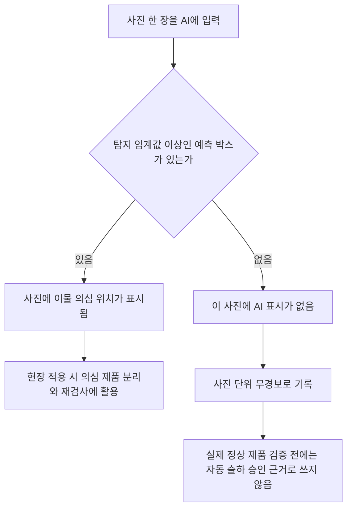

재검사량의 설명용 가정: 한 시간에 제품 1,000개 중 50개를 재검사로 보내고 작업자가 20개만 확인할 수 있다면 30개가 대기한다. 이 숫자는 프로젝트에서 측정한 공장 수치가 아니다. 모든 사진을 사람이 다시 라벨링해야 한다는 뜻도 아니다.

### 9.10. AI가 사진을 보고 모델의 이물 표시를 확인한 평가

2026-10-04 사용자 요청에 따라 **AI 보조 시각 평가**를 수행했다. 목적은 공장 운영이 아니라 네 탐지 모델의 결과 검토다. 예측 박스 안의 이물과 공식 TXT에 있는 이물의 누락을 양쪽 방향으로 확인했다.

먼저 검증 사진 12장의 26개 이물로 검토 화면과 판단 절차를 점검했다. 이후 테스트 사진 97장의 225개 이물과 채택 예측 899개를 모두 검토했다. 그림에서는 모델 이름·탐지 점수·기존 IoU 판정을 숨기고 모델 순서를 바꿨다. Codex가 선 없는 확대 사진과 예측 박스 사진을 실제로 대조했다. 단순히 TXT 중심 좌표가 예측 안에 들어오는지를 계산해 판정을 대신하지 않았다.

성공 기준은 **이물의 구분 가능한 검은 중심이 박스 안에 보이며, 그 박스가 해당 위치를 구체적으로 표시하는 것**이다. 픽셀 단위 윤곽 전체가 들어있는지의 평가는 아니다. 한 이물을 여러 번 표시하면 성공 한 개만 인정한다. 판단 어려움은 별도 항목으로 남기고, 지표의 분모에서 빼지 않는다.

| 모델 | AI 검토 TP | 중복·잘못된 표시 FP | 표시 누락 FN | AI 보조 F1 |
|---|---:|---:|---:|---:|
| YOLOv8n | 224 | 0 | 1 | 0.9978 |
| Faster R-CNN | 225 | 0 | 0 | 1.0000 |
| RF-DETR-S | 224 | 0 | 1 | 0.9978 |
| D-FINE-S | 225 | 1 | 0 | 0.9978 |

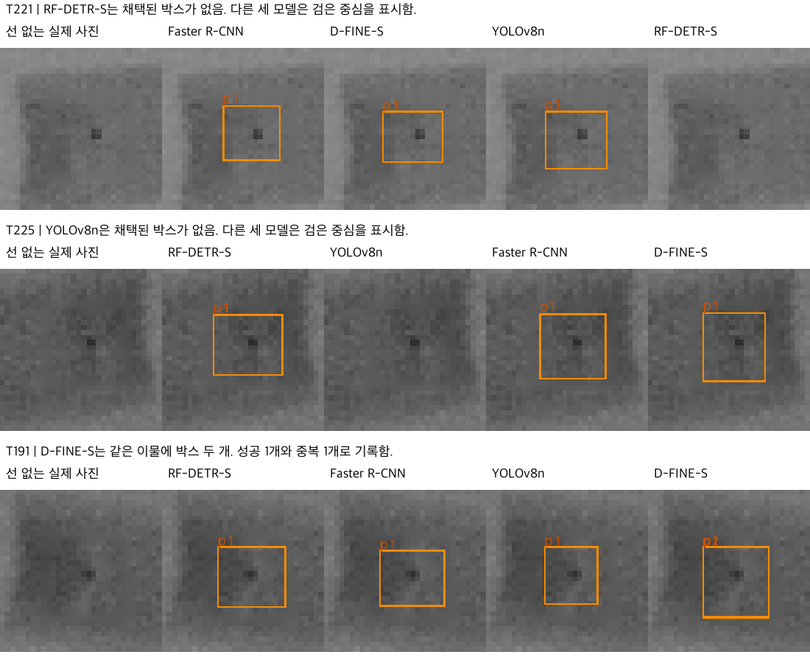

YOLOv8n과 RF-DETR-S의 누락은 서로 다른 사진이다. D-FINE-S의 FP 한 개는 같은 이물에 중복된 박스다. Faster R-CNN의 AI 보조 F1 1.0은 이 사진·임계값·검토 기준에서의 값이며 현장 성능 보장이 아니다.

기존 IoU F1·AP와 구분해서 보고한다. 공식 TXT·탐지 임계값·모델·분할을 변경하지 않았다. 사전 점검은 AI 검토자의 정확도를 입증한 독립 시험이 아니며, 실제 정상 제품과 전문가의 독립 검증은 없다. 모델과 이물의 물리적 경계를 확정한 공식 지표로 쓰지 않는다. 이전 테스트 결과를 이미 본 뒤 진행한 탐색적 평가다. [판정 기록과 근거](evidence/common_epoch_20261004/visual_review/README.md)에 각 판정과 해시, 재현 범위를 남겼다.

### 9.11. 두 모델의 신뢰도를 설명할 때 구분할 숫자 (2026-10-05)

현재 개발 조합은 YOLOv8n·RF-DETR-S다. 사용자 승인에 따라 판단이 다르면 두 예측을 보존하고 제품을 보류한다. 모델이 검사하는 단계와 프로그램이 결과를 처리하는 단계는 다르다.

- **개별 탐지 성능:** 공식 TXT와 예측을 IoU 0.5로 대응해 F1·정밀도·재현율을 계산한다. 기존 테스트 97장·225개 이물에서 YOLO F1은 0.9889, RF F1은 0.9800이다.
- **보완 관계:** 두 모델의 전체 사진 재실행에서 검증 이물 243개 중 242개는 한 모델 이상이 정답과 대응했다. 정답을 보고 계산한 수이며, 실제 프로그램이 정답을 골라 합쳤다는 뜻은 아니다.
- **판단 충돌:** 검증 사진 107장 중 1장은 예측끼리 위치·개수 대응이 달랐다. 나머지 106장이 정답임을 보장하지 않는다. 이 구분은 정답 TXT 없이 실행할 수 있다.
- **사진의 경고 유무:** 한 곳이라도 채택 예측이 있으면 경고 사진으로 센다. 경고 사진의 모든 이물을 찾았다는 뜻은 아니다. 제품을 실제로 출하한 수와도 다르다.

검증 사진 107장을 3회 실행해도 고유 평가 사진은 107장이다. 반복 실행은 속도와 실행 일관성을 확인한다. 서로 다른 새 사진 321장을 검사한 것으로 쓰지 않는다. 실제 정상 제품 0장이므로 정상 오경보율·사진 정확도·현장 미탐 제품률은 현재 계산하지 않는다.

**전체 사진 F1을 후보 확대·분할 검사에 그대로 붙이지 않는다.** 입력 범위가 바뀌면 탐지 결과와 점수 분포가 달라진다. 후보 확대 RF의 추가 학습 최고 검증 F1 0.9448은 전체 사진 RF의 0.9918보다 낮았다. 검증에서 다시 임계값을 선택한 탐색 결과라는 점도 함께 적는다. 자세한 표와 그림은 [모델 정리본 18.22절](20_모델선정과_평가_정리본.md)에 있다.

## 10. 팀원에게 설명할 문장

“사진의 작은 검은 점이 찾을 이물이고, 빨간 테두리는 검사기가 그려 넣은 표시입니다. AI가 테두리만 외우지 않도록 선이 있는 자리만 주변 밝기로 메웠습니다. 이물 위치를 기록한 TXT 파일은 사진과 별도로 유지합니다. 점들이 모두 남는 범위를 잘라 확대하거나 사진 전체를 조금 돌린 자료도 만들었습니다. 이물을 일부 또는 전부 지운 사진은 해당 점의 라벨도 함께 제거했습니다. 이런 자료가 도움이 되는지는 같은 평가 사진으로 비교한 뒤 결정합니다. TXT가 없는 사진은 AI가 위치를 만들고 여러 검사에서 통과한 것만 추가하며, 사람은 의심 사진만 확인합니다.”

## 11. 근거와 상세 기록

현재 설명은 기존 docs/06·08·11·13~18의 데이터 관련 내용을 통합했다. 이전 문장의 수치·정책이 다르면 최신 계획과 확인된 파일을 우선한다. 과거 원문은 [이전 문서 모음](../archive/문서정리_20261002/이전문서모음.md)에 보존했다.

- 현재 처리 구현: `scripts/xray_prepare_v2.py`, 데이터 목록: `data/xray_v2/summary.json`.
- 공유본 검사: `reports/provided_preprocessing_audit_20261002/`.
- Crop·추가 라벨 대상 분석: `reports/augmentation_options_study_20261002/`.
- 이번 설명 그림의 실제 출처·확인값: `reports/docs_consolidation_20261002/figure_sources.json`.
- 그림 재생성: `scripts/xray_explainer_figures.py`.
- 실제 TXT·좌표 설명 그림: `scripts/xray_label_figure.py`, 출처·사본 일치 확인: `reports/docs_consolidation_20261002/label_example.json`.
- 판정·채점 구현: `scripts/xray_eval.py`의 `match`, `evaluate`, `interpolated_ap`. 현재 분할: `data/xray_v2/split.csv`.
- 초기 검증 수치·임계값: `reports/preds_v2_roadmap_*_val_custom_ap_v2_eval.json`, `reports/roadmap_20261002/official_initial_comparison.json`. 초기 설명에서는 저장 결과만 읽었다. 이후 2026-10-02에는 IoU 기준 재채점·고정 임계값 테스트 추론·추가 AI 라벨 검사를 실제 실행했다. 날짜별 범위는 docs/21에 기록했다.
- 선행 연구: [식품 X-ray 이물 합성](https://www.techscience.com/cmc/v67n2/41335/html), [객체 탐지 증강](https://arxiv.org/abs/1906.11172), [X-ray Background Mixup](https://arxiv.org/html/2412.00460v3), [Soft Teacher](https://openaccess.thecvf.com/content/ICCV2021/html/Xu_End-to-End_Semi-Supervised_Object_Detection_With_Soft_Teacher_ICCV_2021_paper.html). 해당 연구 결과를 우리 데이터의 성능으로 대입하지 않는다.


### 2026-10-03 후속 평가 연결: 전처리 효과와 제품 판정을 구분한다

작은 이물·가장자리·형상·주변 밝기·대비에 따른 실패를 분석한다. 초기 구간은 라벨 제공 학습 자료에서 정했고, 저장 검증 예측을 기존 IoU 0.5 기준으로 재채점했다. 결과와 근사 측정의 한계는 [모델과 평가 17절](20_모델선정과_평가_정리본.md#17-회의-반영-실패-조건과-제품-출하-위험을-중심으로-평가한다)에 있다. 이 분석을 위해 원본·공식 TXT·평가 분할·학습 자료를 바꾸지 않았다.

박스 FN은 실제 이물 제품이 출하됐다는 뜻이 아니다. 반대로 낮은 탐지 점수나 무검출도 정상이라는 증거가 아니다. PASS / RE-INSPECTION / REJECT의 조건과 정상 자료 부족은 같은 절에서 구분한다. 합성 음성 사진을 실제 정상 제품의 검증 자료로 대신 사용하지 않는다.


## 10. 제출 전 데이터·평가 범위 재점검 (2026-10-04)

최신 모델 비교 전에 실제 학습 파일을 읽어 다시 확인했다. 전체 혼합 학습 사진 2,453장에는 기본 296장, 일부 자르기 295장, 사진 전체를 −7.5도·+7.5도 회전한 자료 각 295장, 막대 밖 이물 합성 295장, 이물 일부 제거 93장, 이물 전부 제거 82장, 자동 채택 의사 라벨 802장이 있다. 검증 107장·테스트 97장의 사진과 TXT는 고정된 라벨 제공 데이터셋의 사본과 해시가 같다.

사진·라벨 원본과 가공 사본 2,657쌍의 기록된 해시를 확인했다. 같은 픽셀 사진의 중복과 분할을 넘나드는 촬영 묶음은 없었다. 라벨 형식·좌표 범위도 검사했다. 색상 채널이 서로 다른 픽셀은 발견하지 못했다. 이 검사가 가려진 원래 영상을 완벽하게 복원했다는 뜻은 아니다.

학습 정답 박스는 의사 라벨·합성을 포함해 4,950개다. 검증 243개·테스트 225개는 공식 TXT 기준이다. 빈 TXT 82장은 이물을 제거해 만든 합성 학습 사진이다. **검증·테스트에는 실제 정상 제품 사진이 없다.** 따라서 정상 제품 오경보율, 실제 제조 불량 확률의 보정, 자동 정상 통과의 안전성은 아직 평가할 수 없다.

의사 라벨 파일이 저장 기록과 일치한다는 사실은 모든 의사 라벨이 정확하다는 증명이 아니다. 같은 촬영 묶음과 동일 픽셀 중복을 막았더라도 시험편·호기·날짜가 충분히 다양하다는 뜻은 아니다. 새로운 현장 자료에 대한 일반화는 별도로 확인한다.

[재점검 수치와 범위](evidence/common_epoch_20261004/design_review/data_integrity.json). 최신 모델 비교와 단계적 검사의 공통 오류 한계는 모델 정리본 18.15절에서 함께 설명한다.

### 제출 전 데이터 재확인과 식품 FN 해석 — 2026-10-04

최종 입력은 학습 2,453장·검증 107장·테스트 97장이다. 박스는 각각 4,950개·243개·225개다. 출처 사진과 라벨 2,657쌍을 확인했다. 픽셀 중복·분할 간 촬영 묶음 중복·입력의 유색 픽셀 사진은 각각 0개였다. 빈 라벨 82장은 학습용 이물 전부 제거 사진이며 실제 정상 제품의 평가 자료가 아니다. 확인 근거는 `reports/design_review_20261004/data_integrity.json`이다.

식품 공정에서 중요한 FN은 이물이 든 제품을 경고 없이 통과시키는 실패다. 현재 IoU FN에는 검은 이물 중심을 표시했지만 공식 박스와 충분히 겹치지 않은 경우도 포함한다. 두 의미를 합치지 않는다. 기존 TXT·IoU 채점은 보존하고 실제 중심 표시 검토와 제품 처리 실패를 별도로 기록한다. 두 모델이 같은 예측을 했다는 이유로 정답 라벨을 바꾸거나 정상으로 확정하지 않는다. 자세한 결과와 처리 순서는 모델 정리본 18.15~18.18절에 있다.

## 12. 증강이 항상 도움이 되는가: 참고 보고서 검토 (2026-10-05)

**증강 사진이 늘어도 성능은 낮아질 수 있다.** 실제 검사 사진과 다른 무늬·밝기·크기를 지나치게 학습하거나, 이물을 지우는 과정에서 남은 흔적에 잘못된 라벨을 붙이면 실제 사진 판단이 어려워질 수 있다. 다만 성능 하락만으로 그 원인을 확정할 수는 없다. [KeepAugment, CVPR 2021](https://openaccess.thecvf.com/content/CVPR2021/html/Gong_KeepAugment_A_Simple_Information-Preserving_Data_Augmentation_Approach_CVPR_2021_paper.html)도 증강에 의한 정보 손실과 분포 변화를 다룬다.

### 12.1. 참고 보고서에서 확인한 결과와 확인하지 못한 것

참고 자료는 `docs/대회자료/KAMP_Xray_경진대회_보고서_강경래_v4.pdf`다. 아래는 PDF 표·본문을 대조한 결과다. 실행 코드·예측 CSV·학습 로그를 아직 전달받지 못했으므로 독립 재현 결과가 아니다. 쪽수는 PDF 페이지 기준이다.

10쪽의 A 조건은 공식 학습 사진 340장에 약한 라벨 사진 1,880장을 더한 **2,220장**이다. 따라서 '공식 정답 원본 340장만 사용한 실험'으로 부르면 안 된다. D 조건은 여기에 이물 합성·제거를 모두 더한 4,372장이다. YOLOv8n을 30epoch 학습했고 A와 D만 seed 0·1을 반복했다.

| 참고 보고서 조건 | 학습 사진 | 검증 IoU FN, seed 0 | 검증 IoU FN, seed 1 |
|---|---:|---:|---:|
| A: 실제 영상 + 약한 라벨 | 2,220 | 5 | 7 |
| B: A + 이물 합성 | 3,580 | 5 | 미보고 |
| C: A + 이물 제거 | 3,012 | 5 | 미보고 |
| D: A + 이물 합성 + 이물 제거 | 4,372 | 9 | 8 |

확인 가능한 결론은 **이 구성에서 전체 합성·제거 혼합 조건 D가 A보다 검증 FN이 많았다**는 것이다. 모든 증강이 해롭다는 결론은 아니다. B·C의 FN은 A의 seed 0과 같았다. 사진 전체 회전·자르기의 독립 효과도 이 표로 판단할 수 없다. FN은 IoU 위치 기준이며, 실제 제품 누락 수와 구분한다.

A·D는 30epoch가 같지만 사진 입력 횟수는 각각 66,600회·131,160회다. D가 약 1.97배다. 이는 큰 데이터셋을 같은 횟수 반복하는 실용적 비교로 의미가 있다. 다만 데이터 구성의 효과와 업데이트 수·스케줄 효과를 완전히 분리한 실험은 아니다. 원본 한 장당 반복 횟수가 줄었다고 해석해서는 안 된다.

학습 seed 두 개에서 평균 FN은 A 6개, D 8.5개다. 차이는 2.5개다. 반복 수가 적고 B·C는 한 seed이므로 불확실성이 크다. 보고서의 사전 개선 조건인 'FN 3개 이상 감소'는 연구자가 정한 채택 기준이지 통계적 유의성 검정이 아니다.

### 12.2. 우리 연구에 반영할 점

1. 사진 일부 자르기, 전체 회전, 이물 합성, 이물 제거, 의사 라벨을 서로 다른 조건으로 기록한다. '증강' 하나로 묶어 원인을 설명하지 않는다.
2. 같은 epoch 비교에는 사진 수와 총 업데이트 수를 함께 적는다. 기존 740회 업데이트 비교와 이후 20epoch 혼합 학습의 목적 차이도 보존한다.
3. 이물 제거 사진의 남은 자국이 성능을 떨어뜨렸다는 설명은 가설로 표시한다. 비교군 없이 확정 원인으로 쓰지 않는다.
4. 색 네모가 없던 배경에 동일한 제거 처리를 한 대조 사진은 표시 제거 흔적의 영향을 시험하는 데 도움이 된다. 해당 대조 사진에서 오탐 0개가 나와도, 모델이 어떤 상황에서도 처리 흔적을 이용하지 않는다는 증명은 아니다.
5. 낮은 대비 사진에서의 변화는 별도 스트레스 시험으로 보고한다. 검증·테스트 평균으로 설정을 선택하지 않는다. 참고 보고서 10쪽 저대비 열은 두 분할 평균이므로, 선택에 실제 사용했는지 코드·시점 확인이 필요하다.
6. 합성 정상 사진과 공식 라벨이 없는 배경 조각을 실제 정상 제품 평가 자료로 대신하지 않는다.

현재 전체 혼합 2,453장으로 학습한 기존 결과를 소급해서 삭제하거나 증강 효과가 입증됐다고 쓰지 않는다. 참고 보고서와 우리는 분할·라벨·합성 방법·학습 조건이 달라 결과 숫자를 직접 우열 비교하지 않는다. 새로운 실험은 별도 폴더에 저장한다.

### 12.3. 두 재검사 역할에 맞춘 사진 준비

후보 확인은 **첫 모델이 표시한 부위와 주변 배경을 함께 보는 작업**이다. 학습 때는 라벨 제공 학습 사진의 정답 박스를 중심으로 96×96픽셀 범위를 자른다. 추론 때는 정답을 볼 수 없으므로 YOLOv8n의 예측 위치를 중심으로 자른다. 이 차이 때문에 학습과 실제 입력의 위치 오차가 다를 수 있다.

누락 확인은 **후보가 없더라도 사진 전체에 빈틈이 없도록 겹치는 조각을 검사하는 작업**이다. 256×256픽셀 조각이 이웃 조각과 64픽셀 겹치도록 만든다. 가장자리까지 포함한다. 학습에서는 공식 이물이 조각 경계에 잘린 사진을 제외하고, 추론에서는 조각의 예측 좌표를 원래 사진 좌표로 되돌린다. 두 조각이 같은 이물을 중복 표시하면 같은 검토 모델 내부에서 NMS로 정리한다.

새 역할별 학습의 부모는 라벨 제공 학습 사진 중 알려진 라벨 문제 2장을 제외한 294장이다. 후보 확인 사진은 805장(빈 공식 라벨 조각 294장), 누락 확인 사진은 1,247장(빈 공식 라벨 조각 236장)이다. 조각의 박스는 각각 1,078개·2,327개다. 같은 이물이 여러 조각에 반복되므로 독립적인 새 이물 수가 아니다. 두 학습 세트는 공식 검증·테스트 부모와 겹치지 않는다.

새 역할별 추가 학습 자료에는 새 의사 라벨·이물 합성·이물 제거를 넣지 않았다. 다만 시작 RF-DETR-S 저장본은 기존 혼합 2,453장으로 학습한 모델이다. 전체 학습 이력에서 의사 라벨이나 합성이 전혀 없었다고 표현하면 안 된다. 두 방식 모두 아직 예비 연구이며 정상 제품 판정 능력이 검증된 전용 모델로 부르지 않는다.

근거: `data/xray_review_roles_20261005/manifest.json`, `reports/review_roles_20261005/peer_report_arithmetic.json`. 모델 실행과 채점 결과는 모델 정리본 18.21절에 기록한다.


### 확정 검사 입력과 평가의 구분 (2026-10-05)

개발 기본 방식은 **YOLOv8n과 RF-DETR-S 모두 전체 사진 검사**다. 두 모델 모두 색 네모를 제거한 같은 사진을 입력받는다. 후보 주변 자르기·확대와 겹침 분할은 별도 개선 실험이다. 원본·공식 TXT·촬영 묶음 분할은 변경하지 않았다.

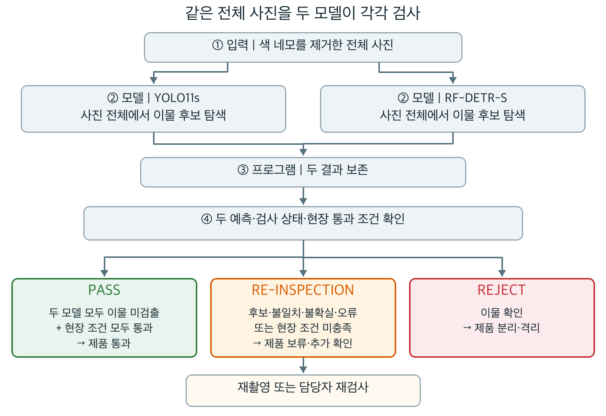

검증 107장·테스트 97장 저장 예측을 다시 채점하고 같은 처리 규칙으로 재생했다. 테스트에서 YOLO 무후보 1장과 RF 무후보 1장은 서로 다른 사진이었다. 다른 모델이 각각 경고했다. 두 모델 모두 IoU 기준을 충족하지 못한 이물은 테스트 225개 중 2개 남았다. 이 수는 실제 이물이 예측 박스 밖에 있었다는 뜻과 구분한다. 실제 정상 제품이 없으므로 정상 오경보율·공장 출하 미탐률은 아직 계산하지 않는다. 세부 정책과 근거는 [모델 정리본 18.23절](20_모델선정과_평가_정리본.md#1823-확정한-전체-사진-이중-검사와-저장-예측-재검증-2026-10-05)에 기록했다.


### 12.4. 제출 보고서에 연결한 전처리 근거와 실제 효과 (2026-10-05)

합성·의사 라벨 연구를 실험 후 검토하여, 방법 선택의 이유와 결과 해석을 보강했다. 연구를 먼저 읽고 모든 전처리를 결정한 것으로 시간을 바꾸어 설명하지 않는다. 관련 문헌의 수치는 우리 실험 성능으로 옮기지 않는다.

- **자르기·회전:** 제품과 이물을 함께 변형해 위치·기울기 변화를 학습하는 가설이다. 단기 비교의 기본 F1 0.9567에서 0.9918로 높아졌다.
- **막대 밖 합성:** 이물이 있는 위치를 다양하게 만드는 가설이다. 단독 추가 F1은 0.9773이었다. 시험편 의존이 실제로 줄었는지, 공장의 다른 이물로 일반화하는지는 미검증이다.
- **이물 제거:** 이물이 없는 위치도 학습시키는 가설이다. 전부 제거 추가는 0.9547로 기본보다 소폭 낮았다. 일부 제거 추가는 0.9671이었다. 합성 정상은 실제 정상 제품을 대신하지 않는다.
- **의사 라벨:** 라벨링 후보 데이터셋의 실제 사진을 추가한다. 단독 추가는 0.9877이지만 자르기·회전과 함께 쓰면 0.9794로 자르기·회전만의 0.9918보다 낮았다. 데이터 수와 성능은 비례하지 않았다.

위 값은 YOLOv8n, seed 0, batch 8, **실제 업데이트 740회**의 여덟 별도 학습 결과다. 검증 107장·243개 이물의 IoU 0.5 최고 F1이며 조건별 탐지 임계값을 골랐다. 모든 조건을 각각 20epoch 학습한 결과가 아니다. 자료가 많은 조건은 사진당 노출이 적고 단일 seed이므로 일반적인 우월성을 증명하지 못한다.

최종 혼합 2,453장은 모델 비교에 같은 자료를 쓰기 위한 공통 조건이다. 단기 비교의 최고 조건이나 최적 증강 조합으로 표현하지 않는다. 제출 보고서의 제1장에 처리 이유·실제 사진을, 제2장에 여덟 조건 결과와 해석을 배치했다.

출처: [식품 X-ray 합성 연구 Kim 등, 2021](https://doi.org/10.32604/cmc.2021.014642), [Soft Teacher, 2021](https://arxiv.org/abs/2106.09018). 우리의 다중 예측 검사 방식은 Soft Teacher 전체 알고리즘 구현이 아니다. 자체 수치는 `reports/roadmap_20261002/ablation_results.json` 및 `ablation_completion_check.json`, 문서 반영값은 `docs/evidence/editorial_review_20261005/evidence.json`에 있다.

### 12.5. 팀 v7 실험에서 배운 전처리 비교 원칙 (2026-10-06)

상대 프로젝트 v7은 증강을 일괄 제외하지 않았다. 저대비 이물에는 저장 합성·제거 자료를 뺀 구성이 유리했지만, RF-DETR-S의 검증 위치 FN과 합성 정상 오경보에는 증강 포함 구성이 유리했다. 최종 학습에는 증강 포함 4,372장을 유지했다. A라고 부른 ‘실제 사진만’도 라벨 제공 학습 340장과 색 네모 약라벨 1,880장을 합친 것이며, 학습 중 회전·이동·반전 증강을 사용했다.

우리 여덟 조건도 증강 효과가 단순히 합산되지 않았다. 따라서 ‘사진 수가 늘면 성능이 오른다’고 설명하지 않는다. 선택 이유, 평가 조건, 좋아진 점, 나빠진 점을 함께 쓴다. 처리 흔적을 따로 시험하고 대비를 단계적으로 낮추는 대조 실험은 후속 보완안이다. 이물을 지운 사진은 실제 정상 제품의 대체 증거가 아니다.

양쪽의 색 네모 제거·추가 라벨 방식과 코드 검토 결과는 [모델 정리본 18.26절](20_모델선정과_평가_정리본.md)에 있다. 이번에는 원본·전처리·라벨·분할을 변경하지 않았다.
