# 모델을 어떻게 고르고 비교하는가

**2026-10-05 현재 결정:** 사용자가 개발 조합으로 **YOLOv8n + RF-DETR-S**와 판단 충돌 시 제품 보류를 승인했다. 두 재검사 역할은 유지하되, 확대·분할 입력과 전체 사진 입력의 성능을 구분한다. 전체 사진 재검사를 기본으로 할지 추가 확인 중이다. 승인 조합의 실제 전체 사진 실행과 선정 근거는 **18.22절**이다. 아래 10월 4일 Faster R-CNN 제안은 당시 기록이다.

**과거 설계 검토 (2026-10-04):** 최신 YOLO 두 모델의 공통 20epoch 비교와 독립 전체 추가 검사를 완료했다. 당시 연구 제안은 YOLOv8n + Faster R-CNN이었다. 결과·한계는 18.16~18.18절에 보존한다. 현재 개발 조합은 위의 사용자 결정과 18.22절을 따른다.
2026-10-04 보완 · [문서 처음으로](README.md) · [데이터 설명](19_데이터전처리_정리본.md) · [계획과 이력](21_진행계획과_작업이력.md)

**비교는 세 모델에서 시작하여 여섯 모델까지 확장했다.** 기존에 쓴 가벼운 모델, 같은 CNN이지만 다른 방식으로 찾는 모델, Transformer를 이용하는 모델을 비교했다. 현재 개발 조합은 정했으며, 현장 운영 임계값과 자동 정상 통과 조건은 별도 검증 대상이다.

## 1. AI가 사진을 받으면 무엇을 내놓는가

입력은 색 네모를 지운 X-ray 사진이다. 출력은 ‘이 부근에 이물이 있다’는 위치 박스와 점수다. 점수가 높다는 것은 모델이 그 후보를 이물로 더 강하게 판단했다는 뜻이다. 점수가 0.9라고 해서 실제 공장 제품의 불량 확률이 정확히 90%라고 보장되는 것은 아니다.

학습할 때는 모델이 찾은 박스와 공식 TXT의 정답을 비교해 모델 내부의 숫자들을 조정한다. 이를 여러 사진에서 반복하면 이물의 무늬·경계·주변 배경을 구분하는 법을 배운다.

**파인튜닝**은 이미 다른 사진으로 배운 공개 모델을 가져와 우리 X-ray 사진과 이물 정답으로 추가 학습하는 것이다. 모델 구조를 처음부터 발명하는 작업과 구분한다. 우리가 만드는 부분은 데이터 처리, 추가 라벨 생성·검사, X-ray에 맞춘 학습, 공정한 비교, 오류 분석과 현장 판정 기준이다.

## 2. 세 모델이 사진을 보는 방식

이 절은 **짧은 문장, 일관된 용어, 한 문장에 한 가지 설명**을 사용합니다. ASD-STE100의 일부 작성 원칙을 한국어 설명에 참고했습니다. 영어 규격인 ASD-STE100을 정식으로 준수했다는 뜻은 아닙니다. 이번에는 모델 설명에 이 문체를 적용했습니다. [S10](https://asd-ste100.org/STE_faq.html)

아래 그림은 논문과 공식 구현을 참고해 만든 설명용 도식입니다. 사진은 기본 학습 데이터셋에서 가져왔습니다. 도식의 네모와 화살표는 처리 순서를 보여 줍니다. 실제 특징 지도나 실제 예측 결과를 보여 주는 그림은 아닙니다.

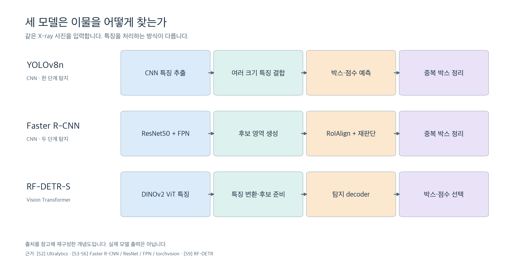

### 2.1. 먼저 알아야 할 말

| 용어 | 이 문서에서의 뜻 |
|---|---|
| 특징, feature | 모델이 계산한 경계·무늬·형태 등의 정보입니다. 각 값의 의미를 사람이 모두 해석할 수 있는 것은 아닙니다. |
| 특징 지도, feature map | 사진의 위치에 대응하도록 특징을 배열한 것입니다. 원본 사진과는 다릅니다. |
| Backbone | 사진에서 특징을 추출하는 부분입니다. |
| Neck / Projector | 추출한 특징을 결합하거나 다음 부분이 사용할 형식으로 바꿉니다. 모델마다 구성은 다릅니다. |
| Head | 특징으로 물체 종류와 박스 좌표 등을 출력하는 부분입니다. |
| CNN, 합성곱 신경망 | 작은 영역에 같은 계산을 반복 적용합니다. 계산을 여러 층으로 쌓아 더 복잡한 특징을 만듭니다. |
| Attention | 다른 위치의 정보 중 무엇을 얼마나 참고할지 계산하는 방법입니다. |
| 예측 박스 | 모델이 출력한 이물 후보의 위치와 크기입니다. 원본의 색 네모와 구분합니다. |

CNN의 앞부분은 좁은 영역을 처리합니다. 여러 층을 거친 특징은 더 넓은 영역의 영향을 받습니다. 따라서 CNN도 주변 정보를 이용할 수 있습니다. Transformer만 주변 정보를 이용한다고 설명하지 않습니다. [S1](https://d2l.ai/chapter_convolutional-neural-networks/why-conv.html)

### 2.2. YOLOv8n: 사진의 여러 위치에서 바로 박스를 예측합니다

**YOLOv8n은 CNN 기반의 한 단계 객체 탐지 모델입니다.** 이름의 `n`은 nano 크기를 뜻합니다. 이번 비교에서는 가벼운 기준 모델로 사용합니다. [S2](https://docs.ultralytics.com/models/yolov8/)

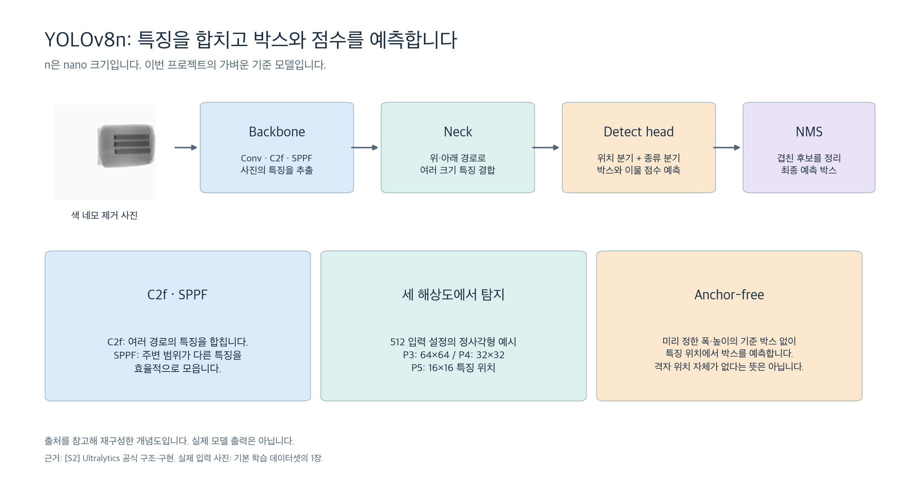

사진은 다음 순서로 처리됩니다.

1. **Backbone이 특징을 추출합니다.** 합성곱과 C2f 블록을 사용합니다. C2f는 여러 처리 경로에서 얻은 특징을 합칩니다. SPPF는 서로 다른 주변 범위를 반영한 특징을 모읍니다.
2. **Neck이 여러 해상도의 특징을 결합합니다.** 촘촘한 위치 정보와 넓은 범위의 정보를 함께 전달합니다.
3. **탐지 Head가 박스와 점수를 예측합니다.** 박스 위치를 구하는 분기와 물체 종류를 판단하는 분기가 나뉘어 있습니다. 이번에는 이물 한 종류를 학습합니다.
4. **NMS가 겹친 후보를 정리합니다.** 같은 물체를 가리킬 가능성이 높은 박스 중 점수가 낮은 박스를 줄입니다.

위 흐름은 [Ultralytics 공식 구조 설명](https://docs.ultralytics.com/guides/yolo-architecture/)과 설치된 YOLOv8 구조 파일을 대조했습니다. NMS는 Non-Maximum Suppression의 약자입니다. NMS에서 박스끼리 겹침을 비교하는 일과, 평가에서 예측 박스를 정답 박스에 대응하는 일은 서로 다릅니다.

YOLOv8은 **anchor-free** 방식을 사용합니다. 각 위치에 폭과 높이를 미리 지정한 기준 박스를 두지 않습니다. 특징 지도 위의 위치를 기준으로 박스를 예측합니다. 위치 격자까지 없어진다는 뜻은 아닙니다. [S2](https://docs.ultralytics.com/models/yolov8/)

**숫자로 보기 — 구조 파일에서 확인한 값**

- 탐지에 사용하는 특징 지도: P3, P4, P5.
- 입력 대비 위치 간격: 각각 8, 16, 32픽셀.
- 512×512 입력의 계산 예: 특징 지도는 각각 64×64, 32×32, 16×16입니다. 이 값은 예측 박스의 고정 크기가 아닙니다.

우리의 비교 질문은 다음과 같습니다. **작은 모델로 이물을 충분히 찾으면서 공장의 처리 시간을 맞출 수 있는가?** 다만 작은 이물의 정보는 사진 축소와 특징 추출 과정에서 약해질 수 있습니다. 가까운 이물의 박스가 NMS에서 제거되는지도 확인해야 합니다. 이는 확인할 위험이며, 현재 데이터에서 발생했다고 단정하는 결과는 아닙니다.

### 2.3. Faster R-CNN: 후보 영역을 찾은 뒤 다시 판단합니다

**이번 모델의 정확한 이름은 Faster R-CNN ResNet50-FPN v2입니다.** Faster R-CNN은 영역을 제안하고 판단하는 탐지 방식입니다. ResNet50은 Backbone입니다. FPN은 여러 해상도의 특징을 결합합니다. `v2`는 torchvision의 모델 변형 이름입니다. 데이터 전처리 버전을 뜻하지 않습니다. [S3](https://arxiv.org/abs/1506.01497), [S6](https://docs.pytorch.org/vision/0.23/models/generated/torchvision.models.detection.fasterrcnn_resnet50_fpn_v2.html)

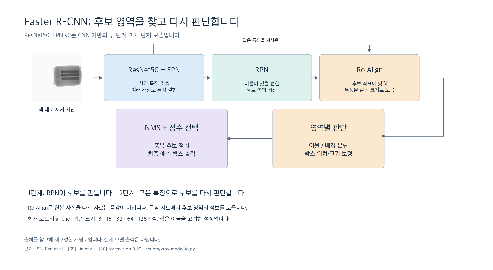

사진은 다음 순서로 처리됩니다.

1. **ResNet50과 FPN이 사진 전체의 특징을 계산합니다.** 이 특징은 뒤의 두 단계에서 함께 사용합니다.
2. **RPN이 물체가 있을 법한 후보 영역을 만듭니다.** RPN은 Region Proposal Network의 약자입니다. 기준 박스인 anchor를 이동하고 크기를 조정합니다.
3. **RoIAlign이 후보 영역의 특징을 모읍니다.** 후보마다 크기가 달라도 뒤의 판단 부분이 받을 특징 크기는 일정하게 맞춥니다. 원본 사진마다 CNN 전체를 다시 실행하는 방식은 아닙니다.
4. **영역별 Head가 이물과 배경을 구분합니다.** 박스의 위치와 크기도 다시 보정합니다.
5. **NMS와 점수 선택을 거쳐 예측 박스를 출력합니다.**

예를 들어 막대의 어두운 모서리와 작은 이물이 모두 후보가 될 수 있습니다. 두 번째 단계는 각 후보의 특징을 보고 다시 판단합니다. 이 절차가 막대 모서리의 오탐을 줄이는지는 실제 예측으로 확인합니다. 위 예는 작동 원리를 설명한 상황이며, 특정 사진에서 관찰한 결과는 아닙니다.

원래 Faster R-CNN 논문과 현재 모델은 구성이 완전히 같지는 않습니다. 후보 생성과 특징 공유의 근거는 원 논문입니다. 현재의 ResNet50-FPN과 RoIAlign 구성은 torchvision 구현을 근거로 설명했습니다. 이름의 `R`은 Region, 즉 영역입니다. RNN의 약자가 아닙니다. [S3](https://arxiv.org/abs/1506.01497), [S6](https://docs.pytorch.org/vision/0.23/models/generated/torchvision.models.detection.fasterrcnn_resnet50_fpn_v2.html)

**숫자로 보기 — 프로젝트 코드에서 확인한 설정**

- RPN anchor의 기준 크기: 8, 16, 32, 64, 128픽셀.
- 출력 분류: 배경과 이물. 이물은 한 종류입니다.
- 후보 수 제한과 anchor 설정의 위치: `scripts/xray_model_io.py`의 `faster_model`.

작은 anchor는 작은 이물의 후보를 만들기 위한 설정입니다. 작은 anchor가 성능을 높였다는 결론은 별도 비교가 필요합니다. RPN이 후보를 놓치면 두 번째 단계도 그 영역을 판단하지 못할 수 있습니다. 후보 수와 처리 시간도 함께 확인합니다.

### 2.4. ResNet50과 FPN은 각각 무엇을 하는가

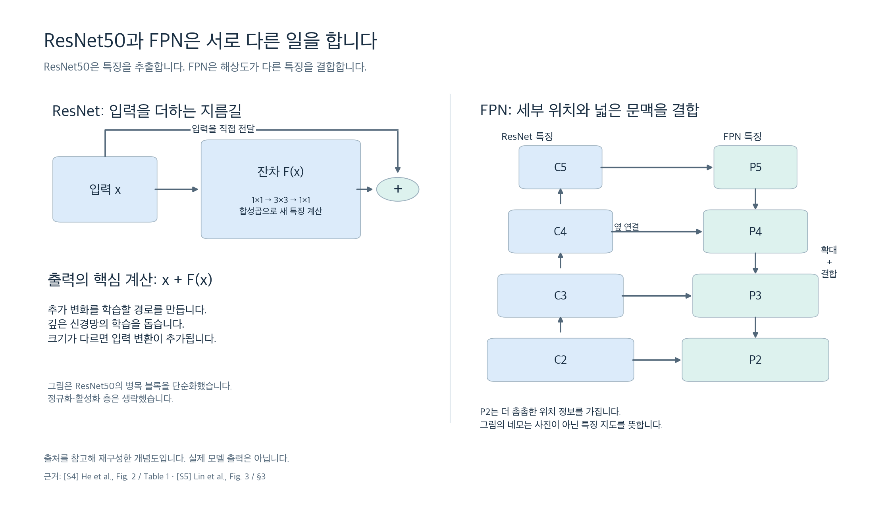

**ResNet50은 입력을 다음 층으로 직접 전달하는 경로를 사용합니다.** 이 경로를 잔차 연결, residual connection이라고 부릅니다. 한 경로는 새 변화량 `F(x)`를 계산합니다. 다른 경로는 입력 `x`를 전달합니다. 두 결과를 더하는 핵심 계산은 `x + F(x)`입니다. 층이 깊어져도 학습을 진행하기 쉽게 만드는 설계입니다. [S4](https://arxiv.org/abs/1512.03385)

그림 왼쪽의 지름길을 보십시오. 이 경로는 원본 사진을 최종 출력으로 복사한다는 뜻이 아닙니다. 해당 블록에 들어온 특징을 전달합니다. 특징의 크기가 다르면 크기를 맞추는 계산이 추가됩니다. ResNet50의 `50`은 표준 Backbone의 깊이를 나타냅니다. 전체 탐지 모델이 정확히 50층이라는 뜻은 아닙니다.

**FPN은 위치가 촘촘한 특징에 깊은 층의 정보를 더합니다.** FPN은 Feature Pyramid Network의 약자입니다. 깊은 층의 작은 특징 지도를 확대합니다. 그 결과를 앞쪽 층의 특징과 결합합니다. 이 과정을 반복해 여러 해상도의 특징을 만듭니다. [S5](https://arxiv.org/abs/1612.03144)

그림 오른쪽의 `C`는 ResNet에서 나온 특징입니다. `P`는 FPN이 결합한 특징입니다. P2처럼 촘촘한 지도는 작은 물체의 위치를 다루는 데 활용할 수 있습니다. 다만 이것만으로 작은 이물의 탐지가 보장되지는 않습니다. FPN은 사진을 여러 장 만드는 데이터 증강도 아닙니다.

아래는 FPN 논문의 원본 그림입니다. 위 한국어 도식의 원리를 확인할 때 참고합니다.


출처: Lin et al., *Feature Pyramid Networks for Object Detection*, Figure 3, arXiv:1612.03144v2 / CVPR 2017. [원문 보기](https://arxiv.org/html/1612.03144v2). 외부 서버의 그림이므로 표시하려면 인터넷이 필요합니다. 위의 한국어 재구성 도식은 프로젝트에 PNG와 SVG로 저장했습니다.

### 2.5. RF-DETR-S: 패치 사이의 관계를 이용해 이물을 찾습니다

**RF-DETR-S는 Vision Transformer를 Backbone으로 사용하는 탐지 모델입니다.** `S`는 Small 크기를 뜻합니다. ViT는 사진을 작은 조각인 패치로 나눕니다. 각 패치를 숫자 벡터로 바꿉니다. Transformer는 이 벡터 사이의 관계를 계산합니다. [S7](https://arxiv.org/abs/2010.11929), [S9](https://arxiv.org/html/2511.09554v2)

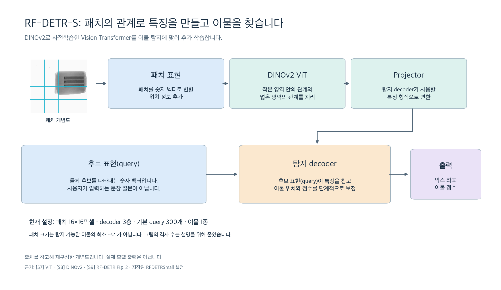

**DINOv2는 특징을 미리 학습하는 방법입니다.** 다양한 사진에서 정답 라벨 없이 시각 특징을 배우는 자기지도학습을 사용합니다. RF-DETR는 이 사전학습 특징을 활용합니다. 우리 프로젝트의 추가 학습에는 이물 라벨을 사용합니다. DINOv2를 사용한다고 X-ray 라벨이 필요 없어지는 것은 아닙니다. [S8](https://arxiv.org/abs/2304.07193), [RF-DETR 공식 저장소](https://github.com/roboflow/rf-detr)

사진은 다음 순서로 처리됩니다.

1. **ViT가 패치를 특징으로 바꿉니다.** RF-DETR의 Backbone은 작은 구역 안의 attention과 더 넓은 범위의 attention을 함께 사용합니다.
2. **Projector가 특징을 변환합니다.** 뒤의 탐지 부분이 사용할 형식으로 맞춥니다.
3. **탐지 decoder가 물체 후보를 처리합니다.** 후보를 나타내는 숫자 벡터를 query라고 부릅니다. Query는 사진의 특징을 참고해 박스를 보정합니다.
4. **박스 좌표와 이물 점수를 출력합니다.** 현재 추론 경로에는 YOLO 방식의 별도 NMS를 추가하지 않습니다.

Query는 사용자에게 받는 문장 질문이 아닙니다. 사진에서 물체를 찾기 위한 내부 표현입니다. Decoder는 이 표현과 사진의 특징을 함께 처리하는 부분입니다. 문장을 한 단어씩 생성하는 언어모델의 사용 방식과 구분합니다. 처리 원리는 [RF-DETR 논문 3절과 Figure 2](https://arxiv.org/html/2511.09554v2)를 참고했습니다. 실제 추론 경로는 `scripts/xray_predict_controlled.py`에서 확인했습니다.

**숫자로 보기 — 이번에 저장된 Small 모델 설정**

- Backbone: `dinov2_windowed_small`.
- 모델 입력: 512×512. 패치: 16×16픽셀.
- 탐지 decoder: 3층. 기본 query: 300개.
- 이물 종류: 1종. 물체의 픽셀 경계를 구하는 segmentation head는 사용하지 않습니다.
- 근거 파일: `runs/v2_mix2453_rfdetr_mps/training_config.json`의 `model_config`.

패치의 크기는 탐지 가능한 이물의 최소 크기가 아닙니다. 패치 안의 작은 이물도 입력값에 영향을 줍니다. 다만 그 정보를 충분히 학습하는지는 평가해야 합니다. Query 수 역시 사진마다 실제 이물이 그만큼 있다는 뜻은 아닙니다.

아래는 RF-DETR 논문의 원본 구조도입니다. 원문은 탐지와 segmentation을 함께 설명합니다. 그림에 있는 segmentation 분기는 이번 프로젝트에서 사용하지 않습니다.


출처: Robinson et al., *RF-DETR: Neural Architecture Search for Real-Time Detection Transformers*, Figure 2, arXiv:2511.09554v2, 2026. [원문 보기](https://arxiv.org/html/2511.09554v2), [원문에 표시된 CC BY 4.0 안내](https://creativecommons.org/licenses/by/4.0/). 원본 그림을 외부 링크로 표시했습니다.

논문은 속도와 성능에 맞게 구조를 탐색하는 NAS도 다룹니다. **이번 프로젝트에서는 정해진 Small 구조를 가져와 파인튜닝합니다.** 우리 데이터로 NAS를 수행한 것은 아닙니다. 사전학습과 attention이 X-ray의 배경 변화에 도움이 되는지는 이번 비교에서 확인할 가설입니다.

### 2.6. 세 모델을 함께 비교하는 이유

| 모델 | 구조에서 확인한 차이 | 우리 데이터에서 확인할 질문 | 공장 적용 때 함께 볼 것 |
|---|---|---|---|
| YOLOv8n | CNN으로 여러 위치의 박스를 직접 예측합니다. | 가벼운 모델로 작은 이물을 충분히 찾는가? | 미탐, 가까운 이물의 구분, 전체 처리 시간 |
| Faster R-CNN ResNet50-FPN v2 | CNN 특징으로 후보를 만들고 영역별로 다시 판단합니다. | 후보의 재판단과 여러 해상도 특징이 위치와 오탐을 개선하는가? | 후보 누락, 후보 수, 메모리와 처리 시간 |
| RF-DETR-S | DINOv2 ViT 특징과 Transformer 탐지 decoder를 사용합니다. | 사전학습 특징과 위치 간 관계가 촬영 조건 변화에 도움이 되는가? | 작은 이물의 미탐, 메모리, 실제 장치의 추론 시간 |

표의 질문은 **실험 가설**입니다. 모델이 발표된 연도나 구조만으로 우수성을 결정하지 않습니다. 같은 검증 데이터셋에서 모델을 비교합니다. 탐지 임계값을 고른 후에는 테스트 데이터셋에 고정 적용합니다. 공장 속도를 비교할 때는 같은 장치를 사용해야 합니다.

현재 입력은 각각의 X-ray 사진입니다. 이번 비교에서는 시간 순서가 필요한 RNN·LSTM을 추가하지 않습니다. 향후 연속 영상이나 장비 센서의 변화를 다루면 별도 후보가 될 수 있습니다. YOLO26, YOLOv8n-P2와 더 큰 모델은 추가 검토 후보로 남깁니다. DoG는 기존의 어두운 점 검출 참고 결과로 보존합니다.

**제출 문장 초안 — 모델 구성 설명**

> 세 가지 탐지 구조를 비교하였다. YOLOv8n은 가벼운 CNN 기준 모델로 사용하였다. Faster R-CNN ResNet50-FPN v2는 후보 영역을 다시 판단하는 구조로 선정하였다. RF-DETR-S는 사전학습된 Vision Transformer 특징을 사용하는 비교 모델로 선정하였다. 공개 사전학습 가중치를 가져와 같은 X-ray 학습 데이터셋으로 파인튜닝하였다.

이 문단은 선정 목적과 학습 방식을 설명합니다. 최종 모델의 선정 결과는 별도로 작성합니다. Epoch, batch size, 학습률과 옵티마이저는 이 문서 **13.1절**에서 확인할 수 있습니다.

### 2.7. 설명과 그림의 출처

아래 자료는 교과서, 원 논문, 공식 문서입니다. 그림의 `[S번호]`는 이 목록을 가리킵니다. 모델의 원리와 현재 구현이 다르면 현재 구현을 따로 적었습니다. YOLOv8은 공식 문서와 구조 코드를 근거로 설명했습니다. 존재하지 않는 YOLOv8 원 논문을 인용하지 않습니다.

| 번호 | 자료 | 이 문서에서 참고한 부분 |
|---|---|---|
| S1 | Zhang et al., [Dive into Deep Learning, 7.1](https://d2l.ai/chapter_convolutional-neural-networks/why-conv.html) | CNN의 작은 영역 처리와 같은 계산의 반복 적용 |
| S2 | Ultralytics, [YOLOv8 공식 문서](https://docs.ultralytics.com/models/yolov8/), [YOLO 구조 안내](https://docs.ultralytics.com/guides/yolo-architecture/) | Anchor-free 탐지, 분리된 head, C2f·SPPF·특징 결합. 설치된 8.4.158의 `cfg/models/v8/yolov8.yaml`과 대조 |
| S3 | Ren et al., [Faster R-CNN: Towards Real-Time Object Detection with Region Proposal Networks](https://arxiv.org/abs/1506.01497), NeurIPS 2015 | RPN과 탐지 단계의 특징 공유, 영역 제안 |
| S4 | He et al., [Deep Residual Learning for Image Recognition](https://arxiv.org/abs/1512.03385), CVPR 2016 | Figure 2의 잔차 연결, Table 1의 ResNet50 구성 |
| S5 | Lin et al., [Feature Pyramid Networks for Object Detection](https://arxiv.org/abs/1612.03144), CVPR 2017 | 3절과 Figure 3의 위쪽 경로·옆 연결·다중 해상도 특징 |
| S6 | torchvision 0.23, [fasterrcnn_resnet50_fpn_v2 공식 API](https://docs.pytorch.org/vision/0.23/models/generated/torchvision.models.detection.fasterrcnn_resnet50_fpn_v2.html) | 현재 사용하는 ResNet50-FPN v2 구성과 RoIAlign. 프로젝트의 anchor 변경은 `scripts/xray_model_io.py`로 별도 확인 |
| S7 | Dosovitskiy et al., [An Image is Worth 16x16 Words: Transformers for Image Recognition at Scale](https://arxiv.org/abs/2010.11929), ICLR 2021 | Figure 1의 패치 표현과 Transformer encoder |
| S8 | Oquab et al., [DINOv2: Learning Robust Visual Features without Supervision](https://arxiv.org/abs/2304.07193), 2023 기술 보고서 | 자기지도 사전학습과 시각 특징 |
| S9 | Robinson et al., [RF-DETR: Neural Architecture Search for Real-Time Detection Transformers](https://arxiv.org/html/2511.09554v2), 2026 개정본, [공식 저장소](https://github.com/roboflow/rf-detr) | 3절과 Figure 2의 ViT·projector·decoder, NAS. 현재 Small 설정은 저장된 학습 설정 파일로 별도 확인 |
| S10 | ASD-STEMG, [ASD-STE100 공식 FAQ](https://asd-ste100.org/STE_faq.html) | 짧은 문장, 일관된 용어, 한 문장 한 주제라는 작성 원칙을 한국어에 참고 |

한국어 재구성 도식은 `scripts/xray_model_architecture_figures.py`로 생성합니다. 생성 기록은 `reports/model_explanation_20261003/figure_manifest.json`에 저장합니다. 설명 그림 생성은 모델 학습이나 추론을 실행하지 않습니다. 입력 사진도 변경하지 않습니다.

## 3. 모델은 어디서 가져오는가

| 모델 | 사용할 공식 경로 |
|---|---|
| YOLOv8n | Ultralytics 패키지와 공식 `yolov8n.pt` 가중치 |
| Faster R-CNN ResNet50-FPN v2 | torchvision의 모델 함수와 공식 사전학습 가중치 |
| RF-DETR-S | rfdetr 패키지의 Small 모델과 공식 체크포인트 |

Hugging Face는 모델 파일을 공유하는 장소 중 하나다. 위 모델은 공식 라이브러리로 구조와 맞는 가중치를 받을 수 있어, 반드시 Hugging Face에서 직접 내려받을 필요는 없다. 파일만 받는 것으로 끝나지 않고 X-ray 입력, 이물 클래스, 라벨 좌표, 학습·추론·채점을 연결해야 한다.

참고: [Ultralytics YOLOv8](https://docs.ultralytics.com/models/yolov8/), [torchvision Faster R-CNN v2](https://docs.pytorch.org/vision/stable/models/generated/torchvision.models.detection.fasterrcnn_resnet50_fpn_v2.html), [RF-DETR 공식 저장소](https://github.com/roboflow/rf-detr). 배포 시에는 실제 사용하는 코드·백본·가중치 버전의 사용 조건을 확인한다.

## 4. 무엇을 같게 해야 공정한 비교인가

세 모델에 같은 기본 학습 데이터셋과 같은 검증 데이터셋·테스트 데이터셋을 사용한다. 색 네모 제거도 동일하게 적용한다. 추가 의사 라벨을 사용할 때는 모든 모델에 같은 라벨 목록을 주고, 증강 종류·강도도 공통으로 기록한다. 다만 모델마다 적합한 학습률까지 무조건 같은 값으로 강요하지 않고, 비교 가능한 탐색 예산 안에서 조정한다.

데이터 처리 방법의 효과는 한 모델에서 먼저 분리해 본다. 기본 학습 데이터셋만 사용, 사진 전체 자르기·회전 추가, 같은 증강에 의사 라벨 추가를 비교한다. 이 1차 비교는 완료했다. 처음에는 기본·자르기/회전·전체 혼합을 세 모델에 교차 적용하는 비교를 제안했다(11절). 이후 사용자 시간 제약에 따라 이번 본실험은 하나의 공통 자료로 세 모델만 비교하는 범위로 좁혔다(12절). 같은 자료에서의 모델 차이는 비교할 수 있으나, 충분히 학습한 다른 자료와의 비교 없이 자료 구성 자체의 우수성을 입증했다고 쓰지 않는다.

데이터가 늘면 같은 epoch 수여도 실제 학습 횟수는 늘어난다. 따라서 업데이트 수·데이터 노출 수·실행 시간도 기록한다. 모델 설정은 검증 자료에서 고르고, 테스트를 보고 반복해서 좋은 설정을 찾지 않는다.

## 5. 결과 숫자는 무슨 뜻인가

용어와 데이터셋 이름은 [전처리 정리본 0절](19_데이터전처리_정리본.md)의 기준을 따른다. 같은 문서 9절에 실제 예측 사진, F1 계산, 임계값 선택, 박스 대응 규칙을 자세히 적었다.

| 말 | 쉬운 뜻 | 예시 |
|---|---|---|
| 미탐, False Negative | 실제 이물을 놓침 | 이물이 있는데 예측 박스를 내지 못함 |
| 오탐, False Positive | 대응할 정답 박스가 없는 예측을 채택함 | 시험편 막대 경계나 중복 박스를 이물로 채택 |
| 재현율, Recall | 실제 이물 중 얼마나 찾았는가 | 정답 10개 중 9개 탐지하면 90% |
| 정밀도, Precision | 모델이 찾았다고 한 것 중 얼마나 맞는가 | 예측 10개 중 8개가 맞으면 80% |
| F1 | 정밀도와 재현율을 함께 보는 값 | 많이 찾되 틀린 경보도 줄이는지 비교 |
| IoU | 예측 박스와 정답 박스가 얼마나 겹치는가 | 위치·크기가 같으면 1, 안 겹치면 0 |
| 탐지 임계값 | 어느 점수부터 이물 후보로 받아들일지 정한 기준 | 낮추면 더 많이 찾지만 오탐도 늘 수 있음 |

표의 10개·9개·8개는 개념 설명용 숫자이며 실제 실험 결과가 아니다.

AP는 점수 임계값을 바꾸면서 정밀도와 재현율을 종합한 값이다. 기존 계산은 첫 검출 구간을 빠뜨리는 문제가 있어 수정했다. 예측이 하나도 없을 때도 정답이 있다면 모두 미탐으로 센다. 정답이 없는 세트의 AP·재현율은 계산할 대상이 없으므로 해당 없음으로 기록한다.

기존 비교의 AP `custom_ap_v2`는 자체 박스 대응 규칙으로 계산한 보간 정밀도–재현율 곡선의 면적이다. 논문에서 흔히 보는 표준 COCO AP와 같은 수치가 아니다. 기존 YOLO의 저장 예측을 수정된 계산으로 다시 채점한 결과가 있지만, AP 계산 수정 자체를 모델의 학습 성능 개선으로 설명하지 않는다. 현재 테스트는 과거에 이미 확인한 이력이 있어 완전히 새로운 외부 평가라고 쓰지 않는다.

채점은 `scripts/xray_eval.py` 하나로 모은다. 모델별 출력은 공통 CSV의 `stem, cx, cy, w, h, score` 형식으로 변환한다. 이는 모델이 찾은 박스 한 개를 한 줄로 적는 형식이며 좌표는 픽셀 단위다.

## 6. 실제 공장 적용을 가정하면 무엇이 더 필요한가

F1만 높다고 공장 적용이 완료되는 것은 아니다. 작은 이물을 얼마나 놓치는지, 정상 제품에서 경보가 얼마나 자주 울리는지, 제품이 지나가는 시간 안에 판정을 마치는지 함께 봐야 한다.

| 확인할 것 | 우리 작업에서 할 일 |
|---|---|
| 위험한 미탐 | 크기·대비·위치·호기별로 실패 조건을 나누어 분석 |
| 작업을 늘리는 오경보 | 사진당 오탐을 기록하고 실제 정상 제품 자료에서 추가 확인 |
| 판정 시간 | 사진 읽기·전처리·추론·후처리를 포함한 실제 장치의 시간 측정 |
| 불확실하거나 실패한 입력 | 재검사·보류 기준을 만들고 오류를 자동 정상으로 처리하지 않음 |
| 사용 조건·비용 | 실제 선택한 코드·가중치·장치의 조건과 운영 부담 확인 |
| 추적·재현 | 데이터·모델·점수 기준 버전과 실행 명령을 기록 |

현재 공식 정답은 시험편 양성 사진 중심이다. 실제 정상 제품의 대표 표본이나 다양한 실제 혼입 이물이 충분한 상태가 아니므로, 그 범위까지 성능이 입증됐다고 쓰지 않는다. 이물 전부 제거 사진만으로 공장 정상 제품의 오경보율을 검증했다고 할 수도 없다.

대회 공통 평가표의 ‘제조 이상 확률’과 X-ray 과제의 ‘이물 위치 탐지’를 연결하려면, 사진의 이물 후보 점수를 제품 단위 점수로 정리하고 실제 정상·이상 자료에서 점수와 발생 비율이 맞는지 확인해야 한다. 이를 확률 보정이라고 한다. 그전에는 ‘이상 의심 점수’로 표현한다. 이물 하나 단위의 F1과 제품 하나 단위의 F1도 구분한다.

## 7. 실행 환경과 현재 완료 범위

프로젝트는 uv로 Python과 패키지를 분리해 관리한다. `.venv/bin/python`으로 실행하며 `.python-version`에 Python 3.12.14가 고정돼 있다. Codex도 이 실행 파일을 사용한다. uv는 새 컴퓨터나 별도 서버가 아니라, 이 노트북 안에서 프로젝트마다 실행 환경을 관리하는 도구다.

실제 학습·추론 연결 검사를 마쳤다. YOLOv8n과 RF-DETR-S는 MPS에서 기본 학습 데이터셋 296장으로 20epoch 학습을 완료했다. Faster R-CNN은 짧은 비교에서 CPU가 더 빨라 CPU로 20epoch 학습과 검증 추론을 완료했다. GPU 검증 추론은 지연으로 중단하고 부분 출력은 최종 채점에서 제외했다. 장치마다 결과·속도 조건을 따로 기록하며, MPS가 보이지 않는 제한된 실행 환경의 결과와 혼동하지 않는다.

일반 연구 환경의 기본은 uv이며, 논문 저장소가 Conda 환경을 요구하면 그 프로젝트에서 별도로 사용한다. Docker는 서버 재현·배포가 필요할 때 검토한다. 패키지 설치와 잠금 파일은 프로젝트 규칙을 따른다. 현재 Mac의 패키지 기록이 다른 OS·GPU에서 그대로 재현된다고 가정하지 않는다.

현재 완료: 색 네모 제거 자료 확대, 사진 자르기·회전·이물 제거 후보 생성과 검사, 세 모델의 기본 학습 데이터셋 학습·검증·테스트, 후보 1,900장의 자동 라벨 검사, YOLO의 8가지 데이터 조건 비교. 남은 작업은 선택한 자료의 모델별 학습량을 정리한 후 세 모델 비교·최종 모델 추천·제출 자료 완성이다. 2026-10-03 사용자 재개 지시로 전체 혼합 2,453장·20epoch 비교를 시작했다. 2026-10-03 저장 기록 확인 결과, YOLOv8n·RF-DETR-S의 맥북 MPS 작업과 Faster R-CNN의 Colab T4 작업 모두 20epoch 학습·검증·테스트를 완료했다. 세 모델의 저장 결과는 13.2절에 정리했다. 최종 모델 선정과 제출물 완성은 남아 있다. 더 자세한 일정과 상태는 [계획과 작업 이력](21_진행계획과_작업이력.md)에 있다.

## 8. 기본 학습 데이터셋으로 학습한 초기 검증 결과 — 기존 완화 기준

아래는 기본 학습 데이터셋 296장으로 각 모델을 20epoch 학습한 초기 비교다. 검증 데이터셋 107장·공식 정답 라벨 243개에서 임계값을 정했다. 새로운 증강이나 AI 추가 라벨은 사용하지 않았다. 아직 최종 데이터 조건이나 최종 모델을 선택한 결과는 아니다.

| 모델 | 학습 장치 | 검증 F1 | 탐지 / 미탐 / 오탐 | 정답과 예측 중심의 평균 거리 | 대응 박스 IoU 중앙값 |
|---|---|---|---|---|---|
| YOLOv8n | MPS | 1.0000 | 243 / 0 / 0 | 1.04px | 0.707 |
| RF-DETR-S | MPS | 1.0000 | 243 / 0 / 0 | 1.07px | 0.704 |
| Faster R-CNN | CPU | 1.0000 | 243 / 0 / 0 | 0.96px | 0.723 |

**F1이 1.0이어도 박스가 정답과 완전히 같다는 뜻은 아니다.** F1은 이물 단위 TP·FP·FN을 전체 사진에 걸쳐 합산해 계산했다. 정밀도와 재현율 모두 1.0이지만, 실제 정상 제품의 오경보율과 제품 단위 F1을 입증한 것은 아니다. 이 초기 비교의 채점은 중심 거리 8픽셀 이내 또는 IoU 0.3 이상을 맞는 탐지 후보로 인정한다. 아래 사진처럼 같은 이물을 찾았어도 상자 크기·위치는 다를 수 있다. 중심 거리·IoU는 공통 채점에서 맞았다고 대응된 박스의 위치 통계이며 별도 AP가 아니다.

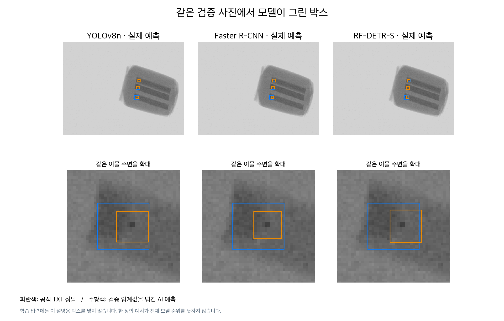

위 예시는 검증 데이터셋 중 YOLO의 대응 박스 IoU가 가장 낮은 사진을 선택한 것이다. 파란색은 공식 TXT, 주황색은 실제 모델 예측이다. 설명선은 학습 사진에 그려 넣지 않는다.

현재 비교는 같은 사진·20epoch를 사용하지만 모델별 옵티마이저와 업데이트 수가 같은 실험은 아니다. 이후 데이터 증강 비교에서는 YOLO의 실제 업데이트를 740회로 고정한 새 기준선을 사용한다. 초기 모델 비교와 그 기준선을 섞어 성능 향상으로 해석하지 않는다. 모델별 추론 장치가 달랐으므로 이번 기록의 시간으로 속도 순위를 정하지 않는다. 한 번의 학습·양성 시험편 중심 검증 결과이므로 실제 정상 제품의 오경보율이나 공장 전체 성능으로 확대하지 않는다.

근거: `reports/preds_v2_roadmap_*_val_custom_ap_v2_eval.json`, `reports/roadmap_20261002/localization/`, `runs/v2_roadmap_*/execution.json`.

이 문서는 기존 docs/07·09~14·18의 모델·환경·평가 설명을 통합했다. 과거 후보와 수치는 [이전 문서 모음](../archive/문서정리_20261002/이전문서모음.md)에 보존했다.


## 9. 주지표 보완과 테스트 평가

2026-10-02 사용자 요청으로 테스트 결과를 보기 전에 주지표를 IoU 0.5 이상의 이물 단위 F1로 고정했다. 기존 8픽셀 또는 IoU 0.3의 결과는 초기 탐색 지표로 보존한다. 검증 최고 F1로 모델별 탐지 임계값을 정하는 것은 개발 절차이고, 그 점수만으로 최종 성능을 주장하지 않는다. 같은 임계값을 테스트에 고정 적용한다.

박스·신뢰도 점수·IoU·중복 예측의 쉬운 설명과 실제 재채점 결과는 [전처리 정리본 9절](19_데이터전처리_정리본.md)에 있다. 세 모델의 기존 검증 예측을 IoU 0.5로 재채점한 F1은 YOLOv8n 0.9753, Faster R-CNN 0.9835, RF-DETR-S 0.9712다. 기존 F1 1.0과 기준이 다르며 학습 성능 변화로 해석하지 않는다. 테스트 평가와 후속 증강 비교는 실행한 결과만 아래에 추가한다.

### 9.1. 실제 테스트 평가 완료

검증 임계값을 그대로 적용한 결과다. 테스트는 97장·이물 라벨 225개이며, 기본 학습 데이터셋으로 학습한 세 체크포인트를 실제 추론에 사용했다. 모델 선택용 순위는 테스트로 정하지 않는다.

| 모델 | 검증 IoU 0.5 F1 | 테스트 IoU 0.5 F1 | 테스트 TP / FP / FN | 기존 완화 기준 테스트 F1 |
|---|---:|---:|---|---:|
| YOLOv8n | 0.9753 | 0.9710 | 218 / 6 / 7 | 0.9978 |
| Faster R-CNN | 0.9835 | 0.9710 | 218 / 6 / 7 | 0.9978 |
| RF-DETR-S | 0.9712 | 0.9644 | 217 / 8 / 8 | 1.0000 |

위치·크기가 기준에 못 미친 박스는 예측 하나의 FP와 정답 하나의 FN으로 함께 셀 수 있다. 따라서 IoU 기준의 FN 전체를 ‘이물 주변에 아무 예측도 없었다’고 해석하지 않는다. 테스트에도 실제 정상 제품 사진이 없으므로 공장 정상 제품 오경보율은 미검증이다. 근거: `reports/roadmap_20261002/official_test_comparison.json`, `reports/preds_v2_roadmap_*_test_iou50_v1_eval.json`.

### 공장 적용 시 코드 사용 조건

현재 설치 패키지의 메타데이터는 Ultralytics 8.4.158의 AGPL-3.0, torchvision 0.23.0의 BSD, RF-DETR 1.11.1의 Apache License 2.0을 표시한다. Ultralytics 공식 문서는 AGPL-3.0과 Enterprise 사용 조건을 별도로 안내한다. 공장 시스템에 통합할 때는 실제 배포 코드와 가중치의 조건을 함께 검토한다. 공개 패키지라는 사실만으로 어떤 배포 방식도 조건 없이 가능하다고 판단하지 않는다.

출처: 설치 패키지 metadata와 [Ultralytics YOLOv8 공식 안내](https://docs.ultralytics.com/models/yolov8/), [torchvision LICENSE](https://github.com/pytorch/vision/blob/main/LICENSE).


## 10. 전처리·의사 라벨 효과 비교 완료 — 2026-10-02

**기존 8조건·740회 업데이트 비교에서 가장 좋았던 데이터 조건은 사진 전체 자르기·회전이다. 전체 혼합과 충분한 학습 이후의 최종 선택은 아직 완료하지 않았다.** 같은 YOLOv8n과 고정된 검증 107장·243개로 아래 조건을 비교했다. 주 지표는 IoU 0.5 이상 일대일 대응 F1이며, 각 조건의 검증에서 탐지 임계값을 정했다. 테스트 점수로 이 조건을 고르지 않았다.

| 학습 조건 | 학습 사진 | 검증 F1 | TP / FP / FN |
|---|---:|---:|---|
| 기본 학습 데이터셋 | 296 | 0.9567 | 232 / 10 / 11 |
| 사진 자르기·회전 추가 | 1,181 | 0.9918 | 241 / 2 / 2 |
| 이물 전부 제거 추가 | 378 | 0.9547 | 232 / 11 / 11 |
| 이물 일부 제거 추가 | 389 | 0.9671 | 235 / 8 / 8 |
| 자르기·회전·이물 제거 | 1,356 | 0.9877 | 240 / 3 / 3 |
| 막대 밖 이물 추가 | 591 | 0.9773 | 237 / 5 / 6 |
| 의사 라벨 추가 | 1,098 | 0.9877 | 240 / 3 / 3 |
| 자르기·회전 + 의사 라벨 | 1,983 | 0.9794 | 238 / 5 / 5 |

모든 조건은 시드 0, 배치 8, 실제 최적화 업데이트 740회, 업데이트별 동일 학습률 일정(0.001에서 0.00001)을 사용했다. 마지막 배치 크기에 따라 실제 사진 노출은 조금 달랐으며 실행 기록에 남겼다. 이는 초기 세 모델의 20epoch 비교와 구분되는 통제 실험이다. 초기 YOLO 검증 F1 0.9753과 위 기본 조건 0.9567은 학습률 일정·누적 설정이 다른 실행이므로 같은 실행의 값처럼 바꿔 쓰지 않는다.

740회의 기준은 기본 학습 사진 296장을 배치 8로 나누어 20epoch 학습하는 양과 같다. 즉 296÷8×20=740회이며, 반복해서 본 사진 수는 296×20=5,920회다. 다른 조건도 같은 업데이트 예산에서 비교해 실제 사진 노출 수가 조건당 5,830~5,920회가 됐다. 이 숫자는 최적의 학습량이나 학습 완료를 입증하는 기준이 아니라 1차 비교를 위한 제한된 학습 예산이다. 20epoch 자체가 최적임을 찾은 실험도 하지 않았다. 사진 수가 큰 조건은 더 적게 반복하므로, 충분히 학습한 뒤에도 현재 순위가 유지되는지는 별도로 확인해야 한다.

- 자르기·회전 조건은 기본 조건보다 높았다. 1,181장(기본 296 + 자르기 295 + 회전 590)을 다음 공통 모델 비교의 자료로 선택했다. 탐지 임계값은 0.5285427이다.
- 의사 라벨 단독 추가는 기본 조건보다 높았지만, 자르기·회전에 의사 라벨을 함께 추가하면 자르기·회전만 한 경우보다 낮았다. 생성한 802장을 모두 최종 학습에 넣지는 않는다. 자료 수 증가가 자동으로 성능 향상을 보장하지 않는 실제 관찰이다.
- 이물 전부 제거 추가는 기본 조건보다 낮았고, 일부 제거 추가는 높았다. 제거를 자르기·회전에 더한 조건은 자르기·회전만 한 조건보다 낮았다.
- 막대 밖 이물 추가는 기본 조건보다 높았다. 따라서 ‘효과가 없었다’거나 ‘가설이 틀렸다’고 쓰지 않는다. 다만 최고 점수인 자르기·회전보다 낮아 현재 선택 자료에는 포함하지 않았다. 자르기·회전과 합쳤을 때의 추가 효과는 이번 8조건에 없으므로 확인하지 않았다고 명시한다.

이는 하나의 시드와 검증 분할에서 관찰한 결과다. 반복 학습의 편차·통계적 유의성·새로운 실제 혼입 이물 일반화를 입증하지 않는다. 분할 비율 최적화와 Group K-fold는 추가 실행하지 않았다.

자르기 295장과 회전 590장은 기본 학습 사진 296장 중 공식 라벨 누락 의심 1장을 제외한 295장에서 만들었다. 각 사진에서 자르기 1장, 사진 전체를 +7.5도와 -7.5도로 돌린 2장을 만들었다. 이 비교는 자르기와 회전을 묶어서 넣은 효과이며 각각의 독립적인 효과는 아직 측정하지 않았다. 이물 일부 제거 93장은 이물 3개 중 1개를 지우고 남은 2개 라벨을 유지했다. 전부 제거 82장은 합성 음성 자료이며 실제 정상 제품 사진이 아니다.

**후속 모델 비교 전 보완할 학습량:** 현재 선택된 YOLO는 740회 업데이트, 실제 5epoch 결과다. 현재 실행 대기 코드의 Faster R-CNN과 RF-DETR은 20epoch여서 그대로 비교하면 학습 사진은 같아도 반복해서 배운 양은 다르다. 재개 시 선택 데이터 1,181장으로 YOLO도 20epoch 학습한 비교를 추가하는 것을 권장한다. 기존 8조건 결과는 증강 효과 실험으로 보존하고, 20epoch 모델 비교와 구분한다. 같은 epoch여도 모델별 배치·최적화 방식·계산량까지 동일해지는 것은 아니므로 실제 업데이트·시간을 함께 적는다. 이 보완은 아직 실행하거나 큐 코드에 반영하지 않았다.

사용자 이동 일정에 따라 이 비교까지만 완료했다. 선택 자료에서 Faster R-CNN·RF-DETR을 학습하고 같은 데이터 조건의 최종 테스트·속도 비교를 마친 후 최종 모델을 추천한다. 현재 테스트 결과 표(9.1)는 기본 학습 자료로 학습한 초기 모델의 결과이며, 위 선택 자료의 최종 결과가 아니다.

근거: `reports/roadmap_20261002/ablation_results.json`, `dataset_selection.json`, `ablation_completion_check.json`. 8개 모델 체크포인트의 SHA-256과 실제 검증 추론에 사용한 가중치 확인값이 모두 일치했다.


## 11. 모든 전처리 자료를 합쳐 세 모델을 학습하는 전략 — 2026-10-03 연구 정리

**권장: 전체 혼합 데이터셋을 정식 비교 후보로 추가하고 세 모델 모두에서 평가한다.** 이 절은 문헌·현재 파일 검사를 바탕으로 한 설계 제안이다. 전체 혼합 데이터셋의 학습 실행이나 성능 확인은 아직 하지 않았다.

**후속 범위 조정:** 사용자는 시간 제약 때문에 아래 9개 비교를 모두 하지 않고, 기존 전체 혼합 또는 의사 라벨 증강 확대안 중 하나만 골라 세 모델을 학습하기로 했다. 최신 선택안과 환경 비교는 12절을 따른다. 이 절의 넓은 비교 설계는 연구 근거로 보존한다.

### 11.1. 왜 지금까지 전부 합치지 않았나

기존 8조건은 어떤 처리가 도움이 되는지 짧은 공통 학습 예산으로 파악하려는 1차 실험이었다. 하지만 전체 혼합은 그 실험 목록에 없었다. 의사 라벨이나 합성의 일부 조합 결과만으로 전체 혼합의 결과를 추론할 수 없다. 또한 YOLO에서 나온 순위를 Faster R-CNN과 RF-DETR의 순위로 일반화할 수 없다. 따라서 자르기·회전 선택은 기존 8조건 안에서의 잠정 결과이며, 전체 혼합을 배제할 근거가 아니다.

여러 방법을 합치자는 제안과 개별 방법의 효과를 확인하는 실험은 함께 사용할 수 있다. 전체 혼합으로 최종 성능을 확인하고, 비교 실험으로 그 결과가 어떻게 달라지는지 설명하면 된다.

### 11.2. 합칠 대상은 8개 목록에 반복된 사진을 정리한 2,453장

1~8번은 서로 다른 8종 재료가 아니라 재료를 조합한 8개 학습 목록이다. 기본 사진은 8개 목록에 모두 있고 자르기·회전은 2·5·8번에 중복된다. 5번과 8번은 별도의 새 처리 방법이 아니다.

| 합칠 구성 | 서로 다른 이미지 수 | 8개 목록을 그대로 합칠 때 각 이미지의 반복 |
|---|---:|---:|
| 기본 학습 데이터셋 | 296 | 8회 |
| 사진 일부 자르기 | 295 | 3회 |
| 사진 전체 회전 | 590 | 3회 |
| 이물 전부 제거 | 82 | 2회 |
| 이물 일부 제거 | 93 | 2회 |
| 막대 밖 이물 합성 | 295 | 1회 |
| 자동 채택 의사 라벨 사진 | 802 | 2회 |
| 합계 | **2,453** | 그대로 나열하면 7,272항목 |

실제 연결 경로, 디코딩한 RGB 픽셀, 정규화한 TXT 좌표를 확인했다. 고유 경로·고유 픽셀 영상 모두 2,453개이며 서로 다른 경로 사이의 동일 영상이나 동일 영상의 상충 라벨은 발견되지 않았다. 기본 사진을 8번 등록하는 식의 우연한 반복은 제거하고, 특정 자료를 더 자주 보여 줄 필요가 있으면 그 비율을 명시해서 정한다.

원천 촬영 사진은 1,098장(기본 296 + 자동 채택 802)이며 파생 증강은 1,355장이다. 2,453장을 모두 새로 촬영한 독립 제품 사진으로 설명하지 않는다. 촬영 사진 사이에도 같은 촬영 묶음의 유사 장면이 있을 수 있다.

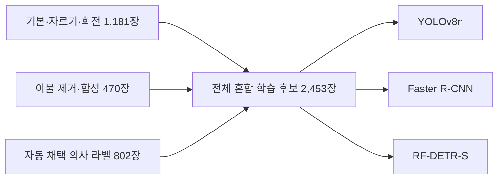
```mermaid
flowchart LR
 A["기본·자르기·회전 1,181장"] --> D["전체 혼합 학습 후보 2,453장"]
 B["이물 제거·합성 470장"] --> D
 C["자동 채택 의사 라벨 802장"] --> D
 D --> E["YOLOv8n"]
 D --> F["Faster R-CNN"]
 D --> G["RF-DETR-S"]
```

이는 서로 다른 처리 사진을 함께 학습한다는 뜻이다. 모든 사진에 이물 전부 제거→합성→자르기→회전을 순서대로 적용한다는 뜻이 아니다. 변환 사진은 현재 생성한 사진과 그에 맞게 바꾼 라벨을 사용한다. 검증 107장·테스트 97장은 합치지 않는다. 의심 698장·보류 400장도 자동 채택 사진에 섞지 않는다.

8개 조건의 검증·테스트 사진/TXT는 동일하며, 통합 후보와 평가 자료 사이의 원천 사진·촬영 묶음 누출 검사를 통과했다. 같은 입력 영상의 픽셀 중복도 발견되지 않았다. 이는 분할 검사이며 모든 학습 라벨이 정확함을 보장하는 검사는 아니다. 근거: `combined_data_union_audit.json`, `combined_data_union_fingerprints.json` 및 기존 inventory/augmentation/accepted 목록.

### 11.3. 문헌에서 확인한 내용과 우리 데이터에 적용할 판단

| 근거 | 확인한 내용 | 이번 프로젝트에 적용할 판단과 한계 |
|---|---|---|
| Goodfellow 등, *Deep Learning* (2016), 7.4절 | 증강의 일반화 효과와 정답 의미를 보존하는 변환, 모델 비교 시 같은 증강 정책 적용을 설명 | 공통 자료로 세 모델을 비교하는 근거. 우리 탐지 과제에서는 사진 변환에 맞춰 박스 좌표도 바꿔야 함 |
| *Dive into Deep Learning*, Image Augmentation 장 | 여러 영상 변환을 결합하고 학습 중 무작위 변환을 적용하는 구현을 제시 | 현재 저장된 변형 사진을 합쳐 시작하고, 후속으로 학습 중 새 변형을 만드는 온라인 증강을 검토 가능. RGB 색 변환이나 큰 자르기 범위를 X-ray에 그대로 복사하지 않음 |
| YOLOv4 기술보고서 (2020) | 여러 학습 기법을 조합하고 단독·조합 실험을 수행 | 여러 증강을 함께 쓰는 접근은 타당하나 모든 조합이 항상 유리한 것은 아님. 보고서의 모든 학습 기법을 증강이라고 부르지는 않음 |
| Simple Copy-Paste (CVPR 2021) | 크기 변화·객체 붙이기·의사 라벨 학습을 결합해 개선한 사례. 일부 다른 조합에는 개선이 없었으며 증강별 검증 성능이 정체될 때까지 학습 | 전체 혼합을 직접 시험할 근거. 740회만으로 충분한 학습 이후의 순위를 단정할 수 없음. 자연영상의 Mask R-CNN 계열 실험이므로 우리 X-ray 성능을 보장하지 않음 |
| STAC (2020) | 공식 라벨 자료로 학습한 모델이 만든 고신뢰 의사 라벨과 강한 증강을 결합해 탐지기를 학습 | 현재 저장된 의사 라벨 802장을 함께 사용하는 출발점과 유사. 우리 파이프라인이 STAC 전체를 구현한 것은 아님 |
| Soft Teacher (ICCV 2021), Unbiased Teacher (ICLR 2021) | 라벨/비라벨 혼합과 의사 라벨의 신뢰도·편향을 다룸. Soft Teacher는 분류 점수와 박스 위치 신뢰성을 구분 | 의사 라벨을 공통 자료에 넣되 출처·호기·위치 안정성을 관리하고 필요시 혼합 비율이나 손실 가중치를 조절. 논문의 클래스 편향을 우리 호기 편향과 동일한 문제로 단정하지 않음 |
| Kim 등, 포장식품 X-ray 이물 탐지 연구 (CMC 2021) | 실제 정상 식품 영상에 이물 영상을 합성하고 Mosaic와 함께 YOLO를 학습. 식품 내부 배치·X-ray 감쇠 특성을 고려하고 실제 촬영 평가 자료를 사용 | 합성과 다른 증강을 함께 쓴 관련 분야 연구 사례. 현재의 이물 무늬 합성이 같은 물리적 품질이라고 주장하거나, 실제 정상 평가 자료가 없는 우리 프로젝트의 공장 성능을 대신 입증할 수는 없음 |

1차 출처:

- [Deep Learning 7.4절](https://www.deeplearningbook.org/contents/regularization)
- [Dive into Deep Learning: Image Augmentation](https://classic.d2l.ai/chapter_computer-vision/image-augmentation.html)
- [YOLOv4 원문](https://arxiv.org/html/2004.10934v1)
- [Simple Copy-Paste 원문](https://arxiv.org/html/2012.07177v2)
- [STAC 원문](https://arxiv.org/abs/2005.04757), [저자 구현](https://github.com/google-research/ssl_detection)
- [Soft Teacher 원문](https://arxiv.org/abs/2106.09018), [공식 혼합·가중치 설정](https://github.com/microsoft/SoftTeacher/blob/main/configs/soft_teacher/base.py)
- [Unbiased Teacher 원문](https://arxiv.org/abs/2102.09480), [공식 구현](https://github.com/facebookresearch/unbiased-teacher)
- [Real-Time Anomaly Detection in Packaged Food X-Ray Images Using Supervised Learning](https://file.techscience.com/ueditor/files/TSP_CMC_67-2/TSP_CMC_14642/TSP_CMC_14642.pdf), DOI 10.32604/cmc.2021.014642

위 논문들의 결과는 해당 데이터와 구현에서 관찰된 것이다. 우리 프로젝트의 성능 상승을 예측한 숫자로 인용하지 않는다.

### 11.4. 권장 본실험: 세 모델 × 세 데이터 조건

| 학습 자료 | YOLOv8n | Faster R-CNN | RF-DETR-S |
|---|---|---|---|
| 기본 296장 | 기준 성능 | 기준 성능 | 기준 성능 |
| 기본 + 자르기·회전 1,181장 | 비교 | 비교 | 비교 |
| 전체 혼합 2,453장 | 비교 | 비교 | 비교 |

총 9개 조합으로 같은 모델에서 자료의 효과, 같은 자료에서 모델의 차이를 비교한다. 기본 296장의 기존 20epoch 결과는 보존한다. 새 본실험의 학습률·종료 규칙 등이 달라지면 기존 결과를 동일 조건 재실험인 것처럼 재사용하지 않고 필요한 기준 실험도 보완한다.

- **공통 자료와 평가를 고정한다.** seed 0, 원천 촬영 묶음 분할, 입력 크기 기준, 공식 TXT, 의사 라벨 목록, 평가 코드는 동일하게 유지한다. 배치 크기는 장치·모델에 맞추되 실제 배치·업데이트·사진 노출·시간을 보고한다. 모델별 적합한 학습률 차이는 기록한다.
- **학습 길이는 740회로 다시 자르지 않는다.** 전체 혼합 2,453장에 배치 크기 8로 이를 적용하면 약 2.41epoch에 불과하다. 검증 F1·위치 정확도와 학습 오차의 경과를 확인한다. 20epoch는 중간 확인 예시일 뿐 최적값이나 충분한 학습의 증거가 아니다. 최대 길이·검증 간격·개선 정체 시 종료 규칙을 실행 전에 정하고, 상한까지 개선 중이면 미수렴 한계를 적는다. 같은 epoch도 모델별 계산량·수렴 정도가 같다는 뜻은 아니다.
- **판단은 검증에서 한다.** 주지표 IoU 0.5 F1, 재현율·오탐, IoU 0.75 위치 정확도와 검사기별 결과를 함께 본다. 모델·데이터 조건별 탐지 임계값을 검증에서 정하고, 최종 선택을 고정한 뒤 테스트 97장에 적용한다. 테스트 결과를 보고 혼합 비율을 고르지 않는다. 검증 결과를 반복해서 선택한 낙관성과 이전 테스트 확인 이력을 적는다.
- **단일 YOLO 선별 규칙을 본실험과 구분한다.** 기존 평가 정책 JSON을 덮어쓰지 않는다. 본실험의 모델×자료 교차 비교와 선택 기준은 새 정책 버전으로 실행 전에 기록한다. 이번 연구 중에는 실행 정책을 바꾸거나 테스트를 새로 평가하지 않았다.

전체 혼합만 세 모델에 적용해 비교하는 최소안도 가능하다. 다만 그것만으로는 통합 자료가 기존 자료보다 도움이 됐는지 모델별로 설명하기 어렵다. 따라서 기존 기준을 유지한 위 표가 더 설득력 있는 연구 설계다. 모든 기법의 모든 조합을 전수 탐색할 필요는 없다.

### 11.5. 전체 혼합의 보완·발전 순서

**첫째, 단순 통합 자체를 먼저 시험한다.** 중복 정리한 2,453장을 보통의 무작위 순서로 학습하는 조건이 사용자의 가설을 직접 시험한다. 처음부터 비율·손실 가중치·새 증강을 동시에 바꾸면 원인을 해석하기 어렵다.

**둘째, 필요할 때 자료별 학습 비중을 조절한다.** 기본·자르기·회전은 1,181장, 이물 제거·합성은 470장, 의사 라벨은 802장이다. 각 출처를 기록한 채 사진을 뽑는 빈도나 의사 라벨이 학습 오차에 기여하는 비중을 별도로 조절할 수 있다. 공식 라벨 자료를 매번 일정량 포함하거나 의사 라벨의 영향력을 낮추는 것은 검증할 후보이지 보편적 정답이 아니다. Soft Teacher와 Unbiased Teacher의 실제 배치 비율·손실 정의도 서로 달라 특정 숫자를 그대로 복사하지 않는다. 여러 비율을 무제한 탐색하지 않고 한 요소씩 제한적으로 비교한다.

**셋째, 검사기·부모 사진 쏠림을 확인한다.** 의사 라벨 802장은 1·2호기에서만 채택됐다. 합친 뒤 전체 F1이 좋아져도 3호기 성능이 나빠질 수 있으므로 호기별 미탐·오탐을 확인한다. 같은 부모 사진의 파생본을 너무 자주 보는 문제도 출처별 표본 추출로 완화할 수 있다. 현재 자료에 없는 3호기 의사 라벨을 비율 조정만으로 만들어 낼 수는 없다.

**넷째, 유망한 모델에서 온라인 증강·교사 갱신을 검토한다.** 온라인 증강은 학습 중 사진 전체 자르기·회전을 새로 뽑고 박스 좌표도 함께 바꾸는 방식이다. 저장된 동일 변형만 반복하지 않는 장점이 있지만, 세 모델 비교 시 동일한 변환 규칙과 원천 자료를 유지해야 한다. 교사 모델을 학습 중 갱신하는 Soft Teacher 계열은 추가 연구 방향이며 이번 비교를 위해 반드시 먼저 구현해야 하는 조건은 아니다.

현재 실제 정상 제품 평가 사진은 없다. 이물 전부 제거 82장이 학습에 도움을 줄 수는 있어도 공장의 정상 제품 오경보율이나 실제 제조 이상 확률이 검증됐다고 말할 수 없다.

### 11.6. 실행 비용의 변화

기존 296장·20epoch 실측에 자료 수 비율을 곱하면 전체 혼합 2,453장·20epoch는 YOLO MPS 약 19분, Faster R-CNN CPU 약 7시간 53분, RF-DETR MPS 약 3시간 3분으로 추정된다. 세 모델 순차 학습만 약 11시간 15분이다. 자르기·회전 조건의 세 모델 비교까지 새로 하면 두 데이터 조건 6개 학습에 약 16시간 40분으로 계산된다. 새 실측이 아니며 추론·분석·제출 자료·학습 연장·기준 실험 보완은 별도다.

이 전략에는 이전 1,181장 기준 전체 마무리 7~9시간 안내를 그대로 적용할 수 없다. 특히 Faster R-CNN이 시간을 많이 쓰므로 본실험을 재개할 때 Colab 등 CUDA 장치에서 짧게 실행해 실제 속도를 확인할 가치가 커졌다. Colab이 무조건 빠르거나 세션이 유지된다는 보장은 하지 않으며, 이번에는 연결·업로드·학습을 시작하지 않았다.

근거: `reports/roadmap_20261002/combined_training_research_proposal.json`, `combined_data_union_audit.json`, `runs/v2_roadmap_*/execution.json`. 연구 제안과 실제 실행 완료는 구분한다.


## 12. 의사 라벨 증강과 한 가지 자료 조건의 본실험 — 2026-10-03 선택 전 검토

사용자는 기존 전체 혼합 2,453장 또는 의사 라벨 사진에도 증강한 확대안 중 하나만 선택하고, 같은 자료로 세 모델을 학습하기로 했다. 현재는 사용자 선택 전이다. 추가 학습·데이터 생성·GPU 대여·결제·업로드는 하지 않았다.

### 12.1. 의사 라벨 사진에도 증강할 수 있나

할 수 있다. STAC처럼 고신뢰 의사 라벨과 증강을 결합한 탐지 연구가 있다. 다만 증강은 AI가 붙인 라벨의 오류를 고쳐 주지 않는다. 특히 이물을 지우거나 복사하는 처리는 사진에서 무엇이 실제 이물인지 더 정확히 알아야 한다.

| 방법 | 의사 라벨 사진에 적용할 판단 | 구체적인 이유 |
|---|---|---|
| 사진 일부 자르기 | 확대안을 선택하면 우선 적용 가능 | 기록된 박스가 모두 남도록 가로·세로 80~95% 영역을 자르고 원래 크기로 확대한다. 박스도 함께 이동·확대한다. 알려지지 않은 누락까지 보존을 보장하지는 않는다. |
| 사진 전체 회전 | 확대안을 선택하면 우선 적용 가능 | ±7.5도로 돌리고 박스 네 꼭짓점도 회전한다. 영상 밖으로 나가는 박스가 있는 변환은 제외한다. |
| 이물 전부 제거 | 이번 확대안에서는 권하지 않음 | AI가 놓친 이물이 있다면, 표시된 점만 지우고 빈 라벨을 주어 남은 이물을 배경으로 학습시킬 위험이 있다. 현재 제거 검사는 지정한 박스 주변의 잔여 무늬 검사다. |
| 이물 일부 제거 | 이번 확대안에서는 보류 | 802장 중 박스 1개 사진은 662장이다. 하나를 지우면 전부 제거와 같아 일부 제거 대상이 아니다. 박스 3개인 140장만 현재 규칙상 후보이며, 누락·잔여 이물 검사는 별도로 필요하다. |
| 막대 밖 이물 합성 | 이번 확대안에서는 보류 | 잘못 탐지한 무늬를 복사하거나 기존 누락을 유지할 수 있다. 이미 공식 라벨 사진에서 만든 합성 295장이 전체 혼합에 포함돼 있다. 추가 합성의 현실성과 효과는 미검증이다. |

검사한 박스 개수는 의사 라벨 TXT에 기록된 개수다. 802장 실제 이물 개수의 독립적인 확인 결과가 아니다. 기존 공식 라벨에서 만든 제거·합성 자료는 유지하고, 위험 판단은 의사 라벨에서 새로 만들어 범위를 넓히는 경우에 관한 것이다.

좌표만 검사했을 때 802장 모두 자르기 80%·95% 크기와 ±7.5도 회전의 경계 조건을 통과했다. 자르기 1장과 회전 2장씩 만들면 2,406장 추가, 전체 4,859장 후보가 된다. 실제 영상은 생성하지 않았고 영상 품질·중복 검사는 아직이므로 최종 장수는 생성 후 확정한다. 원천 촬영 사진은 1,098장으로 같다.

단순 무작위 추출 시 의사 라벨에서 유래한 사진 비중도 802/2,453=32.69%에서 3,208/4,859=66.02%로 늘어난다. 모델 오차에 대한 영향은 박스 수·손실 계산에도 달려 있어 이 비율을 정확한 손실 비중이라고 부르지 않는다. 자료를 늘린 효과와 의사 라벨 비중 변화가 함께 생긴다는 의미다. 잘못된 라벨이 있다면 파생본에도 이어지고, 현재 1·2호기에만 채택된 의사 라벨의 비중도 커진다.

### 12.2. 이번에는 어떤 안을 권하나

**권장안 A: 기존 전체 혼합 2,453장 하나로 세 모델을 학습한다.** 의사 라벨 802장도 이미 포함돼 있다. 확인된 자료 구성으로 모델 비교에 학습 시간을 집중하고, 아직 효과·품질을 확인하지 않은 의사 라벨 파생본은 이번 학습에 추가하지 않는다. A의 성능이 B보다 높다는 실험 결과가 있어서 고른 것은 아니다. 시간 제한과 라벨 불확실성을 고려한 우선순위다.

**대안 B: 확대안을 원한다면 자르기·회전만 추가한 4,859장 후보를 사용한다.** 의사 라벨에 전부 제거·일부 제거·합성까지 일괄 적용하지 않는다. 사용자 선택 시 영상 생성·좌표·잔여 의심점·중복을 검사하고 실제 장수를 고정한 뒤 세 모델에 같은 목록을 준다. A와 B를 모두 학습하지 않는다.

한 자료 조건의 YOLOv8n, Faster R-CNN ResNet50-FPN v2, RF-DETR-S 비교는 대회의 2개 이상 모델 비교 요구에 맞는 설계다. 세 모델은 사전학습 가중치에서 각각 새로 파인튜닝한다. seed 0·검증 107장·테스트 97장·IoU 0.5 주지표를 유지한다. 검증에서 모델·체크포인트·탐지 임계값을 결정하고 테스트로 선택을 바꾸지 않는다. 최대 epoch와 검증 간격·종료 규칙은 장치 실측과 사용자가 정한 예산에 맞춰 실행 전에 고정한다. 740회 업데이트를 본실험 상한으로 복사하지 않는다.

한 공통 자료만 쓰므로 새 결과는 그 자료에서의 모델 성능 비교다. 추가 증강 때문에 성능이 올랐다는 인과적 주장이나 전체 혼합이 최적이라는 주장은 하지 않는다. 기존 8조건 결과는 짧은 예산의 1차 비교로 구분해 보존한다.

### 12.3. 맥북·Colab·GPU 대여 비교

2026-10-03 공식 공개 자료를 확인했다. 실제 GPU 재고와 계정별 혜택, 결제 화면의 최종 가격은 확인하지 않았다.

| 환경 | 확인된 비용·조건 | 판단 |
|---|---|---|
| 현재 맥북 | 대여비 없음. 저장 실행에서 YOLO·RF-DETR은 MPS, Faster R-CNN은 CPU | 이미 실행된 경로지만 Faster CPU가 병목이며 잠자기 중 계산을 지속할 수 없음. 추가 지출을 피하고 오래 켜 둘 수 있을 때 적합 |
| Colab 무료·유료 | GPU 종류·가용량·실행 시간은 보장되지 않음. Pro+는 충분한 CU가 있을 때 최대 24시간 연속 실행. 한국 계정 현재 요금은 로그인 때문에 확인 못함 | 짧은 실습이나 이미 가진 CU 활용에 적합. 마감 전 무인 학습의 지속성을 가장 중요하게 보면 별도 GPU 대여가 명확함 |
| RunPod Secure Cloud On-Demand | RTX 4090 24GB $0.74/h, A5000 24GB $0.27/h, A40 48GB $0.49/h, A6000 48GB $0.53/h 공개 가격 | 이번 유료 첫 후보는 RTX 4090 1대. GPU를 고정하고 세 모델을 순차 실행. 총비용 최적이나 메모리 충분성을 실측한 결과는 아님 |
| Vast.ai | 호스트별 변동 가격. 공식 RTX 4090 페이지에 이번 조회 당시 숫자 견적이 없어 확정 단가 미기재. 저장·전송료 별도 | 검증된 on-demand 호스트의 GPU·CPU·RAM·디스크·요금을 함께 비교할 때 대안 |
| Lambda | A6000 48GB $1.09/h, A10 24GB $1.29/h, Quadro RTX 6000 24GB $0.69/h 공개 가격 | RunPod 재고가 없을 때 검토. GPU 이름·세대를 구분하고 실제 속도와 총비용은 별도 측정 |

RunPod는 Spot이 아닌 On-Demand를 첫 후보로 삼는다. Spot의 중단 가능성을 피하려는 선택이며 서버 장애까지 없다는 보장은 아니다. 저장공간 요금은 별도이며 Pod를 정지해도 보관한 volume 요금은 남을 수 있다. 가격이 더 낮은 A5000이 전체 작업 비용도 더 낮을지는 학습 시간에 따라 달라진다.

RunPod 원격 서버에서 연결과 프로세스를 분리해 실행하면 노트북의 인터넷 끊김·잠자기 중에도 학습이 진행되도록 구성할 수 있다. 모델 사이 전환도 원격 실행 스크립트가 맡는다. 지금 그렇게 실행한 상태는 아니다. 결과·체크포인트 보관, 종료 후 GPU 과금 중지까지 실행 계획에 포함해야 한다.

Google은 2026-09-22 Google AI 구독에 Colab 혜택을 순차 제공한다고 발표했다. 이미 Google AI 또는 Colab 유료 구독이 있다면 실제 계정의 CU·GPU 혜택을 먼저 확인할 가치가 있다. 모든 계정에 적용 완료됐다고 가정하지 않는다. 이 세 번의 학습만을 위해 현재 원화 가격도 확인하지 않은 새 구독을 먼저 권하지 않는다.

### 12.4. 시간과 비용을 어떻게 판단하나

기존 로컬 296장·20epoch 기록의 자료 수 비례 추정에서 A안 세 모델은 약 11시간 15분, B안 4,859장 후보는 약 22시간 17분이다. 준비·추론·분석·제출물과 추가 학습은 별도이고 새 실측 시간은 아니다. 같은 epoch와 구현을 유지한 규모 비교에만 사용한다.

CUDA 환경의 실제 시간은 아직 모른다. 선택 후 각 모델 1~2epoch의 초/epoch, 검증 시간, 최대 GPU 메모리를 재고 전체 예산을 산정한다. RTX 4090이 맥북보다 몇 배 빠르다고 임의로 곱하지 않는다. 24GB를 초기 후보로 삼되 해상도·배치·최적화 상태를 포함해 검사하고, 기존 코드의 FP32 설정을 자동으로 바꾼 것처럼 설명하지 않는다. CUDA에서 AMP를 채택하면 별도 설정 변경과 유한 손실 검사를 기록한다.

RunPod 4090의 GPU 비용은 시간당 $0.74 기준 8시간 사용 예시 $5.92, 12시간 예시 $8.88이다. 8/12시간은 완료 예상 시간이 아니다. 저장공간·세금 등은 별도이며 실제 이용액과 계정에 미리 충전하는 돈도 구분한다. 사용자 선택과 예산 확정 전 대여·결제·업로드를 하지 않는다.

근거와 직접 출처:

- 데이터·좌표·규모 계산: `reports/roadmap_20261002/pseudo_augmentation_and_compute_options_20261003.json`, `pseudo/accepted.csv`, `scripts/xray_prepare_roadmap.py`, `scripts/xray_refine_removal.py`.
- [STAC](https://arxiv.org/abs/2005.04757), [Soft Teacher](https://arxiv.org/abs/2106.09018), [RF-DETR 학습·메모리 설정](https://rfdetr.roboflow.com/latest/learn/train/training-parameters/). RF-DETR 최신 문서의 예시는 설치된 버전·현재 자료에서의 보장이 아니다.
- [RunPod 가격](https://www.runpod.io/pricing), [4090 종류별 가격](https://www.runpod.io/gpu-models/rtx-4090), [Pod 과금](https://docs.runpod.io/pods/pricing), [저장공간](https://docs.runpod.io/pods/storage/types), [잔액과 과금](https://docs.runpod.io/accounts-billing/billing).
- [Colab FAQ](https://research.google.com/colaboratory/faq.html), [Google AI 구독 혜택 발표](https://developers.googleblog.com/colab-is-now-part-of-your-google-ai-plan/).
- [Vast.ai 과금](https://docs.vast.ai/guides/instances/pricing), [RTX 4090 공개 조회](https://vast.ai/pricing/gpu/RTX-4090), [Lambda 가격](https://lambda.ai/instances), [Lambda 관리](https://docs.lambda.ai/public-cloud/on-demand/creating-managing-instances/).


## 13. 전체 혼합 2,453장 본학습 실행 — 2026-10-03

하나의 공통 학습 자료로 세 모델을 각각 20epoch 학습한다. 학습 사진 수가 큰 조건을 740업데이트에서 멈췄던 앞선 증강 비교와 구분한다. 시드는 0, 입력 크기는 512이며 추가 무작위 증강은 끈다. 모델별 기존 학습률과 배치(YOLO 8, Faster/RF 4)는 보존한다. 같은 epoch가 같은 계산량이나 업데이트 수를 뜻하지 않으며 20epoch의 수렴·최적성은 입증하지 않았다.

비교 체크포인트는 세 모델 모두 마지막 20epoch로 미리 정했다. 검증 데이터셋에서 IoU≥0.5 F1이 가장 높은 탐지 임계값을 정하고 테스트에는 그대로 적용한다. IoU≥0.75와 기존 기준은 보조 지표다. 테스트를 보고 모델·자료·임계값을 바꾸지 않는다. 실제 정상 제품 0장 및 이전 테스트 확인 이력의 한계를 유지한다.

YOLOv8n의 학습은 MPS에서 761.4844초에 완료됐다. IoU≥0.5 검증 F1은 0.9856263(TP240/FP4/FN3), 탐지 임계값 0.68106407을 그대로 적용한 테스트 F1은 0.9888641(TP222/FP2/FN3)이다. 이 문단은 먼저 완료된 YOLOv8n의 기록이다. 이후 세 모델 모두 학습·평가를 마쳤으며, 전체 결과는 13.2절에 있다. 최종 모델 선정은 아직 확정하지 않았다.

학습·중간 저장·평가 코드와 근거: `scripts/xray_train_resumable.py`, `scripts/xray_evaluate_run.py`, `reports/overnight_20261003/evaluation_policy.json`, `v2_mix2453_yolo_mps_evaluation.json`. Colab은 사용자 승인으로 Drive를 연결하고 매 epoch 재개 상태를 보존한다. 상세 진행은 docs/21을 따른다.


### 13.1. 실제 파인튜닝 설정을 읽는 방법

2026-10-03 실행 코드와 저장 설정을 대조했다. 세 모델 모두 사전학습 가중치에서 이물 탐지를 추가 학습한다. epoch는 학습 자료를 한 바퀴 사용하는 단위이며, 이번 목표는 모델마다 전체 혼합 2,453장을 20회 사용하는 것이다. 검증 107장과 테스트 97장은 학습 자료에 넣지 않는다. 입력 해상도 설정은 512이고, 모델별 리사이즈·패딩 방식은 다를 수 있다.

| 설정 | YOLOv8n | Faster R-CNN ResNet50-FPN v2 | RF-DETR-S |
|---|---|---|---|
| 목표 epoch | 20 | 20 | 20 |
| 미니배치 크기 | 8장 | 4장 | 4장 |
| 최적화 방법 | AdamW | AdamW | AdamW |
| 기준 학습률 | 0.001 | 0.0001 | 탐지 부분 0.0001, encoder 기준 0.000015 |
| 학습률 변화 | 첫 1epoch 준비 구간 후 선형 감소 | cosine 곡선에 따라 감소 | 이번 20epoch 동안 시간에 따른 감소 없음 |
| Weight decay | 0.0005 | 0.0001 | 0.0001 |
| 장치 | 맥북 MPS GPU | Colab Tesla T4 CUDA | 맥북 MPS GPU |

학습률은 틀린 예측을 줄이기 위해 모델 내부 숫자를 얼마나 크게 바꿀지 조절하는 값이다. 정확도나 탐지 임계값이 아니다. 같은 학습률이라도 모델·손실 함수·배치 구성에 따라 효과가 달라지므로, 숫자가 크다고 성능이나 학습 속도가 무조건 높아지는 것은 아니다. 이번 값들은 기존 실험 설정을 이어 사용했으며 최적값을 탐색해 입증한 결과는 아니다.

YOLOv8n의 실제 20번째 epoch CSV 학습률은 0.0000595다. 설정의 lr0×lrf=0.00001은 스케줄의 목표 끝값이며, 이를 마지막 epoch에서 실제 사용한 값으로 쓰지 않는다. YOLO는 nbs=64 기본값에 따라 준비 구간 이후 미니배치 8개, 약 64장의 기울기를 모아 한 번 갱신한다. 따라서 batch8이 곧 매 8장마다 가중치를 갱신한다는 뜻은 아니다.

RF-DETR-S는 이미 학습된 영상 특징을 크게 바꾸지 않도록 encoder에 더 작은 기준 학습률을 둔다. 계층별 계수(0.8)와 구성 요소 계수(0.7)가 추가 적용되어 모든 encoder 계층의 실제 학습률이 0.000015인 것은 아니다. 설치된 rfdetr 1.11.1의 기본 step 스케줄은 100epoch에 학습률을 줄이므로, 현재 20epoch 실행에서는 각 파라미터 그룹의 학습률을 유지한다. 이 설정은 수정하지 않았다.

Faster R-CNN은 후보 영역을 먼저 찾고 영역별 특징으로 이물 여부와 좌표를 다시 판단한다. 현재 구현은 작은 이물 후보를 찾도록 anchor 기준 크기를 8·16·32·64·128픽셀로 설정했다. 이는 설계 의도이며 작은 이물 탐지 성능 향상을 별도 비교로 입증했다는 뜻은 아니다. RF-DETR-S는 DINOv2 기반 Vision Transformer와 탐지 decoder를 사용하는 비교 모델이다.

모델별 손실 함수가 달라 loss 숫자를 서로 직접 비교하지 않는다. 20epoch가 같은 업데이트 수·계산량·수렴 정도를 의미하지도 않는다. 공통 비교는 정해 둔 평가 자료와 IoU≥0.5 기준으로 한다. 근거: `reports/overnight_20261003/training_settings_audit.json`, `scripts/xray_train_resumable.py`, `scripts/xray_model_io.py` 및 각 실행 폴더의 설정·CSV.


### 13.2. 전체 혼합 2,453장 학습·평가 완료 — 2026-10-03 확인

**세 모델 모두 20epoch 학습과 검증·테스트 평가를 완료했습니다.** 아래 수치는 저장된 평가 결과입니다. 이번 완료 확인에서는 학습이나 추론을 다시 실행하지 않았습니다.

| 모델 | 학습 장치 | 학습 시간 | 검증 F1 | 테스트 F1 | 테스트 TP / FP / FN |
|---|---|---:|---:|---:|---|
| YOLOv8n | 맥북 MPS | 12.69분 | 0.9856 | 0.9889 | 222 / 2 / 3 |
| Faster R-CNN ResNet50-FPN v2 | Colab T4 | 96.55분 | 0.9877 | 0.9867 | 222 / 3 / 3 |
| RF-DETR-S | 맥북 MPS | 170.10분 | 0.9877 | 0.9821 | 219 / 2 / 6 |

채점은 IoU ≥ 0.5의 이물 단위 일대일 대응 F1입니다. 검증 데이터셋은 107장·243개 정답 박스입니다. 테스트 데이터셋은 97장·225개 정답 박스입니다. 각 모델의 검증 데이터셋에서 탐지 임계값을 정했습니다. 테스트에는 그 값을 그대로 적용했습니다.

학습 시간은 실행 스크립트의 `seconds` 기록입니다. 데이터 준비와 환경 설치 시간은 포함하지 않습니다. 학습 장치가 다르므로 이 표의 시간으로 모델의 공장 추론 속도 순위를 정하지 않습니다.

Faster R-CNN과 RF-DETR-S의 검증 F1은 같습니다. 테스트 점수로 후보를 다시 고르지 않습니다. 최종 선정에는 검증 오류 사례, 같은 장치의 추론 시간, 현장 사용 조건을 함께 검토해야 합니다. 실제 정상 제품의 오경보율은 아직 검증하지 못했습니다.

로컬 체크포인트와 예측 파일을 확인했습니다. 2026-10-03 사용자 지시로 Faster R-CNN의 모델·예측·평가·로그 20개 파일을 맥북에도 보관했습니다. Drive의 파일 크기와 다운로드 크기가 일치합니다. 다운로드본과 프로젝트 복사본의 SHA-256도 일치합니다. 체크포인트를 CPU에서 읽어 20epoch 상태와 모델 가중치의 엄격한 구조 일치를 확인했습니다. 이 과정에서 학습이나 추론을 다시 실행하지 않았습니다. 모델 설명과 그림은 작성했지만, 최종 선정 근거·재검사 기준·제출 서류는 아직 완료하지 않았습니다. 사용자 진행 지시에 따라 오탐·미탐 사례와 같은 장치의 속도를 추가로 확인합니다. 결과는 아래 14절에 기록합니다.

근거: `reports/overnight_20261003/completion_audit.json`, `local_queue.json`, `cloud_completion_source.json`, `v2_mix2453_*_evaluation.json`. 원격 평가 JSON은 Drive의 평가 로그에 출력된 전체 내용을 읽어 보존했습니다.


## 14. 실제 오탐·미탐 사진과 같은 맥북의 처리 시간

### 14.1. 무엇을 확인했나

전체 혼합 2,453장으로 학습한 세 모델의 **검증 107장·테스트 97장**을 확인했다. 모두 **라벨 제공 데이터셋**에 속한다. 학습용 의사 라벨 802장을 다시 검수한 작업은 아니다. 저장된 예측을 기존 `xray_eval.py`로 재채점했고, 기존 TP·FP·FN·F1이 모두 재현됐다. 오류가 있는 서로 다른 사진 15장을 전부 확대해 확인했다.

채점은 계속 **IoU ≥ 0.5, 정답 하나와 예측 하나의 일대일 대응**을 사용한다. 검증에서 고른 탐지 임계값도 유지했다. YOLOv8n은 0.68106407, Faster R-CNN은 0.999992, RF-DETR-S는 0.7691675다. 점수의 분포가 모델마다 다르므로 임계값의 크기로 모델의 정확도를 비교하지 않는다.

### 14.2. ‘미탐’도 두 경우로 나뉜다

**박스 불일치:** 모델이 이물 근처에 박스를 그렸지만, 위치나 크기가 정답 박스와 충분히 겹치지 않는다. 이 경우 정답은 FN 1개, 대응되지 않은 예측은 FP 1개로 센다. 서로 다른 이물을 두 개 잘못 찾았다는 뜻이 아니다. 같은 장소에서 생긴 한 번의 박스 불일치가 두 집계에 함께 들어간다.

**탐지 임계값 미달:** 정답과 충분히 겹치는 예측 후보가 있어도 탐지 점수가 임계값보다 낮으면 제외한다. 최종 출력에는 해당 박스가 없으므로 FN으로 센다. 겹치는 후보가 저장됐다는 사실만으로 실용적으로 잘 찾았다고 해석하지 않는다. 매우 낮은 점수의 후보도 있기 때문이다.

아래 표에서 미탐의 두 분류를 더하면 전체 FN이다. 이는 오류 설명을 위한 분류이며 TP·FP·FN의 채점 규칙을 바꾸지 않는다.

| 자료 | 모델 | TP | FP | FN | FN 중 박스 불일치 | FN 중 임계값 미달 | 오류가 있는 사진 |
|---|---|---:|---:|---:|---:|---:|---:|
| 검증: 정답 이물 243개 | YOLOv8n | 240 | 4 | 3 | 3 | 0 | 4장 |
| 검증: 정답 이물 243개 | Faster R-CNN | 240 | 3 | 3 | 3 | 0 | 3장 |
| 검증: 정답 이물 243개 | RF-DETR-S | 240 | 3 | 3 | 3 | 0 | 3장 |
| 테스트: 정답 이물 225개 | YOLOv8n | 222 | 2 | 3 | 2 | 1 | 3장 |
| 테스트: 정답 이물 225개 | Faster R-CNN | 222 | 3 | 3 | 3 | 0 | 3장 |
| 테스트: 정답 이물 225개 | RF-DETR-S | 219 | 2 | 6 | 2 | 4 | 5장 |

‘근처’의 분석 기준은 기존 보조 기준인 중심 거리 8픽셀 이내 또는 IoU 0.3 이상이다. **이 기준으로 정답 처리를 한 것은 아니다.** 이번 박스 불일치 사례의 실제 중심 거리는 0.17~3.79픽셀, IoU는 0.4052~0.4990이었다. 사진에서도 정답과 예측이 같은 작은 점 주변에 있는 것을 확인했다. 이를 설명할 때도 공식 채점의 FP·FN은 그대로 유지한다.

### 14.3. 실제 사진으로 이해하기

아래의 파랑 실선은 **공식 TXT의 정답 박스**, 주황 실선은 **임계값을 통과한 예측 박스**다. 보라 점선은 **임계값 미달로 제외된 예측 후보**다. 모두 설명을 위해 덧그린 선이며, 원본의 **색 네모**와 다르다. 가운데 선 없는 확대 사진은 실제 모델 입력이다. 사진 픽셀이나 라벨은 바꾸지 않았다.

**사례 A — 점 근처를 찾았지만 박스가 작다.** 검증 사진 `001_20200629_082834(2)`에서 세 모델 모두 같은 정답을 놓친 것으로 채점됐다. 공식 TXT 박스는 20×18픽셀이다. 세 모델은 약 12~13픽셀 크기의 박스를 냈다. 따라서 IoU가 약 0.41~0.48에 머물렀다. 학습된 박스 크기와 공식 라벨의 경계 차이를 추가로 조사할 가치가 있지만, 이 사진만으로 원인이나 라벨 오류를 확정하지 않는다.

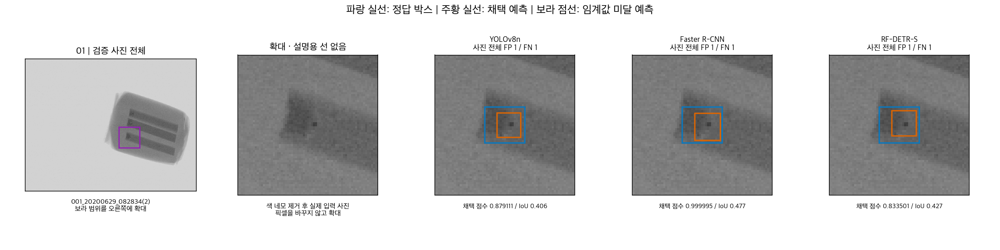

**사례 B — 박스는 겹치지만 점수가 낮아 제외됐다.** 테스트 사진 `001_20200831_123316(5)`의 YOLO 후보는 IoU 0.7855다. 위치 기준은 통과한다. 그러나 탐지 점수 0.6244955가 고정 임계값 0.68106407보다 낮아 최종 출력에서 제외됐다. 테스트 결과를 보고 임계값을 낮추지 않았다.

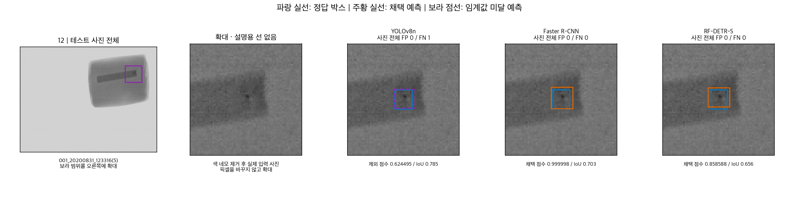

RF-DETR-S의 테스트 미탐 중 네 개도 임계값 미달이다. 이 중 세 후보의 점수는 약 0.761~0.767이며, 다른 한 후보는 약 0.011로 매우 낮다. 따라서 네 개 모두 임계값을 조금만 낮추면 해결된다고 말할 수 없다. 임계값을 낮추면 다른 오탐도 함께 늘 수 있다.

**사례 C — 공식 TXT에 없는 위치에 박스를 그렸다.** 검증 사진 `002_20200625_042957(3)`에서 YOLO는 막대의 희미한 어두운 무늬에 추가 박스를 냈다. 그 위치에는 공식 TXT 정답이 없으므로 FP다. 실제 이물인지, 제품 무늬인지, 영상 잡음인지는 확정하지 못했다. 해당 예측 영역에는 지운 색 네모 픽셀이 없었고 원본·처리 후 RGB도 같았다. 이 국소 사례를 색 네모 제거가 만든 흔적이라고 설명할 근거는 없다. 공식 라벨은 유지했다.

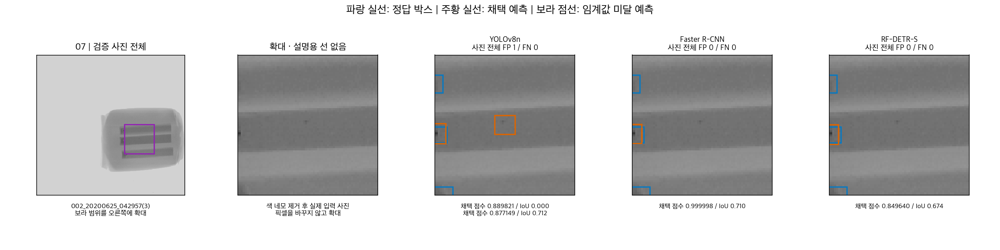

전체 15장 비교: [사례 1~3](../reports/overnight_20261003/diagnostics/figures/error_gallery_01.png), [4~6](../reports/overnight_20261003/diagnostics/figures/error_gallery_02.png), [7~9](../reports/overnight_20261003/diagnostics/figures/error_gallery_03.png), [10~12](../reports/overnight_20261003/diagnostics/figures/error_gallery_04.png), [13~15](../reports/overnight_20261003/diagnostics/figures/error_gallery_05.png). 여러 예측이 있는 확대 사진의 점수 목록은 저장 예측의 점수 순서다.

### 14.4. 어떤 조건에서 오류가 있었나

검증에서 8픽셀 이하 정답은 10개였다. YOLO와 RF-DETR-S는 각각 1개, Faster R-CNN은 0개를 놓쳤다. 반대로 다른 크기의 이물에서도 오류가 발생했다. 이 작은 표본으로 ‘Faster R-CNN이 모든 작은 이물에 더 우수하다’고 결론 내리지 않는다.

검증에서 세 모델이 공통으로 놓친 정답은 사례 A의 한 개다. 이 사진의 정답은 작기만 한 경우가 아니라 20×18픽셀이다. 이물 크기만으로 오류를 설명할 수 없다. 영상 대비, 배경 모양, 라벨과 예측 박스 경계를 함께 봐야 한다. 이번 분석은 관측된 오류를 분해한 것이며, 특정 전처리가 오류를 만들었다는 인과적 실험은 아니다.

| 자료·호기 | 정답 이물 수 | YOLO 미탐 | Faster R-CNN 미탐 | RF-DETR-S 미탐 |
|---|---:|---:|---:|---:|
| 검증 1호기 | 90 | 0 | 1 | 0 |
| 검증 2호기 | 71 | 1 | 0 | 1 |
| 검증 3호기 | 82 | 2 | 2 | 2 |
| 테스트 1호기 | 80 | 1 | 1 | 3 |
| 테스트 2호기 | 81 | 0 | 1 | 0 |
| 테스트 3호기 | 64 | 2 | 1 | 3 |

숫자는 이물 개수다. 호기별 미탐을 더하면 앞 표의 FN이다. 호기마다 촬영 조건과 사진 구성이 다르고 오류 수도 적으므로, 특정 호기가 원인이라고 단정하지 않는다. 크기·대비별 전체 분모와 미탐 수는 `recall_conditions.csv`에 저장했다. 대비는 주변 밝기와 이물 중심 밝기의 차이로 계산한 영상 지표이며 실제 재료 특성의 측정값이 아니다.

공장에서는 ‘박스를 정확히 그렸는가’와 ‘제품을 재검사로 보냈는가’도 구분해야 한다. 단순히 채택 박스가 하나라도 있으면 재검사한다고 가정하면, 검증에서는 세 모델 모두 107장에 박스가 있었다. 테스트에서는 YOLO와 RF-DETR-S가 각각 96/97장, Faster R-CNN이 97/97장에 박스를 냈다. 다만 **모든 사진에 이물이 있으므로 정상 제품의 오경보율은 알 수 없다.** 이 수치는 재검사 정책의 예시 집계이며 최종 공장 판정 기준이나 정상·이상 분류 정확도가 아니다.


### 14.5. 같은 맥북 GPU에서 측정한 처리 시간

**Apple M5 Pro의 MPS GPU**에서 세 모델을 차례로 실행했다. 같은 검증 사진 107장을 각각 3번 처리했다. 모델마다 321회, 합계 963회다. 모델을 읽는 시간과 첫 준비 추론 3회씩은 제외했다. 학습을 다시 한 것은 아니다.

| 모델 | 한 장 평균 | 한 장 중앙값 | 한 장 P95 | 평균 시간의 역수: 장/초 |
|---|---:|---:|---:|---:|
| YOLOv8n | 10.3 ms | 8.7 ms | 16.9 ms | 96.97 |
| Faster R-CNN | 1286.6 ms | 1286.8 ms | 1314.4 ms | 0.78 |
| RF-DETR-S | 29.1 ms | 29.0 ms | 31.6 ms | 34.42 |

1,000ms는 1초다. P95는 측정된 처리 시간의 약 95%가 그 값 이하였다는 뜻이다. 예를 들어 Faster R-CNN의 한 장 평균은 약 1.29초다. ‘장/초’는 배치 1에서 평균 시간을 뒤집은 값이다. 카메라 촬영·컨베이어·통신을 포함한 실제 생산 처리량은 아니다.

측정 조건은 배치 1, 해상도 설정 512, FP32, CPU 보조 스레드 6개다. 사진 읽기 → RGB 변환 → 모델별 크기 조정 → 추론 → 예측 후처리 → CPU 배열 변환 → 고정 탐지 임계값 적용까지 쟀다. GPU가 실제 작업을 끝낸 뒤 타이머를 멈췄다. 모델 가중치가 실제 `mps:0`에 있고 FP32인 것도 확인했다. 색 네모 제거와 공장 장비의 통신 시간은 제외했다.

세 모델의 해상도 설정은 같지만 내부 크기 조정·여백 추가 방식은 다르다. 따라서 계산량이 같은 비교는 아니다. 현재 공통 입력을 각 모델의 기존 실행 코드로 처리할 때의 시간 비교다. 모든 연산이 GPU에서만 실행된다고 보장하지도 않는다. MPS 미지원 연산의 CPU 대체를 허용하고 CPU 후처리까지 포함했다.

YOLO의 세 반복 평균은 12.8·9.1·9.1ms였다. 준비 추론을 제외해도 첫 반복에서 더 느린 호출이 있었다. Faster R-CNN은 1,292.9·1,280.8·1,286.0ms, RF-DETR-S는 29.1·29.2·28.8ms였다. 한 번의 맥북 세션에서 측정했으며 발열·다른 프로그램 부하를 완전히 통제하지 않았다.

추가 배포 최적화는 적용하지 않았다. YOLO의 기존 추론 경로는 내부 레이어 결합을 사용하고, RF-DETR은 설치된 패키지의 일반 FP32 추론 경로를 사용한다. RF-DETR 패키지에서도 추가 추론 최적화가 가능하다는 안내가 나왔다. 따라서 이 값은 **현재 실행 코드와 맥북의 결과**이며 모델 아키텍처 자체의 보편적 속도 순위가 아니다. 다른 NVIDIA GPU나 배포 형식에서는 별도 측정이 필요하다.

반복마다 각 사진에서 채택한 박스 수가 기존 검증 예측과 같았다. 이는 박스 수의 확인이며 모든 좌표·점수가 비트 단위로 같다는 확인은 아니다. 위 오류 분석과 F1은 원래 저장 예측을 재채점한 결과이고, 속도 측정에서 낸 예측으로 이를 교체하지 않았다.

### 14.6. 이번 분석으로 판단할 수 있는 것

검증에서 세 모델의 재현율은 같다. Faster R-CNN과 RF-DETR-S는 TP 240·FP 3·FN 3으로 같고, YOLO는 추가 FP가 하나 더 있다. 다만 오류가 난 사진은 모델마다 다르다. 이 적은 차이와 단일 학습 시드만으로 특정 아키텍처가 일반적으로 우수하다고 입증할 수 없다.

맥북의 현재 실행에서는 YOLO가 가장 빠르고 RF-DETR-S가 그다음이다. Faster R-CNN은 같은 검증 F1의 RF-DETR-S보다 훨씬 느렸다. 맥북 배포를 가정하면 속도 측면에서 불리하다는 근거다. 공장 장치가 NVIDIA GPU라면 이번 MPS 측정을 그대로 적용하지 않는다.

후속 최종 선정에서는 **검증 성능·지연 시간 요구·실제 배포 장치·정상 제품 오경보율**을 함께 판단한다. 테스트 오류 사진은 결과의 한계를 설명하는 자료로 사용한다. 이번 분석을 보고 테스트 점수가 유리해지는 모델·임계값을 새로 고르지 않는다. 최종 모델과 공장 재검사 기준은 아직 확정하지 않았다.

재현에 사용하는 파일:

- 오류 재채점·분류: `scripts/xray_analyze_errors.py` → `reports/overnight_20261003/diagnostics/error_audit.json`, `errors.csv`, `ground_truth_detail.csv`, `selected_predictions.csv`, `recall_conditions.csv`.
- 사진: `scripts/xray_error_figures.py` → `figure_manifest.json`, `figures/`. 직접 확인한 설명은 `visual_review.json`, TXT 없는 예측의 원본 비교는 `unmatched_prediction_inspection.json`.
- 속도: `scripts/xray_benchmark_completed.py` → `benchmark_mps.json`, `benchmark_mps.log`. 같은 출력을 덮어쓰지 않도록 새 실행 시 `--out`으로 다른 파일을 지정한다.

공식 TXT·고정 분할·학습 가중치·기존 예측 CSV는 유지했다. 새 학습과 탐지 임계값 조정은 실행하지 않았다.


## 15. 최종 모델 선정안과 지표별 비교

### 15.1. 오탐·미탐 분석을 왜 했나

오탐·미탐 분석 전에도 세 모델의 테스트 평가는 완료돼 있었다. 실제 순서는 **학습 → 검증에서 탐지 임계값 선택 → 고정 임계값으로 테스트 평가 → 저장된 검증·테스트 예측의 오류 사진 분석**이다. 오류 분석에서는 새 학습을 하지 않았고, 저장 예측의 점수를 다시 확인했다.

대상은 테스트 데이터셋만이 아니라 검증 107장과 테스트 97장이다. FP·FN의 개수를 세는 것은 수치 평가의 일부다. 이후 사진 분석은 그 숫자가 왜 생겼는지 설명하는 작업이다. 예를 들어 같은 FN이라도 모델이 이물 근처에 박스를 냈으나 위치·크기가 불일치한 경우와, 겹치는 후보의 탐지 점수가 낮아 제외된 경우는 다르다. 한 번의 박스 불일치가 FP와 FN에 동시에 집계될 수도 있다.

이 구분은 대회의 조건별 미탐 분석, 모델의 한계 설명, 공장 재검사 기준 검토에 필요하다. 테스트를 처음 수행하기 위해 오류 분석을 한 것은 아니다. 오류 사진을 본 뒤 테스트가 유리해지는 임계값이나 모델을 찾는 데도 사용하지 않는다.

### 15.2. 같은 데이터 조건에서 비교한 실제 지표

세 모델 모두 같은 학습 자료 2,453장으로 20epoch 파인튜닝했다. YOLOv8n도 학습 전 가중치를 그대로 평가한 모델이 아니다. ‘베이스라인’은 비교의 출발점이라는 뜻이며, 다른 모델보다 성능이 낮아야 한다는 뜻은 아니다.

아래의 굵은 숫자는 해당 행의 최고 값이다. 처리 시간만 낮을수록 좋다. 정밀도·재현율·F1은 주지표인 IoU ≥ 0.5와 모델별 고정 탐지 임계값을 사용했다. 검증 107장·정답 이물 243개, 테스트 97장·정답 이물 225개다.

| 지표 | YOLOv8n | Faster R-CNN | RF-DETR-S |
|---|---:|---:|---:|
| 검증 정밀도 | 98.36% | **98.77%** | **98.77%** |
| 검증 재현율 | **98.77%** | **98.77%** | **98.77%** |
| 검증 F1 | 0.9856 | **0.9877** | **0.9877** |
| 검증 AP@0.5 | 0.9743 | 0.9801 | **0.9864** |
| 검증 AP@0.75 | 0.1905 | **0.2405** | 0.2157 |
| 테스트 정밀도 | **99.11%** | 98.67% | 99.10% |
| 테스트 재현율 | **98.67%** | **98.67%** | 97.33% |
| 테스트 F1 | **0.9889** | 0.9867 | 0.9821 |
| 테스트 AP@0.5 | **0.9880** | 0.9822 | 0.9835 |
| 테스트 AP@0.75 | 0.1335 | 0.1339 | **0.1688** |
| 맥북 한 장 평균 처리 시간 ↓ | **10.3ms** | 1286.6ms | 29.1ms |

#### 숫자를 읽기 전에: 무엇을 세는가

평가 단위는 **사진 장수 대신 이물 박스 개수**다. 한 사진에 이물이 세 개 있으면 정답도 세 개다. 예측을 채택할 만큼 탐지 점수가 높고, 정답 박스와 IoU 기준에 맞게 겹쳐야 탐지 성공으로 센다. 정답 하나는 한 예측하고만 대응한다.

| 용어 | 쉬운 설명 | YOLO 테스트의 실제 값 |
|---|---|---:|
| TP: True Positive | 정답 이물을 채점 기준에 맞게 찾음 | 222개 |
| FP: False Positive, 오탐 | 채택한 예측이 대응되는 정답을 얻지 못함 | 2개 |
| FN: False Negative, 미탐 | 정답 이물에 대응되는 채택 예측이 없음 | 3개 |

FP는 정답과 떨어진 곳을 표시했을 때도 생기고, 실제 이물 근처라도 박스 겹침이 부족할 때 생길 수 있다. 후자의 경우 정답 쪽에는 FN도 남는다. 이 설명은 공식 TXT 기준이며 원본의 색 네모와 구분한다.

YOLO 테스트 결과를 두 방향에서 보면 다음과 같다.

- **정답에서 출발:** 실제 정답 225개 → 찾은 이물 222개 + 놓친 이물 3개.
- **모델 출력에서 출발:** 채택한 예측 224개 → 맞는 예측 222개 + 대응되지 않은 예측 2개.

#### 정밀도·재현율·F1은 서로 다른 질문에 답한다

**정밀도(Precision)**는 ‘모델이 이물이라고 표시한 것 중 얼마나 맞는가?’를 뜻한다. `TP ÷ (TP + FP)`로 계산한다. YOLO는 `222 ÷ 224 = 99.11%`다. 정밀도가 높으면 채택 예측 중 오탐 비중이 작다. 다만 이물 사진만 있는 이번 평가로 실제 정상 제품의 오경보율을 알 수는 없다.

**재현율(Recall)**은 ‘실제로 있는 이물을 얼마나 빠뜨리지 않고 찾았는가?’를 뜻한다. `TP ÷ (TP + FN)`로 계산한다. YOLO는 `222 ÷ 225 = 98.67%`다. 이물 누락을 줄여야 하는 검사에서는 재현율을 중요하게 본다.

**F1-score**는 정밀도와 재현율을 함께 본 점수다. 조화평균 `2 × 정밀도 × 재현율 ÷ (정밀도 + 재현율)`을 사용하며, 둘 중 하나가 낮으면 점수도 내려간다. 박스 개수로는 `2TP ÷ (2TP + FP + FN)`이다. YOLO는 `444 ÷ 449 = 0.9889`다. 이는 이물 단위 탐지 점수이며 사진의 98.89%를 정확히 판정했다는 뜻이 아니다.

F1은 오탐과 미탐을 같은 비중으로 요약한다. 공장에서 미탐의 비용이 훨씬 크다면 F1만으로 결정하지 않고, 필요한 재현율을 먼저 만족하는지와 그때의 오탐 부담을 함께 봐야 한다. 그 공장 요구값은 아직 확정하지 않았다.

#### AP와 IoU: ‘어디에 그렸는가’와 ‘점수 순서가 좋은가’

**IoU(Intersection over Union)**는 정답 박스와 예측 박스의 **겹친 면적 ÷ 두 박스가 차지한 전체 면적**이다. 1이면 정확히 겹친다. IoU ≥ 0.5는 겹침이 50% 이상이어야 위치 기준을 통과한다는 뜻이다. 탐지 점수가 0.5 이상이라는 뜻이 아니다. 그림은 [전처리 정리본의 IoU·일대일 대응 설명](19_데이터전처리_정리본.md)을 참고한다.

**AP(Average Precision)**는 탐지 점수가 높은 예측부터 낮은 예측까지 차례로 받아들일 때의 정밀도·재현율 관계를 요약한다. 점수가 높은 예측이 잘 맞는지, 더 많은 이물을 찾으려 할 때 오탐이 얼마나 늘어나는지를 함께 반영한다. 여러 임계값의 정밀도를 단순히 더해 나눈 값은 아니며, 보간한 정밀도–재현율 곡선 아래 면적을 계산한다. 값은 0~1이고 높을수록 좋다.

- **F1:** 실제 사용할 하나의 탐지 임계값을 고정한 상태에서 정밀도·재현율을 요약한다.
- **AP@0.5:** 정답 대응에 IoU 0.5를 요구하고, 탐지 점수 기준을 변화시키며 전체 관계를 요약한다.
- **AP@0.75:** 정답 대응에 IoU 0.75를 요구한다. 박스 위치·크기를 더 정확히 맞혀야 한다.

따라서 검증 F1이 같은 Faster R-CNN과 RF-DETR-S도 AP는 다를 수 있다. 선택한 임계값에서 TP·FP·FN은 같아도, 전체 후보의 탐지 점수 순서와 다른 임계값에서의 오탐·미탐은 다를 수 있기 때문이다.

표의 AP는 프로젝트의 기존 채점 코드가 계산한 all-points AP다. COCO mAP@[0.5:0.95]와 다르므로 공개 벤치마크의 mAP 숫자와 직접 비교하지 않는다.

#### 처리 시간은 정확도와 별개다

처리 시간(Latency)은 사진 한 장의 예측을 끝내는 데 걸린 시간이다. `1,000ms = 1초`이며 낮을수록 빠르다. 이번 표는 모델별 검증 사진 107장×3회의 평균이며 사진 읽기·예측·후처리를 포함한다. 색 네모 제거·촬영·공장 통신은 제외한다. 평균만으로 최악의 지연을 알 수 없으므로 14.5절에 P95도 함께 적었다. P95는 측정된 처리 시간의 약 95%가 그 값 이하였다는 뜻이다.


**주지표의 테스트 F1·AP@0.5와 맥북 속도에서는 YOLO가 가장 높거나 빠르다. 그러나 모든 지표에서 최고는 아니다.** 검증 F1은 Faster R-CNN·RF-DETR-S가 높고, 검증 AP@0.5는 RF-DETR-S가 높다. 더 엄격한 박스 겹침을 요구하는 AP@0.75는 검증에서 Faster R-CNN, 테스트에서 RF-DETR-S가 높다. 세 모델 모두 AP@0.75가 낮으므로, 정밀한 박스 경계까지 충분히 맞춘 모델이라고 주장하지 않는다.

기존 중심 거리 8픽셀 또는 IoU 0.3의 완화 기준에서는 테스트 F1이 YOLO 0.9978, Faster R-CNN 1.0000, RF-DETR-S 0.9910이었다. 이는 보조 결과이며 주지표 IoU 0.5를 대체하지 않는다. 채점 기준에 따라서도 우위가 달라질 수 있다.

테스트에서 YOLO와 Faster R-CNN은 TP 222·FN 3으로 같고 FP만 2개와 3개로 다르다. F1 차이는 약 0.22%p다. RF-DETR-S는 TP 219·FN 6이며 YOLO와의 F1 차이는 약 0.68%p다. 통계적 우월성을 검증한 결과로 표현하지 않는다.

### 15.3. 현재 조건의 모델 선정안: YOLOv8n — 추가 검토 중

**현재 20epoch 실험과 맥북 처리 시간을 함께 고려하면 YOLOv8n을 우선 후보로 추천한다.** 2026-10-03 후속 연구에서 기존 체크포인트 재검증과 추가 후보를 제안했으며, 모델의 최적 성능까지 비교한 결론은 아니다(16절). 이는 Codex의 선정안이며 사용자 확정 결정과 구분한다. 공장 장치와 허용 지연 시간은 아직 정해지지 않았으므로, 실시간 검사에 유리하도록 처리 시간을 중요한 고려사항으로 둔 판단이다.

선정 근거는 검증 결과와 같은 장치의 측정값이다.

1. 검증에서 세 모델 모두 TP 240·FN 3이다. 현재 주지표에서 YOLO의 이물 재현율은 다른 두 모델과 같다.
2. YOLO는 검증 FP가 하나 더 많아 F1이 약 0.20%p 낮다. 이 손해를 숨기지 않는다.
3. 현재 맥북에서는 YOLO가 RF-DETR-S보다 약 2.82배, Faster R-CNN보다 약 124.76배 빠르다. 정확한 계수는 측정 JSON에 있으며 다른 장치에 일반화하지 않는다.
4. 따라서 관측된 검증 성능 차이와 처리 시간의 균형을 선택 이유로 삼는다. ‘테스트 F1이 가장 높으므로 골랐다’는 이유는 사용하지 않는다.

속도보다 **검증 F1·AP를 최대화하는 것**을 우선한다면 RF-DETR-S가 더 적절한 후보가 된다. 검증 F1이 Faster R-CNN과 같고 AP@0.5가 더 높으며 현재 맥북에서 더 빠르기 때문이다. 더 엄격한 박스 위치 정밀도를 우선할 경우에는 검증 AP@0.75에서 Faster R-CNN의 장점도 고려해야 한다. 모든 목적에 하나의 모델이 우수한 결과는 아니다.

정상 제품 오경보율, 새 생산 조건에서의 성능, 실제 공장 장치 속도는 아직 확인하지 못했다. 동일한 20epoch가 모든 모델의 충분한 학습이나 최적 설정을 보장하지도 않는다. 이번 선정안은 현재 데이터·학습 설정·측정 환경에 대한 결론이다.

**기록상 한계:** 이번 선정안 작성 전에 세 모델의 테스트 수치와 오류 사진이 이미 공개됐다. 따라서 제출 서류에 ‘테스트를 전혀 보지 않고 최종 모델을 먼저 확정한 후, 최초의 독립 테스트를 수행했다’고 쓰면 안 된다. 검증·속도를 추천 근거로 제시하더라도 테스트 열람 이력은 공개한다. 테스트 점수를 보고 학습·탐지 임계값을 추가 조정하지 않았다.

제출 서류에 활용할 선정 근거 문장 초안:

> 동일 학습 자료로 YOLOv8n, Faster R-CNN, RF-DETR-S를 파인튜닝하여 비교하였다. IoU 0.5 기준 검증 재현율은 세 모델이 같았다. YOLOv8n의 검증 F1은 추가 오탐 한 건으로 약 0.20%p 낮았으나, 동일 맥북 환경에서 가장 짧은 처리 시간을 보였다. 이에 검증 성능과 처리 시간의 균형을 고려하여 YOLOv8n을 최종 모델 후보로 제안한다. 실제 공장 적용을 위해서는 정상 제품 오경보율과 대상 장치의 처리 시간을 추가로 검증해야 한다.

이 문장은 사용자 확정 뒤 ‘선정하였다’로 갱신한다. 테스트 열람 이력과 평가 절차는 별도 방법론 문단에 함께 적는다.

근거: `reports/overnight_20261003/v2_mix2453_*_evaluation.json`, `diagnostics/benchmark_mps.json`, `diagnostics/model_selection_comparison.json`. 이번 작업은 저장 결과의 비교·해석이며 새 학습·추론·채점을 실행하지 않았다.


## 16. 베이스라인보다 설득력 있는 결과를 만들기 위한 추가 연구

2026-10-03 사용자 요청으로 대회 원문, 기존 학습 기록, 논문·공식 구현을 대조했다. **이번에는 조사와 저장 자료 분석만 했다. 새 모델 학습·추론이나 임계값 조정은 실행하지 않았다.**

### 16.1. 먼저 베이스라인의 출처를 구분한다

현재 원본 데이터 폴더에 있는 `yolov3_20201200.ipynb` 두 파일의 학습·탐지 명령은 `--cfg yolov3-spp.cfg`를 사용한다. 확인한 보관본의 제공 모델은 **YOLOv3-SPP**다. **YOLOv8n은 현재 프로젝트에서 비교 기준으로 사용한 모델**이며, 주최측 원본 코드의 모델이라고 단정하면 안 된다. 별도로 받은 다른 배포본이 있다면 그 내용은 별도 확인이 필요하다.

원본 노트북의 제공 모델과 프로젝트 비교 기준을 보고서에서 구별한다. YOLOv3-SPP를 공통 비교표에 넣는다면 현재와 같은 분할·전처리·채점으로 새로 재현해야 한다. 원본의 `weights/last.pt`는 어떤 사진을 학습했는지 이번에 확인하지 못했으므로, 그대로 가져와 독립적인 베이스라인 성능이라고 비교하지 않는다.

대회 안내문 4쪽은 베이스라인을 포함한 두 모델 이상 비교와 선정 이유를 요구한다. 결과보고서 양식 2~3쪽은 동일 평가조건의 차이를 설명하고, 새로운 알고리즘 사용 자체보다 성능·오류 감소·현장 활용 기여를 설명하도록 한다. 확인한 이 문구에는 반드시 최신 모델을 쓰거나 베이스라인을 이겨야 한다는 요구가 없다. 베이스라인으로 반드시 주최측 제공 모델을 써야 한다는 별도 요구도 이 문구만으로 확정하지 않는다. 심사위원의 개별 판단이나 점수는 예측할 수 없다.

### 16.2. 기존 실험에서 실제로 개선할 여지가 있는가

**첫째, 비교한 마지막 모델이 각 모델의 가장 좋은 상태였다고 입증하지 못했다.** 세 모델 모두 전체 혼합 2,453장으로 20epoch 학습했지만, 모델별 최적 학습률·종료 시점까지 탐색한 결과는 아니다. 배치와 최적화 방법도 달라 같은 epoch가 같은 계산량을 뜻하지 않는다. 기존 표는 공통 자료·정해진 학습량에서의 비교로 보존한다.

RF-DETR-S의 저장 이력을 읽으면 자체 검증 mAP@[0.5:0.95]는 **7번째 epoch에서 0.4311**, 마지막 **20번째 epoch에서 0.4077**이었다. `checkpoint_best_regular.pth`의 epoch도 실제로 7번째임을 확인했다. 기존 공통 평가에 사용한 것은 20번째 `last.ckpt`다. 따라서 이미 저장된 7번째 모델을 공통 검증 기준으로 다시 평가하는 것이 첫 번째 후속 실험이다. 공식 학습 안내도 최적 체크포인트와 EMA·조기 종료 사용을 설명한다. [RF-DETR 공식 학습 안내](https://rfdetr.roboflow.com/learn/train/)

이 mAP는 학습 라이브러리 자체 지표이며 프로젝트 F1·all-points AP와 다르다. 7번째 모델이 프로젝트 F1에서도 더 좋다는 결론은 아직 없다. 더 오래 학습하면 반드시 좋아진다는 뜻도 아니다. 체크포인트 선택을 적용한 비교는 기존 마지막 epoch 비교와 구분하고, 다른 모델에도 동일한 선택 원칙과 명시적인 탐색 예산을 적용한다.

**둘째, 검증 오류에는 박스 크기·위치 문제가 집중돼 있다.** 검증 107장의 정답 이물 243개에 대해 세 모델 각각의 FN은 3개다. 모두 근처에 채택된 예측이 있지만 IoU 0.5를 통과하지 못한 경우다. ‘이물이 존재하는지 전혀 몰랐다’와 ‘이물 근처를 찾았으나 박스를 맞추지 못했다’를 구분한다. 작은 물체에서 IoU가 작은 위치 오차에 민감하다는 연구도 있다. 이는 박스 예측을 개선할 근거이며, 공식 TXT를 임의로 수정하거나 평가 기준을 완화할 근거가 아니다. [NWD 논문](https://arxiv.org/abs/2110.13389)

**셋째, 모델끼리 보완할 여지는 제한적으로 있다.** 기존 검증 대응 기록에서 YOLO와 RF-DETR이 함께 놓친 정답은 2개, YOLO와 Faster R-CNN은 1개, 세 모델 모두는 1개였다. 각 모델의 FN 3개가 모두 같은 이물인 것은 아니다. 다만 이 분석은 정답을 알고 탐지 여부를 비교한 것이며, 합친 예측의 F1이나 배포 가능한 앙상블 성능은 아니다. 오탐 증가와 박스 중복 처리를 포함해 실제 검증해야 한다.

### 16.3. 새 모델을 하나만 추가한다면 D-FINE-S를 우선한다

**D-FINE-S를 1순위 추가 실험 후보로 제안한다.** HGNetv2 CNN 특징 추출기와 DETR 계열 Transformer 탐지부를 사용한다. ICLR 2025 논문의 핵심은 박스 경계를 한 번에 확정하기보다, 경계가 있을 법한 위치의 분포를 단계적으로 다듬는 FDR이다. 정교해진 위치 정보를 앞 단계에도 전달하는 자기 증류를 함께 사용한다. 현재 검증에서 확인한 박스 불일치를 직접 겨냥하는 선택이다. [D-FINE 논문](https://proceedings.iclr.cc/paper_files/paper/2025/hash/6cf58a87e3097e7d1f9be3e8693a93de-Abstract-Conference.html)

설명용 흐름: **X-ray → CNN으로 무늬 추출 → Transformer로 이물 후보 판단 → 박스 경계를 여러 단계로 보정 → 위치·탐지 점수**. 이 흐름은 원리 설명이며 우리 사진으로 실행한 결과가 아니다.

공식 저장소에 사전학습 가중치와 사용자 데이터 파인튜닝 방법이 있다. 우선 COCO 사전학습 S 모델을 같은 데이터로 시험하는 안을 제안한다. 공개 COCO AP나 T4 TensorRT 속도를 우리 F1·맥북 FP32 속도와 직접 비교하지 않는다. 코드와 사전학습 가중치의 이용 조건도 구분한다. 우리 X-ray에서의 향상은 미확인이다. [D-FINE 공식 구현](https://github.com/Peterande/D-FINE)

조사했지만 우선순위를 낮춘 후보는 다음과 같다.

| 후보 | 아키텍처·특징 | 현재 판단 |
|---|---|---|
| DEIMv2-S | DINOv3에서 지식을 전달받은 작은 ViT와 탐지부. 단일 크기 특징을 여러 크기의 특징으로 바꾸는 STA 사용 | 특징 표현 개선 후보. 현재는 검증 오류와 더 직접 연결되는 D-FINE을 먼저 제안 |
| YOLO26n/s | CNN 계열 YOLO. 작은 물체 학습용 STAL 등 포함 | 최신 CNN 비교가 필요할 때 후보. 새 이름을 쓰는 것만으로 차별성이나 성능을 보장하지 않음 |
| SAHI 방식의 분할 추론 | 사진을 겹치는 조각으로 나누어 탐지하고 좌표를 합침. 별도 아키텍처는 아님 | 큰 영상의 작은 물체에는 연구 근거가 있으나, 현재 작은 원본에서도 이득인지 불확실. 문맥 손실·중복 예측·지연 증가를 함께 확인해야 함 |

출처: [DEIMv2 논문](https://arxiv.org/abs/2509.20787), [DEIMv2 공식 구현](https://github.com/Intellindust-AI-Lab/DEIMv2), [YOLO26 공식 설명](https://docs.ultralytics.com/models/yolo26/), [SAHI 논문](https://arxiv.org/abs/2202.06934). 후보들을 모두 학습하자는 제안은 아니다.

### 16.4. 모델을 바꾸는 것 외의 개선안

**자료와 학습의 기여를 분리한다.** 사진 자르기·회전, 이물 제거, 합성, 의사 라벨의 단기 8조건 비교는 이미 있다. 전체 혼합 세 모델 학습은 모델 간 비교이지 전체 혼합이 최선임을 입증한 비교는 아니다. 최종 후보에서 ‘라벨 제공 학습 자료만’과 ‘선택한 증강·의사 라벨 포함’의 학습량·종료 규칙을 맞춰 추가 비교하면, 무엇이 성능에 기여했는지 더 설득력 있게 설명할 수 있다. 유리한 조건만 보고하지 않고 악화·동점도 남긴다.

**서로 다른 모델의 박스를 결합할 수 있다.** Weighted Boxes Fusion은 여러 모델의 박스를 점수로 가중해 합치는 방법이다. 위치 오차 개선의 후보지만, 우리 모델들의 탐지 점수 분포가 다르므로 숫자를 그대로 동일한 확률처럼 취급하면 안 된다. 저장된 검증 예측으로 먼저 검토할 수 있으며, 실제 운용 시에는 복수 모델 추론 비용도 든다. [WBF 논문](https://arxiv.org/abs/1910.13302)

**판정을 보류하고 재검사하는 운영을 설계할 수 있다.** 빠른 모델로 먼저 검사하고, 불확실하거나 서로 다른 모델의 결과가 어긋나는 사진을 정밀 모델·사람에게 넘기는 안이다. 낮은 점수의 박스만 재검사하면 아예 예측이 없는 미탐이 통과할 수 있으므로, 무검출을 자동 정상으로 취급하지 않는 규칙도 필요하다. 보류 가능한 예측의 위험과 처리 비율을 다루는 연구는 설계 참고가 된다. 객체 탐지 공장 시스템에서의 효과는 별도로 검증해야 한다. [SelectiveNet, ICML 2019](https://proceedings.mlr.press/v97/geifman19a.html)

현재 평가에는 실제 정상 제품 사진이 없다. 따라서 정상 제품 오경보율·재검사율·공장 불량 확률의 보정을 입증할 수 없다. 합성 음성 사진과 탐지 점수는 이를 대신하지 않는다. 새 모델 하나보다 이 한계를 명확히 관리하는 것이 현장 활용 근거를 강화할 수 있다는 판단이다.

### 16.5. 권장 실행 순서와 보고 원칙

아래는 최초 연구 제안이다. 2026-10-03 후속 회의를 반영한 현재 우선순위는 17.6절과 docs/21 2절을 따른다.

1. **기존 RF-DETR의 저장된 좋은 시점을 공통 검증으로 확인한다.** 학습 없이 가능한 첫 확인이다. 주지표는 기존 IoU 0.5 F1을 유지하고 AP@0.75는 박스 정밀도 보조 지표로 둔다.
2. **추가 학습을 한다면 D-FINE-S 한 모델부터 시험한다.** 데이터·분할·채점·탐색 예산과 체크포인트 선택 규칙을 먼저 기록한다. 학습 곡선을 보고 종료를 판단하되 모델마다 무제한으로 시행착오를 반복하지 않는다.
3. **최종 후보의 데이터 효과나 재검사 방법을 하나 골라 검증한다.** 추가 모델 수보다 확인된 개선과 실패 이유가 남는 실험을 우선한다. 같은 검증 자료에 반복 선택한 결과에는 낙관 편향 가능성을 밝힌다.
4. **실제 배포 장치의 지연 시간과 정상 제품 자료를 확인한다.** 현재 MPS의 속도 순위가 공장 CUDA 장치에서도 같다고 쓰지 않는다. 실제 정상 자료 확보 전에는 자동 통과 안전성을 주장하지 않는다.

기존 테스트 수치·오류 사진은 이미 열람했다. 후속 연구를 처음부터 블라인드 테스트로 설계한 실험이라고 소급 서술하지 않는다. 후속 선택에는 학습·검증만 사용하고, 가능하면 새로운 촬영 묶음의 별도 평가 자료로 마지막 확인을 한다. 기존 분할을 점수가 잘 나오는 쪽으로 다시 나누지 않는다.

추가 검증 뒤에도 YOLO가 가장 적합하다면, ‘베이스라인밖에 찾지 못했다’고 쓸 필요가 없다. **어떤 약점을 가정했고, 어떤 다른 구조·처리를 시험했으며, 개선 여부와 운용 비용을 어떻게 판단했는지**를 결과로 설명한다. 실제로 시행하지 않은 새 모델·앙상블은 실험 결과에 포함하지 않는다. 모델 이름을 바꾸거나 전처리만 바꾸고 새 아키텍처를 개발했다고 표현하지 않는다.

이번 조사 근거: `scripts/xray_model_research_audit.py`, `reports/model_research_20261003/research_audit.json`, `runs/v2_mix2453_rfdetr_mps/metrics.csv`, `reports/overnight_20261003/diagnostics/ground_truth_detail.csv`, 대회 안내·보고서 양식 원문. 최종 모델과 추가 학습 범위는 사용자 결정 전이다.

## 17. 회의 반영: 실패 조건과 제품 출하 위험을 중심으로 평가한다

2026-10-03 사용자 요청을 반영했다. 목표는 **이물을 놓치는 조건을 밝히고, 위험 제품이 자동 통과하지 않도록 판정 절차를 설계하는 것**이다. F1만 높이는 것보다 현장 과제에 직접 연결된다. 단, 현재 사진은 시험편 중심이며 정상 생산품이 없다. 설계 방향과 현장 검증 완료를 구분한다. D-FINE-S 추가 학습은 아직 실행하지 않았다.

### 17.1. 저장 모델 재검증의 의미

체크포인트(checkpoint)는 특정 학습 시점의 모델 상태를 저장한 파일이다. 7번째 epoch의 파일은 ‘학습 자료를 7번 반복한 시점의 모델’, 20번째 파일은 마지막 시점의 모델이다. 학습을 오래 했다고 검증 성능이 항상 높아지는 것은 아니다.

| 확인한 저장 시점 | RF-DETR 자체 검증 mAP@[0.5:0.95] | 현재 비교에 사용했는가 |
|---|---:|---|
| 7번째 epoch | 0.4311 | 아직 공통 평가에 사용하지 않음 |
| 20번째 epoch | 0.4077 | 기존 세 모델 비교에 사용 |

재검증은 **7번째 모델 불러오기 → 기존 검증 사진 107장 추론 → xray_eval.py로 채점 → 마지막 모델과 비교**다. 학습을 처음부터 반복하는 작업이 아니다. 이번에 실행한 것은 기존 마지막 모델의 저장 예측 재채점이며, 7번째 모델의 새 추론은 아직 하지 않았다.

2026-10-04에 세 모델의 전체 학습 기록을 확인했다. **YOLOv8n도 자체 검증 mAP가 7번째 epoch에서 가장 높았다.** 따라서 RF-DETR만 바꾸어 비교하지 않고 YOLO도 같은 원칙으로 확인한다. Faster R-CNN은 epoch별 검증 기록과 이전 저장 모델이 없어 같은 확인을 바로 할 수 없다. 구체적인 수치와 보완 계획은 17.7~17.8절에 적었다. RF-DETR 7번째 모델을 최종 모델로 선정했다는 뜻은 아니다.

공통 비교에서는 IoU 0.5 F1과 미탐 수를 확인한다. 박스 위치 정확도는 AP@0.75로 함께 본다. 학습 라이브러리의 mAP가 높다고 프로젝트 F1이나 제품 출하 안전성이 높다고 단정하지 않는다. 체크포인트를 고르는 기준은 추론 전에 고정하고, 다른 모델에도 같은 선택 원칙을 적용한다. 기존 ‘마지막 20epoch’ 결과는 보존한다. [RF-DETR 학습 안내](https://rfdetr.roboflow.com/learn/train/)

### 17.2. D-FINE-S를 시험할 근거와 입증하지 못한 부분

후보 선정의 논리는 **관찰한 문제 → 문제를 겨냥하는 모델 기능 → 비교 실험**이다. ‘베이스라인을 이기기 위해 모델을 더 찾았다’는 설명에 의존하지 않는다.

이번에 `scripts/xray_condition_audit.py`로 라벨 제공 학습 자료와 검증 자료를 다시 읽었다. 증강본과 의사 라벨은 이 탐색 분석에서 제외했다. 기존 탐지 임계값과 IoU 0.5 채점은 유지했다. 테스트로 구간이나 후보를 정하지 않았다.

숫자로 보기:

- 라벨 제공 학습 사진 296장, 정답 박스 679개.
- 학습 정답 박스의 긴 변 중앙값 11픽셀. 범위 6~21픽셀. 15픽셀 이하 643개.
- 검증 사진 107장, 정답 박스 243개. 세 모델 각각 TP 240개, FN 3개.
- 검증 FN 3개씩은 모두 근처에 채택된 예측이 있으나 IoU 0.5를 통과하지 못한 경우다. 모델별 FN을 합치면 서로 다른 정답 위치는 6개다.

위 크기는 원본 해상도에서 측정한 **TXT 정답 박스의 크기**다. 실제 이물의 직경이나 mm 단위가 아니다. 작은 박스는 몇 픽셀만 달라도 IoU가 크게 변할 수 있다. [NWD 연구](https://arxiv.org/abs/2110.13389)는 작은 객체에서 이 문제를 설명한다. 이 논문은 D-FINE-S의 X-ray 성능을 입증하는 자료는 아니다.

D-FINE-S는 **HGNetv2 CNN 특징 추출기 + Transformer 탐지부**를 쓴다. FDR(Fine-grained Distribution Refinement)은 박스의 네 경계가 있을 법한 위치 분포를 여러 단계로 보정한다. GO-LSD는 정교해진 위치 정보를 앞쪽 탐지 단계에도 전달하는 자기 증류다. 따라서 현재 관찰한 **작은 정답 박스의 위치·크기 불일치**를 줄일 후보로 시험할 근거가 있다. [D-FINE 논문, ICLR 2025](https://proceedings.iclr.cc/paper_files/paper/2025/hash/6cf58a87e3097e7d1f9be3e8693a93de-Abstract-Conference.html), [논문 방법 설명](https://arxiv.org/html/2410.13842v1)

설명용 흐름: **사진 → CNN으로 특징 추출 → Transformer로 후보 판단 → 박스 네 경계를 단계별 보정 → 예측 박스·탐지 점수**.

S 크기를 고른 이유는 위치 보정 기능과 처리 비용을 함께 검토하기 위해서다. 공식 저장소는 S 모델 약 10M 파라미터와 배치 1·T4·FP16·TensorRT 10.4.0의 지연 3.49ms를 제시한다. 이 수치는 시험할 가치가 있다는 참고 근거다. 우리 사진·맥북·공장 장치에서 측정한 시간이 아니다. 카메라 입력, 색 네모 처리, 제품 추적, 분리 장치 작동을 포함한 전체 지연은 별도로 확인해야 한다. COCO 사전학습 가중치부터 시험하며, 코드와 가중치의 이용 조건을 구분한다. [공식 구현·모델 표](https://github.com/Peterande/D-FINE)

파라미터(parameter)는 학습으로 조정하는 모델 내부 수치다. 10M은 약 1,000만 개다. D-FINE-S는 같은 계열에서 작은 모델에 속한다. N은 S보다 더 작다. N·S·M·L·X는 계열 내부의 크기 이름이며, 서로 다른 모델 계열에서 같은 크기나 속도를 뜻하지 않는다.

| D-FINE 크기 | 공식 파라미터 수 | 공식 연산량(GFLOPs) | 공식 T4 지연(ms) |
|---|---:|---:|---:|
| N | 4M | 7 | 2.12 |
| S | 10M | 25 | 3.49 |
| M | 19M | 57 | 5.62 |
| L | 31M | 91 | 8.07 |
| X | 62M | 202 | 12.89 |

출처는 위 공식 모델 표다(2026-10-04 확인). 지연은 동일한 공식 T4·FP16·TensorRT·배치 1 조건이다. 우리 프로젝트의 MPS 측정치와 직접 속도 순위를 매기지 않는다. 파라미터 수만으로 연산량, 중간 특징을 저장하는 메모리, 실제 지연을 알 수 없다.

**제조현장 적용을 시험할 후보로는 타당하다. 실제 적용에 적합한지는 아직 미확인이다.** 작은 규모와 경계 보정 기능은 후보 선정 근거다. 채택 근거는 실제 이물 제품의 통과 위험, 정상 제품의 재검사 부담, 사용할 장치의 전체 처리 지연·메모리·안정성으로 확보해야 한다. 현재 실제 정상 제품 자료와 현장 처리 시간 제한이 없으므로 적합성 확인을 완료할 수 없다.

**현재는 D-FINE-S가 더 적합하다고 입증하지 못했다.** 박스가 더 정확해져도 실제 이물 제품의 무경보 통과가 줄지 않을 수 있다. 이미 경보가 나는 제품의 박스만 개선하는 경우도 있기 때문이다. 추가 학습 여부와 채택 여부는 다음 기준으로 판단한다.

1. 같은 학습 자료·분할·공통 채점·명시한 실험 예산을 사용한다.
2. 조건별 FN과 AP@0.75를 확인해 위치 보정 가설을 평가한다.
3. 제품 단위 판정의 대용 지표와 실제 정상 자료의 오경보를 별도로 확인한다.
4. 감당할 수 있는 재검사량과 지연 안에서 위험 감소가 확인될 때 채택한다.
5. 개선이 없으면 그 결과를 남기고 기존 모델을 유지한다.

제출용 후보 선정 문장 초안:

> 라벨 제공 학습 자료의 정답 박스는 긴 변 중앙값이 11픽셀로 작았다. 기존 세 모델의 검증 오류에는 이물 근처를 예측했지만 정답 박스와 충분히 겹치지 않는 사례가 있었다. 이에 박스 경계를 단계적으로 보정하는 D-FINE-S를 추가 비교 후보로 선정하였다. 위치 정확도의 개선이 조건별 미탐과 제품 판정 위험의 감소로 이어지는지 함께 검증할 계획이다.

이 문장은 현재 **선정 근거와 실험 계획**이다. 학습 전에는 ‘성능을 개선하였다’ 또는 ‘공장에 적합함을 입증하였다’로 바꾸지 않는다.

### 17.3. 어떤 조건에서 실패하는지 분석하는 방법

크기·대비만 계산하던 진단에 박스 종횡비·주변 밝기·주변 밝기 변화량을 추가했다. 조건별 낮음·중간·높음의 경계는 **학습 자료의 25·75백분위**로 정했다. 검증 오류가 잘 모이도록 경계를 움직이지 않았다. 모든 구간의 정답 수·사진 수·촬영 묶음 수·FN을 저장했다.

| 조사할 조건 | 이번 자동 측정 | 해석 한계 |
|---|---|---|
| 작은 이물 | TXT 박스 긴 변 | 실제 이물 외곽·물리 크기와 다름 |
| 가장자리 이물 | 대략 분리한 제품 영역 경계에서 정답 중심까지의 거리 | 회색 막대의 경계가 아님. 제품 영역 분리가 틀리면 거리도 틀림 |
| 길쭉한 형상 | TXT 박스 긴 변 ÷ 짧은 변 | 실제 외곽의 형상 아님. 특이 형상은 별도 확인 필요 |
| 어두운 배경 | 정답 박스를 제외한 주변 픽셀 밝기 중앙값 | 주변 막대·제품 경계도 영향을 줌 |
| 복잡한 배경 | 같은 주변 픽셀 밝기의 표준편차 | 복잡도를 근사하며 원인을 확정하지 못함 |
| 낮은 대비 | 중심 5×5의 최소 밝기와 주변 21×21 중앙값의 차이 | 중심 위치와 다른 구조의 영향을 받는 근사치 |

이번 검증에서 확인한 예시:

| 검증 조건 | 정답 수 | YOLOv8n FN | Faster R-CNN FN | RF-DETR-S FN |
|---|---:|---:|---:|---:|
| 박스 긴 변 10픽셀 이하 | 92 | 1 | 1 | 1 |
| 낮은 대비: 밝기 차이 42.5 이하 | 55 | 1 | 1 | 1 |
| 비교적 긴 박스: 종횡비 1.2614 초과 | 36 | 1 | 0 | 0 |
| 밝기 변화량이 큰 주변: 표준편차 14.2349 초과 | 57 | 1 | 0 | 1 |

행은 서로 겹칠 수 있으므로 FN을 행끼리 합하지 않는다. 모델별 FN이 전체 3개뿐이다. 위 결과만으로 ‘작은 이물이나 복잡한 배경에서 미탐률이 높다’고 확정하지 않는다. 예를 들어 세 모델의 작은 박스 구간 FN은 1/92이고, 큰 박스 구간(13픽셀 초과)은 1/63이다. 작은 구간이 더 나쁘다는 가설을 현재 결과가 뒷받침하지 않는다.

세 모델이 공통으로 실패한 한 위치의 대비는 25로 검증 최저값이었다. 낮은 대비와 박스 경계 불일치를 함께 점검할 사례다. 한 사례가 실패 원인을 입증하지는 않는다.

자료의 범위도 확인했다. 학습·검증 TXT 박스 종횡비의 최대는 각각 약 1.86·1.83이다. 가늘고 긴 철사나 특이 형상의 성능을 대표한다고 볼 수 없다. 현재 제품 영역 근사 거리의 최솟값도 학습 약 38.1픽셀·검증 약 38.2픽셀이다. 제품 가장자리에 아주 가까운 사례가 충분한지 보장할 수 없다. 추가 자료가 없으면 해당 조건은 ‘평가하지 못함’으로 보고한다. 합성 사진 결과는 실제 사진 결과와 분리한다.

촬영 묶음 안 사진은 서로 비슷하다. 이후 차이의 불확실성을 계산할 때는 사진을 독립 표본처럼 처리하지 않고 촬영 묶음 단위 재표집을 사용한다. 조건을 많이 나누어 우연히 나쁜 한 구간을 골라 결론내리지 않는다. 호기별 결과와 함께 보고, 표본이 적은 구간은 수치와 표본 수만 제시한다.

### 17.4. 박스 미탐과 위험 제품 통과를 분리한다

**박스 단위 FN:** 정답 이물에 IoU 0.5 이상으로 대응한 예측이 탐지 임계값을 넘지 못한 경우다.

**제품 단위 위험 통과:** 실제 이물이 있는 제품을 최종 시스템이 PASS로 보낸 경우다. 박스 단위 FN과 같은 사건이 아니다. 현재에는 제품 추적 ID·공정 연결 기록이 없으므로 사진 단위 결과를 제품 단위의 대용 지표로만 사용한다.

예: 한 사진에 이물이 3개 있다. 모델이 2개만 찾으면 박스 FN은 1개다. 그러나 하나라도 찾아 제품을 출하에서 제외했다면 그 제품이 정상으로 출하된 것은 아니다. 반대로 무검출 사진을 PASS로 보내면 실제 이물 제품이 통과할 수 있다.

이번 재채점에서 세 모델 모두 검증 사진 107장에 임계값 이상 예측을 하나 이상 냈다. 그러나 각 모델이 IoU 0.5 이상 정답 대응을 하나 이상 확보한 사진은 106장이고, 모든 정답을 찾은 사진은 104장이다. **경보가 있었다는 사실은 모든 이물을 정확히 찾았다는 뜻이 아니다.** 정상 사진이 없으므로 이 경보 기록으로 공장 오경보율이나 자동 통과 안전성을 검증할 수 없다.

박스 FP도 정상 제품 오경보와 다르다. 이물 사진 안의 중복 박스나 위치가 어긋난 박스도 FP가 될 수 있다. 다음 지표를 분리해 보고한다.

| 지표 | 계산·목적 |
|---|---|
| 박스 미탐률 | FN ÷ 전체 정답 이물 수. 위치·탐지 성능 |
| 위험 제품 통과율 | 실제 이물 제품 중 PASS 제품 비율. 출하 차단 실패 |
| PASS 오염률 | PASS 제품 중 실제 이물 제품 비율. 실제 불량률에 영향받음 |
| 정상 제품 오경보율 | 실제 정상 제품 중 RE-INSPECTION 또는 REJECT 비율 |
| 전체 재검사율 | 전체 제품 중 RE-INSPECTION 비율. 생산량·실제 불량률·자료 구성에 영향받음 |
| 처리 지연 | 촬영부터 판정·분리 명령까지. 평균과 상위 지연(p95)을 함께 측정 |

현재 IoU 0.5 F1은 모델 비교 주지표로 보존한다. 운영 기준은 **위험 제품 통과를 최소화하면서 재검사 용량과 지연 제한을 만족하는지**로 별도 설계한다. F1 최대 임계값이 FN 위험 비용을 반영한 운영 임계값이라는 뜻은 아니다. FN을 더 중시하는 F2도 보조 지표일 뿐 공장 안전성 보증이 아니다.

허용 위험, 시간당 처리량, 재검사 인원·시간, 분리 지연 한계는 현장과 정해야 한다. 임의의 목표 재현율이나 FN:FP 비용 비율을 공식 기준처럼 제시하지 않는다. 식품 이물의 상해 위험은 FN 우선 관리의 근거지만, 미국 FDA 자료를 국내 공정의 법정 설정값으로 적용하지 않는다. [FDA의 단단하거나 날카로운 식품 이물 위험 설명](https://www.fda.gov/regulatory-information/search-fda-guidance-documents/cpg-sec-555425-foods-adulteration-involving-hard-or-sharp-foreign-objects)

### 17.5. PASS / RE-INSPECTION / REJECT는 조건부 설계로 둔다

탐지 confidence는 모델의 이물 후보 점수다. confidence 0.9가 실제 이물 확률 90%이거나 정상 확률 10%라는 뜻은 아니다. 사진의 최고 confidence도 바로 불량 확률이 되지 않는다. 확률로 보고하려면 대표성 있는 정상·이상 자료로 보정과 별도 평가가 필요하다. [확률 보정 연구, ICML 2017](https://proceedings.mlr.press/v70/guo17a.html)

정상 자료와 공정 검증 후의 설계는 다음과 같다. 재검사 임계값을 T_low, 분리 임계값을 T_high라고 하며 T_low < T_high로 둔다. 실제 값은 아직 정하지 않았다.

| 조건 | 판정 | 작업 의미 |
|---|---|---|
| 읽기·추론 실패, 영상 품질 불량, 검증 범위 밖 조건 | RE-INSPECTION | 판정을 보류하고 재촬영·기존 검사 절차로 보냄 |
| 유효한 영상에서 이물 점수가 T_high 이상 | REJECT | 자동 출하에서 제외·격리. 자동 폐기나 확정 정답을 뜻하지 않음 |
| T_low 이상 T_high 미만, 모델 간 불일치 등 | RE-INSPECTION | 추가 검사로 판단을 보완 |
| T_low 미만이며 정상 자료·독립 평가·영상 품질·적용 범위 조건을 모두 통과 | PASS 후보 | 현장 검증 후에만 자동 통과 허용 |
| 무검출 또는 낮은 점수인데 정상 통과 조건을 입증하지 못함 | RE-INSPECTION | 무검출을 정상의 증거로 사용하지 않음 |

**현재 자동 PASS는 비활성으로 유지한다.** 이는 완성된 생산 시스템이 아니라 검증 전 보류 정책이다. 모든 사진을 재검사하면 출하 위험은 줄일 수 있어도 생산성이 나빠질 수 있다. 따라서 이 정책만으로 성공했다고 보고하지 않는다. 재검사 후에도 미확정이면 격리를 유지한다. 재검사 수용량 초과·장치 오류 시 경보와 공정 대응은 현장 설비 절차로 정한다.

설명용 판정 흐름:

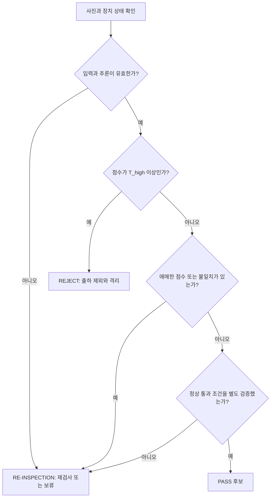
```mermaid
flowchart TD
    A[사진과 장치 상태 확인] --> B{입력과 추론이 유효한가?}
    B -- 아니오 --> R[RE-INSPECTION: 재검사 또는 보류]
    B -- 예 --> C{점수가 T_high 이상인가?}
    C -- 예 --> J[REJECT: 출하 제외와 격리]
    C -- 아니오 --> D{애매한 점수 또는 불일치가 있는가?}
    D -- 예 --> R
    D -- 아니오 --> E{정상 통과 조건을 별도 검증했는가?}
    E -- 아니오 --> R
    E -- 예 --> P[PASS 후보]
```

‘작은 이물을 놓친 사진’을 사후에 알아내는 분석에는 정답 라벨을 사용한다. 실제 운용 시에는 놓친 이물의 크기나 대비를 알 수 없다. 따라서 정답으로 만든 실패 조건을 그대로 자동 재검사 규칙으로 사용하지 않는다. 실제 규칙에는 관측 가능한 영상 품질, 장치 상태, 모델 간 불일치 등을 사용하고, 그 규칙이 미탐을 잡아내는지도 별도 평가한다.

판정 보류 방식은 selective prediction의 위험·자동 처리 비율 절충과 연결된다. SelectiveNet 논문은 이 설계의 참고다. 해당 논문은 우리 객체 탐지나 식품 공정에서의 효과를 입증하지 않는다. [SelectiveNet, ICML 2019](https://proceedings.mlr.press/v97/geifman19a.html)

### 17.6. 수정한 우선순위와 분석 재현

1. 조건 정의·자료 범위 확인과 기존 저장 예측 분석을 먼저 한다. 이번에 학습 기준 구간과 검증 탐색 분석을 완료했다.
2. 사용자 후속 지적을 반영해 세 모델의 공통 검증·저장 정책을 먼저 고정한다. 권장안은 세 모델을 같은 정책으로 20epoch씩 재실행하는 것이다. 근거·대안·시간은 17.8절을 따른다. 기존 고정 20epoch 결과는 보존한다.
3. 저장된 검증 예측으로 FN·오경보·재검사량의 관계를 분석하고 판정 프로토타입을 설계한다. 정상 자료가 없어 계산할 수 없는 지표는 null 또는 미검증으로 남긴다.
4. D-FINE-S는 위치 개선 가설을 검증할 추가 학습 후보로 둔다. 정상 자료 수집과 실패 조건 보완보다 우선한다고 단정하지 않는다. 채택은 결과를 본 뒤 결정한다.
5. 실제 정상·이상 제품과 드문 실패 조건을 새 촬영 묶음으로 확보해 판정 기준을 고정·검증한다. 확보가 불가능하면 모의 설계와 한계로 제출한다.
6. 모델 선택, 오류 분석, 판정 절차, 재현 방법을 제출 자료로 완성한다. 기존 테스트를 이미 열람한 이력은 밝힌다.

이번 명령: `.venv/bin/python scripts/xray_condition_audit.py`. CPU로 저장 예측을 재채점했으며 새 학습·추론은 하지 않았다. 원본·공식 TXT·분할·모델·저장 예측은 변경하지 않았다. 원출력은 `reports/condition_audit_20261003/`이고 공유용 요약은 [분석 근거 JSON](evidence/condition_audit_20261003/summary.json), [조건별 검증표 CSV](evidence/condition_audit_20261003/validation_conditions.csv)다. 상세 행은 로컬 보고 폴더에 둔다. 조건별 유의한 차이나 모델 우월성을 이번 탐색으로 입증했다고 쓰지 않는다.

### 17.7. epoch와 과적합: 세 모델의 실제 기록

**epoch이 많다는 사실만으로 과적합이라고 판단하지 않는다.** epoch은 학습 자료를 한 번 반복하는 단위다. 과적합(overfitting)은 학습 자료에 지나치게 맞춰져 새로운 자료에 대한 성능이 충분히 좋아지지 않는 현상이다. 학습 손실은 줄지만 검증 성능이 정체하거나 나빠지는 양상이 점검 신호다. 작은 검증 표본의 변동이나 지표의 차이도 있으므로 한 번의 감소로 원인을 확정하지 않는다. [Dive into Deep Learning: 일반화와 과적합](https://classic.d2l.ai/chapter_multilayer-perceptrons/underfit-overfit.html)

예를 들어 같은 연습 문제를 더 풀면 연습 점수는 오를 수 있다. 그러나 새로운 문제의 점수는 오르지 않을 수 있다. 모델에서도 학습 손실 감소와 검증 성능 향상을 따로 확인해야 한다. 이 원칙은 CNN, Transformer, 작은 모델에 모두 적용된다.

이번에 읽은 것은 **전체 혼합 2,453장으로 학습한 세 모델의 기존 20epoch 기록**이다. 새 학습·추론·채점은 하지 않았다. 증강된 사진은 같은 원본에서 파생되므로 2,453장을 모두 독립적인 새 제품 표본으로 보지 않는다. 의사 라벨에도 오류가 있을 수 있다.

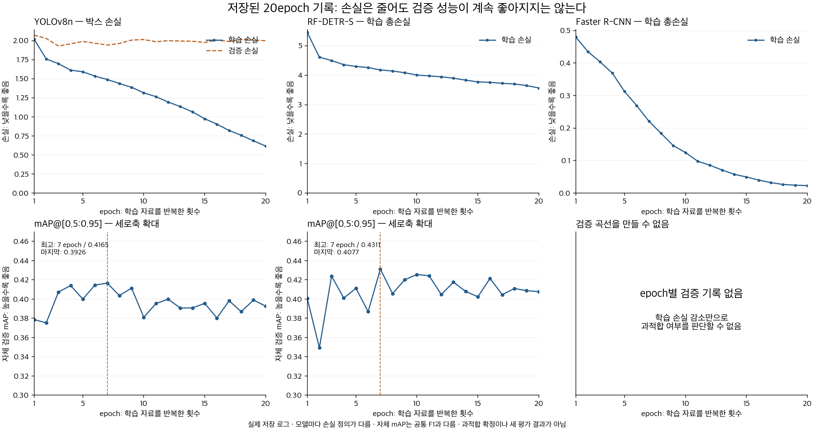

위쪽은 학습 손실, 아래쪽은 학습 라이브러리가 기록한 검증 mAP다. 손실은 낮을수록, mAP는 높을수록 좋다. YOLO는 박스 손실 성분이고 나머지 모델은 총손실이므로 모델 사이의 손실 크기를 비교하지 않는다. 아래쪽 세로축은 변화를 보기 위해 확대했다. mAP@[0.5:0.95]는 여러 IoU 기준의 AP를 평균한 값이다. 현재 프로젝트의 공통 IoU 0.5 F1과 다른 지표다.

| 확인 항목 | YOLOv8n | RF-DETR-S | Faster R-CNN |
|---|---:|---:|---|
| 자체 검증 mAP@[0.5:0.95] 최고 시점 | 7번째 | 7번째 | epoch별 검증 기록 없음 |
| 7번째 mAP@[0.5:0.95] | 0.41654 | 0.43112 | 확인 불가 |
| 20번째 mAP@[0.5:0.95] | 0.39264 | 0.40772 | 같은 학습 로그에 기록 없음 |
| 7번째 mAP@0.5 | 0.96670 | 0.97040 | 확인 불가 |
| 20번째 mAP@0.5 | 0.97178 | 0.97880 | 같은 학습 로그에 기록 없음 |
| 이전 모델 확인 가능 여부 | best.pt가 7번째 지표와 일치 | 7번째 파일 보관됨 | 로컬에는 마지막 20번째만 있음 |

이 표는 **각 모델의 학습 시점 변화**를 확인하는 표다. 라이브러리별 평가 구현이 다르므로 표의 자체 mAP로 세 모델의 우열을 정하지 않는다. Faster R-CNN도 마지막 모델의 공통 검증·테스트 평가는 완료했다. 없는 것은 학습 도중 각 epoch의 검증 기록이다.

숫자로 보기:

- YOLO의 학습 박스 손실은 7번째 1.49080에서 20번째 0.61612로 줄었다. 같은 시점의 검증 박스 손실은 1.94187에서 1.99945로 늘었다.
- RF-DETR의 학습 총손실은 7번째 4.18111에서 20번째 3.56705로 줄었다. 검증 손실은 `compute_val_loss=False`여서 없다.
- Faster R-CNN의 학습 총손실은 1번째 0.48012에서 20번째 0.02278로 줄었다. 이것만으로 과적합 여부를 판단하지 않는다.

**해석:** YOLO와 RF-DETR에서는 마지막 모델보다 중간 모델의 자체 mAP@[0.5:0.95]가 높았다. 과적합 가능성을 점검할 이유는 있다. 그러나 두 모델의 mAP@0.5는 마지막에 오히려 높았다. 따라서 ‘20epoch에서 모든 탐지 성능이 나빠졌다’ 또는 ‘과적합이 확정됐다’고 쓰지 않는다. RF-DETR 7번째 파일은 더 좋은 후보일 수 있어 확인하는 것이며, 이미 최종 선정한 파일이 아니다.

YOLO의 best.pt에는 정리된 epoch 값이 -1로 저장되어 있다. 저장된 mAP 두 값과 검증 박스 손실이 학습 CSV의 7번째 행과 유일하게 일치함을 확인했다. RF-DETR 파일의 epoch 값은 0부터 세므로 저장값 6이 7번째 epoch다. Faster R-CNN은 last.pt를 매 epoch 덮어썼고, 현재 로컬 파일의 epoch는 20이다. 손실 로그만으로 7번째 가중치를 복원할 수 없다.

재현 명령은 다음과 같다. 자신의 신뢰할 수 있는 학습 체크포인트만 대상으로 실행한다.

```bash
.venv/bin/python scripts/xray_training_history_audit.py
.venv/bin/python scripts/xray_training_history_figure.py
```

원출력은 `reports/training_history_20261004/`다. 공유용 [점검 JSON](evidence/training_history_20261004/audit.json)과 [epoch별 CSV](evidence/training_history_20261004/epoch_curves.csv)에 값·출처·해시·한계를 보관한다.

### 17.8. 저장 모델 선택과 다음 실험의 공정성

**최적 저장본 보관(best checkpoint)**과 **조기 종료(early stopping)**는 다르다. 전자는 검증 기준이 가장 좋았던 모델을 남기는 기능이다. 후자는 검증 기준이 정한 횟수 동안 개선되지 않으면 학습을 멈추는 기능이다. 20epoch을 모두 학습하고 7번째 저장본을 선택할 수도 있다. 이는 7epoch만 학습했다는 뜻이 아니다.

기존 세 모델 비교는 모두 **마지막 20번째 모델을 사용하는 고정 학습량 비교**였다. YOLO의 patience는 1000, RF-DETR의 early_stopping은 False였고, Faster R-CNN은 지정한 epoch까지 실행했다. 이번 20epoch 안에서 검증 정체에 따른 조기 종료는 적용되지 않았다. 기존 결과를 삭제하지 않으며, 각 구조의 최적 성능을 찾은 결과라고 부르지도 않는다.

**권장안: Faster R-CNN을 포함한 세 모델을 공통 검증·저장 규칙으로 20epoch씩 한 번 재실행한다.** 사용자가 ‘기록 부족을 한계로만 적으면 설득력이 부족하다’고 지적하여 계획을 보완했다. 아래는 실행 전 제안이며, 이번 문서 점검에서는 학습을 시작하지 않았다.

Faster R-CNN만 재학습하면 그 모델은 20개 시점에서 최적 모델을 고를 수 있다. 그러나 YOLO·RF-DETR은 이미 남은 일부 파일에서만 공통 채점으로 선택할 수 있다. 반대로 두 모델의 자체 mAP 최고 시점과 Faster의 공통 F1 최고 시점을 섞으면 선택 기준이 달라진다. 같은 목적의 비교를 위해 **세 모델 모두 매 epoch 공통 평가를 거치고 같은 선택 기회를 갖도록 한다.** 기존 결과가 무효라는 뜻은 아니다. 고정된 마지막 시점 비교에서, 동일 규칙으로 고른 저장 시점 비교로 근거를 보완하는 작업이다.

| 단계 | 실행할 일 | 확인·보존할 결과 |
|---|---|---|
| 1. 평가 정책 고정 | 데이터·분할·20epoch·공통 선택 지표·동점 규칙을 시작 전에 기록 | 실행 설정과 해시, 테스트 비사용 명시 |
| 2. 저장·검증 기능 점검 | 매 epoch 검증과 저장·중단 후 재개를 짧게 시험 | 가중치 수정 없는 검증, 저장본 재로딩, 재개 상태 확인 |
| 3. 세 모델 재실행 | 각자의 원래 사전학습 가중치에서 20epoch 파인튜닝 | epoch별 학습 손실·검증 예측·공통 지표·가중치 |
| 4. 저장 시점 비교 | 같은 규칙으로 고른 best와 마지막 last를 나란히 비교 | 최종 epoch 선택 이유, 학습 후반 성능 변화 |
| 5. 실패 조건 분석 | 선택 모델의 조건별 FN·사진 단위 경보·처리 시간을 분석 | 크기·대비·배경별 표본 수와 결과, 실제 오류 사진 |
| 6. 추가 모델·제출 판단 | D-FINE-S 추가 학습 여부를 정하고 제출 근거를 완성 | 기존 비교와 새 비교 구분, 입증한 결과와 미검증 항목 |

공통 실행 조건 제안:

- 전체 혼합 학습 사진 2,453장, 검증 사진 107장, 기존 촬영 묶음 분할, seed 0, 입력 설정 512를 유지한다. 모델별 전처리 세부 차이와 배치 크기는 기록한다.
- 모델별 사전학습 가중치·학습률·optimizer·증강 설정은 기존 실행과 같게 둔다. 새 데이터나 학습률 탐색을 동시에 추가하지 않는다. 마지막 20번째 모델에서 이어 학습하는 방식은 사용하지 않는다.
- 매 epoch `scripts/xray_eval.py`로 검증 예측을 채점한다. 현재 주지표인 IoU 0.5 F1로 저장 시점을 고른다. 탐지 임계값도 검증 자료에서만 정하며 해당 모델 파일과 함께 보관한다.
- F1이 같으면 재현율, AP@0.75, 더 이른 epoch 순으로 고른다. 숫자 비교 오차 범위는 1e-9로 기록한다. 이 규칙은 실행 후 결과에 맞춰 바꾸지 않는다. FN을 우선하는 공장 운영 임계값은 별도 분석한다.
- 세 모델 모두 20epoch을 완료한다. 이번 비교에는 조기 종료를 적용하지 않는다. 최적 저장본 보관과 조기 종료를 구분하며, 모든 모델을 7epoch로 맞추지 않는다.
- 각 epoch의 가중치·검증 예측 CSV·채점 JSON을 보관한다. 재개용 last에는 optimizer·scheduler·난수 상태를 보관한다. 검증이 BatchNorm 통계나 학습 난수 상태를 바꾸지 않게 점검한다.
- 학습 손실과 공통 검증 F1·AP@0.5·AP@0.75·FN의 곡선을 만든다. 손실의 절댓값을 서로 다른 모델끼리 비교하지 않는다. 한 번의 seed 0 실험은 반복 실험의 통계적 우월성 증명이 아니다.

선택한 저장본은 **고정한 20epoch 범위에서 검증 기준이 가장 높았던 모델**이다. 해당 아키텍처의 전역 최적 성능을 입증한 모델이 아니다. 학습량은 같은 epoch로 맞추지만 배치 크기·연산량·장치가 다르므로 업데이트 수와 시간을 함께 보고한다.

대안도 있다. 시간이 부족하면 기존 세 모델의 마지막 20epoch 비교를 그대로 사용할 수 있다. 이는 이미 실행한 유효한 제한적 비교다. Faster만 재학습하면 해당 모델의 학습 경향은 확인할 수 있지만 세 모델 모두 같은 기준의 저장본 탐색을 마쳤다고 쓸 수는 없다. 저장된 마지막 가중치를 다시 평가하거나 마지막에서 추가 학습해도 사라진 과거 가중치는 복원되지 않는다. 기존 YOLO·RF-DETR의 7번째 모델은 간단한 민감도 확인에는 쓸 수 있지만, 이번 권장안에서는 세 모델의 공통 기록 보완을 우선한다.

장치와 시간 근거:

| 모델 | 권장 장치 | 이전 20epoch 학습 실측 |
|---|---|---:|
| YOLOv8n | 맥북 MPS | 12.69분 |
| Faster R-CNN | Colab Tesla T4 | 96.55분 |
| RF-DETR-S | 맥북 MPS | 170.10분 |

위 값은 새 실행 시간 예측이 아니라 기존 execution.json의 실측이다. 맥북에서 YOLO→RF-DETR을 순서대로 돌리고 Colab에서 Faster를 동시에 돌리면, 과거 학습 시간만으로 계산한 긴 경로는 182.80분이다. 새 공통 검증·파일 저장·코드 점검·Colab 준비 시간은 여기에 더 필요하다. T4 재할당과 같은 처리 속도는 보장되지 않는다. 검증을 넣은 짧은 실행 후 예상 시간을 다시 계산한다. 근거·실행 전 제안은 [재학습 정책 제안 JSON](evidence/training_history_20261004/retraining_proposal.json)에 보관한다. 상태는 미실행 제안이다.

새 후보나 탐지 임계값을 테스트 점수로 고르지 않는다. 기존 테스트 결과는 이미 열람했으므로 이후 연구를 새로운 비공개 테스트 검증처럼 표현하지 않는다. 후속 테스트를 수행하더라도 설정 고정 후 결과 확인으로 한정하고, 같은 테스트를 반복 보며 설정을 바꾸지 않는다. 독립적인 최종 일반화 확인에는 새 촬영 묶음이 필요하다.

### 17.9. 중단된 학습을 이어 하는 준비와 확인 범위

2026-10-04 사용자 요청으로 복구 기능을 보완했다. **마지막으로 저장을 완료한 epoch부터 이어 학습한다.** 예를 들어 8번째 epoch 중간에 종료되면, 7번째 완료 저장본을 불러와 8번째를 다시 실행한다. 파일 손상으로 한 단계 더 이전 저장본을 사용하면 다시 실행하는 양도 늘 수 있다.

모델 가중치만 저장하면 학습 중 사용하던 갱신 상태가 빠진다. 따라서 재개용 저장본에는 optimizer, 학습률 조절 상태, 완료 epoch와 난수 상태를 함께 보존한다. YOLO는 라이브러리의 전체 학습 저장본, RF-DETR은 Lightning 전체 체크포인트, Faster R-CNN은 프로젝트의 전체 상태 파일을 사용한다. 재개와 최종 추론용 가중치는 구분한다.

| 준비한 기능 | 동작 |
|---|---|
| 완료 파일만 선택 | 임시 저장 폴더는 복구 후보에서 제외. 복사 뒤 크기와 SHA-256 검사 |
| 이전 정상 저장본 유지 | 최근 정상 전체 상태 2개를 보관. 최신 파일이 손상되면 이전 정상 파일을 확인 |
| epoch별 모델 보관 | YOLO·RF-DETR은 매 epoch 네이티브 저장본, Faster는 매 epoch 모델 가중치 보관 |
| 잘못된 재개 차단 | 학습·검증 이미지와 라벨의 내용, 분할, 설정, 실행 코드, 주요 패키지 버전이 다르면 중단 |
| 중복 실행 차단 | 같은 실행 환경에서 같은 run을 두 번 실행하지 못하도록 잠금 |
| 끝난 작업 확인 | 마지막 완료 저장은 있지만 상태 기록 전에 종료된 경우, 전체 재학습 없이 완료 상태를 복구 |

최근 2개는 **재개용 전체 상태**의 개수다. 비교용 epoch별 모델 파일까지 2개만 남기는 것은 아니다. 단순 `last` 또는 `best`라는 파일명만 믿지 않고 저장본의 epoch·필수 상태·파일 검사를 확인한다. 전체 상태가 없는 추론용 파일은 재개용으로 거부한다.

검사 결과:

- 기존 검사 포함 37개 통과. 그중 신규 복구 검사는 12개다. 저장 중 실패, 최신 파일 손상, 불완전 파일, 설정 변경, 중복 실행 등을 검사했다.
- YOLOv8n·Faster R-CNN·RF-DETR-S를 각각 사진 2장·CPU·입력 설정 128로 짧게 학습했다. 1epoch 저장 뒤 프로세스를 종료하고 같은 설정으로 재실행해 2epoch까지 완료했다. 이는 성능 비교 실험이 아니다.
- Faster R-CNN은 중단 없이 2epoch 학습한 경우와 나누어 재개한 경우의 모델 tensor 404개가 모두 동일했다. 이 동일성을 다른 모델·GPU 장치에 일반화하지 않는다.
- RF-DETR의 첫 검사에서 저장 callback 순서 오류를 발견했다. 체크포인트 callback 뒤에 복구 저장을 실행하도록 수정한 뒤 저장·재개 검사를 통과했다.
- D-FINE은 공식 체크포인트의 필수 항목 형식을 모의 파일로 검사했다. **실제 D-FINE 학습 연결·CUDA 중단 재개 검사는 아직 하지 않았다.** MPS·T4에서의 실제 중단 검사도 본학습 전 단계로 남아 있다.

Colab에서는 기존에 승인받은 Drive의 **새 실험 폴더**에 모델·복구 상태·로그를 보관한다. 새 VM에서는 Drive 연결과 같은 실행 환경·패키지 복원 뒤 재개한다. Google Drive 실제 마운트에서의 새 복구 기능과 강제 VM 교체는 이번 로컬 검사에서 시험하지 않았다. 같은 OS의 잠금은 서로 다른 Colab VM 사이의 중복 실행을 막는 장치가 아니므로, 재할당 전 기존 학습 세션 종료를 확인한다.

**저장본 복구는 GPU 서버 자동 재연결과 다르다.** Colab 재할당·로그인·Drive 재연결이 필요할 수 있다. 연결을 유지하려는 자동 클릭이나 무한 재시도는 준비하지 않았다. 맥북이 잠자기에 들어가면 로컬 계산은 멈춘다. 승인 후 본학습에 앞서 필요한 전원 상태와 실제 재개를 확인한다.

구현은 `scripts/xray_recovery.py`, 연결은 `scripts/xray_train_resumable.py`, 고장 검사는 `scripts/test_xray_recovery.py`다. 결과는 `reports/recovery_preparation_20261004/summary.json`에 있다. 재개 인터페이스는 같은 실행 명령의 `--resume`이다. 기존 완료 실험 이름으로 새 학습을 덮어쓰지 않는다. 이번 수정은 복구·저장 보완이며, **매 epoch 공통 F1 선택 기능과 D-FINE 실행기는 승인 후 연결·검사할 작업**이다. 과거 Colab ZIP·노트북은 과거 실행용이므로 새 패키지로 준비한 뒤 사용한다.

공식 동작 참고: [Ultralytics 학습 재개](https://docs.ultralytics.com/modes/train/#resuming-interrupted-trainings), [D-FINE 저장·로드 구현](https://github.com/Peterande/D-FINE/blob/master/src/solver/_solver.py). 실제 재개 확인은 위 프로젝트 검사 결과를 기준으로 한다.


### 17.10. 네 모델의 공통 검증 재실행 — 2026-10-04 완료

사용자 승인 후 새 실행을 시작했다. 학습 자료는 전체 혼합 2,453장이고 검증은 고정한 107장이다. 네 모델은 모두 20epoch를 완료했다. 각 epoch의 가중치를 저장하고 같은 xray_eval.py로 검증 F1, 재현율, AP@0.75를 계산한다. 최고 F1 저장본을 선택하며 동점이면 재현율, AP@0.75, 이른 epoch 순으로 결정한다. 수치 비교 허용 오차는 1e-9다. 테스트는 이 선택에 쓰지 않는다.

학습이 중단되면 저장이 끝난 epoch부터 이어 간다. 모델 가중치뿐 아니라 optimizer·학습률 scheduler·난수 상태를 함께 보관한다. 작은 실행에서는 YOLO·RF-DETR의 MPS 재개와 Faster·D-FINE의 CPU 재개를 확인했다. Faster·D-FINE은 Colab T4·Drive에서도 512픽셀 입력으로 저장·재개 검사를 통과했다. 저장 복구 기능이 Colab의 GPU 세션 자동 재연결을 보장하지는 않는다.

D-FINE-S는 [공식 구현](https://github.com/Peterande/D-FINE)의 커밋 956d1709314c2c6a4df6f34de232054578a7449f와 COCO 사전학습 가중치를 사용한다. 이물 클래스용 출력은 새로 초기화했다. 사전 결정한 학습률은 AdamW 1e-4, 백본 5e-5이고 weight decay는 1e-4다. 20epoch cosine scheduler를 쓴다. 입력은 512×512, batch 4다. 추가 무작위 영상 증강, AMP, EMA와 공식 학습 후반의 이전 모델 재로딩은 사용하지 않는다. 같은 저장 영상의 효과를 비교하기 위한 제한된 파인튜닝 설정이며 최적 설정을 입증한 것은 아니다.

맥북에서 YOLO→RF-DETR, Colab에서 Faster→D-FINE 본학습을 완료했다. CUDA·Drive 재개 검사를 통과한 환경을 사용했다. 새 선택 저장본의 테스트·조건·속도 결과는 18절에 있다. 기존 마지막 20epoch 결과와 새 공통 검증 선택 결과는 별도 표로 보고한다. 기존 테스트 열람 이력과 실제 정상 제품이 없다는 한계는 유지한다.


### 17.11. 식품 공장의 AI 보조검사 적용안 — 현장 검증 전 제안

사용자는 현장 검사 속도와 재검사 가능량을 제공하지 않았다. 따라서 특정 처리량·절감률을 가정하지 않는다. 제출물에는 아래 흐름을 적용 제안으로 설명하고, 실제 설치·효과 측정 결과와 구분한다.

1. **기존 검사와 병행해 기록한다.** X-ray 사진을 제품 식별자·촬영 시각·호기와 연결한다. 현장 PC가 전처리·추론을 수행하고 위치·점수·처리 시간을 기록한다. 초기에는 AI가 기존 장비의 경보를 취소하거나 출하를 승인하지 않는다.
2. **작업자의 재검사를 돕는다.** 사진 전체와 의심 부분 확대, 예측 박스, 장비와 AI의 판정 불일치를 표시한다. 작업자는 해당 제품을 분리해 검사하고 실제 이물 여부와 최종 조치를 기록한다. 반복 오류는 호기·시간대·제품별로 모아 점검한다.
3. **검증 후 분리 장치에 연결한다.** 제품 식별자·이동 위치를 설비 제어기에 전달한다. 촬영부터 조치까지의 지연과 실제 분리 여부를 확인한다. 다음 제품을 잘못 분리하지 않도록 제품 추적과 센서 확인을 함께 시험한다.
4. **오류를 정상으로 바꾸지 않는다.** 사진 누락, 시간 초과, 통신 오류, 제품 대응 불명확, 분리 확인 실패에는 사전에 정한 재검사·보류 절차를 적용한다. 기존 장비의 보호 기능을 유지한다.

| 도입 전 확인할 항목 | 평가 방법 |
|---|---|
| 이물 제품의 통과 위험 | 이물 제품 중 경보 없이 통과한 비율. 이물 박스 FN과 별도로 계산 |
| 정상 오경보 | 대표 정상 제품 중 경보한 비율. 현재 검증·테스트에는 실제 정상 제품이 없어 미검증 |
| 재검사 부담 | 전체 제품 중 재검사 비율과 단위 시간당 재검사 수. 작업자 처리 용량과 대조 |
| 처리 시간과 추적 | 촬영부터 조치까지 지연 분포·P95·시간 초과 수, 제품 대응과 분리 확인 |
| 장애 대응 | 사진 누락·통신 오류·시간 초과·분리 실패 상황에서 재검사·보류 처리 확인 |

운영 탐지 임계값은 현장 대표 자료에서 미탐 위험과 재검사량을 함께 보고 정한다. 처리 시간 P95만 통과해도 모든 제품의 시간 제한을 보장하는 것은 아니므로 시간 초과 처리도 따로 확인한다. 자동 PASS는 대표 정상·이상 제품의 검증과 운영 조건 확정 전까지 비활성으로 둔다. 현장 자료가 없으면 미검증 항목으로 제출한다.

기대 효과는 의심 위치 확인과 재검사 지원, 오류 추적, 새 데이터의 확보다. 생산성 향상·미탐 감소·재검사량 감소가 이미 실현됐다고 적지 않는다. 모델 점수는 보정된 제조 이상 확률이 아니며 정상 판정의 근거로 단독 사용하지 않는다.

산업 설계 참고: [METTLER TOLEDO X-ray Inspection Guidance](https://www.mt.com/nz/en/home/library/know-how/product-inspection/PI-Guides/xray-inspection-guide/x-ray-inspection-wiki.html)의 5.3·6.3·17~21절에서 제품 분리 확인, 시험편 검사와 기록 관리 원칙을 참고했다. AI 보조검사 흐름과 단계별 도입은 본 프로젝트의 제안이다. 보고서 4장과 발표자료 현장 활용 부분에 반영했다.


## 18. 공통 검증 선택 저장본의 테스트·실패 조건·속도 — 2026-10-04

네 모델을 전체 혼합 2,453장으로 각각 20epoch 학습한 뒤, 검증 107장에서 같은 규칙으로 저장본과 탐지 임계값을 선택했다. 아래는 그 값을 고정하고 테스트 97장에 적용한 결과다. 테스트 결과로 저장본·탐지 임계값을 바꾸지 않았다. 이전 실험에서 같은 테스트를 열람한 이력이 있으므로 완전히 새로운 비공개 시험으로 표현하지 않는다.

테스트 추론은 네 모델 모두 맥북 MPS에서 새로 실행했다. 검증 표는 각 모델을 선택할 때 저장한 원래 검증 결과다. Faster·D-FINE의 원래 검증은 CUDA, YOLO·RF-DETR은 MPS였다. 같은 MPS에서 검증을 다시 확인한 결과와 환경 차이는 18.5절에 별도로 적는다.

### 18.1. 새 선택 저장본 비교

| 모델 | 선택 epoch | 고정 탐지 임계값 | 검증 F1 | 테스트 정밀도 | 테스트 재현율 | 테스트 F1 | TP / FP / FN |
|---|---:|---:|---:|---:|---:|---:|---:|
| YOLOv8n | 20 | 0.68106407 | 0.9856 | 0.9911 | 0.9867 | 0.9889 | 222 / 2 / 3 |
| Faster R-CNN | 17 | 0.99998570 | 0.9918 | 0.9867 | 0.9867 | 0.9867 | 222 / 3 / 3 |
| RF-DETR-S | 8 | 0.70370466 | 0.9918 | 0.9821 | 0.9778 | 0.9800 | 220 / 4 / 5 |
| D-FINE-S | 11 | 0.72014374 | 0.9856 | 0.9735 | 0.9778 | 0.9756 | 220 / 6 / 5 |

기준은 **IoU ≥ 0.5·점수 순 일대일 대응**이다. 테스트 사진에는 정답 이물이 총 225개 있다. TP는 정답 박스에 맞게 찾은 수, FP는 대응하지 못한 채택 예측 수, FN은 찾지 못한 정답 박스 수다. 가까운 위치를 예측해도 IoU가 0.5 미만이면 해당 예측은 FP, 정답은 FN으로 각각 센다.

Faster R-CNN의 임계값이 1에 가깝다고 더 정확하거나 더 안전하다는 뜻은 아니다. 모델별 점수 분포가 다르고, 이 점수는 보정된 제조 이상 확률이 아니다. 임계값을 반올림해 1.0으로 사용하면 판정이 달라지므로 저장된 값을 그대로 사용한다.

| 모델 | 테스트 AP@0.5 | 테스트 AP@0.75 | IoU 0.75 F1 | 기존 완화 기준 F1 |
|---|---:|---:|---:|---:|
| YOLOv8n | 0.9880 | 0.1335 | 0.3311 | 0.9978 |
| Faster R-CNN | 0.9793 | 0.1091 | 0.3304 | 1.0000 |
| RF-DETR-S | 0.9709 | 0.1382 | 0.3252 | 0.9978 |
| D-FINE-S | 0.9690 | 0.1597 | 0.3484 | 0.9978 |

AP는 기존 채점기의 all-points 보간 AP이며 COCO mAP가 아니다. 보조 F1의 임계값도 해당 매칭 규칙의 검증에서 선택한 값이다. 표의 차이는 이 데이터·학습 설정·seed 0에서 관찰한 결과이며, 아키텍처의 일반적 우열을 입증하지 않는다.

### 18.2. 어떤 방식으로 실패했나

| 모델 | 근처 박스가 있었지만 IoU 미달인 FN | 위치는 맞지만 점수가 임계값 미달인 FN | 저장 예측에 IoU 0.5 이상 후보가 없는 FN |
|---|---:|---:|---:|
| YOLOv8n | 2 | 1 | 0 |
| Faster R-CNN | 3 | 0 | 0 |
| RF-DETR-S | 4 | 0 | 1 |
| D-FINE-S | 5 | 0 | 0 |

‘근처’는 오류를 설명하기 위한 분류다. 중심 거리 8픽셀 이내 또는 IoU 0.3 이상을 사용하며, 정답으로 인정하는 IoU 0.5 기준은 바꾸지 않는다. 분류 순서는 근처 채택 예측 → 임계값 미달의 위치 일치 예측 → 저장 예측에 위치 일치 후보 없음이다. 이 분류는 원인 확정이 아니다. 저장 대상인 탐지 점수 0.001 미만 후보까지 확인한 것도 아니다.

### 18.3. 이물 위치와 사진 단위 경보를 구분한다

| 모델 | 경보가 전혀 없는 이물 사진 / 97장 | 이물을 하나 이상 정확히 찾은 사진 | 모든 이물을 정확히 찾은 사진 |
|---|---:|---:|---:|
| YOLOv8n | 1 | 95 | 94 |
| Faster R-CNN | 0 | 97 | 94 |
| RF-DETR-S | 1 | 96 | 92 |
| D-FINE-S | 0 | 97 | 92 |

경보는 임계값 이상 예측이 하나 이상 있는 상태다. 경보가 있어도 모든 이물 위치를 정확히 찾았다는 뜻은 아니다. 위 수치는 이물 사진에서의 관측이며 실제 출하·분리 장치를 시험한 결과가 아니다. 실제 정상 제품이 0장이므로 정상 오경보율, 재검사 업무량, 자동 PASS 안전성은 판단할 수 없다.

### 18.4. 실패 조건을 어떻게 나누었나

조건 경계는 공식 학습 사진 296장의 정답 박스에서 계산한 25·75백분위수로 정했다. 테스트 결과에 맞춰 경계를 바꾸지 않았다. 아래 각 칸은 **FN / 해당 조건의 정답 박스 수**다. 한 이물이 여러 조건에 동시에 포함되므로 행을 합산하지 않는다.

| 조건 | YOLOv8n | Faster R-CNN | RF-DETR-S | D-FINE-S |
|---|---:|---:|---:|---:|
| 작은 박스: 긴 변 ≤ 10픽셀 | 2 / 71 | 1 / 71 | 3 / 71 | 2 / 71 |
| 제품 경계에 상대적으로 가까움: 거리 ≤ 45.84픽셀 | 0 / 65 | 1 / 65 | 2 / 65 | 0 / 65 |
| 낮은 대비: 지표 ≤ 42.5 | 1 / 59 | 1 / 59 | 1 / 59 | 2 / 59 |
| 상대적으로 길쭉한 박스: 긴 변/짧은 변 > 1.2614 | 1 / 56 | 3 / 56 | 3 / 56 | 3 / 56 |
| 어두운 배경: 주변 밝기 중앙값 ≤ 98 | 1 / 44 | 1 / 44 | 0 / 44 | 2 / 44 |
| 밝기 변화가 큰 배경: 주변 표준편차 > 14.2349 | 1 / 45 | 1 / 45 | 1 / 45 | 1 / 45 |

크기는 실제 이물 지름이 아니라 TXT 박스의 긴 변이다. 경계 거리는 영상에서 근사한 제품 마스크 내부 거리이며 실제 막대 경계와 다를 수 있다. 대비는 기존 채점기의 국소 밝기 차이 지표다. 종횡비는 이물의 분할 윤곽이 아닌 TXT 박스 모양이다. 배경 밝기와 표준편차는 주변 영역에서 모든 정답 박스를 제외하고 계산했다.

따라서 ‘가장자리·저대비에서 항상 실패한다’고 결론 내릴 수 없다. 상대적으로 길쭉한 박스 집단에 일부 오류가 모였지만, 오류 수가 적고 촬영 묶음 안의 사진들이 비슷하다. 사진·촬영 묶음별 표본 수도 `conditions.csv`에 함께 보관한다. 정답 박스를 알아야 계산할 수 있는 조건은 미지의 이물을 자동으로 재검사시키는 실시간 규칙으로 바로 사용할 수 없다.

### 18.5. 같은 맥북 GPU의 처리 시간

장치: Apple M5 Pro, MPS. 모델별 검증 107장 × 3회, batch 1, FP32, 입력 크기 설정 512다. 모델을 하나씩 순서대로 실행하고 매 호출 뒤 GPU 완료를 기다렸다. 모델마다 3회 예열은 제외했다.

| 모델 | 평균 ms/장 | 중앙값 ms/장 | P95 ms/장 | 평균 기준 장/초 |
|---|---:|---:|---:|---:|
| YOLOv8n | 11.71 | 9.98 | 18.85 | 85.42 |
| Faster R-CNN | 1396.65 | 1393.35 | 1456.72 | 0.72 |
| RF-DETR-S | 38.29 | 38.08 | 41.27 | 26.12 |
| D-FINE-S | 24.74 | 24.67 | 26.13 | 40.41 |

측정 구간은 PNG 읽기·RGB 변환·모델별 크기 변환·추론·후처리·CPU 배열 변환·고정 임계값 필터·GPU 동기화다. 색 네모 제거, 모델 불러오기, 촬영, 통신, 제품 분리 시간은 제외했다. P95는 측정 호출의 95%가 그 시간 이내였다는 뜻이며 최대 지연 보장이 아니다.

동일한 512 설정이어도 모델별 늘리기·여백 추가 방식이 다르다. 같은 연산량 비교는 아니다. 한 맥북 세션의 결과이며 파일 캐시·온도·백그라운드 다운로드 및 압축 해제 부하를 완전히 통제하지 않았다. 공장 처리량이나 다른 GPU의 속도로 일반화하지 않는다. MPS fallback을 허용했으며 모델 파라미터의 MPS·FP32 배치를 확인했다. 모든 연산이 GPU에서만 실행됐음을 뜻하지는 않는다.

첫 속도 측정 반복에서 검증 예측도 별도로 보관했다. 기존 검증 임계값 그대로 재채점해 장치 이동에 따른 판정 차이를 확인한다. 이 기록과 채점은 시간 측정 구간에서 제외했다.

| 모델 | 원래 검증 장치 | 원래 TP / FP / FN | MPS 재확인 TP / FP / FN |
|---|---|---:|---:|
| YOLOv8n | mps | 240 / 4 / 3 | 240 / 4 / 3 |
| Faster R-CNN | cuda | 241 / 2 / 2 | 241 / 2 / 2 |
| RF-DETR-S | mps | 241 / 2 / 2 | 241 / 2 / 2 |
| D-FINE-S | cuda | 240 / 4 / 3 | 239 / 4 / 4 |

**D-FINE-S는 검증 판정 1개가 달라졌다.** 같은 이물의 점수가 CUDA 기록에서는 0.72014374, MPS에서는 0.7201233이었다. 고정 임계값 0.72014374를 사이에 두고 판정이 달라졌다. IoU는 두 환경 모두 약 0.6288로 위치 기준을 넘었다. 이 비교만으로 하드웨어가 유일한 원인이라고 단정하지 않는다. 환경 이동 시 경계 점수의 판정이 달라질 수 있음을 확인한 결과다. 임계값은 다시 맞추지 않았으며, 테스트 표는 MPS에서 관측한 성능이다.

### 18.6. 실제 사진으로 이해하기

아래 선들은 설명용으로 덧그린 것이다. 파랑은 공식 TXT의 정답 박스, 주황은 고정 탐지 임계값을 통과한 예측 박스, 보라 점선은 임계값 미달 예측이다. 원본의 색 네모와 구분한다. 왼쪽 위에는 사진 전체, 위쪽 가운데에는 선 없는 실제 입력 확대를 배치했다.

**예시 A — 경보가 있어도 위치 채점에서 실패할 수 있다.** 가운데 이물의 정답 박스는 9×5픽셀이다. 네 모델 모두 근처를 예측했지만 IoU가 약 0.397~0.472로 0.5에 미달했다. 따라서 각 모델에서 FP 1개와 FN 1개를 센다. 이 사진에서 AI가 아무 경보도 내지 않았다는 뜻은 아니다.

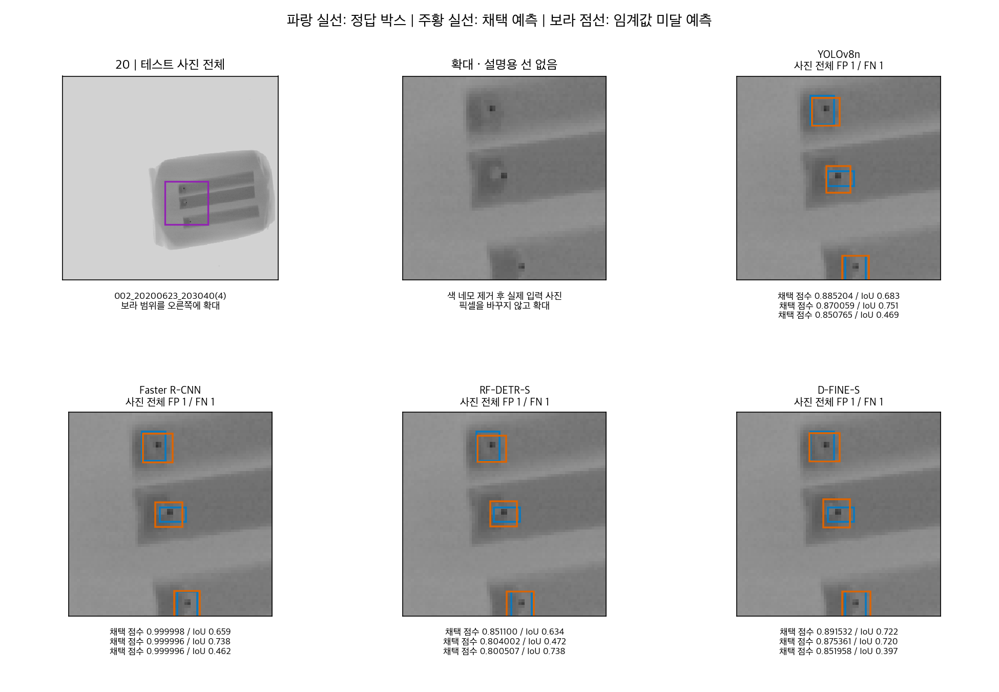

**예시 B — 위치가 맞아도 점수가 낮으면 경보하지 않는다.** YOLOv8n은 IoU 약 0.785인 후보를 만들었지만 탐지 점수 0.624495가 고정 임계값 0.68106407보다 낮았다. 이 사진에는 다른 채택 예측도 없어 경보가 없었다. 다른 세 모델은 같은 이물에 경보했다. 이 사례를 본 뒤 임계값을 낮추면 테스트를 이용한 조정이 되므로 이번 비교에서는 바꾸지 않았다.

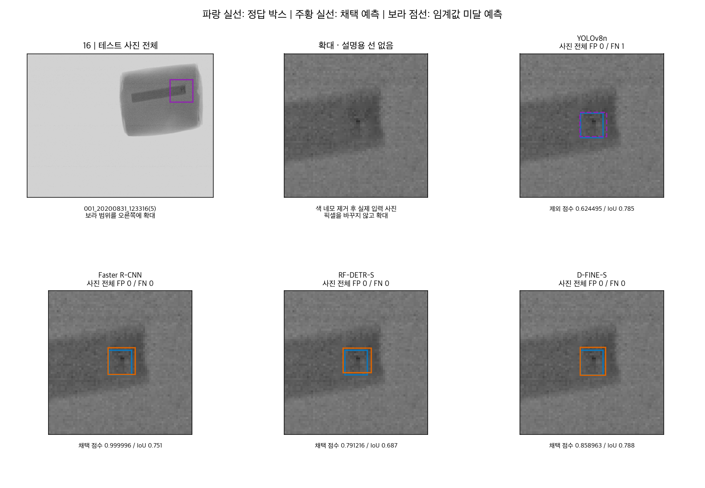

검증·테스트에서 오류가 있었던 서로 다른 사진 20장의 비교 그림과 원본 해시는 `reports/common_epoch_20261004/evaluation/diagnostics/figures/` 및 `figure_manifest.json`에 보관했다. 테스트 오류 사진은 11장이다. 모델별 오류 사진을 합칠 때 같은 사진은 한 번만 센 수다.

### 18.7. 보관 위치와 다음 단계

Colab 두 모델의 148개 파일, 8,085,339,976바이트를 맥북의 기존 프로젝트 `runs/v2_common20_faster_cuda_20261004/`, `runs/v2_common20_dfine_cuda_20261004/`에 보관했다. 선택 저장본뿐 아니라 20개 epoch별 가중치·검증 예측·선택 기록·재개 상태를 포함한다. 실행 로그·큐 기록은 `reports/common_epoch_20261004/colab_backup/`에 있다. Drive 원본은 유지한다.

백업 목록의 파일 크기와 로컬 SHA-256을 기록했다. 40개 epoch의 가중치·검증 예측 해시와 4개 재개 저장 묶음의 파일 해시도 기존 기록과 대조했다. 네 모델의 선택 규칙·저장본 해시를 다시 확인했다. 전체 제출 패키지를 깨끗한 새 환경에서 재현한 검사는 아직 다음 단계다.

이 단계에서는 최종 모델과 운영 재검사 임계값을 확정하지 않았다. 후속 결정에서는 검증 선택 근거, 위치 미탐, 사진 단위 무경보, 속도, 정상 제품 자료의 부재를 함께 검토한다.

실행 근거: `reports/common_epoch_20261004/evaluation/frozen_selection.json`, 각 `*_evaluation.json`, `diagnostics/error_audit.json`, `conditions.csv`, `condition_summary.json`, `benchmark_mps.json`. 테스트 원본 예측은 `reports/preds_v2_common20_*_test.csv`다.

### 18.8. YOLOv8n의 테스트 F1이 다시 높았던 이유

**확인된 직접적인 이유는 현재 IoU 0.5 기준에서 오탐·미탐으로 집계된 수가 적었기 때문이다. 이 결과만으로 YOLO 구조가 다른 구조보다 본질적으로 우수하다고 결론 내리지 않는다.**

F1은 `2×TP / (2×TP + FP + FN)`이다. YOLOv8n과 Faster R-CNN은 TP 222개와 FN 3개로 같다. FP가 각각 2개와 3개라 F1은 0.9889와 0.9867이 된다. 차이는 약 **0.22%p이며 오탐 한 개의 차이**다. 같은 수의 이물을 맞혔다는 뜻이며, 두 모델이 항상 같은 이물을 맞혔다는 뜻은 아니다.

RF-DETR-S와 D-FINE-S는 TP가 각각 220개다. YOLO보다 IoU 0.5 기준 성공이 2개 적다. D-FINE에는 같은 정답의 중복 예측도 1개 있다. 이 차이와 FP 수가 합쳐져 현재 테스트 F1 순서가 만들어졌다. 실제로 이물 주변을 예측한 박스도 IoU가 조금 모자라면 FP와 FN에 동시에 포함된다.

| 근거 수준 | 해석 |
|---|---|
| 확인한 사실 | 작은 정답 박스가 많고, 테스트의 모델별 FN 총 16건 중 14건은 근처 채택 박스의 IoU 미달이다. 네 모델의 검출 능력이 크게 벌어진 상황으로 설명하기 어렵다. |
| 가능한 설명 | 현재 자료는 한 종류의 시험편 이물이 반복되는 제한된 영상이다. 작은 모델도 이를 충분히 학습해 더 큰 모델의 추가 표현력이 이득으로 나타나지 않았을 수 있다. |
| 아직 입증하지 않은 원인 | 작은 데이터에 CNN이 항상 우수하다거나, Transformer가 과적합해서 졌다거나, 특정 증강이 YOLO에만 유리했다는 주장. 이를 분리하는 반복 실험·통제 실험은 하지 않았다. |

비교 조건은 전체 혼합 2,453장·20epoch·seed 0·검증 선택 규칙으로 맞췄다. 그러나 YOLO batch는 8, 나머지는 4였고, 사전학습·학습률·모델별 입력 변환·장치가 모두 동일하지 않다. 20epoch는 같은 계산량이나 각 모델의 최적 학습 완료를 뜻하지 않는다. 증강과 의사 라벨을 포함한 2,453장도 2,453개의 독립적인 공장 조건을 의미하지 않는다. 따라서 이번 표는 **이 학습 설정에서의 비교**다.

순위도 평가 목적에 따라 달라진다. 검증 IoU 0.5 F1은 Faster R-CNN·RF-DETR-S가 0.9918로 YOLO의 0.9856보다 높다. 테스트 AP@0.75는 D-FINE-S가 0.1597로 가장 높다. 테스트 경보 없는 이물 사진은 Faster·D-FINE이 0장, YOLO·RF-DETR이 1장이다. YOLO가 모든 지표에서 1위거나 가장 안전한 모델이라는 결론은 성립하지 않는다. 테스트를 보고 다시 저장본·탐지 임계값·모델 선택 규칙을 조정하지 않는다.

### 18.9. 박스 위치 오류와 현장 검출 실패를 다시 구분한다

**사용자가 제기한 ‘예측 박스 안에 실제 이물이 있으면 의미 있는 검출 아닌가’라는 지적은 타당하다.** 현재 FP/FN은 TXT 박스와의 위치 일치를 평가한 값이다. 실제 이물 제품에 경보가 없었다는 뜻으로 그대로 바꾸어 쓰면 위험을 잘못 설명하게 된다.

2026-10-04에 근처 박스 때문에 FN으로 집계된 모든 테스트 사진 9장을 직접 확대해 검토했다. 네 모델을 합한 해당 오류 14건에서 예측 박스 안에 대상 검은 점이 보였다. 별도 좌표 계산에서도 14건 모두 TXT 박스 중심이 예측 박스에 들어 있었다. 두 박스 중심의 거리는 약 0.55~2.81픽셀이다. 이는 시각적·기하학적 진단이며 실제 이물의 픽셀별 윤곽 정답이나 새 TP 판정은 아니다.

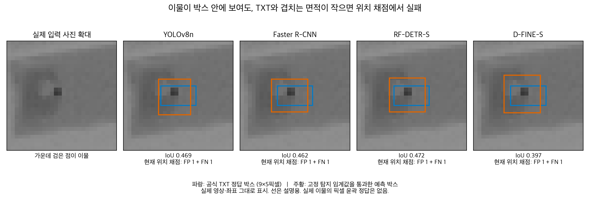

그림의 공식 TXT 박스는 9×5픽셀이다. 예측 박스는 검은 점을 포함하지만 크기·위치가 달라 IoU가 0.397~0.472다. ‘라벨과 거의 같은 사각형’이 필요한 것은 아니지만, 현재 기준의 0.5에는 미달한다. 이 사례를 네 모델 모두 이물 자체를 인식하지 못한 것으로 해석하지 않는다.

현장 목적에 맞는 현재 제안은 **위치 정확성·이물 사진의 무경보·정상 오경보와 재검사량을 함께 평가하는 것**이다. 위치 정확성과 무경보는 18.1~18.3절에 이미 별도로 계산했다. 정상 오경보와 재검사량은 실제 정상 제품이 없어 미검증이다. 현장 운영 임계값은 FN의 위험과 재검사 용량을 고려해 별도 검증 자료에서 정해야 한다. 검증 최고 F1 임계값이 안전 목적의 최적 임계값이라는 뜻은 아니다.

‘이물 포함’을 새 수치로 평가하려면 모델과 독립적으로 확인한 이물 중심 또는 픽셀 윤곽, 허용 크기·거리·중복 대응 규칙이 필요하다. 사진 전체를 덮는 박스를 무조건 위치 탐지 성공으로 인정하면 위치 안내 능력을 구분할 수 없다. 전체 사진의 이상 여부만 판정하려면 사진 단위의 정상·이상 평가를 사용한다. 새 기준을 지금 테스트에 적용한 수치는 탐색적 분석으로 표시하고 별도 촬영 자료에서 확인해야 한다. 이번 작업은 기존 기준과 TP·FP·FN을 변경하지 않았다.

근거와 상세 설명: [데이터 전처리 정리본 9.8절](19_데이터전처리_정리본.md#98-이물이-예측-박스-안에-있으면-찾은-것으로-보아도-되는가), `scripts/xray_review_localization.py`, `reports/common_epoch_20261004/evaluation/diagnostics/containment_review.{json,csv}`. 시각 검토는 같은 폴더의 `containment_visual_review.json`에 기록했다. 작은 객체의 IoU 민감도는 [Wang 등의 연구](https://arxiv.org/abs/2110.13389)를 참고했으며, 우리 데이터의 공장 적용 성능을 보장하는 근거로 사용하지 않는다.

### 18.10. 다음 비교는 위치 안내와 사진별 검출을 먼저 확인한다

현재 관찰만으로 새 모델 재학습을 반복하지 않는다. 저장된 예측으로 다음 보완을 먼저 진행하는 계획이다. 이번 문서 수정에서 새 기준의 성능표를 계산한 것은 아니다.

1. 화면의 고정 크기 표시와 채점용 박스를 구분한다. 위치 안내용 표시는 모델 중심 주변에 그릴 수 있으나 원래 예측 좌표·크기는 보존한다.
2. 학습·검증 자료에서 중심 위치 오차를 평가할 단위와 허용 범위, 일대일 대응을 정한다. TXT 중심이 실제 이물 중심과 완전히 같지는 않다는 한계를 기록한다. 이미 본 테스트의 새 지표는 탐색적 보조 결과다.
3. 네 모델에 같은 기준을 적용하고, IoU 위치 기준·사진에 표시가 없는 수·중심 위치 오차·처리 시간을 함께 비교한다. 테스트에 맞춰 모델이나 임계값을 다시 고르지 않는다.
4. 운영 탐지 임계값은 검증에서 임계값별 검출과 추가 표시 수의 관계를 먼저 살핀다. 정상 제품 자료가 없어 재검사량과 출하 안전성은 확정하지 않는다.
5. 검증 선택 근거와 실행 속도를 바탕으로 최종 모델을 제안하고, 팀이 운영 목적과 한계를 확인한다. 추가 학습은 분석으로 구체적인 개선 가설이 생겼을 때 검토한다.

현재 표의 FN은 **위치 기준 FN**으로 읽는다. ‘경보가 전혀 없는 사진’은 임계값 이상 예측이 없는 사진이며 실제 제품 출하 결과가 아니다. 고정 크기 박스의 장단점과 현장 용어는 [전처리 정리본 9.9절](19_데이터전처리_정리본.md#99-고정-크기-표시-박스와-쉬운-판정-용어)에 그림과 함께 정리했다.


### 18.11. AI 보조 시각 평가 결과

사용자는 IoU의 박스 경계 일치와 별도로, AI가 사진을 보고 실제 이물 표시를 확인하는 평가를 요청했다. 검증 12장 사전 점검 후 테스트 97장·225개 이물과 채택 예측 899개를 검토했다. 원래 IoU 기준 점수는 그대로 보존한다.

| 모델 | AI 검토 TP | 중복·잘못된 표시 FP | 표시 누락 FN | AI 보조 F1 |
|---|---:|---:|---:|---:|
| YOLOv8n | 224 | 0 | 1 | 0.9978 |
| Faster R-CNN | 225 | 0 | 0 | 1.0000 |
| RF-DETR-S | 224 | 0 | 1 | 0.9978 |
| D-FINE-S | 225 | 1 | 0 | 0.9978 |

이 값은 고정된 탐지 임계값에서 검은 중심의 표시와 중복을 판정한 **단일 AI 검토의 탐색적 지표**다. 전체 물체 윤곽·전문가 확인·독립 자료를 통한 AI 검토자 정확도는 미검증이다. 12장 사전 점검은 별도 정답을 가진 평가자 신뢰도 시험이 아니다. 미해결로 남긴 사례는 없었지만 이것이 검토 오류가 없다는 뜻은 아니다.

Faster R-CNN은 이 기준에서 표시 누락과 중복이 없었다. D-FINE-S는 표시 누락이 없고 중복 1개였다. YOLOv8n과 RF-DETR-S는 서로 다른 사진에 한 개씩 표시하지 않았다. 작은 차이와 이미 본 테스트이므로 이 결과만으로 최종 모델을 바꾸지 않는다. [실제 사진과 절차](19_데이터전처리_정리본.md#910-ai가-사진을-보고-모델의-이물-표시를-확인한-평가), [판정 원문](evidence/common_epoch_20261004/visual_review/README.md).

### 18.12. 현장 적용 후보: 빠른 모델 다음에 정밀 검토 모델

사용자 제안은 **단계적 추론(cascade)**이다. 첫 모델이 전체 사진을 빠르게 검사하고, 정해 둔 조건을 만족하는 사진만 두 번째 모델이 다시 검사한다. 저비용 영상 모델과 참조 모델을 연결하는 [NoScope](https://arxiv.org/abs/1703.02529), 판단을 보류하는 비율과 오류를 함께 다루는 [SelectiveNet](https://arxiv.org/abs/1901.09192)이 개념적 근거다. 해당 연구가 우리 식품 X-ray의 안전성을 증명한 것은 아니다.

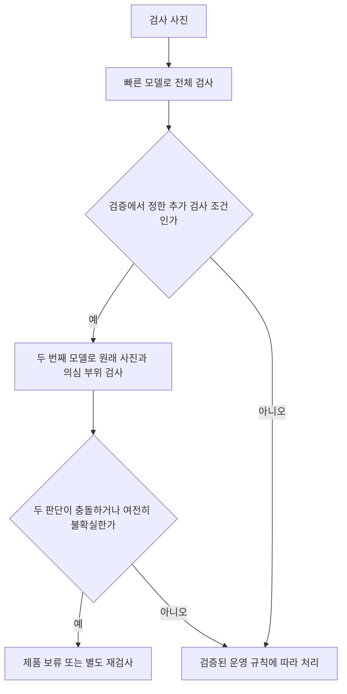
```mermaid
flowchart TD
    A[검사 사진] --> B[빠른 모델로 전체 검사]
    B --> C{검증에서 정한 추가 검사 조건인가}
    C -->|예| D[두 번째 모델로 원래 사진과 의심 부위 검사]
    C -->|아니오| E[검증된 운영 규칙에 따라 처리]
    D --> F{두 판단이 충돌하거나 여전히 불확실한가}
    F -->|예| G[제품 보류 또는 별도 재검사]
    F -->|아니오| E
```

1. 첫 모델은 현재 속도 측정에서 빠른 YOLOv8n을 후보로 둘 수 있다. 두 번째 모델은 이름·크기보다 **첫 모델의 어려운 사진에서 실제로 오류를 줄이는가**로 정한다. D-FINE-S·RF-DETR-S·Faster R-CNN 또는 X-ray에 대해 검증한 영상언어모델이 비교 대상이 될 수 있다.
2. 추가 검사 조건은 중간 탐지 점수, 흐림·잘림 등 입력 문제, 예측의 불안정성 등을 검증 자료에서 시험해 정한다. 이는 아직 구현·검증한 조건이 아니다. 정답 라벨에서 계산한 크기·대비 정보를 현장 입력 조건으로 직접 사용하는 것은 금지한다.
3. 박스가 없다고 정상 확률이 높다는 뜻은 아니다. 첫 모델이 확신하며 놓친 사진은 점수 구간만으로 두 번째 모델에 전달되지 않을 수 있다. 무검출 사진의 처리와 표본 재검사·독립 이상 신호도 따로 검증해야 한다.
4. 두 번째 모델에 첫 모델의 잘린 박스만 주면 박스 밖 누락을 복구하기 어렵다. 원래 사진도 제공한다. 첫 모델의 이상 경고를 두 번째 모델이 부정했다는 이유만으로 자동 정상 처리하지 않고, 충돌은 보류하는 보수적 방안부터 비교한다.
5. 실제 정상·이상 제품, 제품·날짜가 분리된 자료에서 추가 검사 비율, 복구된 미탐, 새로 생긴 오탐·미탐, 평균 및 지연 상위 구간, 대기열·시간 초과를 함께 측정한다. 같은 장치에서 직렬 실행할 경우 평균 시간의 1차 근사는 `첫 모델 시간 + 추가 검사 비율 × 두 번째 모델의 해당 사진 평균 시간`이다. 병렬 처리·대기·통신·설비 시간을 제외한 근사이며 실제 측정으로 검증해야 한다.

현재 MPS 평균 시간은 YOLOv8n 11.71ms, D-FINE-S 24.74ms, RF-DETR-S 38.29ms, Faster R-CNN 1396.65ms다. 이 값은 같은 맥북에서 측정한 단일 모델 값이며 공장의 목표 처리량이나 두 단계 시스템 속도가 아니다. 실시간 2차 검사에는 전용 탐지 모델을 먼저 비교하고, 범용 AI 에이전트는 별도 재검사·오류 설명 용도를 후보로 검토한다. 영상언어모델의 지연·오판·버전 변경은 별도로 검증해야 한다.

이 절은 현장 구조의 제안이다. 이후 저장 예측을 이용한 검증 재현 분석은 18.13절에서 수행했다. 현장 두 단계 추론 시스템·자동 PASS 설정은 아직 구현하지 않았다. 현재 정상 제품 자료가 없어 자동 PASS와 재검사 처리량을 확정할 수 없다.

### 18.13. 조건별 전문 모델 연구와 단계적 추론의 첫 실험

**결론: 빠른 기본 모델과 필요한 경우만 쓰는 보완 모델의 구조는 타당한 연구 방향이다. 현재는 A·B·C 전용 모델을 각각 학습하기보다, 재검사 조건과 보완 모델 하나부터 검증한다.** 전문 모델은 특정 조건을 더 많이 학습하거나 다른 크기로 사진을 검사하는 모델이다. 모델의 구조를 반드시 바꿔야 하는 것은 아니다. 여러 모델을 외부 규칙으로 연결하는 방식이며, 신경망 내부의 Mixture-of-Experts를 구현했다는 뜻도 아니다.

#### 연구 근거와 우리 자료에 적용할 범위

| 연구 | 확인한 내용 | 이번 프로젝트의 선택 |
|---|---|---|
| [NoScope, PVLDB 2017](https://arxiv.org/abs/1703.02529) | 특정 영상에 맞춘 저비용 모델과 참조 모델을 단계적으로 연결하고 비용·정확도를 함께 비교함 | 모든 사진을 무거운 모델 여러 개로 처리하지 않고 필요한 사진을 전달하는 구조를 검토 |
| [Learning to Defer to Multiple Experts, AISTATS 2023](https://proceedings.mlr.press/v206/verma23a.html) | 어떤 전문가가 해당 입력에서 정답을 낼지 추정하고 전문가를 선택하는 문제를 다룸 | 전문가의 전체 평균 성능뿐 아니라 **전달된 사진에서의 성능**을 확인. 서로 다른 모델 점수를 그대로 평균내지 않음 |
| [OHEM, CVPR 2016](https://www.cv-foundation.org/openaccess/content_cvpr_2016/html/Shrivastava_Training_Region-Based_Object_CVPR_2016_paper.html) | 학습 중 어려운 예제를 선택하여 탐지 학습을 개선함 | 실제로 반복해서 틀리는 학습 사례의 비중을 높이는 fine-tuning 후보. 이번에 OHEM 알고리즘 자체를 구현한 것은 아님 |
| [SAHI, ICIP 2022](https://arxiv.org/html/2202.06934v2) | 겹치는 영역으로 사진을 잘라 확대 검사하고 결과를 합침. 학습에서도 잘린 사진과 전체 사진을 함께 사용 | 작은 이물용 두 번째 검사 후보. 전체 사진도 함께 확인하며 잘린 경계·중복·추가 처리 시간을 검사 |

위 연구의 자료와 평가 목적은 식품 X-ray 검사와 다르다. 논문에서 효과가 있었다는 사실은 우리 현장의 성능 보장이 아니다. 또한 현재 사진은 초고해상도 항공 영상이 아니므로 SAHI의 이득을 그대로 기대하지 않는다. 확대는 원본에 없는 정보를 만들지 않는다.

#### 실제로 실행한 분석

학습과 새 테스트는 하지 않았다. **같은 맥북 MPS에서 생성한 검증 사진 107장의 저장 예측**을 CPU로 재채점했다. 정답 박스는 243개다. 네 모델의 선택 저장본과 탐지 임계값은 그대로 유지했다. 채점기는 기존 `scripts/xray_eval.py`이며 위치 기준은 IoU ≥ 0.5다. D-FINE-S는 CUDA 검증과 MPS 검증의 차이가 있으므로 이번 비교는 모두 MPS 예측으로 통일했다.

검증 결과를 읽기 전에 이번 분석의 규칙과 입력 해시를 `policy.json`에 저장했다. 다만 검증 자료는 이미 저장본·임계값 선택에 사용했고 이전 테스트 열람 이력도 있다. 이번 실험은 **개발용 탐색 분석**이며 독립적인 최종 성능 검증이 아니다.

YOLOv8n의 위치 기준 미탐은 3개였다. 정답을 알고 사후에 비교하면 다음 보완 관계가 있다.

| 두 번째 모델 후보 | YOLOv8n의 위치 기준 미탐 3개 중 해당 모델이 맞힌 수 | YOLOv8n이 맞혔지만 해당 모델이 틀린 수 |
|---|---:|---:|
| Faster R-CNN | 3 | 2 |
| RF-DETR-S | 2 | 1 |
| D-FINE-S | 3 | 4 |

이 표는 **오류를 보완할 가능성**이다. 실제 운영에서는 정답을 모르므로 올바른 박스만 골라 합칠 수 없다. 따라서 이 표를 결합 모델 F1이나 개선된 실제 이물 검출률로 보고하지 않는다. 두 번째 모델의 결과로 첫 번째 결과를 무조건 덮어쓰면 새 오류가 생길 수 있다.

#### 점수가 애매한 사진만 고르면 충분한가

첫 모델의 탐지 임계값은 0.68106407이다. 예시 규칙의 점수 구간은 임계값 ±0.05로 고정했다. 이 구간은 보정된 오류 확률이나 신뢰구간이 아니다. 정답 없이 저장 예측에서 계산할 수 있는 단순 개발용 조건이다.

| 추가 검사 규칙 | 전달된 검증 사진 | YOLOv8n의 위치 기준 미탐 3개 중 전달된 수 |
|---|---:|---:|
| 채택된 예측 박스가 없는 사진 | 0장 | 0개 |
| 위 조건 또는 점수가 임계값 ±0.05인 후보가 있는 사진 | 1장 | 0개 |
| 위 조건에 나머지 사진의 20% 무작위 표본 검사 추가, seed 0 | 23장 | 0개 |
| 모든 사진을 두 번째 모델에도 전달하는 대조 실험 | 107장 | 3개 |

따라서 이번 점수 규칙은 해당 위치 오류를 잡아내지 못했다. 한 번의 무작위 표본 검사에서 찾지 못했다고 표본 검사 일반이 무효라는 뜻은 아니다. 첫 모델이 한 이물을 자신 있게 표시하면서 다른 이물을 놓칠 수도 있으므로, 사진에 박스가 있다는 사실만으로 모든 이물을 찾았다고 판단하지 않는다.

전체 사진의 결과를 D-FINE-S로 교체하는 대조 실험에서는 YOLOv8n의 위치 오류 3개를 고쳤지만 새 위치 오류 4개가 생겼다. FN은 3개에서 4개로 바뀌었다. 두 모델의 올바른 결과만 골라 FN을 0개로 만들 수 있다는 계산은 정답을 사용하는 사후 상한이며 실행 가능한 판정 규칙이 아니다. 충돌한 예측을 보존하고 추가 검토하는 설계가 필요한 이유다.

시간은 기존 사진별 실측 기록을 더해 추정했다. 전체 사진을 YOLOv8n과 D-FINE-S에 직렬로 전달하면 평균 약 36.45ms로 추정된다. 실제 두 모델 동시 상주, 모델 전환, 재검사 규칙 계산, 잘린 사진 검사, 대기열, 설비 통신을 측정한 값은 아니다. 재검사 비율도 이물 사진만 있는 검증 자료의 값이며 공장의 비율로 사용하지 않는다.

#### 이어서 실행한 반전 안정성 검사

점수 규칙 다음에는 **사진을 좌우로 뒤집어도 같은 위치를 표시하는가**를 시험했다. 기존 YOLOv8n으로 검증 107장의 원래 사진과 반전 사진을 맥북 MPS에서 실제 추론했다. 반전 사진의 예측 좌표를 원래 방향으로 되돌린다. 두 예측 목록을 IoU 0.5로 일대일 대응시켰을 때 남는 박스가 있거나 원래 예측이 없으면 추가 검사 대상으로 정했다. 이 대응은 예측과 예측의 일관성 비교이며 정답을 사용하는 채점과 구분한다.

규칙은 새 추론 전에 고정했고 정답은 추가 검사 대상 선택에 사용하지 않았다. 8장이 선택됐으며 YOLOv8n의 위치 오류 3개 중 1개가 포함됐다. 해당 사진에서 두 번째 모델의 기존 MPS 예측으로 첫 모델 예측을 바꾸는 대조 분석을 수행했다.

| 방식 | 두 번째 모델에 전달한 사진 | 위치 TP | 위치 FP | 위치 FN | 검증 F1 |
|---|---:|---:|---:|---:|---:|
| 새 추론 YOLOv8n 단독 | 0장 | 240 | 4 | 3 | 0.9856 |
| 반전 규칙 → Faster R-CNN 결과로 교체 | 8장 | 241 | 2 | 2 | 0.9918 |
| 반전 규칙 → RF-DETR-S 결과로 교체 | 8장 | 241 | 2 | 2 | 0.9918 |
| 반전 규칙 → D-FINE-S 결과로 교체 | 8장 | 240 | 4 | 3 | 0.9856 |

이번 전달 조건에서는 RF-DETR-S와 Faster R-CNN이 위치 오류를 줄였다. MPS 단일 모델 속도를 고려하면 **YOLOv8n + RF-DETR-S를 다음 시제품의 우선 후보**로 두는 것이 합리적이다. D-FINE-S는 전체 오류의 보완 가능성이 있지만 이 전달 조건에서는 순개선이 없었다. 자료와 전달 조건이 바뀌면 순위가 달라질 수 있다.

첫 모델의 원래 사진 재추론은 기존 TP·FP·FN·F1을 재현했다. 첫 구현은 점수를 NumPy float32에서 Python float로 바꾸어 CSV에 기록하면서 임계값과 같은 경계 점수 1개가 다르게 채택됐다. 그 결과는 `consistency/`에 보존하고 비교에서 제외했다. `consistency_native_csv/`에서는 기존 공통 exporter의 NumPy 연산·CSV 저장 형식을 그대로 사용했다. 탐지 임계값을 낮추거나 근사 비교를 추가하지 않았다. 이는 앞으로 직접 연결하는 시제품에서도 점수 저장 정밀도를 고정해야 함을 뜻한다.

실행한 범위는 **YOLO 원래 사진·반전 사진 새 추론 + 두 번째 모델 저장 예측 재현 분석**이다. 두 모델을 실제로 연결한 지연·메모리·실시간 성능 시험은 아니다. 반전 검사는 첫 모델을 한 번 더 실행하므로 비용이 든다. 같은 위치를 일관되게 틀리는 오류도 남는다. 개선한 위치 오류가 실제 이물 표시 누락이었다고 주장하지 않는다. 기준과 파일은 `cascade_audit/consistency_native_csv/`에 보존한다.

#### 위치 오류를 실제 표시 누락으로 오해하지 않기

아래는 이번 검증에서 YOLOv8n이 위치 기준으로 틀린 세 사례다. 사진과 예측 좌표를 직접 대조했다. 세 사례 모두 주황 예측 박스 안에 검은 이물 중심이 보였다. 이는 단일 AI의 국소 시각 확인이다. 전체 검증 자료에 새 시각 F1을 산출한 것은 아니다.

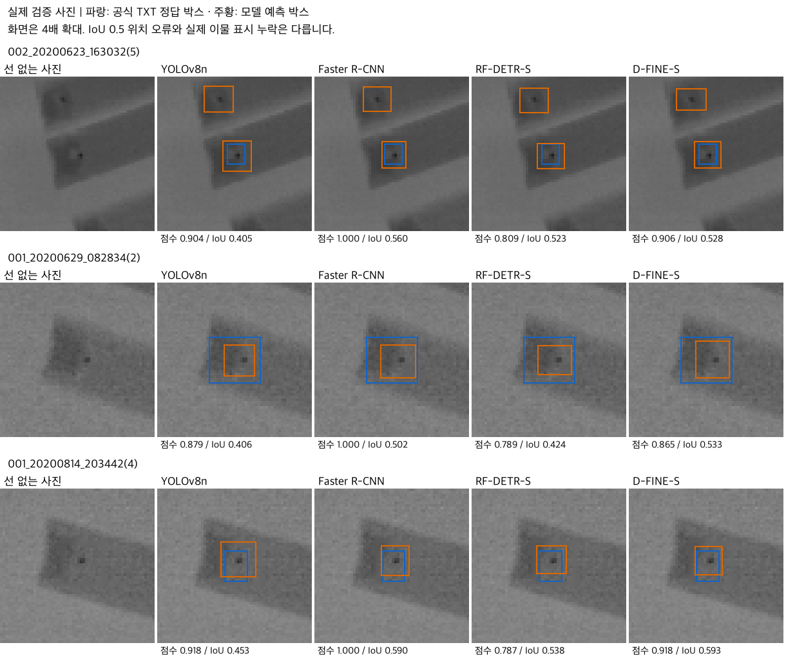

파란 선은 공식 TXT 정답 박스이고 주황 선은 모델 예측이다. 왼쪽에는 선 없는 사진을 함께 표시했다. YOLOv8n의 해당 예측 점수는 약 0.904·0.879·0.918로 임계값 근처가 아니었다. IoU는 약 0.405·0.406·0.453이었다. **이 세 사례는 경계가 다른 문제이며, 이것만으로 작은 이물 전용 모델의 필요성을 입증할 수 없다.** 기존 IoU 결과를 유지하면서 실제 표시 누락과 중복을 따로 검토한다.

#### A·B·C 전문 모델을 만들 자료가 있는가

공식 학습 자료는 296장·679개 정답 박스·67개 촬영 묶음이다. 다음 조건은 학습 자료의 하위 25% 경계로 정했다. 같은 값이 많아 정확히 25%의 박스가 되는 것은 아니다. 사진 하나가 여러 조건에 들어갈 수 있다.

| 전문화 후보 조건 | 해당 학습 사진 | 촬영 묶음 | 해석의 한계 |
|---|---:|---:|---|
| 작은 이물: 정답 박스 긴 변 ≤ 10픽셀 | 148장 | 42개 | 박스 크기이며 실제 이물의 물리적 크기가 아님 |
| 낮은 대비: 현재 명암 차이 대리지표 ≤ 42.5 | 109장 | 30개 | 공식 위치 주변에서 계산한 값. 놓친 이물의 운영 판단 신호로 바로 쓸 수 없음 |
| 제품 외곽에 가까움: 현재 거리 대리지표 ≤ 약 45.84픽셀 | 162장 | 36개 | 대략적인 제품 마스크 기준이며 실제 막대 경계와 다를 수 있음 |

각 조건의 학습 자료는 존재한다. 그러나 검증에서 반복되는 실제 표시 누락을 충분히 확인하지 못했다. 조건의 사진 수만으로 전문 모델의 효과를 보장할 수 없다. 증강 사진을 늘려도 독립적인 촬영 묶음 수가 늘어나는 것은 아니다. 길쭉함도 정답 박스 가로세로비만으로는 이물 형상을 확정할 수 없다.

#### 결정과 후속 실행 순서

1. **완료:** 논문 조사, 저장 예측의 보완 관계 분석, 추가 검사 조건 네 가지 재현, 실제 오류 사진 확인, 조건별 학습 자료 수 확인. 추가로 원래 사진·반전 사진 실제 추론과 안정성 규칙의 저장 예측 재현도 마쳤다.
2. **다음:** YOLOv8n + RF-DETR-S의 실제 연결 시제품에서 평균·상위 지연, 메모리, 새 오탐·누락, 의견 충돌과 시간 초과 처리를 검사한다. 원래 사진도 두 번째 모델에 전달한다. 원래의 경고를 조용히 취소하지 않는다. 결과 교체 실험과 실제 보수적 처리 정책의 지표를 구분한다.
3. **보완 모델 후보:** 현재 반전 규칙에는 RF-DETR-S를 우선 후보로 둔다. D-FINE-S는 대안이며 Faster R-CNN은 별도 재검사 자원의 속도를 확인한 뒤 검토한다. 두 번째 모델을 실행한 후 생기는 의견 차이를 첫 단계의 비용 없는 조건처럼 사용하지 않는다. 흐림·잘림 등 추가 신호도 정답 없이 계산 가능한지 먼저 확인한다.
4. **추가 학습의 조건:** 실제 표시 누락이 특정 조건에서 반복되고 학습 자료로 개선할 근거가 생기면 전문 모델 하나를 학습한다. 작은 이물이라면 전체 사진과 겹치는 확대 영역을 함께 사용하고, 낮은 대비라면 해당 실제 사례의 학습 비중을 높인다. 일반 사진도 섞고 다른 조건의 새 오류를 함께 측정한다. 세 전문 모델을 동시에 학습하지 않는다.
5. **누출 방지:** 검증·테스트 오류 사진을 추가 학습에 넣지 않는다. 어려운 학습 사례를 찾을 때는 기본 학습 자료 안에서 촬영 묶음을 나눠, 해당 묶음을 배우지 않은 모델의 예측을 사용한다. 기존 전체 학습 저장본을 학습 내부의 독립 검증 모델로 재사용하지 않는다. 관련 증강 사진·의사 라벨의 촬영 묶음도 함께 관리한다.
6. **확정 전:** 실제 정상·이상 제품과 새로운 날짜 자료에서 표시 누락, 잘못된 표시, 추가 검사 비율, 처리 지연을 함께 확인한다. 충돌·시간 초과는 보류 대상으로 설계한다. 정상 자료가 없는 현재 단계에서는 PASS의 안전성과 현장 재검사량을 확정하지 않는다.

실행: `.venv/bin/python scripts/xray_cascade_audit.py`. 그림: `scripts/xray_cascade_figure.py`. 원본 결과는 `reports/common_epoch_20261004/evaluation/cascade_audit/`에 있다. [공유용 수치·규칙·한계](evidence/common_epoch_20261004/cascade_audit/README.md)를 함께 보존한다. 새 전문 모델 학습·공장 시스템 배포·새 테스트 최적화는 이번에 수행하지 않았다.


### 18.14 두 모델 실제 연결 시험과 추가 학습 결정

사용자는 **두 모델의 결과가 다르면 두 결과를 보존하고 재검사 대상으로 남기는 방식**을 선택했다. 이 규칙으로 YOLOv8n과 RF-DETR-S를 실제로 연결했다. 저장 예측을 교체해 계산한 18.13절의 대조 분석과 구분한다.

1. 색 네모를 제거한 원래 사진과 좌우 반전 사진을 YOLOv8n으로 검사한다.
2. 반전 예측을 원래 좌표로 돌린다. IoU 0.5 일대일 대응에서 남는 박스가 있거나 원래 사진에 채택 예측이 없으면 RF-DETR-S가 **전체 원래 사진**을 검사한다. 전달 조건에 정답 라벨을 사용하지 않는다.
3. 두 모델의 채택 예측도 같은 방식으로 대응시킨다. 서로 대응되지 않는 박스가 남으면 두 결과를 보존하고 재검사 상태로 남긴다. 여기서 일치는 같은 이물의 물리적 정체를 확인했다는 뜻이 아니라 예측 위치 목록의 일치다.
4. 실행 오류, 개발용 시간 예산 초과, 추가 검사 후에도 무검출인 상태는 재검사로 남긴다. 현재 시제품은 자동 PASS를 출력하지 않는다. 첫 번째 모델에서 안정적으로 탐지한 사진은 탐지 상태로 기록한다.

#### 실제 맥북 실행 결과

선택 저장본·탐지 임계값·해시는 유지했다. 맥북 MPS, 두 모델 메모리 상주, FP32, 입력 512, seed 0으로 검증 107장·243개 이물을 3회 추론했다. 테스트는 추가 실행하지 않았다.

| 항목 | 결과 | 뜻 |
|---|---:|---|
| 첫 모델만 검사 | 회당 99장 | 원래 사진과 반전 사진의 채택 예측이 대응됨 |
| 두 번째 모델도 검사 | 회당 8장 | 추가 확인이 필요하다고 전달한 사진 |
| 두 모델의 예측이 대응됨 | 회당 7장 | 예측 박스 목록이 일대일 대응됨 |
| 두 모델 판단 충돌 | 회당 1장 | 두 결과를 보존하고 재검사로 남김 |
| 전체 평균 처리 시간 | 19.03ms | 107장×3회, 총 321회 측정 |
| 전체 P95 처리 시간 | 43.56ms | 관측 시간의 95%가 이 값 이하 |
| 두 번째 검사 대상 평균 | 47.37ms | 추가 검사된 8장×3회 |
| 실행 오류 / 시간 초과 | 0회 / 0회 | 이번 실행에서 관측한 횟수 |

시간에는 PNG 읽기, 반전, 필요한 추론, 점수 저장 정밀도 보존, 전달·대응 계산과 GPU 동기화가 포함된다. 모델 적재·워밍업·기록 파일 쓰기·색 네모 제거·촬영·설비 통신·대기열은 제외한다. 초기 모델 적재는 별도로 3.25초였다. MPS 메모리는 워밍업 후와 각 사진 처리 후에 확인했다. 관측 최대 드라이버 사용량은 1,359,790,080바이트이며 프로세스 전체 메모리나 실제 순간 최대 사용량은 아니다. 실제 정상 제품이 없어 8/107을 공장 재검사 비율로 해석하지 않는다.

1초 시간 예산은 개발용이다. 동기 호출이 반환된 뒤 시간을 확인하는 **soft deadline**이며 멈춘 GPU 호출을 강제로 종료하는 기능은 없다. 합성 입력의 상태 처리 단위 검사 9개를 통과했으나 실제 GPU 고장·강제 시간 초과 복구 시험을 했다는 뜻은 아니다.

세 반복 모두 YOLO 기본 결과는 TP/FP/FN 240/4/3, F1 0.9856262834를 재현했다. 추가 검사 8장의 예측을 RF-DETR-S 예측으로 바꾸는 **대조 분석**은 241/2/2, F1 0.9917695473이었다. 실제 정책은 예측을 임의 교체하지 않고 충돌을 보류한다. 따라서 이 수치를 최종 운영 시스템의 F1으로 쓰지 않는다.

#### 한 장에서 판단이 달랐던 이유

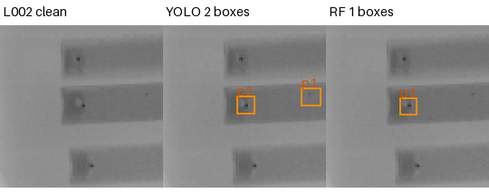

사진은 같은 위치를 확대했다. 왼쪽은 선 없는 사진, 가운데는 YOLOv8n, 오른쪽은 RF-DETR-S다. 설명을 위해 이 공식 이물과 주변 후보의 박스만 표시했다. 사진 속 다른 공식 이물은 별도 패널에서 확인했다.

- YOLO의 **p2**와 RF의 **p1**은 공식 이물의 검은 중심을 표시한다.
- YOLO의 오른쪽 **p1**은 공식 위치 밖의 흐린 무늬를 추가로 표시했다. RF-DETR-S는 이 위치를 채택하지 않았다.
- 선 없는 확대 사진으로도 추가 무늬가 실제 이물인지 확정하기 어려웠다. 정상으로 재라벨링하지 않고 두 결과와 재검사 상태를 보존했다.

#### 전문 모델을 추가 학습할 근거가 있는가

추가 검사 대상과 YOLO IoU 오류가 있는 사진을 합쳐 10장·공식 이물 28개를 검토했다. 이 범위에서 공식 이물의 검은 중심은 모두 YOLO 예측 안에 보였다. 추가 표시 1개는 위와 같이 판단 어려움으로 남겼다. 검토자는 모델 이름을 아는 단일 AI이며, 전체 검증 107장의 시각 F1이나 실제 제품의 누락률을 측정한 것은 아니다.

**현재 결정은 전문 모델 추가 학습 보류다.** 확인한 사례만으로 작은 이물·낮은 대비·특정 형상에서 실제 표시 누락이 반복된다는 근거가 부족했다. IoU 경계 오차를 이유로 A·B·C 전문 모델을 각각 만들지는 않는다. 후속 자료에서 누락 조건이 반복되면 학습 내부 촬영 묶음으로 어려운 사례를 찾고, 일반 사례와 함께 학습한 전문 모델 하나부터 비교한다. 검증·테스트 사진은 추가 학습에 넣지 않는다.

검증 자료를 여러 분석에 재사용한 탐색적 시제품이다. 다음 현장 검증에는 실제 정상·이상 제품, 새로운 날짜·호기, 자동 PASS의 누락 위험, 추가 검사량, 대기열·설비 지연이 필요하다. **현재 제출 제안은 YOLOv8n의 빠른 탐지 + 필요한 사진의 RF-DETR-S 추가 검사 + 판단 충돌 보존**이다. 독립 현장 검증 전 최종 출하 자동화 성능으로 표현하지 않는다.

[실행·규칙·예측·시각 검토 근거](evidence/common_epoch_20261004/cascade_live/README.md). 결과와 한계는 제출 검토본의 AI 보조 평가와 단계적 검사 부분에도 반영했다.


### 18.15 정확도 우선 재검사와 반전 검사의 사각지대 재검토

2026-10-04 사용자 추가 결정: 추가 검사는 속도보다 탐지 성능을 우선한다. 기존 YOLOv8n + 선택적 RF-DETR-S는 잠정 시제품이다. 최신 YOLO11·YOLO26과 전체 사진을 별도 모델이 검사하는 방안을 비교하고, 최종 선택 근거를 다시 정리한다.

#### 같은 결과가 반복되어도 틀릴 수 있다

현재 규칙에서 원래 사진에 예측 박스가 하나도 없으면 반전 결과와 관계없이 추가 검사로 보낸다. 따라서 두 사진에서 모두 무검출인 경우는 이미 추가 검사 대상이다. 남는 문제는 **일부 이물만 두 번 놓치거나, 같은 배경 무늬를 두 번 이물로 표시하는 경우**다. 반전 결과가 비슷하다는 사실은 예측의 일관성이며 정답의 증명이 아니다.

검증 107장의 기존 원래·반전 예측을 공식 IoU 0.5 기준으로 다시 채점했다. 추가 검사에서 제외된 사진은 99장이다. 두 방향에서 함께 FN이 된 공식 박스는 2개였고, 그중 1개는 추가 검사에서도 제외됐다. 두 방향에서 대응되는 FP도 1개였으며 같은 제외 사진에 있었다. 원래 YOLO의 위치 FN 3개 중 추가 검사에서 제외된 것은 총 2개다. 이 중 다른 1개는 반전 결과만 정답과 맞았지만 원래·반전 박스끼리도 충분히 겹쳐 추가 검사 조건을 통과하지 않았다. **예측끼리의 IoU와 정답과의 IoU는 서로 다른 비교다.**

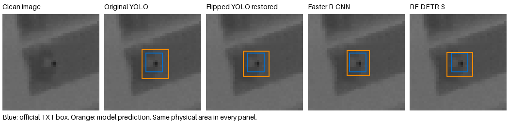

선 없는 사진과 네 예측을 직접 확인했다. 주황 박스 안에 검은 중심은 보인다. 이 사례는 위치 채점과 추가 검사 조건의 한계를 보여준다. 실제 이물을 보지 못한 사례로 부풀리지 않는다.

#### 정확도를 우선하면 추가 검사 모델을 다시 비교해야 한다

| 검증 결과, 고정 임계값 | Faster R-CNN | RF-DETR-S | D-FINE-S |
|---|---:|---:|---:|
| IoU 0.5 TP / FP / FN | 241 / 2 / 2 | 241 / 2 / 2 | 239 / 4 / 4 |
| F1 | 0.9918 | 0.9918 | 0.9835 |
| YOLO의 위치 FN 3개 중 해당 모델이 맞힌 수 | 3 | 2 | 3 |
| YOLO와 두 번째 모델이 함께 틀린 공식 박스 | 0 | 1 | 0 |
| 반전 규칙이 제외한 YOLO 위치 FN 2개 중 해당 모델이 맞힌 수 | 2 | 1 | 2 |
| YOLO가 맞혔지만 해당 모델이 틀린 수 | 2 | 1 | 4 |

공식 정답을 알고 사후에 계산한 보완 관계다. 올바른 결과만 골라 합칠 수 있다는 뜻은 아니다. Faster R-CNN은 속도가 느리다는 이유만으로 제외하지 않는다. RF-DETR와 검증 F1은 같고 YOLO의 위치 오류 보완 범위가 넓으므로 정확도 우선 추가 검사 후보로 다시 검토한다. 단일 AI 시각 평가의 1.0을 모델 선택의 확정 근거로 쓰지 않는다.

추가 검사 모델을 모든 사진에 적용해도 두 모델이 같은 실제 오류를 낼 수 있다. 실제 검출·중복·판단 어려움을 함께 확인하고, 자동 PASS로 연결하지 않는다. 원래·반전·다른 모델의 의견 일치만으로 출하 안전성을 보증할 수 없다. 점수만으로 잘못된 예측을 충분히 걸러내지 못하는 문제는 [Cattelan·Silva, UAI 2024](https://proceedings.mlr.press/v244/cattelan24a.html)에서도 다룬다. 해당 연구는 ImageNet 분류 연구이며 우리 X-ray의 해결책을 검증한 근거는 아니다.

#### YOLOv8n과 최신 YOLO를 구분해 설명한다

YOLOv8n은 주최측 베이스라인이며 기존 네 모델 중 실제 학습과 검증을 마친 빠른 후보였다. YOLO11·YOLO26보다 우수하다는 비교 근거는 없었다. 최신 모델을 제외한 상태에서 최적 모델이라고 쓰지 않는다.

[YOLO11 공식 설명](https://docs.ultralytics.com/models/yolo11)은 개선된 특징 추출과 COCO 정확도·효율을 보고한다. [YOLO26 논문](https://arxiv.org/abs/2606.03748)은 DFL을 제거한 박스 회귀, 선택 가능한 NMS 없는 출력, 작은 객체의 양성 학습 위치를 확보하는 STAL 등을 설명한다. 작은 공식 이물 박스가 많은 우리 자료에서 시험할 이유가 있다. COCO 향상이 X-ray 향상을 보장하지는 않는다.

YOLO11n·YOLO26n을 기존 YOLOv8n과 같은 전체 혼합 2,453장, 20epoch, batch 8, 512, seed 0, AdamW 조건으로 비교한다. 공식 최신 모델의 기본 학습법을 최적화한 실험이 아니라 공통 조건 비교다. 각 epoch의 검증 결과와 재개 저장본을 보존한다. 테스트로 저장본·임계값을 선택하지 않는다. 현재 설치된 패키지와 가중치에서 실제 사용한 출력 경로도 기록하며, YOLO26의 NMS 없는 경로를 사용했다고 이름만 보고 추정하지 않는다.

첫 YOLO26 epoch에는 음수 폭·높이 예측 9개가 있었다. 낮은 점수의 예측이지만 평가기가 이를 거부했다. 원본 실행을 보존하고, 새 두 YOLO 비교에는 음수 박스를 좌표 수정 없이 격리·기록하는 동일 처리를 적용한다. 각 epoch의 원본·유효·격리 예측과 건수를 남긴다. 기존 네 모델의 예측과 채점기는 바꾸지 않는다.

#### 운영·평가·보고서에서 함께 보완할 점

1. 반전 검사는 보조 신호다. 전체 추가 검사와 선택 검사에서 빠져나가는 오류를 비교한다. 일부 안정적 사진의 표본 검사는 감시 수단이며 모든 제품의 오류 방지가 아니다.
2. 추가 검사 모델은 실제 표시 누락, 잘못된 표시·중복, 첫 모델과의 공통 오류를 먼저 본다. 속도·대기열은 별도 자원 조건이다. 무한 대기나 시간 초과를 정상으로 처리하지 않는다.
3. 모든 사진이 이물을 포함하므로 정상 제품 오경보율과 실제 제조 불량 확률은 계산할 수 없다. 합성 정상 사진은 실제 정상 제품의 검증을 대신하지 않는다.
4. 검증 자료를 반복 사용했고 테스트도 이전에 열람했다. 새 분석을 독립적인 최종 시험으로 부르지 않는다. 새 촬영 묶음과 대표 정상·이상 자료의 평가가 필요하다.
5. AI 시각 검토는 보조 근거다. 실제 이물의 독립 정답·전문가 일치도 없이 AI 검토 F1을 최종 정확도로 단정하지 않는다.
6. 특정 조건의 실제 누락이 반복될 때만 전문 모델 학습을 검토한다. 검증·테스트 사진을 학습으로 옮기지 않는다. 일반 학습 사진도 함께 사용한다.

실행 근거: `scripts/xray_shared_error_audit.py`, `reports/design_review_20261004/shared_error_audit/`. [작은 공유 근거](evidence/common_epoch_20261004/design_review/summary.json). 최신 모델 학습 결과와 독립 추가 검사 실행 결과는 다음 절과 제출 검토본에 반영했다. 위 내용은 착수 당시의 검토 이유다.


### 18.16 최신 YOLO 공통 조건 비교 — 완료

YOLO11n과 YOLO26n을 전체 혼합 학습 2,453장·20epoch·batch 8·512픽셀·seed 0·AdamW로 학습했다. 기존 YOLOv8n과 같은 학습 조건이다. 검증 107장으로 저장본과 탐지 임계값을 정했다. 모델별 최적 학습법을 탐색한 비교는 아니다.

| 모델 | 선택 epoch | 검증 TP / FP / FN | 검증 F1 | 고정 임계값 테스트 TP / FP / FN | 테스트 F1 |
|---|---:|---:|---:|---:|---:|
| YOLOv8n | 20 | 240 / 4 / 3 | 0.9856262834 | 222 / 2 / 3 | 0.9888641425 |
| YOLO11n | 5 | 240 / 3 / 3 | 0.9876543210 | 216 / 7 / 9 | 0.9642857143 |
| YOLO26n | 13 | 240 / 3 / 3 | 0.9876543210 | 219 / 6 / 6 | 0.9733333333 |

기준은 공식 TXT와 IoU 0.5다. 테스트는 97장·225개 이물이다. YOLO11n의 탐지 임계값은 0.48035392, YOLO26n은 0.6521711이다. 검증 선택 후 그대로 적용했다. 최신 모델이 기존 모델보다 우수하다는 결과는 얻지 못했다. 특정 구조가 항상 열등하다는 뜻도 아니다.

검증 차이는 FP 1개이며 FN 총수는 같다. 검증 24개 촬영 묶음을 짝지어 2,000번 재표집했다. YOLO11n−YOLOv8n F1 차이의 95% 구간은 −0.0161290~0.0163968, YOLO26n−YOLOv8n은 −0.0149263~0.0190286이었다. 모두 0을 포함한다. 선택 저장본과 임계값을 고정한 조건부 분석이며, 선택 불확실성이나 새 공장 성능을 포함하지 않는다.

YOLO26n의 실제 출력 경로는 `end2end=false`다. NMS 없는 실행이나 기본 MuSGD 성능을 주장하지 않는다. 첫 epoch의 음수 폭·높이 박스 9개, 두 번째 1개는 원본을 보존하고 격리했다. 세 번째 이후와 선택 저장본에는 없었다. 최초 실패 run도 보존했다. epoch 1 저장 후 중단하고 epoch 2부터 복구하는 과정도 실제 확인했다.

같은 맥북 MPS에서 검증 107장×3회 추론했다. YOLO11n 평균 9.96ms·P95 19.30ms, YOLO26n 평균 12.55ms·P95 23.47ms였다. PNG 읽기·촬영·색 네모 제거·대기 시간은 제외한다. 세 번의 지표는 동일했고 격리 박스는 0개였다.

새 테스트에 앞서 `proposal_frozen.json`에 F1 우선 제안 YOLO11n + RF-DETR-S와 임계값을 기록했다. 이후 사용자가 식품 FN 위험을 우선하도록 명시했다. 이에 이미 계산한 검증의 공통 오류를 중심으로 연구 제안을 수정했다. 이전 제안과 변경 이유를 모두 보존한다. 테스트로 임계값을 재조정하지 않았지만, 테스트 열람 이후의 선택 변경이므로 새 독립 자료에서 확인해야 한다. 과거 열람한 테스트를 처음 보는 최종 시험으로 표현하지 않는다.

근거: `reports/design_review_20261004/latest_validation_comparison.json`, `latest_validation_uncertainty.json`, `latest_inference_validation.json`, `latest_test_descriptive.json`, `proposal_frozen.json`, `food_fn_priority_proposal.json`.

### 18.17 식품 이물 미탐 위험을 우선한 전체 추가 검사

**현재 연구 제안은 YOLOv8n과 Faster R-CNN이 모든 사진을 각각 검사하는 방식이다.** 반전 결과가 같아도 두 번째 검사를 생략하지 않는다. YOLOv8n은 빠른 초기 경고를 제공한다. Faster R-CNN은 전체 사진을 독립적으로 확인한다. 두 번째 모델도 실패할 수 있으므로 일치 여부만으로 정상 출하를 허용하지 않는다.

검증에서 Faster R-CNN은 YOLOv8n의 위치 FN 3개를 모두 맞혔다. 두 모델의 공통 위치 FN은 0개였다. RF-DETR-S는 자체 FP·FN 2개씩으로 Faster와 같았지만 YOLO와의 공통 FN은 1개였다. D-FINE-S도 공통 FN은 0개였지만 자체 FP·FN이 4개씩이었다. 이 비교는 **정답을 보고 계산한 오류 보완 가능성**이다. 올바른 결과만 골라 합친 운영 F1이나 실제 식품 미탐률이 아니다.

D-FINE의 위 결과는 고정 임계값 MPS 재실행 값이다. 앞선 저장본 선택 당시 CUDA 검증 F1 0.9856과 구분한다. 같은 저장본의 한 예측 점수가 장치 변경 뒤 임계값 아래로 내려가 MPS F1은 0.9835였다.

| 실제 전체 추가 검사 | 회당 사진 | 반복 | 평균 / P95 | 회당 판단 대응 / 충돌 |
|---|---:|---:|---:|---:|
| YOLOv8n + Faster R-CNN | 107 | 3 | 1226.52 / 1253.56ms | 106 / 1 |
| YOLO11n + RF-DETR-S | 107 | 3 | 39.57 / 52.05ms | 107 / 0 |

각 실행에서 오류는 없었다. 두 번째 조합은 모든 사진에서 판단이 대응했지만 공통 IoU FN 1개가 남았다. 이는 모델 간 의견 일치가 정답 증명이 아님을 보여준다. Faster 조합의 충돌 사진은 `002_20200625_042957(3)`이며 추가 무늬의 실제 이물 여부를 확정하지 않았다. 두 예측을 모두 보존하고 재검사로 남겼다.

시간은 모델이 이미 메모리에 있는 상태의 PNG 읽기·추론·대응 비교·동기화다. 촬영·색 네모 제거·설비 통신·대기열·기록 저장은 제외한다. Faster 전체 검사는 병목이 될 수 있다. 정확도가 우선이라는 이유로 처리량 문제를 무시하지 않는다. 현장 GPU, 제품 간격, 재검사 경로, 병렬 검사 수를 확인해야 한다.

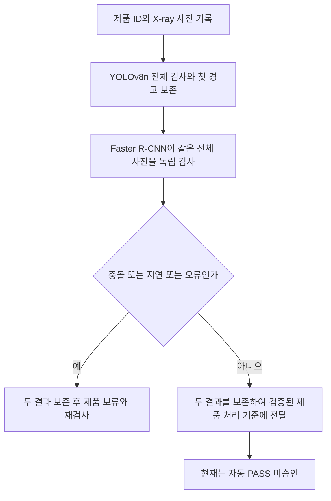
```mermaid
flowchart TD
 A[제품 ID와 X-ray 사진 기록] --> B[YOLOv8n 전체 검사와 첫 경고 보존]
 B --> C[Faster R-CNN이 같은 전체 사진을 독립 검사]
 C --> D{충돌 또는 지연 또는 오류인가}
 D -->|예| E[두 결과 보존 후 제품 보류와 재검사]
 D -->|아니오| F[두 결과를 보존하여 검증된 제품 처리 기준에 전달]
 F --> G[현재는 자동 PASS 미승인]
```

제품 ID와 사진 해시가 다른 결과는 거부한다. 같은 결과를 중복 전송해 첫 경고를 지우지 못하게 한다. 기한을 넘긴 제품은 결과가 나중에 와도 보류를 자동 해제하지 않는다. 이 상태 처리는 `xray_inspection_gate.py`로 구현했고 단위 검사 7개를 통과했다. **실제 GPU 강제 중단·영구 대기열·PLC·배출기 제어는 구현·검증하지 않았다.** 실제 두 모델 추론과 이 상태 처리의 단위 검사는 구분한다.

현장 평가는 이물 제품 중 경고 없이 통과한 비율을 우선한다. 오경보, 재검사량, 처리 시간 초과도 함께 측정한다. 현재 검증·테스트의 실제 정상 제품은 0장이다. 공장용 정상 통과 임계값, 실제 불량 확률, 허용 미탐률은 정할 수 없다. 이물이 없는 사진도 두 모델의 무검출만으로 자동 정상 판정하지 않는다.

근거: `reports/design_review_20261004/yolo8_faster_all/summary.json`, `yolo11_rfdetr_all/summary.json`, `six_model_validation.json`, `scripts/xray_inspection_gate.py`.

### 18.18 실제 누락 검토와 전문 모델 결정

최신 모델의 검증 오류 위치 5개와 테스트 오류 위치 12개를 원래 밝기의 확대 사진에서 확인했다. YOLO11n 테스트 FN 9개 중 2개는 채택된 국소 예측이 없었다. 다른 FN 위치에서는 검은 중심이 예측 박스 안에 보였다. YOLO26n의 확인한 FN 위치도 검은 중심이 박스 안에 있었다. 이는 단일 AI의 오류 위치 한정 검토이며 새로운 시각 F1이 아니다. 모델별 모든 성공·실패·추가 예측을 다시 전수 채점한 결과로 쓰지 않는다.

현재 자료로는 특정 조건의 실제 누락이 반복된다는 독립적인 학습 근거가 부족하다. 따라서 전문 모델 추가 학습은 보류했다. 테스트에서 본 사진을 학습에 넣거나 임계값을 낮춰 점수를 다시 보고하지 않는다. 새로운 학습 내부 촬영 묶음에서 작은 이물·낮은 대비·복잡한 배경 등의 반복 누락이 확인되면, 해당 사례와 일반 사진을 함께 사용해 전문 모델 하나부터 검증한다.

현재 완료 범위는 여섯 모델 비교, 두 조합의 실제 전체 검사, 공통 오류·실제 표시 검토, 제품 보류 상태 처리와 제출 검토본이다. 정상·이상 제품의 독립 현장 검증, 팀의 최종 채택과 포털 제출은 별도다. 재현 묶음은 새 추출 폴더에서 파일 확인과 저장 예측 재채점을 검사하며 새 환경의 전체 재학습과 구분한다.

근거: `reports/design_review_20261004/latest_visual/cases.json`, `latest_visual/review.json`, [제출 검토본](submission_review_20261004/README.md).


### 18.19. 여섯 모델의 공통 검증 학습 곡선

전체 혼합 학습 사진 2,453장으로 각 모델을 20epoch 학습한 뒤, 매 epoch 같은 검증 사진 107장·공식 이물 243개를 평가했다. 아래 그림은 학습 손실이 아니라 **학습이 진행될 때 검증 F1이 어떻게 바뀌었는지** 보여 준다. IoU 0.5 기준이며, 매 epoch 검증에서 탐지 임계값을 선택한 값이다. 테스트 성능이나 고정 임계값의 변화 곡선으로 해석하지 않는다.

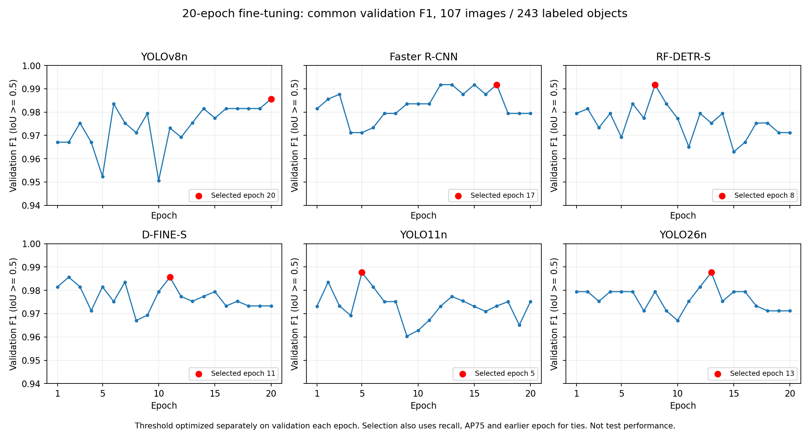

| 모델 | 선택 epoch | 선택 검증 F1 | 마지막 20epoch 검증 F1 |
|---|---:|---:|---:|
| YOLOv8n | 20 | 0.9856 | 0.9856 |
| Faster R-CNN | 17 | 0.9918 | 0.9794 |
| RF-DETR-S | 8 | 0.9918 | 0.9712 |
| D-FINE-S | 11 | 0.9856 | 0.9733 |
| YOLO11n | 5 | 0.9877 | 0.9752 |
| YOLO26n | 13 | 0.9877 | 0.9712 |

빨간 점은 고정한 저장본 선택 규칙으로 고른 epoch다. F1이 같으면 재현율, AP@0.75, 더 이른 epoch 순으로 비교했다. Faster R-CNN과 D-FINE-S는 같은 F1을 기록한 다른 epoch가 있으므로 F1만으로 선택 시점을 설명하지 않는다.

YOLOv8n은 마지막에 가장 높은 선택 점수를 기록했다. 나머지 모델은 중간 저장본이 선택됐다. 검증 점수가 후반에 떨어지거나 변동하는 양상은 있지만, 이 곡선만으로 과적합 원인을 확정하지 않는다. 반복 seed 실험이나 새 독립 평가를 완료한 것은 아니다. 모델별 손실의 정의가 달라 손실 절댓값으로 모델 우열을 정하지 않는다. 기존 세 모델의 학습 손실·자체 mAP 곡선은 17.7절에 별도로 보존했다.

근거: [epoch별 공통 지표 CSV](evidence/common_epoch_20261004/design_review/epoch_curves.csv), [출처 해시와 요약](evidence/common_epoch_20261004/design_review/epoch_curves_audit.json). 본 그림은 현재 학습 기록을 정리한 것이며 새로운 학습을 수행한 결과가 아니다.

### 18.20. 참고 보고서의 비교 방법과 운영 규칙 검토 (2026-10-05)

검토 자료는 대회자료 폴더의 `KAMP_Xray_경진대회_보고서_강경래_v4.pdf`다. PDF 내부 대조와 표의 산술 확인을 수행했다. 소스·학습 로그·예측 CSV는 아직 받지 못했으므로 실행 오류나 재현 성공을 주장하지 않는다. 증강 관련 검토는 데이터 전처리 정리본 12절에 있다.

| 위치 | 확인한 내용 | 해석 또는 추가 확인 |
|---|---|---|
| 7쪽 | 모델별 학습 epoch·해상도·자료 수가 다르다 | 각 실용 설정의 비교는 가능하지만, 모델 구조만 바꾼 통제 실험은 아니다 |
| 7쪽 중심 적중 | 예측 중심이 정답 박스 안에 들어가는지를 확인한다 | 실제 이물 전체가 예측 박스 안에 있는지, 누락된 이물이 없는지와 다른 기준이다. IoU와 양방향 시각 검토를 함께 보존한다 |
| 10쪽 | A 조건도 약한 라벨 1,880장을 포함한다. 저대비 표는 검증·테스트 평균이다 | '원본 공식 라벨만의 성능'으로 해석하지 않는다. 테스트 평균을 선택에 사용했는지 원기록 확인이 필요하다 |
| 12쪽 | S3의 검증 FN 9개는 RF-DETR+YOLOv8n이다. RF-DETR+YOLO11s의 S3는 5개다 | '점수 보정 방식이 FN 9개로 악화'라는 일반 문장은 조합을 명시해야 한다 |
| 17쪽 표와 주석 | 표는 두 모델 모두 개별 임계값 이상일 때 REJECT다. 주석은 S1에 따라 높은 confidence를 사용한다고 적었다 | 두 조건은 일반적으로 다르다. 실제 사용 규칙은 코드로 확인해야 하며, 현재 문구만으로 운영 결과를 재현할 수 없다 |
| 18쪽 | 이물 제품을 모두 잡았을 때 재현율 하한을 확인하는 표를 제공한다 | 제시한 단측 Clopper–Pearson 표본 수는 산술적으로 맞았다. 보고서도 같은 시험편의 반복·증강본을 독립 표본으로 세지 말라고 명시했다. 우리도 이 제한을 적용한다 |

**서로 다른 모델의 점수를 바로 비교하는 한계.** S1은 사진마다 두 모델의 최고 confidence를 비교해 한 모델의 결과를 선택한다. 높은 점수가 더 정확한 이물 판단을 보장하지 않는다. 한 모델이 찾은 실제 이물을 다른 모델의 높은 오탐 점수 때문에 버릴 수도 있다. 점수를 각 탐지 임계값으로 나누는 방법도 확률 보정의 검증을 대신하지 못한다. [Guo et al., ICML 2017](https://proceedings.mlr.press/v70/guo17a.html)은 신경망 confidence와 정답 빈도의 차이를 다룬다. 우리 코드에서는 모델 간 최고 점수로 기존 경고를 지우지 않는다.

**배울 점.** 낮은 대비·작은 이물·반복 시험편을 구분하고, 합성 정상 자료의 한계를 적었으며, seed 반복과 사전 채택 기준을 도입했다. 증강이 기대와 달리 효과가 없었다는 결과도 보존했다. 이는 보고서의 장점이다. 제거 흔적과 성능 하락 사이의 인과관계는 미확인 가설로 두고, 검증·테스트 혼합이나 서로 다른 판정 규칙의 문구는 바로잡아야 한다.

**큰 AI가 재검사에 자동으로 유리한 것은 아니다.** 이 보고서에서는 Qwen2.5-VL-3B의 자체 추가 학습 설정이 전용 탐지 모델보다 느리고 누락도 많았다. 모든 VLM에 일반화하지 않는다. 우리 재검사 모델도 크기·유명세보다 해당 역할의 확인 자료에서 평가한다.

참고 보고서의 실제 영상 중심 재학습 권고는 후속 계획이다. 본표의 최종 모델들이 모두 그 조건으로 다시 학습됐다고 해석하지 않는다. 우리 문서도 완료된 실험, 그 결과로 세운 가설, 다음 계획을 분리한다.

### 18.21. 후보 확인과 누락 확인: 두 단계의 실제 예비 실험

사용자는 기존 저장 모델을 사용하는 시험과 역할별 추가 학습을 모두 승인했다. 첫 모델은 YOLOv8n으로 고정하고 RF-DETR-S로 두 역할을 시험한다. 이는 현재 예비 실험의 구체적인 선택이며 최종 모델 채택이 아니다. Faster R-CNN은 기존 비교 근거로 보존하지만 상시 필수 모델로 고정하지 않는다.

| 순서 | 작업 담당 | 입력 | 하는 일 |
|---|---|---|---|
| 1 | YOLOv8n 모델 | 원래 전처리 사진 전체 | 이물 후보 위치·점수 출력 |
| 2-A: 후보 있음 | RF-DETR-S 모델 | 각 후보 주변 96×96픽셀 사진 | 확대된 후보를 다시 탐지. 제품은 이미 보류 상태로 취급 |
| 2-B: 후보 없음 | RF-DETR-S 모델 | 전체를 덮는 256×256픽셀 겹침 조각 | 첫 모델이 놓친 후보를 다시 탐지 |
| 3 | 프로그램의 처리 규칙, 탐지 모델 아님 | 두 모델의 예측·오류 상태 | 경고 보존·판단 충돌 기록·보류. 재검사 모델이 못 찾았다는 이유로 자동 정상 확정하지 않음 |

TP·FP·TN·FN은 정답을 확인한 뒤 붙이는 평가 결과다. 실행 시에는 실제 정답을 모르므로 'TP/FP 모델' 대신 **후보 확인 모델**, 'TN/FN 모델' 대신 **누락 확인 모델**이라고 부른다. 여기서 FP는 예를 들어 제품 무늬를 이물로 표시하는 오탐다. 기존 IoU 채점에서는 실제 이물을 표시했어도 위치·크기 차이로 FP와 FN이 함께 생길 수 있으므로 두 의미를 분리한다.

이번 '추가 학습 없이 시험'은 기존 저장본의 가중치를 고정하고 입력 사진의 범위만 바꾸어 실제 추론하는 것이다. 이후 '역할별 추가 학습'은 같은 시작 저장본을 두 사본으로 나눠, 각 입력 방식에 맞게 3epoch씩 가중치를 수정하는 것이다. 사진 특징을 추출하는 encoder는 고정하고 나머지 탐지 부분을 학습한다. 두 전문 사본의 비교 결과가 나오기 전 자동으로 기존 모델을 교체하지 않는다.

학습은 MPS, seed 0, batch 4, 해상도 512, 학습률 1e-5, 3epoch, 추가 무작위 증강 없음으로 수행한다. 기존 RF 선택 저장본에서 시작하며 원래 20epoch 결과와 별도 run을 사용한다. 매 epoch 공식 검증 전체 사진의 자체 mAP를 남기고, 역할별 입력 추론은 별도로 기존 `xray_eval.py`의 IoU 0.5로 채점한다. 전체 사진 자체 mAP를 후보 확대 성능으로 오인하지 않는다. 단기 입력 적응 시험이므로 최대 성능 탐색·새로운 독립 시험·전문 FN 모델 완성을 의미하지 않는다.

**평가 범위의 중요한 제한.** 검증 107장 모두 첫 YOLOv8n의 후보가 있었다. 따라서 실제 분기에서는 107장 모두 후보 확인 경로로 간다. 누락 확인 경로 성능을 살펴보기 위해 모든 사진을 강제로 분할 검사하는 별도 진단을 수행했다. 이를 실제 무후보 사진에서 FN을 구한 결과로 쓰지 않는다. 후보가 있는 사진에도 다른 이물이 남아 있을 수 있으므로, 후보만 확인하는 경로는 전체 이물 탐지의 완결된 검사가 아니다. 최종 구조에는 필요에 따라 후보 외 영역의 추가 확인도 검토해야 한다.

제품 처리 규칙을 사진 추론과 구분한다. 현재 스크립트는 예측·경로·의견 충돌을 저장하는 시제품이다. 실제 제품 추적·배출기 제어·사람의 최종 판단은 실행하지 않는다. 새 정상 제품과 확인된 이물 제품이 없어 최종 PASS의 안전성이나 FP 정상 제품 비율은 검증하지 못했다.

**확대 입력이 왜 다른 결과를 만드는지 확인한 예시.** 아래는 검증 TXT를 파일명·가로·세로 위치 순으로 정렬한 첫 이물 6개다. 결과를 보고 좋은 사진만 고른 표본은 아니지만, 전체 성능의 시각 평가를 대신하지 않는다. 각 행은 같은 원래 사진 부위를 같은 배율로 보여 준다. clean은 박스 없는 사진, TXT는 정답 박스, RF full은 전체 사진으로 검사한 기존 RF-DETR-S, RF crop은 후보 주변을 잘라 검사한 동일 저장본이다. 채택 임계값은 0.70370466으로 같다.

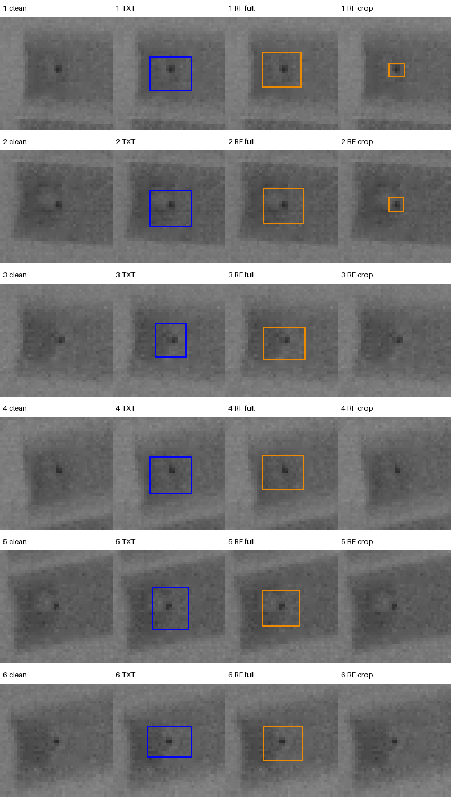

1·2행에서는 후보 확대의 예측 박스 안에도 검은 점이 보이지만 박스가 공식 TXT보다 작다. 3~6행에는 해당 확대 영역에서 임계값을 넘긴 국소 예측이 없다. 따라서 확대 조건의 IoU FN 증가에는 박스 크기 차이와 채택 예측의 부재가 함께 있을 수 있다. 이 예시만으로 전체 FN을 실제 누락으로 재분류하지 않는다. 첫 YOLOv8n의 경고는 그대로 보존되므로, 두 번째 모델의 단독 FN이 그대로 시스템의 제품 통과 수가 되는 것도 아니다.

시각 확인 범위·사진 좌표: `reports/review_roles_20261005/visual/cases.json`. 그림은 실제 저장 예측의 표시이며, 설명용 가상 다이어그램과 구분한다.

이번 오프라인 비교에서는 YOLOv8n의 고정 저장 예측을 첫 검사 결과로 읽었다. RF-DETR-S는 각 입력 방식으로 새로 추론했다. 따라서 두 모델을 동시에 새로 실행한 실시간 통합 속도 시험과 구분한다. 후보 확인 학습의 빈 조각은 실제 첫 모델의 오탐을 모아 검수한 hard negative가 아니다. 누락 확인 학습도 첫 모델의 실제 FN만 모은 전문 학습이 아니다. 두 입력에 대한 기본 적응 시험을 먼저 수행했으며, 실제 오탐·미탐에 특화된 모델의 완성에는 확인된 사례가 더 필요하다.

#### 18.21.1. 완료 결과: 검증 107장·공식 이물 243개

아래는 **두 번째 모델 단독**을 기존 IoU 0.5 기준으로 채점한 결과다. 결합 시스템의 F1이나 실제 제품 출하 누락 수가 아니다. 후보 확대 결과에는 공식 박스보다 작게 표시한 위치 오류도 포함한다. 기존 경고는 취소하지 않는다.

고정 임계값은 기존 RF-DETR-S 0.70370466, D-FINE-S 0.72014374다. 탐색 임계값은 이 검증 세트에서 F1을 최대화한 값이다. 같은 검증 자료를 반복 사용하므로 탐색 점수가 새 독립 성능 추정치는 아니다. 탐색 임계값을 실제 제품 처리 기준으로 적용하지 않았다.

| 모델·입력 | 추가 학습 | 고정 F1 | 고정 FP/FN | 탐색 임계값 | 탐색 F1 | 탐색 FP/FN |
|---|---|---:|---:|---:|---:|---:|
| D-FINE-S · 후보 확대 | 없음 | 0.0000 | 93/243 | 0.014240 | 0.0864 | 864/193 |
| D-FINE-S · 전체 분할 | 없음 | 0.8774 | 18/39 | 0.324602 | 0.9121 | 23/20 |
| RF-DETR-S · 후보 확대 | 없음 | 0.0736 | 71/231 | 0.558683 | 0.2222 | 181/190 |
| RF-DETR-S · 전체 분할 | 없음 | 0.9877 | 3/3 | 0.729680 | 0.9877 | 3/3 |
| RF-DETR-S · 후보 확대 | 1epoch | 0.2302 | 3/211 | 0.556711 | 0.8842 | 22/33 |
| RF-DETR-S · 후보 확대 | 2epoch | 0.0082 | 0/242 | 0.580896 | 0.9421 | 13/15 |
| RF-DETR-S · 후보 확대 | 3epoch | 0.7216 | 5/103 | 0.583713 | 0.9448 | 15/12 |
| RF-DETR-S · 전체 분할 | 1epoch | 0.9686 | 3/12 | 0.691649 | 0.9877 | 3/3 |
| RF-DETR-S · 전체 분할 | 2epoch | 0.9876 | 2/4 | 0.698464 | 0.9918 | 2/2 |
| RF-DETR-S · 전체 분할 | 3epoch | 0.9750 | 3/9 | 0.692171 | 0.9877 | 3/3 |

참고로 같은 기존 RF-DETR-S의 **전체 사진** 저장 예측을 다시 채점하면 F1 0.9918, FP 2개·FN 2개다. 전체 분할의 추가 학습 2epoch와 같았다. 후보 확대 3epoch의 탐색 F1 0.9448은 그보다 낮았다. 추가 학습 없이 입력만 바꿨을 때도 RF-DETR-S가 D-FINE-S보다 두 역할의 위치 채점에서 높았다. 이 범위의 결과로 전용 모델의 최적 성능이나 현장 안전성을 확정하지 않는다.

**결론:** 후보 확대와 추가 학습은 시험할 이유가 있었지만, 현재 설정에서 기존 전체 사진 검사보다 우수하다는 근거는 얻지 못했다. 입력 범위·추가 학습·탐지 임계값을 서로 구분해야 한다. 특정 epoch의 검증 최고값만으로 최종 구조를 변경하지 않는다. 누락 확인 역할은 자연 분기 입력이 0장이므로 강제 전체 분할 진단 결과로만 보고한다.

후보 추가 학습은 398.36초, 전체 분할 추가 학습은 614.10초가 걸렸다. 실패한 준비 실행 시간은 제외한 성공 run 기록이다. 둘 다 3epoch이고 MPS에서 순차 학습했다. 검토 추론만의 한 번 측정 평균은 기존 RF 후보 확대 59.33ms·전체 분할 121.41ms, 추가 학습 3epoch 사본은 각각 55.47ms·112.95ms다. YOLO 실행·영상 파일 읽기·설비 처리·대기열은 포함하지 않으므로 실제 공장 처리 시간으로 쓰지 않는다.

| 추가 학습 epoch | 후보 확인 학습 loss | 전체 분할 학습 loss |
|---|---:|---:|
| 1 | 7.6616 | 5.0333 |
| 2 | 6.5129 | 4.9567 |
| 3 | 6.2404 | 4.9423 |

학습 loss는 줄었지만 검증 최고값이 매 epoch 좋아지지는 않았다. 이 세 점만으로 과적합 원인을 확정하지 않는다. 전체 사진 자체 mAP와 역할별 IoU 채점을 각각 저장했다.

정상 완료 3epoch의 가중치·optimizer·scheduler·난수 상태와 해시를 복구 저장소에서 확인했다. 이번 새 run을 실제로 중단한 뒤 재개하는 시험은 수행하지 않았으므로, 이번에 재개 실행까지 검증했다고 쓰지 않는다.

다음 단계는 새 설계를 즉시 채택하는 것이 아니라, 후보 확대가 줄일 오탐의 실제 표본과 첫 모델이 아무 후보도 못 낸 사진을 확보하여 역할별 평가를 보완하는 것이다. 동료 코드·로그가 오면 PDF의 판정 규칙과 증강 비교를 재계산한다. 현장의 정상 통과 조건·최종 모델 변경은 사용자와 검토한다.

근거: [역할별 비교 CSV](evidence/review_roles_20261005/summary.csv), [요약과 범위](evidence/review_roles_20261005/summary.json), [후보 추가 학습](evidence/review_roles_20261005/candidate_training_audit.json), [전체 분할 추가 학습](evidence/review_roles_20261005/miss_training_audit.json).

### 18.22. 승인한 두 모델과 이를 지지하는 수치 (2026-10-05)

**개발 조합은 YOLOv8n + RF-DETR-S다.** 사용자는 두 모델의 결과가 다르면 예측을 보존하고 제품을 보류하는 방향을 승인했다. 후보 확인과 누락 확인이라는 역할도 유지한다. 다만 확대·분할 입력의 예비 결과가 전체 사진 검사보다 높지 않으므로, 기본 입력을 전체 사진으로 할지 확인 중이다. 아직 답변을 받지 않은 입력 방식이나 역할별 저장본을 최종 배포 설정으로 고정하지 않았다.

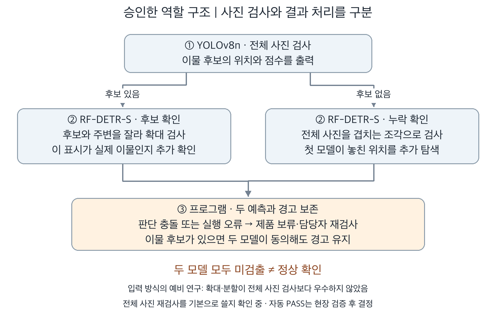

#### 두 모델을 고른 이유

| 모델 | 검증 F1 | 기존 테스트 F1 | 테스트 TP / FP / FN | 같은 MPS 단일 검사 평균 |
|---|---:|---:|---|---:|
| YOLOv8n | 0.9856 | 0.9889 | 222 / 2 / 3 | 11.71ms |
| Faster R-CNN | 0.9918 | 0.9867 | 222 / 3 / 3 | 1396.65ms |
| RF-DETR-S | 0.9918 | 0.9800 | 220 / 4 / 5 | 38.29ms |
| D-FINE-S | 0.9856 | 0.9756 | 220 / 6 / 5 | 24.74ms |

검증은 107장·243개 이물, 테스트는 97장·225개 이물이다. IoU 0.5 채점이며 테스트에는 검증에서 선택한 저장본과 탐지 임계값을 고정했다. 검증 열은 저장본 선택 당시 장치다. D-FINE-S의 후속 MPS 검증은 0.9835(FP 4·FN 4)였다. 속도는 과거 같은 MPS에서 단일 모델별로 107장×3회 측정한 값이다. RF-DETR-S의 테스트 0.9821은 **정밀도**이고, F1은 **0.9800**이다.

- **YOLOv8n:** 가벼운 첫 검사 모델이다. 기존 테스트에서 높은 F1과 재현율을 보였다. 최신 YOLO11n·YOLO26n도 시험했으나 이번 설정에서 일관된 우위가 확인되지 않았다. 최신 모델이 본질적으로 나쁘다는 결론은 아니다.
- **RF-DETR-S:** 같은 MPS 검증에서 Faster R-CNN과 FP 2·FN 2가 같았고, 처리 시간은 짧았다. YOLO와 다른 특징 추출 구조이며 실제 오류의 일부를 보완했다. 구조가 다르다는 이유만으로 오류가 독립이라고 가정하지 않았다.
- **Faster R-CNN과의 차이:** YOLO의 위치 FN 3개 중 Faster는 3개, RF는 2개를 보완했다. RF를 FN 최소 모델이라고 부르지는 않는다. 실제 공장 속도 기준이 없는 상태에서 높은 탐지 성능과 짧은 계산 시간을 함께 고려한 개발 선택이다.
- **D-FINE-S와의 차이:** RF보다 빠르고 YOLO와의 공통 위치 FN도 적었지만, 단독 MPS 검증 FP/FN은 4/4로 RF의 2/2보다 많았다. 후보 확대와 전체 분할 입력의 예비 결과도 RF보다 낮았다. 따라서 D-FINE을 실패한 모델로 삭제하지 않고 비교 근거로 보존한다.

현재 모델 조합은 기존 테스트를 열람한 뒤 정리한 개발 결정이다. 기존 테스트를 새 조합 선정과 완전히 독립적인 최종 검증으로 주장하지 않는다. 임계값은 이번 작업에서 변경하지 않았다.

#### 승인 조합을 실제로 연결한 전체 사진 검사

두 모델을 메모리에 올리고 각 검증 사진을 실제로 다시 추론했다. YOLO의 예측 유무와 상관없이 RF도 **전체 사진**을 검사했다. 이 결과는 후보 확대·분할 구조의 통합 성능과 구분한다.

| 확인 항목 | 확인한 값 | 뜻 |
|---|---|---|
| 자료·장치 | 검증 107장·243개 이물, MPS, 3회 | 고유 사진은 107장이다. 321개 독립 사진이 아니다. |
| YOLO 개별 결과 | TP 240 / FP 4 / FN 3, F1 0.9856 | 공식 TXT와 비교한 위치 기준 성능 |
| RF 개별 결과 | TP 241 / FP 2 / FN 2, F1 0.9918 | 공식 TXT와 비교한 위치 기준 성능 |
| 오류 보완 | YOLO FN 3개 중 RF가 2개 대응 | 두 모델을 함께 시험할 근거 |
| 공통 위치 FN | 1개 | 두 모델 모두 IoU 0.5 미달. 실제 제품 출하 수가 아님 |
| 하나 이상이 정답과 대응 | 242 / 243개 | 사후 정답으로 센 보완 범위. 결합 F1이 아님 |
| 예측 대응 / 판단 충돌 | 매회 106 / 1장 | 예측끼리 비교한 결과. 106장이 정답이라는 뜻이 아님 |
| 사진에 경고가 하나 이상 있음 | 107 / 107장 | 사진 어딘가에 예측이 있음. 모든 이물을 찾았다는 뜻이 아님 |
| 실행 오류 | 321회 호출 기록 중 0회 | 이 실행 범위의 오류 관측 |
| 평균 / P95 | 36.55 / 44.49ms | 사진 읽기·추론·대응 비교. 촬영·마스킹·설비·대기 제외 |

두 모델의 단일 검사 시간을 더한 값과 새 통합 측정값은 측정 시점·모델 실행 경로·포함 범위가 다르다. 새 통합 시간은 새 실행 기록을 그대로 보고한다. 현장 FPS나 라인 수용량으로 환산해 보장하지 않는다. `referred`는 이 실행에서 두 번째 모델 호출 여부이며 공장 재검사율이 아니다.

#### 확대·분할 결과를 전체 사진 결과와 섞지 않기

18.21절의 후보 확대는 RF의 3epoch 추가 학습과 검증 임계값 재선택 후 F1 0.9448이었다. 전체 분할은 2epoch 사본의 탐색 최고 F1 0.9918로 기존 전체 사진 RF와 같았다. 후보 확대가 단독으로 TP/FP를 더 잘 구분한다는 근거는 부족하다. 학습 loss 감소만으로 채택하지 않는다.

검증 107장 모두 첫 모델의 후보가 있었다. 따라서 '후보 없음 → 누락 확인'의 자연 분기 성능은 아직 확인하지 못했다. 전체 분할을 107장에 강제로 적용한 결과는 입력 방식의 진단이다. 새 정상 제품, 실제 오탐 후보, 무후보 이물 사진에서 역할별 성능을 확인해야 한다. 그런 자료가 없는데 전체 분할 점수를 자연 분기의 FN 개선으로 쓰지 않는다.

#### D-FINE-S를 학습한 이유와 추가 학습 여부

D-FINE-S는 작은 공식 박스의 경계를 더 정확하게 찾을 수 있는지 시험한 후보였다. 학습 자료의 정답 박스 긴 변 중앙값은 11픽셀이다. 이물 근처를 예측해도 IoU에 미달하는 오류가 관찰되었다. [D-FINE 논문](https://arxiv.org/abs/2410.13842)의 FDR는 박스 경계 분포를 단계적으로 보정한다. 이 기능과 오류 원인을 연결한 연구 가설이었다. 성능 향상이 보장된다는 뜻은 아니다.

공통 비교에서 D-FINE-S를 20epoch 학습했고 검증 규칙으로 11epoch 저장본을 골랐다. 테스트 F1은 0.9756, TP 220·FP 6·FN 5였다. 이번 후보 확대·분할 실험에서는 이 저장본으로 새 추론만 했다. **역할별 3epoch 추가 학습은 RF-DETR-S 두 사본에만 수행했다.** D-FINE-S에 3epoch 추가 학습을 했다고 쓰지 않는다.

#### 보고서에 쓸 결론과 다음 확인

이번 자료에서는 개별 모델의 높은 탐지 성능, 서로 다른 일부 오류, 실제 연결의 실행 가능성을 확인했다. 이 세 근거를 바탕으로 YOLOv8n·RF-DETR-S 조합을 개발 방향으로 정한다. 이물 경고와 판단 충돌은 보존하여 재검사에 사용한다. 실제 정상 제품 자료가 없으므로 정상 오경보율과 자동 PASS 안전성을 검증했다는 주장까지 확장하지 않는다.

다음 순서는 **입력 방식 확인 → 해당 방식의 저장본·임계값·판정 규칙 고정 → 실제 오탐·무후보 이물과 정상 자료로 역할 평가 → 보고서·발표자료·재현 묶음의 최종 일치 확인**이다. 단순히 epoch를 더 늘리는 학습은 시작하지 않는다. 부족한 평가 자료를 추가 학습으로 대신하지 않는다.

근거: [실제 연결 요약](evidence/approved_pair_20261005/live_summary.json), [사진별 처리 기록](evidence/approved_pair_20261005/image_decisions.csv), [출처·해시·선정 범위](evidence/approved_pair_20261005/evidence.json). 재현: `scripts/xray_secondary_review_live.py`, `scripts/xray_secondary_review_audit.py`, `scripts/xray_approved_pair_evidence.py`.
